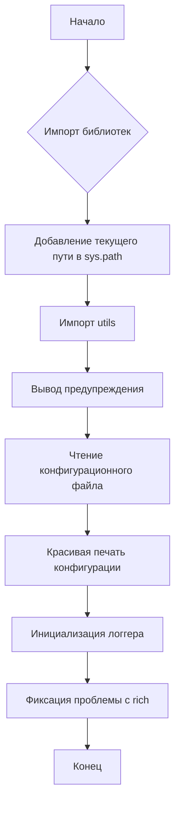
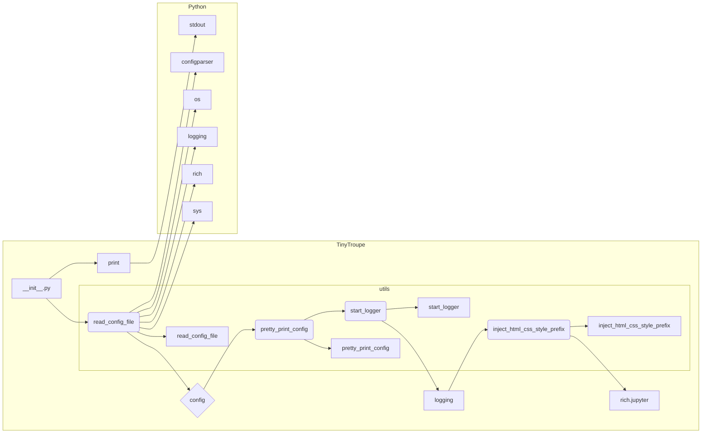

# Анализ кода из tinytroupe/__init__.py

**1. <input code>**

```python
import os
import logging
import configparser
import rich # for rich console output
import rich.jupyter

# add current path to sys.path
import sys
sys.path.append('.')
from tinytroupe import utils # now we can import our utils

# AI disclaimers
print(
"""
!!!!
DISCLAIMER: TinyTroupe relies on Artificial Intelligence (AI) models to generate content. 
The AI models are not perfect and may produce inappropriate or inacurate results. 
For any serious or consequential use, please review the generated content before using it.
!!!!
""")

config = utils.read_config_file()
utils.pretty_print_config(config)
utils.start_logger(config)

# fix an issue in the rich library: we don't want margins in Jupyter!
rich.jupyter.JUPYTER_HTML_FORMAT = \
    utils.inject_html_css_style_prefix(rich.jupyter.JUPYTER_HTML_FORMAT, "margin:0px;")
```

**2. <algorithm>**



**Пример:**

* **B:** `import os`, `import logging`, `import configparser`, `import rich`, `import rich.jupyter`
* **C:** `sys.path.append('.')` – добавляет текущую директорию в путь поиска модулей Python.  Это позволяет импортировать файлы из поддиректорий проекта.
* **F:** `config = utils.read_config_file()` – функция `read_config_file` из модуля `utils` читает конфигурационный файл и возвращает объект `configparser.ConfigParser`.
* **G:** `utils.pretty_print_config(config)` – функция `pretty_print_config` из `utils` отображает конфигурацию в читаемом формате.
* **H:** `utils.start_logger(config)` – функция `start_logger` из `utils` настраивает систему логирования на основе конфигурации.


**3. <mermaid>**



**4. <explanation>**

* **Импорты:**
    * `os`, `logging`, `configparser`: стандартные модули Python для работы с операционной системой, логированием и чтением конфигурационных файлов.
    * `rich`, `rich.jupyter`: библиотека для форматированного вывода в консоли и Jupyter Notebook. Используется для улучшения пользовательского интерфейса.
    * `sys`: стандартный модуль Python, позволяющий получить и изменить пути поиска модулей.
    * `tinytroupe.utils`:  модуль, который находится в подпапке `tinytroupe`, вероятно содержит вспомогательные функции, связанные с чтением конфигурации, форматированием вывода и инициализацией логгера.
* **Классы:**  В данном коде нет объявления классов.
* **Функции:**
    * `read_config_file` (в `utils`): Читает конфигурационный файл и возвращает объект `configparser.ConfigParser`.
    * `pretty_print_config` (в `utils`): Форматированно выводит конфигурацию в консоль.
    * `start_logger` (в `utils`): Настраивает систему логирования.
    * `inject_html_css_style_prefix` (в `utils`): Изменяет CSS-стили, вероятно для корректной работы в Jupyter Notebook.
* **Переменные:**
    * `config`: объект `configparser.ConfigParser`, содержащий конфигурацию.
* **Возможные ошибки и улучшения:**
    * Не указано, какой конфигурационный файл читается.
    * Не указано, в каком формате он хранится.
    * Проверка на существование файла и корректность формата конфигурации была бы полезной.
    * Обработка ошибок (например, если конфигурационный файл не найден или имеет неправильный формат).
    * Возможно,  лучше использовать `toml` или `yaml` для хранения конфигурации, т.к. они имеют более читаемый и расширяемый формат.
* **Взаимосвязь с другими частями проекта:** Модуль `utils` вероятно содержит функции, используемые другими частями проекта `tinytroupe`, для обработки конфигурации, вывода данных и логирования. Этот файл инициализирует нужные сервисы перед запуском приложения.


Этот код является частью инициализации проекта TinyTroupe, устанавливая необходимые зависимости и настраивая среду для последующих операций.