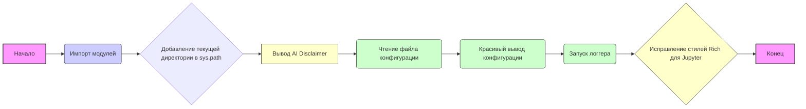

## Анализ кода `tinytroupe/__init__.py`

### <алгоритм>

1.  **Импорт модулей**: Импортируются необходимые модули, такие как `os`, `logging`, `configparser`, `rich`, `sys` и пользовательский модуль `utils`.
    *   Пример: `import os` импортирует модуль для работы с операционной системой.
    *   Пример: `from tinytroupe import utils` импортирует пользовательский модуль `utils` из пакета `tinytroupe`.

2.  **Добавление текущего пути к `sys.path`**: Текущая директория добавляется в список путей поиска модулей `sys.path`, чтобы можно было импортировать модули из текущего каталога.
    *   Пример: `sys.path.append('.')` добавляет текущий каталог в `sys.path`.

3.  **Вывод AI Disclaimer**: Выводится предупреждение о том, что TinyTroupe использует AI и сгенерированный контент может быть неточным.
    *   Пример: `print("DISCLAIMER: ...")` выводит предупреждение в консоль.

4.  **Чтение конфигурационного файла**: Функция `utils.read_config_file()` читает файл конфигурации и возвращает его содержимое.
    *   Пример: `config = utils.read_config_file()` читает файл конфигурации и присваивает его содержимое переменной `config`.

5.  **Красивый вывод конфигурации**: Функция `utils.pretty_print_config(config)` выводит содержимое конфигурации в красивом формате, используя библиотеку `rich`.
    *   Пример: `utils.pretty_print_config(config)` выводит конфигурацию в консоль.

6.  **Настройка логгера**: Функция `utils.start_logger(config)` настраивает логгер для записи сообщений.
    *   Пример: `utils.start_logger(config)` настраивает логгер, используя настройки из переменной `config`.

7.  **Исправление стилей Rich для Jupyter**: Функция `utils.inject_html_css_style_prefix()` добавляет префикс `margin:0px;` к HTML-формату вывода `rich` в Jupyter для того, чтобы убрать лишние отступы.
    *   Пример: `rich.jupyter.JUPYTER_HTML_FORMAT = utils.inject_html_css_style_prefix(rich.jupyter.JUPYTER_HTML_FORMAT, "margin:0px;")` изменяет переменную для вывода в jupyter.

### <mermaid>

**Объяснение зависимостей Mermaid:**

*   **Импорт модулей (`B`)**: Зависит от внешних библиотек `os`, `logging`, `configparser`, `rich`, `rich.jupyter` и `sys`. Также импортирует `utils` из пакета `tinytroupe`. Все импорты необходимы для дальнейшего функционирования скрипта.
*   **Добавление текущей директории в `sys.path` (`C`)**: Использует модуль `sys`.
*   **Вывод AI Disclaimer (`D`)**: Не имеет прямых зависимостей, это просто вывод текста в консоль.
*   **Чтение файла конфигурации (`E`)**: Использует функцию `utils.read_config_file()`.
*   **Красивый вывод конфигурации (`F`)**: Использует функцию `utils.pretty_print_config(config)` и, следовательно, зависит от результата чтения файла конфигурации (`config`).
*   **Запуск логгера (`G`)**: Использует функцию `utils.start_logger(config)` и, следовательно, зависит от результата чтения файла конфигурации (`config`).
*  **Исправление стилей Rich для Jupyter (`H`)**: Использует `rich.jupyter` и функцию `utils.inject_html_css_style_prefix`, а также имеет зависимость от переменной `rich.jupyter.JUPYTER_HTML_FORMAT`, которая меняется.

### <объяснение>

**Импорты:**

*   `os`: Модуль для работы с операционной системой. Он может быть использован, например, для работы с путями к файлам (хотя в данном коде не используется напрямую).
*   `logging`: Модуль для настройки и использования логгера. Используется для записи сообщений о работе приложения.
*   `configparser`: Модуль для чтения файлов конфигурации (обычно `.ini` файлы).
*   `rich`: Библиотека для создания красивого и форматированного вывода в консоль. Используется для красивого вывода конфигурации и может использоваться в других частях проекта.
*  `rich.jupyter`: Модуль расширения для `rich` для использования в среде Jupyter.
*   `sys`: Модуль для доступа к некоторым переменным и функциям, зависящим от интерпретатора Python. В данном случае используется для модификации `sys.path` для импорта локальных модулей.
*   `tinytroupe.utils`: Пользовательский модуль, содержащий функции для чтения конфигурации, вывода конфигурации и настройки логгера. Его присутствие указывает на то, что код является частью более крупного проекта.

**Переменные:**

*   `config`: Переменная, которая хранит прочитанную конфигурацию. Тип данных этой переменной зависит от того, как именно `utils.read_config_file()` обрабатывает файл конфигурации, но скорее всего это будет словарь.
*   `rich.jupyter.JUPYTER_HTML_FORMAT`: Cтроковая переменная, в которой хранится HTML формат вывода `rich` в среде Jupyter. Эта переменная переопределяется для исправления стилей `rich` в Jupyter.

**Функции:**

*   `utils.read_config_file()`:
    *   Аргументы: Нет.
    *   Возвращает: Содержимое файла конфигурации (вероятно, словарь).
    *   Назначение: Читает конфигурацию из файла. Эта функция находится в модуле `tinytroupe.utils`.
    *   Пример: Возвращает словарь с настройками, например: `{'model': {'name': 'gpt2'}, 'logging': {'level': 'DEBUG'}}`

*   `utils.pretty_print_config(config)`:
    *   Аргументы: `config` - словарь с конфигурацией.
    *   Возвращает: Ничего (выводит данные в консоль).
    *   Назначение: Выводит содержимое конфигурации в красивом формате в консоль, используя библиотеку `rich`.
    *   Пример: Выводит красивую таблицу с данными из словаря `config`.

*   `utils.start_logger(config)`:
    *   Аргументы: `config` - словарь с конфигурацией.
    *   Возвращает: Ничего (настраивает логгер).
    *   Назначение: Настраивает логгер на основе настроек, заданных в конфигурационном файле.
    *    Пример: Настраивает логгер на запись сообщений уровня DEBUG в файл, указанный в конфигурации.

*   `utils.inject_html_css_style_prefix(html, prefix)`:
    *   Аргументы: `html` - исходный HTML, `prefix` - CSS префикс для добавления.
    *   Возвращает: HTML с добавленным CSS префиксом.
    *   Назначение: Добавляет CSS-стили к существующему HTML, используется для исправления стиля отображения в Jupyter.
    *   Пример: `utils.inject_html_css_style_prefix('
test
', "margin:0px;")` вернет `'
test
'`

**Классы:**
  В этом коде нет определения классов.

**Взаимосвязь с другими частями проекта:**
*  Код является точкой входа в проект. 
*  Импортирует и использует `tinytroupe.utils`, что указывает на то, что функционал по чтению и форматированию конфигурации вынесен в отдельный модуль.
*  `tinytroupe.utils` может также использоваться другими модулями внутри проекта.
*  Код настраивает logging для всего проекта.
*  Установка `rich.jupyter.JUPYTER_HTML_FORMAT` указывает на то, что данный проект может использоваться с Jupyter Notebook.

**Потенциальные ошибки и области для улучшения:**

*   **Отсутствие обработки ошибок**: В коде не предусмотрена обработка ошибок, например, если файл конфигурации не найден или имеет неверный формат. Следует добавить `try-except` блоки для обработки возможных исключений.
*   **Жестко заданные значения**: В коде жестко задан префикс стиля `"margin:0px;"`. Это может быть вынесено в конфигурационный файл.
* **Зависимость от глобальных переменных**: Код меняет переменную `rich.jupyter.JUPYTER_HTML_FORMAT` напрямую. Было бы лучше инкапсулировать эту логику в функцию или класс.

**Заключение:**

Код `tinytroupe/__init__.py` является точкой входа для проекта `TinyTroupe`, настраивает среду, читает конфигурацию, настраивает логгер и выводит AI disclaimer. Код использует сторонние библиотеки для вывода, работы с файлами и логгирования. Он также использует пользовательский модуль `tinytroupe.utils`, что говорит о наличии архитектуры, разделяющей ответственность.