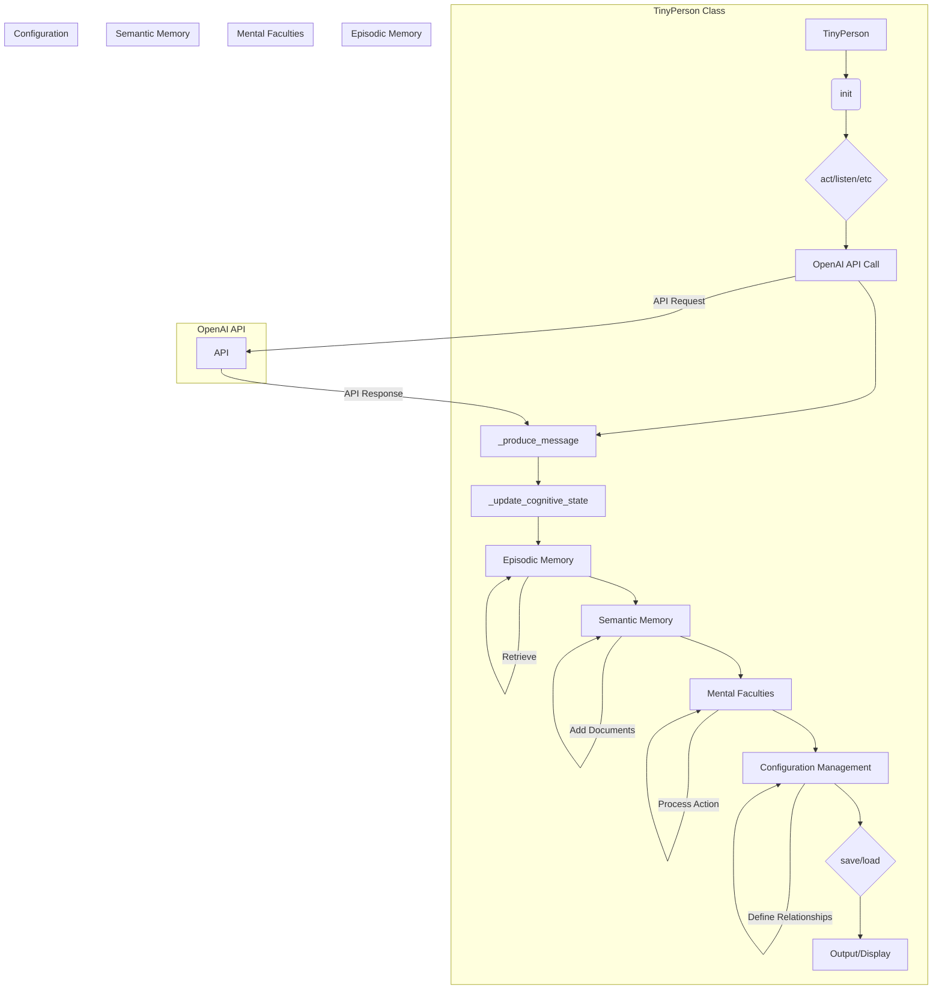

# <input code>

```python
"""
This module provides the main classes and functions for TinyTroupe's  agents.

Agents are the key abstraction used in TinyTroupe. An agent is a simulated person or entity that can interact with other agents and the environment, by
receiving stimuli and producing actions. Agents have cognitive states, which are updated as they interact with the environment and other agents. 
Agents can also store and retrieve information from memory, and can perform actions in the environment. Different from agents whose objective is to
provide support for AI-based assistants or other such productivity tools, **TinyTroupe agents are aim at representing human-like behavior**, which includes
idiossincracies, emotions, and other human-like traits, that one would not expect from a productivity tool.

The overall underlying design is inspired mainly by cognitive psychology, which is why agents have various internal cognitive states, such as attention, emotions, and goals.
It is also why agent memory, differently from other LLM-based agent platforms, has subtle internal divisions, notably between episodic and semantic memory. 
Some behaviorist concepts are also present, such as the idea of a "stimulus" and "response" in the `listen` and `act` methods, which are key abstractions
to understand how agents interact with the environment and other agents.
"""

import os
import csv
import json
import ast
import textwrap  # to dedent strings
import datetime  # to get current datetime
import chevron  # to parse Mustache templates
import logging
logger = logging.getLogger("tinytroupe")
import tinytroupe.utils as utils
from tinytroupe.utils import post_init
from tinytroupe.control import transactional
from tinytroupe.control import current_simulation
from rich import print
import copy
from tinytroupe.utils import JsonSerializableRegistry

from typing import Any, TypeVar, Union

Self = TypeVar("Self", bound="TinyPerson")
AgentOrWorld = Union[Self, "TinyWorld"]

# ... (rest of the code)
```

# <algorithm>

Unfortunately, a visual flowchart for the entire code is not feasible due to its complexity.  Instead, a textual description of the TinyPerson class's core logic will be provided:

1. **Initialization (`__init__`, `_post_init`):**  
   - Takes name, optional memory, and mental faculties as input.
   - Initializes internal attributes:  `current_messages`, `environment`, `_actions_buffer`, `_accessible_agents`, `_displayed_communications_buffer`, and default memory and mental faculties (if not provided).
   - Creates a configuration dictionary (`_configuration`) with default values (e.g., age, occupation, etc.).
   - Initializes the prompt template (`_prompt_template_path`).
   - Loads/creates initial system message (`_init_system_message`).
   - Registers the agent in the global `all_agents` list.
   - Resets the prompt (`reset_prompt`) for the agent.
   - Optionally, handles agent renaming, potentially creating new names if a collision occurs (`_rename`).

2. **Agent Actions (`act`, `listen`, `see`, `think`, `socialize`):**
   - `act`:  
     - (Optionally) performs a set number of actions (`n`) or until "DONE". 
     - Uses the `_produce_message` function to get the action from the LLM (OpenAI API call).
     - Stores the action, cognitive state update, and communication.
     - Calls `_display_communication` and stores communications in a buffer for later display.
     - Processes the action using mental faculties (`_mental_faculties`).
     - Updates cognitive states (`_update_cognitive_state`).
   - `listen`, `see`, `socialize`, `think`, `internalize_goal`:
     - Store the stimulus in episodic memory.
     - Displays the received stimulus, if `communication_display` is True.
     - (Optionally) Calls a tool method.

3. **Configuration Management (`define`, `define_several`, `define_relationships`, `clear_relationships`):**
   - Allows modification of the agent's configuration.
   - `define`: Adds a new key-value pair to the agent's configuration or adds a value to an existing group.
   - `define_relationships`: Adds/updates agent relationships (potentially to multiple agents).
   - `clear_relationships`: Removes all relationships.

4. **Input/Output (`save_spec`, `load_spec`, `encode_complete_state`, `decode_complete_state`):**
   - `save_spec`: Saves the agent's configuration (and possibly memory) to a JSON file.
   - `load_spec`: Loads an agent's configuration from a JSON file.
   - `encode_complete_state`: Serializes the agent's state for storage (critical part).
   - `decode_complete_state`:  Deserializes the agent's state to restore the state (critical part).

5. **Display (`pp_current_interactions`, `pretty_current_interactions`):**
   - Displays the current agent's interactions and conversation history (messages).


# <mermaid>



# <explanation>

**1. Imports:**

- `os`, `csv`, `json`, `ast`, `textwrap`, `datetime`, `chevron`, `logging`, `copy`: Standard Python libraries for file system operations, data serialization, string manipulation, time management, template parsing, logging, and object copying.
- `rich`: A rich library for formatting and displaying text output.
- `tinytroupe.utils`, `tinytroupe.control`: Custom modules within the `tinytroupe` package (likely related to utility functions, simulation control, and perhaps other TinyTroupe components).  The import paths indicate a package structure.  `JsonSerializableRegistry` suggests a custom class for serialization.  
- `llama_index.embeddings.openai`, `llama_index.core`, `llama_index.readers.web`: Modules from the `llama_index` library, indicating an integration with large language models and document loading for semantic memory.
- `from tinytroupe import openai_utils`: Imports a module specifically for interacting with the OpenAI API.


**2. Classes:**

- **`TinyPerson`:** Represents a simulated person.
    - **Attributes:** `name`, `episodic_memory`, `semantic_memory`, `_mental_faculties`, `_configuration`, `all_agents`, `communication_style`, `communication_display`, `current_messages`, `environment`, `_actions_buffer`, `_accessible_agents`, `_displayed_communications_buffer`, `MAX_ACTIONS_BEFORE_DONE`, `PP_TEXT_WIDTH`, `_prompt_template_path`, `_init_system_message`, `simulation_id`.
    - **Methods:**  Methods like `__init__`, `_post_init`, `generate_agent_prompt`, `reset_prompt`, `get`, `define`, `define_several`, `define_relationships`, `clear_relationships`, `related_to`, `act`, `listen`, `socialize`, `see`, `think`, `internalize_goal`, `_observe`, `listen_and_act`, `see_and_act`, `think_and_act`, `read_documents_from_folder`, `read_documents_from_web`, `move_to`, `change_context`, `make_agent_accessible`, `make_agent_inaccessible`, `make_all_agents_inaccessible`, `_produce_message`, `_update_cognitive_state`, `_display_communication`, `_push_and_display_latest_communication`, `pop_and_display_latest_communications`, `clear_communications_buffer`, `pop_latest_actions`, `pop_actions_and_get_contents_for`, `__repr__`, `minibio`, `iso_datetime`, `save_spec`, `load_spec`, `encode_complete_state`, `decode_complete_state`, `create_new_agent_from_current_spec`, `add_agent`, `has_agent`, `set_simulation_for_free_agents`, `get_agent_by_name`, `clear_agents`.  Many of these methods handle agent interaction, memory management, configuration changes, and communication.

- **`TinyMentalFaculty`:** Base class for agent mental faculties. Defines common structure.
    - **Methods:** `process_action`, `actions_definitions_prompt`, `actions_constraints_prompt`.

- **`RecallFaculty`:** Implements the memory recall faculty for the agent.

- **`FilesAndWebGroundingFaculty`:** Allows the agent to access and use local file content and web pages for knowledge grounding. This is an example of how the agent can access external data.

- **`TinyToolUse`:** Enables tool usage by the agent.  Allows agent interaction with simulated tools (which would be implemented in other modules).

- **`TinyMemory`:** Base class for memory implementations (episodic and semantic).

- **`EpisodicMemory`:** Manages the agent's short-term memory (recent events).

- **`SemanticMemory`:** Manages the agent's long-term, factual knowledge, using `llama_index` for vectorized document search.


**3. Functions:**


**4. Variables:**

- `config`: A configuration object holding settings (likely from a configuration file).
- `default`: A dictionary containing default parameters for embedding models, display lengths, etc.

**5. Possible Errors/Improvements:**

- **Error Handling:** While the code uses `@repeat_on_error`, more comprehensive error handling (e.g., for the OpenAI API) could be beneficial.
- **LLM interaction:** The use of the OpenAI API is a key component, but the code's quality could be improved with error handling.
- **Scalability:** The global `all_agents` dictionary might become a bottleneck as the number of agents grows.  Consider alternative implementations for managing agents in a larger context.

- **Clearer separation of concerns:** Although the code is quite well-structured, some methods could benefit from a tighter division of responsibilities to reduce complexity.

- **Documentation:** While the docstrings are helpful, more detailed explanations and examples within the code (especially for more complex logic) are recommended.


**Relationships with Other Parts of the Project:**

This code relies heavily on other parts of the TinyTroupe project, particularly the `utils` module for various utility functions, the `control` module for simulation handling, `openai_utils` for OpenAI API interaction, and the `llama_index` library for semantic memory operations.


**Overall:** This code appears well-structured and designed for implementing sophisticated agents.  The use of `llama_index` and the focus on memory aspects are important components.  The combination of episodic and semantic memory, and the handling of external documents via `semantic_memory`, provides a more realistic representation of human-like agents compared to simple LLM-based agents.  Further enhancement could involve adding more robust error handling and more detailed logging to assist with debugging.