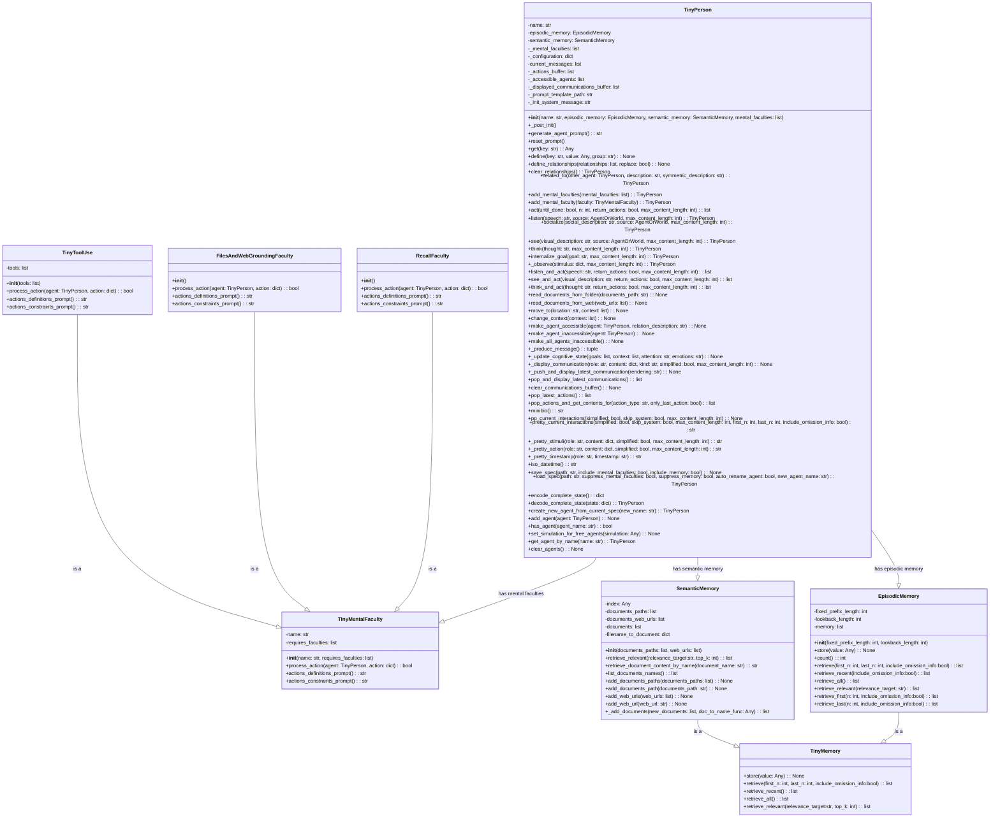

## <алгоритм>

### `TinyPerson` Class
1.  **Инициализация (`__init__`)**:
    *   Принимает `name`, `episodic_memory`, `semantic_memory` и `mental_faculties` как аргументы.
    *   Сохраняет переданные значения памяти, если они предоставлены.
    *   Инициализирует имя агента, вызывая `assert name is not None`.
    *   Вызывает метод `_post_init` после завершения `__init__`.

2.  **Пост-инициализация (`_post_init`)**:
    *   Инициализирует списки `current_messages`, `_actions_buffer`, `_accessible_agents` и `_displayed_communications_buffer`.
    *   Инициализирует `episodic_memory` и `semantic_memory`, если они не были переданы.
    *   Инициализирует список `_mental_faculties`, если он не был передан.
    *   Создает словарь `_configuration` со всеми необходимыми полями конфигурации агента, включая имя, возраст, национальность, профессию, навыки и т.д.
    *   Определяет путь к файлу шаблона подсказок `tinyperson.mustache`.
    *   Устанавливает `_init_system_message` в `None`.
    *   Проверяет, нужно ли переименовать агента или добавить его в глобальный список агентов.
    *   Сбрасывает подсказку.
    *   Устанавливает `simulation_id`, если агент был создан в рамках симуляции.

3.  **Генерация подсказки (`generate_agent_prompt`)**:
    *   Читает шаблон подсказки из файла `tinyperson.mustache`.
    *   Создает копию словаря `_configuration`.
    *   Формирует строку с определениями и ограничениями действий из ментальных способностей агента.
    *   Добавляет дополнительные переменные шаблона, если включена опция RAI.
    *   Рендерит шаблон с помощью `chevron.render` и возвращает результат.

4.  **Сброс подсказки (`reset_prompt`)**:
    *   Генерирует системное сообщение с помощью `generate_agent_prompt`.
    *   Сбрасывает `current_messages`, устанавливая системное сообщение в качестве первого сообщения.
    *   Добавляет в `current_messages` последние сообщения из эпизодической памяти.

5.  **Определение конфигурации (`define`)**:
    *   Принимает `key`, `value` и `group` как аргументы.
    *   Удаляет отступы из значения, если оно является строкой.
    *   Добавляет значение в словарь конфигурации в указанный `group` (если есть), или в корень, если `group` не указан.
    *   Сбрасывает подсказку после изменения конфигурации.

6.  **Действие (`act`)**:
    *   Принимает `until_done`, `n`, `return_actions`, `max_content_length`.
    *   Вызывает вспомогательную функцию `aux_act_once` (с возможностью повтора), либо `n` раз, либо до тех пор, пока действие не будет типа `DONE`.
        *   Внутри `aux_act_once`
        *    Вызывает `think` с сообщением "I will now act a bit, and then issue DONE."
        *    Вызывает `_produce_message`, получает `role` и `content`.
        *    Сохраняет сообщение в эпизодическую память.
        *    Извлекает когнитивное состояние и действие из `content`.
        *    Добавляет действие в буфер действий.
        *    Обновляет когнитивное состояние агента с помощью `_update_cognitive_state`.
        *   Отображает коммуникацию.
        *   Вызывает `process_action` для каждой из ментальных способностей.
    *   Возвращает список действий, если `return_actions` имеет значение `True`.

7.  **Слушание (`listen`)**:
    *   Принимает речь (`speech`) и источник (`source`).
    *   Вызывает `_observe` с типом стимула `CONVERSATION`.

8.  **Социализация (`socialize`)**:
    *   Принимает социальное описание (`social_description`) и источник (`source`).
    *   Вызывает `_observe` с типом стимула `SOCIAL`.

9.  **Зрение (`see`)**:
    *   Принимает визуальное описание (`visual_description`) и источник (`source`).
    *   Вызывает `_observe` с типом стимула `VISUAL`.

10. **Мышление (`think`)**:
     *   Принимает мысль (`thought`).
     *   Вызывает `_observe` с типом стимула `THOUGHT`.

11. **Интернализация цели (`internalize_goal`)**:
     *    Принимает цель (`goal`).
     *    Вызывает `_observe` с типом стимула `INTERNAL_GOAL_FORMULATION`.

12. **Наблюдение (`_observe`)**:
    *   Принимает стимул.
    *   Добавляет стимул в эпизодическую память.
    *   Отображает коммуникацию.

13. **Комбинации `listen`, `see` и `think` с `act`**:
    *   Методы `listen_and_act`, `see_and_act` и `think_and_act` объединяют соответствующие методы наблюдения (`listen`, `see`, `think`) с методом действия (`act`).

14. **Чтение документов (`read_documents_from_folder`, `read_documents_from_web`)**:
    *   Загружает документы из указанных папок или веб-страниц в семантическую память.

15. **Перемещение (`move_to`)**:
    *   Обновляет текущее местоположение и контекст агента.

16. **Изменение контекста (`change_context`)**:
    *   Изменяет контекст агента и вызывает `_update_cognitive_state`.

17. **Управление доступностью агентов (`make_agent_accessible`, `make_agent_inaccessible`, `make_all_agents_inaccessible`)**:
    *   Позволяют делать агентов доступными или недоступными для взаимодействия.

18. **Производство сообщения (`_produce_message`)**:
    *   Сбрасывает подсказку.
    *   Преобразует `current_messages` в формат для OpenAI API.
    *   Отправляет сообщение в OpenAI API.
    *   Возвращает роль и контент из ответа.

19. **Обновление когнитивного состояния (`_update_cognitive_state`)**:
    *   Обновляет когнитивное состояние агента, включая цели, контекст, внимание и эмоции.
    *   Сбрасывает подсказку.

20. **Отображение коммуникации (`_display_communication`)**:
    *   Форматирует стимулы или действия с помощью `_pretty_stimuli` или `_pretty_action`.
    *   Сохраняет и отображает коммуникацию.

21. **Получение действий (`pop_latest_actions`)**:
    *   Возвращает и очищает буфер последних действий.

22. **Получение содержимого действий (`pop_actions_and_get_contents_for`)**:
     *    Получает действия, отфильтровывает их по типу и возвращает содержимое.

23. **Визуализация (мини-биография, текущих взаимодействий, и т.д.)**:
    *   Форматирует текстовое представление агента и его действий.

24. **Сохранение и загрузка состояния (`save_spec`, `load_spec`, `encode_complete_state`, `decode_complete_state`)**:
     *   Позволяют сохранять и загружать состояние агента, включая конфигурацию, память и т.д.

25. **Управление списком агентов (`add_agent`, `has_agent`, `set_simulation_for_free_agents`, `get_agent_by_name`, `clear_agents`)**:
     *   Позволяют управлять глобальным списком агентов.

### `TinyMentalFaculty` Class
1.  **Инициализация (`__init__`)**:
    *   Принимает `name` и `requires_faculties`.

2.  **Обработка действия (`process_action`)**:
    *   Метод, который должен быть переопределен в подклассах.

3. **Определения и ограничения действий (`actions_definitions_prompt`, `actions_constraints_prompt`)**:
    *   Методы, которые должны быть переопределены в подклассах.

### `RecallFaculty` Class
1. **Инициализация (`__init__`)**:
     *   Вызывает конструктор родительского класса `TinyMentalFaculty` с именем "Memory Recall".
2. **Обработка действия (`process_action`)**:
     *   Если действие типа `RECALL` и содержит содержимое:
        *  Извлекает информацию из семантической памяти с помощью `retrieve_relevant`.
        *  Вызывает `agent.think` с найденной информацией.
     *   В противном случае возвращает `False`.

3. **Определения и ограничения действий (`actions_definitions_prompt`, `actions_constraints_prompt`)**:
    *   Возвращает текстовые описания действий и ограничений для `RECALL`.

### `FilesAndWebGroundingFaculty` Class
1.  **Инициализация (`__init__`)**:
     *   Вызывает конструктор родительского класса `TinyMentalFaculty` с именем "Local Grounding".
2.  **Обработка действия (`process_action`)**:
    *   Если действие типа `CONSULT` и содержит содержимое, пытается получить содержимое документа по его имени.
    *   Если действие типа `LIST_DOCUMENTS` и содержит содержимое, выводит список доступных документов.
    *   В противном случае возвращает `False`.
3.  **Определения и ограничения действий (`actions_definitions_prompt`, `actions_constraints_prompt`)**:
    *   Возвращает текстовые описания действий и ограничений для `CONSULT` и `LIST_DOCUMENTS`.

### `TinyToolUse` Class
1.  **Инициализация (`__init__`)**:
    *   Принимает список инструментов `tools`.
    *    Вызывает конструктор родительского класса `TinyMentalFaculty` с именем "Tool Use".
2.  **Обработка действия (`process_action`)**:
    *   Итерирует по списку инструментов и вызывает их метод `process_action`.
3.  **Определения и ограничения действий (`actions_definitions_prompt`, `actions_constraints_prompt`)**:
    *   Собирает и возвращает описания действий и ограничений из всех инструментов.

### `TinyMemory` Class
1.  **Хранение (`store`)**:
    *   Метод для сохранения значения в памяти, который должен быть переопределен в подклассах.

2.  **Извлечение (`retrieve`, `retrieve_recent`, `retrieve_all`, `retrieve_relevant`)**:
    *   Методы для извлечения значений из памяти, которые должны быть переопределены в подклассах.

### `EpisodicMemory` Class
1.  **Инициализация (`__init__`)**:
    *   Принимает длину фиксированного префикса `fixed_prefix_length` и длину просмотра `lookback_length`.
    *   Инициализирует пустой список `memory`.
2.  **Хранение (`store`)**:
    *   Добавляет значение в конец списка `memory`.
3.  **Извлечение (`retrieve`, `retrieve_recent`, `retrieve_all`, `retrieve_first`, `retrieve_last`)**:
    *   Реализует методы для извлечения значений из памяти по разным критериям.

### `SemanticMemory` Class
1.  **Инициализация (`__init__`)**:
    *   Принимает список путей к документам `documents_paths` и веб-адресов `web_urls`.
    *   Инициализирует пустой `index`, списки документов, и словари соответствия имен документам.
2.  **Извлечение релевантной информации (`retrieve_relevant`)**:
    *   Извлекает релевантную информацию из документов на основе запроса.
3. **Извлечение содержимого документа (`retrieve_document_content_by_name`)**:
    *   Извлекает содержимое документа по имени.
4. **Получение списка имен документов (`list_documents_names`)**:
     *   Возвращает список имен документов в памяти.
5.  **Добавление документов (`add_documents_paths`, `add_documents_path`, `add_web_urls`, `add_web_url`, `_add_documents`)**:
    *   Добавляет документы из указанных папок или веб-страниц в семантическую память.
    *   Индексирует документы для семантического поиска.

## <mermaid>

**Анализ зависимостей:**

*   **`TinyPerson`** зависит от `EpisodicMemory` и `SemanticMemory` для управления памятью, а также от `TinyMentalFaculty` для управления ментальными способностями. Кроме того, он импортирует `JsonSerializableRegistry` для сериализации и десериализации.
*   **`TinyMentalFaculty`** является абстрактным базовым классом, от которого наследуются `RecallFaculty`, `FilesAndWebGroundingFaculty` и `TinyToolUse`. Он не зависит от других классов, но является частью иерархии классов ментальных способностей.
*   **`RecallFaculty`** расширяет `TinyMentalFaculty` и предоставляет функциональность для вызова информации из памяти.
*   **`FilesAndWebGroundingFaculty`** расширяет `TinyMentalFaculty` и предоставляет функциональность для консультации документов.
*   **`TinyToolUse`** расширяет `TinyMentalFaculty` и предоставляет функциональность для использования инструментов.
*  **`TinyMemory`**  является абстрактным базовым классом для `EpisodicMemory` и `SemanticMemory`.
*   **`EpisodicMemory`** расширяет `TinyMemory` и реализует функциональность для управления эпизодической памятью.
*   **`SemanticMemory`** расширяет `TinyMemory` и реализует функциональность для управления семантической памятью, включая возможность загрузки и поиска документов.

## <объяснение>

### Импорты
- **`os`**:
    -   **Назначение**: Модуль предоставляет функции для взаимодействия с операционной системой, такие как работа с путями к файлам.
    -   **Взаимосвязь с `src`**: Используется для формирования путей к файлам шаблонов подсказок, которые являются частью проекта `src`.
- **`csv`**:
    -   **Назначение**: Модуль для работы с CSV файлами.
    -   **Взаимосвязь с `src`**: Не используется напрямую, может быть задействован в других модулях.
- **`json`**:
    -   **Назначение**: Модуль для работы с JSON данными.
    -   **Взаимосвязь с `src`**: Используется для сохранения и загрузки состояния агента, а также для взаимодействия с OpenAI API.
- **`ast`**:
    -   **Назначение**: Модуль для работы с абстрактными синтаксическими деревьями.
    -   **Взаимосвязь с `src`**: Не используется напрямую в этом модуле, но может использоваться в других частях проекта.
- **`textwrap`**:
    -   **Назначение**: Модуль для работы с текстом, например, для удаления отступов.
    -   **Взаимосвязь с `src`**: Используется для форматирования текста в подсказках и сообщениях.
- **`datetime`**:
    -   **Назначение**: Модуль для работы с датой и временем.
    -   **Взаимосвязь с `src`**: Используется для отметки времени событий в симуляции.
- **`chevron`**:
    -   **Назначение**: Модуль для работы с шаблонами Mustache.
    -   **Взаимосвязь с `src`**: Используется для рендеринга подсказок для агентов из файлов шаблонов.
- **`logging`**:
    -   **Назначение**: Модуль для логирования событий.
    -   **Взаимосвязь с `src`**: Используется для отладки и мониторинга работы агентов.
- **`tinytroupe.utils`**:
    -   **Назначение**: Модуль с утилитами для проекта TinyTroupe.
    -   **Взаимосвязь с `src`**: Содержит вспомогательные функции для работы с конфигурацией, текстом, датой и временем.
-  **`tinytroupe.utils.post_init`**:
    -   **Назначение**: Декоратор, вызывающий метод `_post_init` после конструктора класса.
    -   **Взаимосвязь с `src`**: Используется для инициализации агентов после создания.
- **`tinytroupe.control.transactional`**:
    -   **Назначение**: Декоратор, обеспечивающий транзакционность методов.
    -   **Взаимосвязь с `src`**: Используется для управления состоянием агента и обеспечения консистентности операций.
- **`tinytroupe.control.current_simulation`**:
    -   **Назначение**: Функция для доступа к текущей симуляции.
    -   **Взаимосвязь с `src`**: Позволяет агентам знать, в какой симуляции они находятся.
- **`rich`**:
    -   **Назначение**: Модуль для форматированного вывода в терминал.
    -   **Взаимосвязь с `src`**: Используется для отображения коммуникаций агентов.
- **`copy`**:
    -   **Назначение**: Модуль для создания копий объектов.
    -   **Взаимосвязь с `src`**: Используется для создания копий конфигурации агента и других объектов для избежания побочных эффектов.
- **`tinytroupe.utils.JsonSerializableRegistry`**:
    -    **Назначение**: Базовый класс для сериализации и десериализации JSON.
    -   **Взаимосвязь с `src`**: Используется для сохранения и загрузки состояния агентов, ментальных способностей и т.д.
- **`typing.Any`, `typing.TypeVar`, `typing.Union`**:
     -  **Назначение**: Модуль для аннотации типов.
     -  **Взаимосвязь с `src`**: Используется для более строгой проверки типов и улучшения читаемости кода.
- **`llama_index.embeddings.openai.OpenAIEmbedding`**,
    **`llama_index.core.Settings`, `llama_index.core.VectorStoreIndex`**,
    **`llama_index.readers.web.SimpleWebPageReader`**,
    **`llama_index.readers.SimpleDirectoryReader`**:
     -   **Назначение**: Модули для работы с Llama-Index, который используется для семантического поиска.
     -   **Взаимосвязь с `src`**: Используется для создания векторных представлений текста и поиска релевантной информации.
- **`tinytroupe.openai_utils`**:
     -  **Назначение**: Утилиты для работы с OpenAI API.
     -  **Взаимосвязь с `src`**: Используется для отправки сообщений в OpenAI API и получения ответов.
- **`tinytroupe.utils.name_or_empty`, `tinytroupe.utils.break_text_at_length`, `tinytroupe.utils.repeat_on_error`**:
    - **Назначение**: Утилиты для работы с текстом и обработки ошибок.
    -  **Взаимосвязь с `src`**: Используются в различных местах кода для форматирования текста и обработки ошибок при вызове API.

### Классы

#### `TinyPerson`
- **Роль**: Представляет собой агента в симуляции TinyTroupe. Агент имеет имя, память, ментальные способности и может взаимодействовать с другими агентами и средой.
- **Атрибуты**:
    -   `name`: Имя агента.
    -   `episodic_memory`: Эпизодическая память агента.
    -   `semantic_memory`: Семантическая память агента.
    -   `_mental_faculties`: Список ментальных способностей агента.
    -   `_configuration`: Словарь с конфигурацией агента.
    -   `current_messages`: Список текущих сообщений.
    -   `_actions_buffer`: Буфер действий агента.
    -   `_accessible_agents`: Список доступных агентов.
    -   `_displayed_communications_buffer`: Буфер отображенных коммуникаций.
    -   `_prompt_template_path`: Путь к файлу шаблона подсказок.
    -   `_init_system_message`: Исходное системное сообщение.
    -   `all_agents`: Словарь всех инстанцированных агентов.
    -   `communication_style`: Стиль коммуникации.
    -   `communication_display`: Флаг, определяющий, отображать ли коммуникации.
-   **Методы**:
    -   `__init__`: Конструктор класса.
    -   `_post_init`: Метод, выполняющийся после конструктора для инициализации.
    -   `generate_agent_prompt`: Генерирует подсказку для агента.
    -   `reset_prompt`: Сбрасывает подсказку агента.
    -   `get`: Получает значение из конфигурации агента.
    -   `define`: Устанавливает значение в конфигурации агента.
    -    `define_relationships`: Определяет или обновляет отношения агента.
    -    `clear_relationships`: Очищает отношения агента.
    -    `related_to`: Определяет отношения между агентами.
    -   `add_mental_faculties`: Добавляет список ментальных способностей.
    -   `add_mental_faculty`: Добавляет ментальную способность.
    -   `act`: Выполняет действие в среде.
    -   `listen`: Слушает сообщение от другого агента или мира.
    -   `socialize`: Воспринимает социальный стимул.
    -   `see`: Воспринимает визуальный стимул.
    -   `think`: Заставляет агента думать.
    -   `internalize_goal`: Заставляет агента интернализировать цель.
    -   `_observe`: Наблюдает стимул.
    -   `listen_and_act`: Комбинация `listen` и `act`.
    -   `see_and_act`: Комбинация `see` и `act`.
    -   `think_and_act`: Комбинация `think` и `act`.
    -    `read_documents_from_folder`: Загружает документы из папки.
    -    `read_documents_from_web`: Загружает документы из веб-страниц.
    -   `move_to`: Перемещает агента в новое место.
    -   `change_context`: Изменяет контекст агента.
    -   `make_agent_accessible`: Делает агента доступным для взаимодействия.
    -   `make_agent_inaccessible`: Делает агента недоступным для взаимодействия.
    -   `make_all_agents_inaccessible`: Делает всех агентов недоступными для взаимодействия.
    -   `_produce_message`: Генерирует сообщение для OpenAI API.
    -   `_update_cognitive_state`: Обновляет когнитивное состояние агента.
    -   `_display_communication`: Отображает коммуникацию.
    -  `_push_and_display_latest_communication`: Добавляет и отображает последнюю коммуникацию.
    -   `pop_and_display_latest_communications`: Отображает и удаляет последнии коммуникации.
    -   `clear_communications_buffer`: Очищает буфер коммуникаций.
    -   `pop_latest_actions`: Получает последние действия агента.
    -   `pop_actions_and_get_contents_for`: Получает содержимое действий определенного типа.
    -   `minibio`: Возвращает мини-биографию агента.
    -   `pp_current_interactions`: Выводит в терминал текущие взаимодействия в формате rich text.
    -   `pretty_current_interactions`: Возвращает строку с текущими взаимодействиями.
    -   `_pretty_stimuli`: Форматирует вывод стимулов.
    -   `_pretty_action`: Форматирует вывод действий.
    -   `_pretty_timestamp`: Форматирует вывод времени.
    -   `iso_datetime`: Возвращает текущее время в формате ISO.
    -   `save_spec`: Сохраняет конфигурацию агента в файл.
    -   `load_spec`: Загружает конфигурацию агента из файла.
    -   `encode_complete_state`: Кодирует полное состояние агента.
    -   `decode_complete_state`: Декодирует полное состояние агента.
    -   `create_new_agent_from_current_spec`: Создает нового агента из спецификации текущего агента.
    -   `add_agent`: Добавляет агента в глобальный список.
    -   `has_agent`: Проверяет наличие агента в списке.
    -   `set_simulation_for_free_agents`: Устанавливает симуляцию для свободных агентов.
    -   `get_agent_by_name`: Получает агента по имени.
    -   `clear_agents`: Очищает глобальный список агентов.
-   **Взаимодействие**: Взаимодействует с `EpisodicMemory`, `SemanticMemory`, `TinyMentalFaculty`, OpenAI API и средой симуляции.

#### `TinyMentalFaculty`
-   **Роль**: Абстрактный базовый класс для ментальных способностей агентов.
-   **Атрибуты**:
    -   `name`: Имя ментальной способности.
    -   `requires_faculties`: Список ментальных способностей, которые необходимы для работы этой способности.
-   **Методы**:
    -   `__init__`: Конструктор класса.
    -   `process_action`: Обрабатывает действие.
    -   `actions_definitions_prompt`: Возвращает подсказку для определения действий.