## Анализ конфигурационного файла `config.ini`

### 1. <алгоритм>

**Блок-схема:**

1.  **Чтение файла `config.ini`**:
    *   Файл `config.ini` содержит параметры конфигурации, которые делятся на несколько секций.
    *   Пример: Секция `[OpenAI]` содержит параметры для работы с API OpenAI.

2.  **Секция `[OpenAI]`**:
    *   **`API_TYPE`**: Определяет тип используемого API (например, `openai` или `azure`).
        *   Пример: `API_TYPE=openai` означает использование API OpenAI.
    *   **`AZURE_API_VERSION`**: Версия API Azure OpenAI.
        *   Пример: `AZURE_API_VERSION=2023-05-15` задаёт конкретную версию API.
    *   **`MODEL`**: Имя модели OpenAI, которую нужно использовать.
        *   Пример: `MODEL=gpt-4o` - использование модели GPT-4o.
    *   **`MAX_TOKENS`**: Максимальное количество токенов для генерации текста.
        *   Пример: `MAX_TOKENS=4000` - максимальное число токенов 4000.
    *   **`TEMPERATURE`**: Параметр, контролирующий случайность генерации текста.
        *   Пример: `TEMPERATURE=0.3` - более детерминированный вывод.
    *   **`FREQ_PENALTY`**: Штраф за повторение токенов.
        *   Пример: `FREQ_PENALTY=0.0` - нет штрафа за частоту.
    *   **`PRESENCE_PENALTY`**: Штраф за наличие токенов.
        *   Пример: `PRESENCE_PENALTY=0.0` - нет штрафа за присутствие.
    *   **`TIMEOUT`**: Максимальное время ожидания ответа от API (в секундах).
        *   Пример: `TIMEOUT=60` - максимальное время ожидания 60 секунд.
    *   **`MAX_ATTEMPTS`**: Максимальное число попыток запроса к API в случае ошибки.
        *   Пример: `MAX_ATTEMPTS=5` - максимум 5 попыток.
    *   **`WAITING_TIME`**: Время ожидания между попытками запроса к API (в секундах).
        *   Пример: `WAITING_TIME=1` - время ожидания 1 секунда.
    *    **`EXPONENTIAL_BACKOFF_FACTOR`**: Коэффициент экспоненциального отката для задержки между повторными запросами к API.
         *    Пример: `EXPONENTIAL_BACKOFF_FACTOR=5` - коэффициент экспоненциального отката 5.
    *   **`EMBEDDING_MODEL`**: Имя модели для получения эмбеддингов.
        *   Пример: `EMBEDDING_MODEL=text-embedding-3-small`.
    *   **`CACHE_API_CALLS`**: Флаг для кэширования вызовов API.
        *   Пример: `CACHE_API_CALLS=False` - не кэшировать.
    *   **`CACHE_FILE_NAME`**: Имя файла кэша.
        *   Пример: `CACHE_FILE_NAME=openai_api_cache.pickle`.
    *   **`MAX_CONTENT_DISPLAY_LENGTH`**: Максимальная длина отображаемого текста.
        *   Пример: `MAX_CONTENT_DISPLAY_LENGTH=1024`.

3.  **Секция `[Simulation]`**:
    *   **`RAI_HARMFUL_CONTENT_PREVENTION`**: Флаг для предотвращения вредоносного контента.
        *   Пример: `RAI_HARMFUL_CONTENT_PREVENTION=True` - включена защита.
    *   **`RAI_COPYRIGHT_INFRINGEMENT_PREVENTION`**: Флаг для предотвращения нарушения авторских прав.
        *   Пример: `RAI_COPYRIGHT_INFRINGEMENT_PREVENTION=True` - включена защита.

4. **Секция `[Logging]`**:
    *    **`LOGLEVEL`**: Уровень логирования.
    *    Пример: `LOGLEVEL=ERROR` - логировать только ошибки.

5.  **Использование конфигурации**:
    *   Конфигурационные параметры используются для настройки различных частей приложения, например, для взаимодействия с API OpenAI, настройки поведения симуляции и логирования.

```mermaid
graph LR
    subgraph config.ini
        A[API_TYPE] --> B(openai);
        A[API_TYPE] --> C(azure);
        D[AZURE_API_VERSION] --> E(2023-05-15);
        F[MODEL] --> G(gpt-4o);
        H[MAX_TOKENS] --> I(4000);
        J[TEMPERATURE] --> K(0.3);
        L[FREQ_PENALTY] --> M(0.0);
        N[PRESENCE_PENALTY] --> O(0.0);
        P[TIMEOUT] --> Q(60);
        R[MAX_ATTEMPTS] --> S(5);
        T[WAITING_TIME] --> U(1);
        V[EXPONENTIAL_BACKOFF_FACTOR] --> W(5);
        X[EMBEDDING_MODEL] --> Y(text-embedding-3-small);
        Z[CACHE_API_CALLS] --> AA(False);
        AB[CACHE_FILE_NAME] --> AC(openai_api_cache.pickle);
        AD[MAX_CONTENT_DISPLAY_LENGTH] --> AE(1024);
        AF[RAI_HARMFUL_CONTENT_PREVENTION] --> AG(True);
        AH[RAI_COPYRIGHT_INFRINGEMENT_PREVENTION] --> AI(True);
        AJ[LOGLEVEL] --> AK(ERROR);
    end
    
    style config.ini fill:#f9f,stroke:#333,stroke-width:2px
    style B fill:#ccf,stroke:#333,stroke-width:1px
    style C fill:#ccf,stroke:#333,stroke-width:1px
    style E fill:#ccf,stroke:#333,stroke-width:1px
    style G fill:#ccf,stroke:#333,stroke-width:1px
    style I fill:#ccf,stroke:#333,stroke-width:1px
    style K fill:#ccf,stroke:#333,stroke-width:1px
    style M fill:#ccf,stroke:#333,stroke-width:1px
    style O fill:#ccf,stroke:#333,stroke-width:1px
    style Q fill:#ccf,stroke:#333,stroke-width:1px
    style S fill:#ccf,stroke:#333,stroke-width:1px
    style U fill:#ccf,stroke:#333,stroke-width:1px
    style W fill:#ccf,stroke:#333,stroke-width:1px
    style Y fill:#ccf,stroke:#333,stroke-width:1px
    style AA fill:#ccf,stroke:#333,stroke-width:1px
    style AC fill:#ccf,stroke:#333,stroke-width:1px
     style AE fill:#ccf,stroke:#333,stroke-width:1px
     style AG fill:#ccf,stroke:#333,stroke-width:1px
     style AI fill:#ccf,stroke:#333,stroke-width:1px
     style AK fill:#ccf,stroke:#333,stroke-width:1px
```

### 2. <mermaid>

**Объяснение зависимостей `mermaid`:**

*   **`config.ini`**: Это общий контейнер, представляющий файл конфигурации.
*   **`API_TYPE`**: Параметр, определяющий тип API, к которому происходит обращение (OpenAI или Azure).
*   **`AZURE_API_VERSION`**: Параметр, содержащий версию API Azure, используемую в проекте.
*   **`MODEL`**: Параметр, представляющий название модели, используемой для работы с API.
*   **`MAX_TOKENS`**: Максимальное количество токенов, которое может сгенерировать модель при ответе.
*   **`TEMPERATURE`**: Параметр, отвечающий за случайность генерации текста моделью.
*  **`FREQ_PENALTY`**: Параметр, устанавливающий штраф за повторяющиеся токены.
*   **`PRESENCE_PENALTY`**: Параметр, устанавливающий штраф за присутствие токенов.
*  **`TIMEOUT`**: Параметр, определяющий максимальное время ожидания ответа от API.
*   **`MAX_ATTEMPTS`**: Максимальное количество попыток для отправки запроса к API в случае ошибки.
*   **`WAITING_TIME`**: Время ожидания между повторными попытками отправки запроса.
*   **`EXPONENTIAL_BACKOFF_FACTOR`**: Коэффициент экспоненциального отката, влияющий на задержку при повторных запросах.
*  **`EMBEDDING_MODEL`**: Параметр, содержащий название модели, используемой для создания эмбеддингов.
*  **`CACHE_API_CALLS`**: Флаг, определяющий, нужно ли кэшировать результаты запросов к API.
*  **`CACHE_FILE_NAME`**: Параметр, содержащий имя файла для хранения кэшированных результатов.
*   **`MAX_CONTENT_DISPLAY_LENGTH`**: Параметр, определяющий максимальную длину контента для отображения.
*   **`RAI_HARMFUL_CONTENT_PREVENTION`**: Флаг, отвечающий за защиту от вредоносного контента.
*   **`RAI_COPYRIGHT_INFRINGEMENT_PREVENTION`**: Флаг, отвечающий за защиту от нарушения авторских прав.
*   **`LOGLEVEL`**: Параметр, определяющий уровень логирования.

Диаграмма наглядно показывает, как каждый параметр конфигурации связан со своим значением.

### 3. <объяснение>

**Импорты:**

В данном файле импорты отсутствуют, поскольку это файл конфигурации, а не файл с кодом на Python.  Файл используется для хранения параметров конфигурации, которые будут импортированы и использованы в других частях проекта, например, для инициализации клиентов OpenAI, настройки параметров симуляции и определения уровня логирования.

**Классы:**

В данном файле нет классов. Это файл конфигурации в формате INI, а не исходный код.

**Функции:**

В данном файле нет функций. Это файл конфигурации, а не файл с кодом.

**Переменные:**

*   **`API_TYPE`**: Строка (`str`), определяет тип используемого API (например, `openai` или `azure`).
*   **`AZURE_API_VERSION`**: Строка (`str`), задает версию API Azure OpenAI.
*   **`MODEL`**: Строка (`str`), имя модели OpenAI, которую нужно использовать (например, `gpt-4o`).
*   **`MAX_TOKENS`**: Целое число (`int`), максимальное количество токенов для генерации текста.
*   **`TEMPERATURE`**: Число с плавающей точкой (`float`), параметр, контролирующий случайность генерации текста.
*   **`FREQ_PENALTY`**: Число с плавающей точкой (`float`), штраф за повторение токенов.
*   **`PRESENCE_PENALTY`**: Число с плавающей точкой (`float`), штраф за наличие токенов.
*   **`TIMEOUT`**: Целое число (`int`), максимальное время ожидания ответа от API (в секундах).
*   **`MAX_ATTEMPTS`**: Целое число (`int`), максимальное число попыток запроса к API в случае ошибки.
*   **`WAITING_TIME`**: Целое число (`int`), время ожидания между попытками запроса к API (в секундах).
*   **`EXPONENTIAL_BACKOFF_FACTOR`**: Целое число (`int`), коэффициент экспоненциального отката при повторных запросах к API.
*   **`EMBEDDING_MODEL`**: Строка (`str`), имя модели для получения эмбеддингов.
*   **`CACHE_API_CALLS`**: Логическое значение (`bool`), флаг для кэширования вызовов API.
*   **`CACHE_FILE_NAME`**: Строка (`str`), имя файла кэша.
*   **`MAX_CONTENT_DISPLAY_LENGTH`**: Целое число (`int`), максимальная длина отображаемого текста.
*   **`RAI_HARMFUL_CONTENT_PREVENTION`**: Логическое значение (`bool`), флаг для предотвращения вредоносного контента.
*   **`RAI_COPYRIGHT_INFRINGEMENT_PREVENTION`**: Логическое значение (`bool`), флаг для предотвращения нарушения авторских прав.
*   **`LOGLEVEL`**: Строка (`str`), уровень логирования.

**Потенциальные ошибки и области для улучшения:**

1.  **Неявные зависимости**: Зависимости от других частей проекта не описаны явно.  Например, какие конкретно модули считывают эти параметры.
2.  **Жестко заданные значения**: Некоторые значения, такие как версии API, могут требовать обновления со временем.  Хорошей практикой было бы использование переменных окружения или внешних файлов для хранения таких значений, что облегчит процесс обновления конфигурации.
3.  **Отсутствие проверки корректности**: Нет проверки значений параметров на корректность, например, диапазон значений `TEMPERATURE` или `MAX_TOKENS`. Добавление валидации может помочь избежать ошибок при использовании некорректных параметров.
4. **Не все параметры описаны в комментарии**.  Для повышения читаемости необходимо добавить комментарии, объясняющие каждый параметр.
5.  **Обработка ошибок конфигурации**: В коде, который использует этот файл, необходимо предусмотреть обработку ошибок, например, если файл не существует или имеет неверный формат.
6.  **Неочевидность взаимосвязей**: Необходимо четко прописать взаимосвязь между настройками и тем, как они влияют на работу приложения.
7. **Отсутствие документации**: Требуется документация, объясняющая предназначение каждой секции и каждого параметра.

**Цепочка взаимосвязей с другими частями проекта:**

1.  Файл `config.ini` является точкой входа для конфигурации проекта.
2.  Параметры из `config.ini` читаются модулями, которые используют API OpenAI, настраивают симуляцию и устанавливают уровень логирования.
3.  Настройки API, такие как `MODEL`, `MAX_TOKENS`, `TEMPERATURE` и другие параметры, используются модулем, ответственным за отправку запросов к API OpenAI.
4.  Настройки симуляции, такие как `RAI_HARMFUL_CONTENT_PREVENTION` и `RAI_COPYRIGHT_INFRINGEMENT_PREVENTION`, влияют на поведение симуляции.
5.  Уровень логирования `LOGLEVEL` используется модулем логирования для определения, какие сообщения следует регистрировать.
6.  Значения `CACHE_API_CALLS` и `CACHE_FILE_NAME` влияют на работу модуля кэширования вызовов API, позволяя сохранить ранее полученные результаты запросов.

В целом, файл `config.ini` является центральным элементом настройки, обеспечивая гибкость и возможность адаптации поведения приложения к различным условиям.