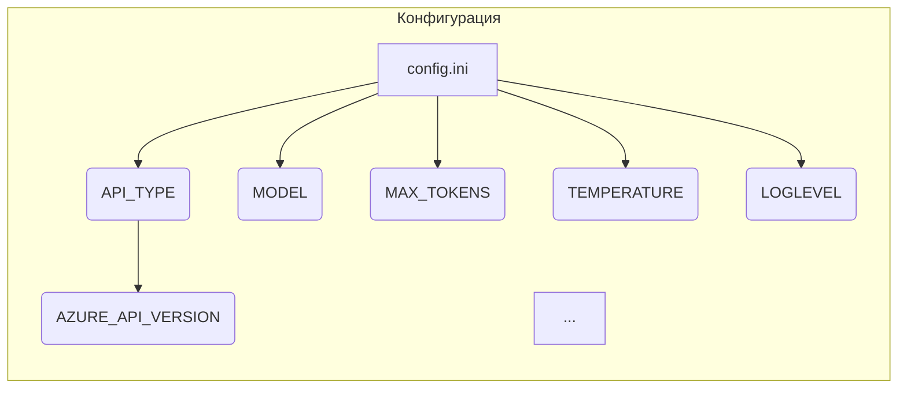

```MD
# Анализ конфигурационного файла tinytroupe/config.ini

1. **<input code>**:

```ini
#
# OpenAI or Azure OpenAI Service
#

# Default options: openai, azure
API_TYPE=openai

# Check Azure's documentation for updates here:
# https://learn.microsoft.com/en-us/azure/ai-services/openai/chatgpt-quickstart?tabs=command-line&pivots=programming-language-python
AZURE_API_VERSION=2023-05-15


#
# Model parameters
#

MODEL=gpt-4o
MAX_TOKENS=4000
TEMPERATURE=0.3
FREQ_PENALTY=0.0
PRESENCE_PENALTY=0.0
TIMEOUT=60
MAX_ATTEMPTS=5
WAITING_TIME=1
EXPONENTIAL_BACKOFF_FACTOR=5

EMBEDDING_MODEL=text-embedding-3-small

CACHE_API_CALLS=False
CACHE_FILE_NAME=openai_api_cache.pickle

MAX_CONTENT_DISPLAY_LENGTH=1024

[Simulation]
RAI_HARMFUL_CONTENT_PREVENTION=True
RAI_COPYRIGHT_INFRINGEMENT_PREVENTION=True


[Logging]
LOGLEVEL=ERROR
# ERROR
# WARNING
# INFO
# DEBUG
```

2. **<algorithm>**:

Этот код не имеет алгоритма в традиционном понимании, это конфигурационный файл.  Он определяет параметры для взаимодействия с API OpenAI (или Azure OpenAI).  Файл содержит настройки для различных аспектов работы, например, тип API, модель, лимит токенов и т.д.  Конфигурация не предполагает выполнение каких-либо действий, а только задаёт контекст для последующей работы.  Нет циклов, итераций, или сложных условий.


3. **<mermaid>**:



В данном случае диаграмма представляет собой просто перечисление настроек, которые определяются в файле.  Взаимосвязи напрямую зависят от настроек, и нет взаимодействия с другими модулями программы. 


4. **<explanation>**:

* **Импорты**:  Нет импортов, так как это конфигурационный файл.  Связь с другими частями проекта проявляется в том, что значения переменных в этом файле будут использоваться кодом, который будет подключаться к API OpenAI.

* **Классы**:  Нет классов.

* **Функции**:  Нет функций.

* **Переменные**:  Переменные `API_TYPE`, `AZURE_API_VERSION`, `MODEL`, `MAX_TOKENS`, и другие — это константы, определяющие настройки для работы с API OpenAI. Тип переменных - строки, числа.

* **Возможные ошибки или области для улучшений**:
    * Отсутствие валидации входных данных.  Хотя здесь валидации и нет, в программном обеспечении, которое использует этот файл, должна быть реализована обработка потенциально некорректных значений.
    * Должна быть возможность выбора между OpenAI и Azure OpenAI (скорее всего, в рамках конкретного пакета).
    * Необходимо документация.  Наличие комментариев улучшает понимание настроек и их предназначения.


**Цепочка взаимосвязей с другими частями проекта**:

Конфигурационный файл `config.ini` будет загружен и обработан другим кодом (скорее всего, в `src.ai.tiny_troupe.TinyTroupe.tinytroupe` или подобном месте), который будет взаимодействовать с API OpenAI, используя заданные настройки. Взаимодействие, скорее всего, будет осуществляться через вызовы функций (которых в файле нет) для инициализации API, установления настроек и передачи запросов на OpenAI.