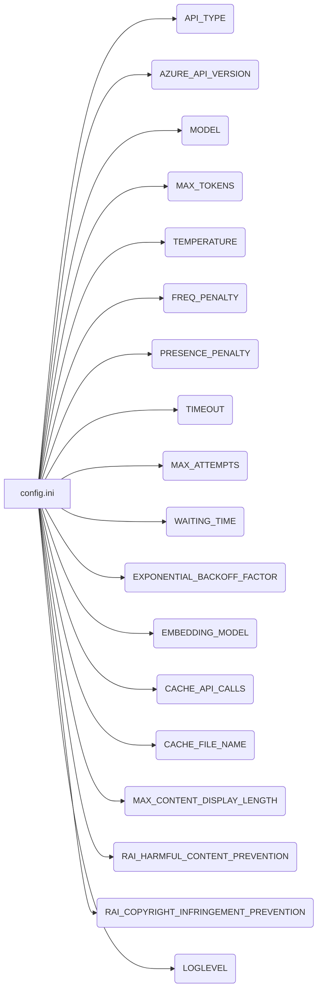

```MD
# Анализ конфигурационного файла tinytroupe/config.ini

## <input code>

```ini
#
# OpenAI or Azure OpenAI Service
#

# Default options: openai, azure
API_TYPE=openai

# Check Azure's documentation for updates here:
# https://learn.microsoft.com/en-us/azure/ai-services/openai/chatgpt-quickstart?tabs=command-line&pivots=programming-language-python
AZURE_API_VERSION=2023-05-15


#
# Model parameters
#

MODEL=gpt-4o
MAX_TOKENS=4000
TEMPERATURE=0.3
FREQ_PENALTY=0.0
PRESENCE_PENALTY=0.0
TIMEOUT=60
MAX_ATTEMPTS=5
WAITING_TIME=1
EXPONENTIAL_BACKOFF_FACTOR=5

EMBEDDING_MODEL=text-embedding-3-small 

CACHE_API_CALLS=False
CACHE_FILE_NAME=openai_api_cache.pickle

MAX_CONTENT_DISPLAY_LENGTH=1024

[Simulation]
RAI_HARMFUL_CONTENT_PREVENTION=True
RAI_COPYRIGHT_INFRINGEMENT_PREVENTION=True


[Logging]
LOGLEVEL=ERROR
# ERROR
# WARNING
# INFO
# DEBUG
```

## <algorithm>

Данный код представляет собой конфигурационный файл (`.ini`),  определяющий параметры для взаимодействия с API OpenAI (или Azure OpenAI).  Блок-схема  отсутствует, поскольку конфигурационный файл не содержит инструкций для выполнения действий. Он содержит только настройки.


## <mermaid>



Диаграмма отражает структуру конфигурационного файла, где каждая секция (например, `[OpenAI]`, `[Simulation]`)  и параметр определяет свой настрой для API взаимодействия с OpenAI.


## <explanation>

Файл `config.ini`  является конфигурационным файлом для Python приложения, скорее всего, для работы с  API OpenAI или Azure OpenAI. Он содержит различные настройки, влияющие на поведение приложения, например, тип используемого API, параметры модели, время ожидания и т.д.


**Импорты:**  
В данном коде отсутствуют импорты, так как это конфигурационный файл.  Он не содержит инструкций для выполнения действий или вызова функций.

**Классы:**
В коде отсутствуют классы.

**Функции:**
В коде отсутствуют функции.

**Переменные:**
Все данные в данном файле  являются константами (строки, числа). Они задают параметры для последующего использования приложением. Например: `API_TYPE`, `MODEL`, `MAX_TOKENS`, `LOGLEVEL`.

**Возможные ошибки или области для улучшений:**

* **Документация:**  Несмотря на комментарии, полезно было бы добавить подробные описания к каждому параметру, например, какие значения допустимы и их влияние на работу приложения.
* **Типизация:**  Использование типов данных (например, `int`, `float`) в конфигурационном файле могло бы улучшить читабельность и предотвратить ошибки.
* **Валидация:**  Программа, использующая этот файл, должна проверять корректность значений параметров.  Например, проверять, что `MAX_TOKENS` — целое число.
* **Ключевые слова в имени секции:**  Использование `[OpenAI]` и `[Simulation]` в качестве секций — хорошее решение для логической группировки параметров.


**Взаимосвязи с другими частями проекта:**

Данный файл `config.ini` используется  приложением для  получения настроек, необходимых для работы с API OpenAI (или Azure OpenAI). Приложение, скорее всего, читает данные из этого файла и использует их в своих внутренних функциях. Пример — чтение параметра `MODEL`, чтобы создать запрос к API с заданной моделью.