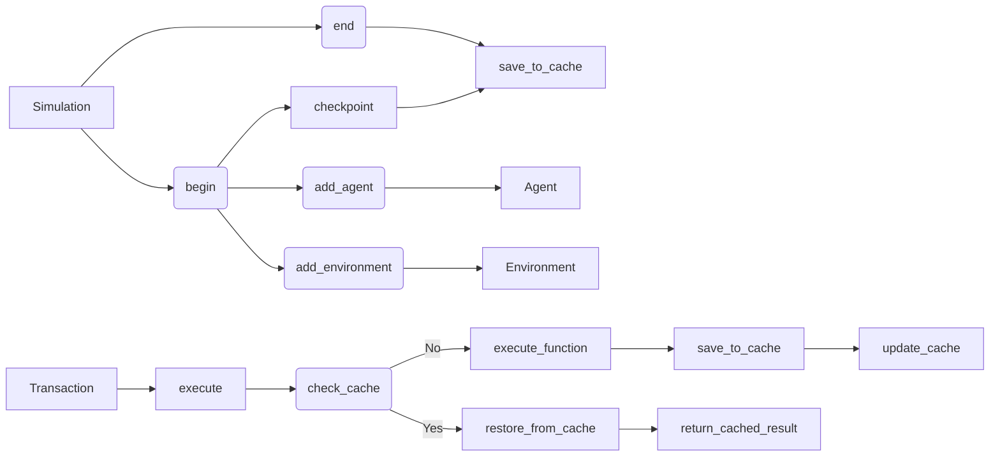

# Анализ кода control.py

## <input code>

```python
"""
Simulation controlling mechanisms.
"""
import json
import os
import tempfile

import tinytroupe
import tinytroupe.utils as utils

import logging
logger = logging.getLogger("tinytroupe")

class Simulation:
    # ... (остальной код)
```

## <algorithm>

К сожалению, построить пошаговую блок-схему для всего файла сложно. Алгоритм работы `control.py` довольно сложный, и охватывает широкий спектр операций.  Он реализует систему контроля симуляции, включающую в себя запуск, остановку, сохранение состояний, управление транзакциями и кеширование. Основные логические блоки:

1. **`Simulation` класс:** Сохраняет информацию о симуляции (агенты, окружения, фабрики, состояние). Реализует методы для управления симуляцией (запуск, остановка, добавление агентов/окружений/фабрик, сохранение/загрузка кеша).

2. **`Transaction` класс:**  Оборачивает вызов функции, позволяя сохранить состояние симуляции перед выполнением функции и восстановить его, если необходимо.

3. **`transactional` декоратор:** Преобразует обычные функции в функции-транзакции, обеспечивая управление состоянием и кешем.

4. **`reset()` функция:** Обнуляет состояние системы контроля симуляций.

5. **`begin()` функция:** Инициализирует симуляцию, сохраняет трассировку, устанавливает режим авто-сохранения.

6. **`end()` функция:** Останавливает симуляцию, сохраняет трассировку, устанавливает режим авто-сохранения.

7. **`checkpoint()` функция:** Сохраняет текущее состояние симуляции в файл кеша.

8. **`_encode_function_output()` и `_decode_function_output()` функции:** Кодируют и декодируют результаты выполнения функций для хранения в кеше, поддерживая сложные типы данных, такие как `TinyPerson`, `TinyWorld`.


**Пример взаимодействия:**

Пользователь хочет выполнить действие, например, передвижение агента.  Декоратор `@transactional` обертывает вызов, и `Transaction` класс сохраняет состояние симуляции перед выполнением.  Если в кеше найдено сохраненное состояние для этого действия, `Transaction.execute` восстанавливает это состояние и возвращает результат из кеша, а не выполняет само действие. Если в кеше нет состояния, действие выполняется, и результат сохраняется в кеше для будущих транзакций.


## <mermaid>



**Объяснение к диаграмме:**

* `Simulation`: Центральный класс, управляющий жизненным циклом симуляции.
* `begin`, `end`, `checkpoint`: Основные методы управления симуляцией.
* `add_agent`, `add_environment`: Добавление сущностей к симуляции.
* `Transaction`: Класс, обеспечивающий транзакционный контроль.
* `execute`: Метод обработки транзакции.
* `check_cache`: Проверка наличия результата в кеше.
* `restore_from_cache`: Восстановление результата из кеша.
* `execute_function`: Выполнение функции, если результат не найден в кеше.
* `save_to_cache`, `update_cache`: Сохранение результата в кеш.

**Зависимости:**

Код использует `tinytroupe`, `tinytroupe.utils`, `json`, `os`, `tempfile` и `logging`. Это означает, что эти пакеты должны быть установлены для работы кода.  Зависимости от `tinytroupe.agent`, `tinytroupe.environment`, `tinytroupe.factory` указывают на наличие связанных компонентов для работы с агентами, окружениями и фабриками.


## <explanation>

**Импорты:**

* `json`, `os`, `tempfile`: Стандартные библиотеки Python для работы с файлами, JSON и временными файлами.
* `tinytroupe`: Вероятно, собственный пакет, содержащий компоненты для моделирования.
* `tinytroupe.utils`: Модуль в пакете `tinytroupe`, содержащий вспомогательные функции, вероятно, для работы с данными и хешированием.
* `logging`: Библиотека Python для ведения логов.  Используется для записи сообщений об ошибках, предупреждениях и других событиях.

**Классы:**

* **`Simulation`:**  Представляет собой контроллер для управления симуляцией. Содержит список агентов, сред, фабрик и историю симуляции (кеш).  Атрибуты: `agents`, `environments`, `factories`, `cached_trace`, `status`, `cache_path`, `auto_checkpoint`, `has_unsaved_cache_changes`, `_under_transaction`, `execution_trace`.  Методы: `begin`, `end`, `checkpoint`, `add_agent`, `add_environment`, `add_factory`, и методы для управления кешем, транзакциями.

* **`Transaction`:** Обеспечивает транзакционный подход к выполнению операций, позволяя сохранять и восстанавливать состояние симуляции при вызове функций.

**Функции:**

* `transactional`: Декоратор, позволяющий оборачивать вызовы функций для выполнения в рамках транзакций.
* `reset`: Обнуляет состояние контроля симуляций.
* `begin`, `end`, `checkpoint`: Основные функции для управления симуляцией.
* `current_simulation`: Возвращает текущую симуляцию.
* `_encode_function_output`, `_decode_function_output`: Функции кодирования и декодирования результатов функций для хранения в кеше.


**Переменные:**

* `logger`: Объект `logging`, используется для регистрации сообщений.
* `_current_simulation_id`: Сохраняет идентификатор текущей симуляции.
* `_current_simulations`: Словарь, сохраняет объекты `Simulation` для разных идентификаторов.

**Возможные ошибки и улучшения:**

* **Обработка ошибок:** В коде есть обработка `FileNotFoundError`, но не хватает более полного контроля ошибок. Необходимо добавить `try...except` блоки для предотвращения внезапного завершения программы при возникновении проблем с файлами или другой ошибке.
* **Мультиплексность:**  Код ограничен запуском одной симуляции одновременно.  Добавление поддержки параллельных симуляций значительно расширит возможности приложения.
* **Документация:**  Документация некоторых методов и функций могла бы быть более подробной и информативной, особенно касательно сложных алгоритмов работы с кешем.


**Взаимосвязи:**

Код тесно связан с модулями `tinytroupe.agent`, `tinytroupe.environment`, `tinytroupe.factory`, которые, вероятно, содержат классы `TinyPerson`, `TinyWorld`, `TinyFactory`, и другие объекты, представляющие сущности симуляции.  Эти классы, в свою очередь, взаимодействуют с классом `Simulation` для управления и сохранения своего состояния.  Для правильной работы необходимо, чтобы структуры данных этих классов и методы `encode_complete_state`, `decode_complete_state` корректно работали с кодом контроля.