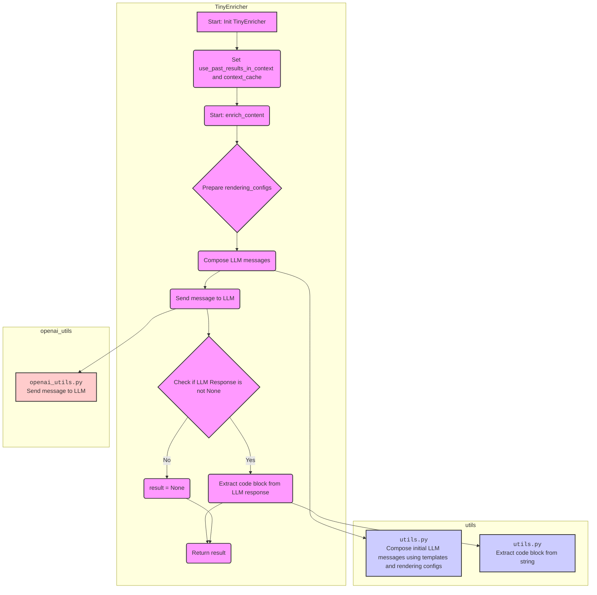
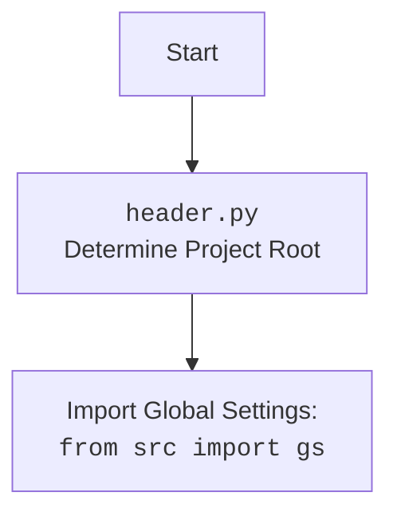

## <алгоритм>

1. **Инициализация `TinyEnricher`:**
   - При создании экземпляра `TinyEnricher` устанавливается флаг `use_past_results_in_context` (по умолчанию `False`). Этот флаг определяет, будут ли использоваться предыдущие результаты в качестве контекста при обогащении контента.
   - Инициализируется пустой список `context_cache`, который будет использоваться для хранения контекстной информации.

   ```python
   # Пример инициализации
   enricher = TinyEnricher() 
   # enricher.use_past_results_in_context = False
   # enricher.context_cache = []
   ```

2. **Метод `enrich_content`:**
   - Принимает следующие аргументы:
     - `requirements`:  Строка с описанием требований к обогащению контента.
     - `content`: Строка с контентом, который нужно обогатить.
     - `content_type`: (необязательно) Строка, указывающая тип контента.
     - `context_info`: (необязательно) Строка с дополнительной контекстной информацией.
     - `context_cache`: (необязательно) Список с предыдущими результатами. По умолчанию `None`.
     - `verbose`: (необязательно) Булево значение, указывающее, нужно ли выводить отладочные сообщения в консоль.

   ```python
    # Пример вызова enrich_content
   result = enricher.enrich_content(
        requirements="Добавить информацию о авторе",
        content="Это текст",
        content_type="текст",
        context_info="Предыдущий текст был о том же",
        verbose=True
   )
   ```

3. **Подготовка `rendering_configs`:**
   - Создается словарь `rendering_configs`, содержащий все переданные аргументы, которые будут использоваться для подстановки в шаблоны сообщений.
   ```python
   rendering_configs = {
    "requirements": "Добавить информацию о авторе",
    "content": "Это текст",
    "content_type": "текст",
    "context_info": "Предыдущий текст был о том же",
    "context_cache": None
   }
   ```

4. **Композиция сообщений для LLM:**
   - Используется функция `utils.compose_initial_LLM_messages_with_templates` для создания списка сообщений для отправки в LLM. Эта функция принимает на вход:
      - Имена файлов шаблонов для системного сообщения (`enricher.system.mustache`) и пользовательского сообщения (`enricher.user.mustache`).
      - Словарь `rendering_configs` для подстановки значений в шаблоны.
   - Функция использует шаблонизатор `chevron` для рендеринга.

   ```python
   messages = utils.compose_initial_LLM_messages_with_templates(
        "enricher.system.mustache",
        "enricher.user.mustache",
        rendering_configs
    )
   # messages = [
   #     {"role": "system", "content": "<содержимое из enricher.system.mustache>"},
   #     {"role": "user", "content": "<содержимое из enricher.user.mustache>"}
   # ]
   ```

5. **Отправка сообщения в LLM:**
   - Используется функция `openai_utils.client().send_message` для отправки сообщений в LLM.
   - Устанавливается параметр `temperature=0.4`, который регулирует случайность ответов LLM.

   ```python
   next_message = openai_utils.client().send_message(messages, temperature=0.4)
   # next_message = {"content": "```json\n{\"author\": \"John Doe\"}```"}
   ```

6. **Обработка ответа LLM:**
   - Логируется отладочное сообщение, содержащее полученный ответ от LLM.
   - Если `verbose` установлен в `True`, отладочное сообщение выводится на консоль.
   - Извлекается кодовый блок (предполагается, что ответ LLM содержит JSON) из содержимого сообщения с помощью `utils.extract_code_block`.
   - Если ответ LLM равен `None`, переменной `result` присваивается значение `None`.

   ```python
   # logger.debug("Enrichment result message: {\"content\": \"```json\\n{\\\"author\\\": \\\"John Doe\\\"}```\"}")
   # if verbose:  print("Enrichment result message: {\"content\": \"```json\\n{\\\"author\\\": \\\"John Doe\\\"}```\"}")
    result = utils.extract_code_block(next_message["content"])
    # result = '{"author": "John Doe"}'
   ```

7. **Возвращение результата:**
   - Метод возвращает извлеченный кодовый блок или `None`, если ответ LLM не был получен.

   ```python
    return result
   ```

## <mermaid>





## <объяснение>

**Импорты:**

- `os`: Модуль для работы с операционной системой. В данном коде явно не используется, но может быть использован в других частях проекта.
- `json`: Модуль для работы с данными в формате JSON.
- `chevron`: Модуль для рендеринга шаблонов (используется в `utils.compose_initial_LLM_messages_with_templates`).
- `logging`: Модуль для логирования событий (используется для отладки).
- `pandas as pd`: Модуль для работы с данными в формате таблиц.
- `tinytroupe.agent.TinyPerson`: Класс, представляющий агента (человека).
- `tinytroupe.environment.TinyWorld`: Класс, представляющий окружение агентов.
- `tinytroupe.factory.TinyPersonFactory`: Класс для создания агентов.
- `tinytroupe.utils.JsonSerializableRegistry`: Класс для управления сериализуемыми данными.
- `tinytroupe.openai_utils`: Модуль для взаимодействия с API OpenAI.
- `tinytroupe.utils as utils`: Модуль с набором вспомогательных функций, которые используются для обработки текстов и сообщений, включая:
    - `compose_initial_LLM_messages_with_templates`: Формирует список сообщений для LLM с использованием шаблонов.
    - `extract_code_block`: Извлекает кодовый блок из текста.
    - Эти модули используют другие части проекта, такие как `gs`, для доступа к глобальным настройкам и шаблонам.

**Классы:**

- `TinyEnricher(JsonSerializableRegistry)`:
    - Наследуется от `JsonSerializableRegistry`, предполагается что он может сериализовывать/десериализовать себя в JSON.
    - Атрибуты:
        - `use_past_results_in_context`: Флаг, указывающий, использовать ли прошлые результаты в контексте (по умолчанию `False`).
        - `context_cache`: Список для хранения контекстной информации (предыдущих результатов)
    - Методы:
        - `__init__(self, use_past_results_in_context=False)`: Конструктор класса.
        - `enrich_content(self, requirements: str, content: str, content_type: str = None, context_info: str = "", context_cache: list = None, verbose: bool = False)`: Основной метод, который обогащает контент с использованием LLM.

**Функции:**

- `__init__(self, use_past_results_in_context=False)`:
    - Конструктор класса `TinyEnricher`.
    - Инициализирует `use_past_results_in_context` и `context_cache`.
- `enrich_content(...)`:
    - Принимает `requirements`, `content`, `content_type`, `context_info`, `context_cache`, `verbose`.
    - Создает словарь `rendering_configs` для передачи в шаблоны сообщений.
    - Компонует список сообщений для LLM, используя шаблоны и `rendering_configs`.
    - Отправляет сообщения в LLM.
    - Извлекает кодовый блок из ответа LLM.
    - Возвращает извлеченный кодовый блок или `None`.

**Переменные:**

- `logger`: Объект логирования, созданный для модуля `tinytroupe`.
- `use_past_results_in_context`: Булев флаг.
- `context_cache`: Список для хранения контекстной информации.
- `requirements`, `content`, `content_type`, `context_info`, `context_cache`, `verbose`: Аргументы метода `enrich_content`.
- `rendering_configs`: Словарь с данными для шаблонов.
- `messages`: Список сообщений, подготовленных для LLM.
- `next_message`: Ответ от LLM.
- `debug_msg`: Строка отладочного сообщения.
- `result`: Извлеченный кодовый блок из ответа LLM.

**Потенциальные ошибки и области для улучшения:**

- **Обработка ошибок:** Отсутствует явная обработка ошибок, связанных с взаимодействием с LLM (например, сбои сети, ошибки API).
- **Типизация:** Использование статической типизации могло бы сделать код более надежным и легким для понимания.
- **Контекст:** Обработка контекста довольно примитивна, текущая реализация не использует `context_cache` в полной мере.
- **Шаблоны:** Зависимость от шаблонов в файлах `.mustache` требует их наличия и корректности.
- **Общая архитектура:** Класс `TinyEnricher` напрямую зависит от `openai_utils` и `utils`. Возможно, стоит рассмотреть добавление абстрактного интерфейса для LLM, чтобы облегчить переход на другую модель.

**Взаимосвязи с другими частями проекта:**

- `tinytroupe.utils`: Используется для композиции сообщений и извлечения кодовых блоков, что указывает на тесную интеграцию с вспомогательными функциями.
- `tinytroupe.openai_utils`: Используется для взаимодействия с LLM, что делает этот класс зависимым от конкретного API.
- `tinytroupe.agent`, `tinytroupe.environment`, `tinytroupe.factory`: Импортируются, но явно не используются в этом коде, что может указывать на их использование в других частях проекта.
- `src.gs`:  `utils.py` будет импортировать `gs`, `gs.py` определяет путь к корневой директории проекта и загружает глобальные настройки приложения.