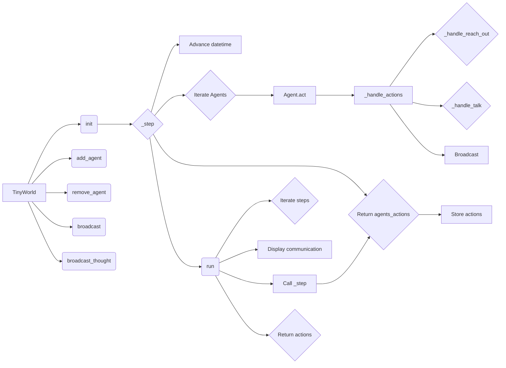

# <input code>

```python
"""
Environments provide a structured way to define the world in which the
agents interact with each other as well as external entities (e.g., search engines).
"""

import logging
logger = logging.getLogger("tinytroupe")
import copy
from datetime import datetime, timedelta

from tinytroupe.agent import *
from tinytroupe.utils import name_or_empty, pretty_datetime
import tinytroupe.control as control
from tinytroupe.control import transactional

from rich.console import Console

from typing import Any, TypeVar, Union
AgentOrWorld = Union["TinyPerson", "TinyWorld"]

class TinyWorld:
    """
    Base class for environments.
    """

    # A dict of all environments created so far.
    all_environments = {} # name -> environment

    # Whether to display environments communications or not, for all environments. 
    communication_display = True

    def __init__(self, name: str="A TinyWorld", agents=[], 
                 initial_datetime=datetime.datetime.now(),
                 broadcast_if_no_target=True):
        """
        Initializes an environment.

        Args:
            name (str): The name of the environment.
            agents (list): A list of agents to add to the environment.
            initial_datetime (datetime): The initial datetime of the environment, or None (i.e., explicit time is optional). 
                Defaults to the current datetime in the real world.
            broadcast_if_no_target (bool): If True, broadcast actions if the target of an action is not found.
        """

        self.name = name
        self.current_datetime = initial_datetime
        self.broadcast_if_no_target = broadcast_if_no_target
        self.simulation_id = None # will be reset later if the agent is used within a specific simulation scope
        
        self.agents = []
        self.name_to_agent = {} # {agent_name: agent, agent_name_2: agent_2, ...}

        self._displayed_communications_buffer = []

        self.console = Console()

        TinyWorld.add_environment(self)
        self.add_agents(agents)
        
    # ... (rest of the code)
```

# <algorithm>

A detailed algorithm for `TinyWorld` class is not readily apparent from a single class.  This class encapsulates an environment for agents, with methods to add, remove, and control agents.  The core logic is in `_step` and `run`.  The crucial part of the algorithm is handling actions:

1. **`__init__`**: Initializes the environment with a name, agents, initial time, and broadcasting settings. Stores agents and their names internally.


2. **`_step`**:  
    a. Advances the `current_datetime` based on provided `timedelta_per_step`. This is a critical timing step for simulation accuracy.
    b. Iterates through `agents` in `self.agents`. 
    c. Collects the actions from each agent via the `act` method. Stores those actions in `agents_actions`.
    d. Handles each action using `_handle_actions`. 
    e. Returns the `agents_actions` dictionary.


3. **`run`**:
    a. Creates an empty list `agents_actions_over_time` to accumulate actions taken over the simulation.
    b. Iterates a specified number of `steps`.
    c. Calls `_step` for each step to advance the environment and get agent actions.
    d. Appends the results to `agents_actions_over_time`.
    e. Returns `agents_actions_over_time` if `return_actions` is True.


4. **`_handle_actions`**: Processes agent actions:
    a. Iterates through each `action` in `actions`.
    b. Retrieves the `action_type` and optional `content` and `target`.
    c. Dispatches to appropriate handler method based on the action type, calling `_handle_reach_out` or `_handle_talk`.

5. **`_handle_reach_out`**: This method allows two agents to interact based on their 'accessibility', essentially modelling relationship building in a simplified environment. 

6. **`_handle_talk`**: If the target is known, delivers the message.  Otherwise, broadcasts the message to all agents.

7. **`broadcast`**: Sends the message to all agents, except the source.

The code also includes methods (`run_minutes`, `skip`, `skip_minutes`, `run_years` etc.) to manage time-based interactions with the environment in various intervals.

# <mermaid>



**Explanation of Dependencies:**

* **`tinytroupe.agent`**: Likely contains the `TinyPerson` class (agent), defining agent actions and communication methods.
* **`tinytroupe.utils`**: Provides helper functions like `name_or_empty` and `pretty_datetime`, likely for formatting and handling strings.
* **`tinytroupe.control`**:  Deals with the `transactional` decorator, hinting at a transactional framework for managing environment state changes.
* **`rich.console`**: Used for rich text formatting and output.
* **`datetime`**: Python's built-in module for working with dates and times.
* **`copy`**: Used for creating deep copies.
* **`logging`**: Used for logging information, debug statements, and warning messages.

# <explanation>

**Imports:**

- `logging`, `copy`, `datetime`, `timedelta`: Standard Python modules for logging, object copying, and date/time manipulation.
- `from tinytroupe.agent import *`: Imports all classes/functions from the `tinytroupe.agent` module;  critical for the agent-related interactions. This is a wildcard import, potentially exposing many names from that module and could lead to issues if there's name collision.
- `from tinytroupe.utils import name_or_empty, pretty_datetime`: Imports utility functions from the `tinytroupe.utils` module, likely for handling strings and formatting dates.
- `import tinytroupe.control as control`: Imports the `control` module from the `tinytroupe` package. It's not clear from the context alone what is in the module.
- `from tinytroupe.control import transactional`: Imports the `transactional` function from the `tinytroupe.control` module.  This likely implements an aspect-oriented programming (AOP) pattern to manage transactions and logging around state changes in the environment.
- `from rich.console import Console`: Imports the `Console` class from the `rich` library, indicating the desire for rich text formatting and output.


**Classes:**

- `TinyWorld`:  The core class representing an environment.
    - `all_environments`: Static variable, a dictionary of all environments initialized so far.  This is for referencing environments.
    - `communication_display`: Static variable to control whether environment communications are displayed.
    - `__init__`: Initializes the environment, sets up agent lists, and handles various settings like the initial date.
    - `_step`:  Core method for advancing the environment one step. This method makes agents act, handles actions (very important part), and returns collected actions.
    - `run`: Runs the environment for a specified number of steps.  It calls `_step` repeatedly.
    - `skip`: Skips steps, advancing time but not performing agent actions.
    - A multitude of time-based methods (e.g., `run_minutes`, `skip_days`) provide convenient ways to run simulations over time intervals.
    - `add_agents`, `add_agent`, `remove_agent`, `remove_all_agents`: Methods for managing agents within the environment. `add_agent` raises `ValueError` if agent name already exists.
    - `get_agent_by_name`: Retrieves an agent from the environment by its name.
    - `_handle_actions`, `_handle_reach_out`, `_handle_talk`: Methods for handling various agent actions.  Crucially, these are crucial for modelling environment interactions.
    - `broadcast`, `broadcast_thought`, `broadcast_internal_goal`: Methods for broadcasting messages/thoughts to all agents.
    - `encode_complete_state`, `decode_complete_state`:  Methods for encoding and decoding the complete state of the environment.  Allows saving and loading of the simulation state.
    - `_pretty_step`, `_display_communication`, `_display`: Methods related to formatting and displaying simulation information, including handling a buffer of communication steps. This is likely for producing well-formatted reports of the simulation state.


**Functions:**


**Possible Errors/Improvements:**

- **`@transactional` decorator:**  The decorator's implementation is not seen, but it's crucial for the transactional behavior it's intended to provide.  Issues with the decorator's implementation might lead to unexpected behavior during simulation runs.


- **Wildcard Imports (`*`)**: The use of wildcard imports from `tinytroupe.agent` should be reviewed; a better practice is to import specific classes or functions as needed to avoid accidental naming conflicts.

- **Error Handling:**  While the `decode_complete_state` method has error handling, more robust error handling could be implemented for other methods. (e.g., checking for `None` return values from agent actions).

- **Data validation:**  Check the format of agent's actions in `_handle_actions`.  Consider using a data validation library like `Pydantic` to ensure actions meet the expected format.

- **Agent-agent interaction**: The methods `make_agent_accessible` and the relations between agents look promising for future extension and simulation of complex agent-agent interaction scenarios.

- **`TinySocialNetwork` subclass**: This subclass introduces the concept of social relations.  The provided code is designed with extensibility in mind, allowing for the introduction of relationships and more sophisticated social interactions in the simulation. This will likely improve over time.


**Relationships with other parts of the project**:

The code heavily relies on the `TinyPerson` class, which likely defines the agents within the simulation. `TinyWorld` directly manages and controls the behavior of agents within its scope. This class provides the context and infrastructure for the agent interactions. The `tinytroupe.utils` and `tinytroupe.control` are supporting libraries. Therefore, `TinyWorld` forms the core engine of the simulation, with dependencies on other parts of the `tinytroupe` package for its functions.