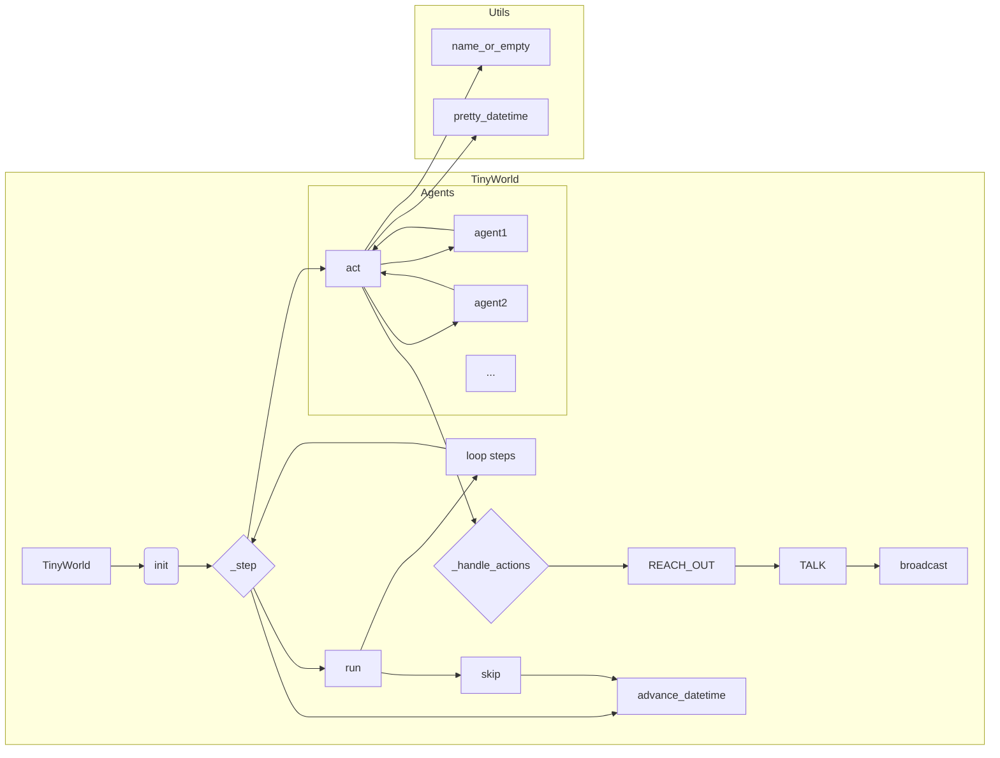

# <input code>

```python
"""
Environments provide a structured way to define the world in which the
agents interact with each other as well as external entities (e.g., search engines).
"""

import logging
logger = logging.getLogger("tinytroupe")
import copy
from datetime import datetime, timedelta

from tinytroupe.agent import *
from tinytroupe.utils import name_or_empty, pretty_datetime
import tinytroupe.control as control
from tinytroupe.control import transactional

from rich.console import Console

from typing import Any, TypeVar, Union
AgentOrWorld = Union["TinyPerson", "TinyWorld"]

class TinyWorld:
    """
    Base class for environments.
    """

    # A dict of all environments created so far.
    all_environments = {} # name -> environment

    # Whether to display environments communications or not, for all environments. 
    communication_display = True

    def __init__(self, name: str="A TinyWorld", agents=[], 
                 initial_datetime=datetime.datetime.now(),
                 broadcast_if_no_target=True):
        """
        Initializes an environment.

        Args:
            name (str): The name of the environment.
            agents (list): A list of agents to add to the environment.
            initial_datetime (datetime): The initial datetime of the environment, or None (i.e., explicit time is optional). 
                Defaults to the current datetime in the real world.
            broadcast_if_no_target (bool): If True, broadcast actions if the target of an action is not found.
        """

        # ... (rest of the code)
```

# <algorithm>

**Описание алгоритма работы класса TinyWorld:**

1. **Инициализация (init):**
    * Создается новый объект `TinyWorld` с именем, списком агентов, начальной датой и параметром для рассылки при отсутствии целевого агента.
    * Агенты добавляются в `self.agents` и `self.name_to_agent`.
    * Сохраняется буфер отображений (`_displayed_communications_buffer`) для последующего хранения.
    * Объект `TinyWorld` добавляется в глобальный словарь `TinyWorld.all_environments`.

2. **Шаг симуляции (_step):**
    * Обновляется текущая дата (`self.current_datetime`) если `timedelta_per_step` задан.
    * Каждый агент выполняет `agent.act()`, возвращая список действий. Результаты записываются в словарь `agents_actions`.
    * Обрабатываются полученные действия агентов с помощью `_handle_actions`.
    * Возвращает словарь действий `agents_actions`.

3. **Запуск симуляции (run):**
    * Цикл по количеству шагов (`steps`).
    * Для каждого шага вызывается `_step`.
    * Результаты действий каждого шага сохраняются в `agents_actions_over_time`.
    * Если `return_actions` = True, возвращает список действий агентов по времени.

4. **Пропуск шагов (skip):**
    * Обновляет текущую дату на количество `steps` с заданным `timedelta_per_step`. Никаких действий агентов не выполняется.

5. **Обработка действий (_handle_actions):**
    * Цикл по действиям каждого агента.
    * Проверяет тип действия.
    * В зависимости от типа (REACH_OUT или TALK), вызывается соответствующий обработчик.
    * При необходимости, рассылает сообщение всем агентам в среде (`broadcast`).

6. **Обработка REACH_OUT (_handle_reach_out):**
    * Ищет целевого агента по имени.
    * Устанавливает доступность агентов друг для друга.
    * Сообщает агентам о том, что связь установлена.

7. **Обработка TALK (_handle_talk):**
    * Ищет целевого агента по имени.
    * Если целевой агент найден, отправляет ему сообщение.
    * Если целевой агент не найден, рассылает сообщение всем агентам (если `broadcast_if_no_target` = True).

8. **Методы broadcast...:**
    * Рассылают сообщения, мысли или внутренние цели всем агентам в среде.


# <mermaid>




# <explanation>

**Импорты:**

* `logging`: Для ведения журналов.  `logger = logging.getLogger("tinytroupe")` инициализирует логгер для модуля `tinytroupe`.
* `copy`: Для создания глубоких копий объектов.
* `datetime`: Для работы с датами и временем.
* `tinytroupe.agent`: Содержит определения агентов (наверняка `TinyPerson`, `TinyAgent`).
* `tinytroupe.utils`: Вспомогательные функции, такие как форматирование дат и имен.
* `tinytroupe.control`: Вероятно, модуль, содержащий `transactional` декоратор для атомарных операций.
* `rich.console`: Для визуализации вывода.
* `typing`: Для типизации.

**Классы:**

* `TinyWorld`: Базовый класс для сред. Он хранит список агентов, текущую дату, буфер сообщений и управляет взаимодействием агентов.
    * `all_environments`: Словарь для хранения всех созданных сред.
    * `communication_display`: Флаг, определяющий, нужно ли отображать сообщения в консоли.
    * `add_agents`, `add_agent`, `remove_agent`, `remove_all_agents`: Методы для управления агентами в среде.
    * `get_agent_by_name`: Ищет агента по имени.
    * `_handle_actions`, `_handle_reach_out`, `_handle_talk`: Методы для обработки действий агентов.
    * `run`, `skip`: Методы запуска и пропуска симуляции.
    * `run_*`, `skip_*`: Методы запуска/пропуска симуляции на заданное время (минуты, часы, дни, недели, месяцы, года).
    * `encode_complete_state`, `decode_complete_state`: Методы для сериализации и десериализации состояния среды.
    * `_display_communication`, `_push_and_display_latest_communication`, `_display`: Методы для отображения и сохранения сообщений.
    * `clear_communications_buffer`: очищает буфер сообщений.
    * `_pretty_step`:  предоставляет форматированный вывод для шага моделирования.
    * `pp_current_interactions`, `pretty_current_interactions`:  получение и отображение истории взаимодействий.
* `TinySocialNetwork(TinyWorld)`: Наследуется от `TinyWorld` и добавляет функциональность для социальных сетей. `relations`: словарь для хранения отношений между агентами.  `add_relation`, `_update_agents_contexts`:  методы для работы с отношениями агентов.
    * `is_in_relation_with`: Проверяет наличие связи между агентами.
    * `_handle_reach_out`:  Реализация `_handle_reach_out` для социальных сетей, учитывающая отношения между агентами.

**Функции:**

* `_step`: Выполняет один шаг симуляции.
* `_advance_datetime`: Обновляет текущую дату.
* `broadcast`, `broadcast_thought`, `broadcast_internal_goal`, `broadcast_context_change`: Рассылают сообщения, мысли или внутренние цели всем агентам.


**Переменные:**

* `self.name`: Имя среды.
* `self.current_datetime`: Текущая дата и время.
* `self.agents`: Список агентов в среде.
* `self.name_to_agent`: Словарь для быстрого поиска агента по имени.
* `self.broadcast_if_no_target`: Флаг для рассылки сообщений без целевого получателя.
* `TinyWorld.all_environments`: Словарь всех созданных сред.

**Возможные ошибки или области для улучшений:**

* Возможно, стоит добавить проверку на существование целевого агента перед выполнением `_handle_talk` и `_handle_reach_out`.
* Словарь `self.relations` в `TinySocialNetwork` может быть избыточным; возможно, стоит использовать другой способ хранения данных о связях, чтобы не добавлять лишние данные при каждом добавлении связи.
* Документация может быть более подробной (особенно для методов `_handle_*`).
* Возможность переопределения поведения (в `_step`, `_handle_actions`, `_handle_reach_out`, `_handle_talk`) для разных типов сред.

**Взаимосвязи с другими частями проекта:**

Код сильно зависит от класса `TinyPerson` (и других агентов), определённого в `tinytroupe.agent`.  Функции из `tinytroupe.utils`  используются для форматирования даты и имен. `tinytroupe.control` нужен для атомарных операций. `rich.console` используется для вывода.  Это ключевые зависимости и компоненты, которые должны быть частью проекта, чтобы код `environment.py` работал правильно.