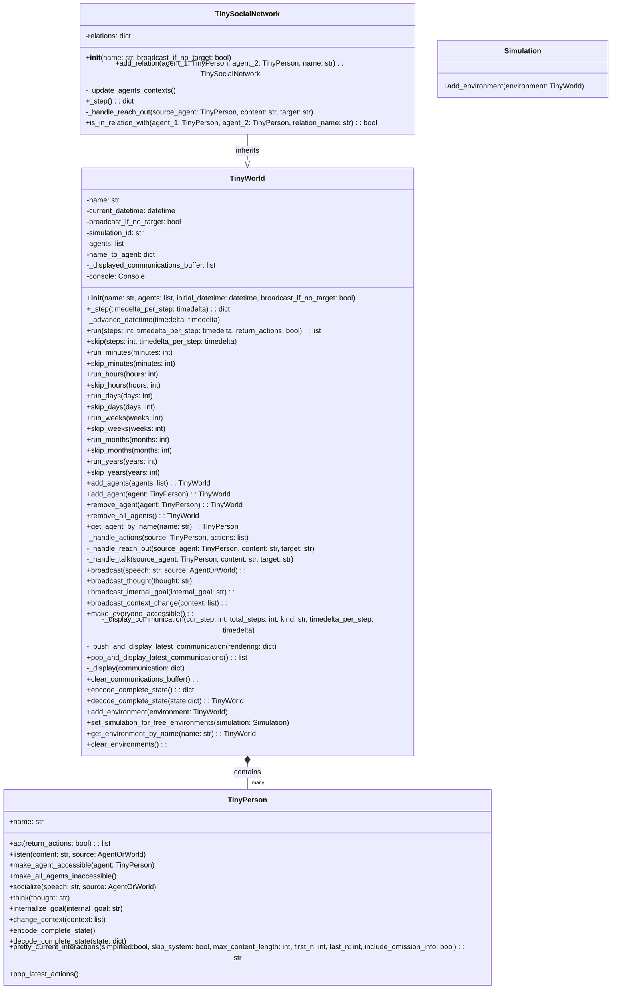

## Анализ кода `hypotez/src/ai/tiny_troupe/TinyTroupe/tinytroupe/environment.py`

### <алгоритм>

1.  **Инициализация `TinyWorld`**:
    *   Создается экземпляр `TinyWorld` с заданным именем, списком агентов, начальным временем и флагом широковещания.
    *   Инициализируются атрибуты: `name`, `current_datetime`, `broadcast_if_no_target`, `simulation_id`.
    *   Создаются пустые списки для агентов (`agents`) и словарь `name_to_agent` (для быстрого поиска агента по имени).
    *   Создается буфер (`_displayed_communications_buffer`) для хранения отображаемых коммуникаций.
    *   Создается консоль (`Console`) для вывода сообщений.
    *   Добавляет текущий экземпляр среды в `all_environments`.
    *   Добавляет агентов в среду, если они есть.
    *   Пример:
        ```python
        world = TinyWorld(name="MyWorld", agents=[agent1, agent2], initial_datetime=datetime.now(), broadcast_if_no_target=True)
        ```

2.  **Шаг симуляции `_step`**:
    *   Увеличивает время среды на заданную `timedelta` (если есть).
    *   Для каждого агента в среде:
        *   Агент выполняет действие (`agent.act()`).
        *   Полученные действия обрабатываются (`_handle_actions`).
    *   Возвращает словарь с действиями агентов.
    *   Пример:
        ```python
        actions = world._step(timedelta_per_step=timedelta(minutes=10))
        ```

3.  **Запуск симуляции `run`**:
    *   Запускает симуляцию на заданное количество шагов.
    *   На каждом шаге:
        *   Выводит информацию о текущем шаге (если `communication_display` включен).
        *   Выполняет шаг симуляции (`_step`).
        *   Сохраняет действия агентов на каждом шаге.
    *   Возвращает список действий за все шаги, если `return_actions` равен `True`.
    *   Пример:
        ```python
        actions_over_time = world.run(steps=10, timedelta_per_step=timedelta(hours=1), return_actions=True)
        ```

4.  **Управление временем**:
    *   Функции `run_minutes`, `run_hours`, `run_days`, `run_weeks`, `run_months`, `run_years` запускают симуляцию на заданное время.
    *   Функции `skip_minutes`, `skip_hours`, `skip_days`, `skip_weeks`, `skip_months`, `skip_years` пропускают заданное время, не выполняя действий агентов.

5.  **Управление агентами**:
    *   `add_agents`: Добавляет список агентов в среду.
    *   `add_agent`: Добавляет агента в среду. Имя агента должно быть уникальным.
    *   `remove_agent`: Удаляет агента из среды.
    *   `remove_all_agents`: Удаляет всех агентов из среды.
    *   `get_agent_by_name`: Возвращает агента по имени.

6.  **Обработка действий `_handle_actions`**:
    *   Для каждого действия агента:
        *   Определяет тип действия (`action_type`).
        *   Вызывает соответствующий обработчик.
    *   Обработчики действий:
        *   `_handle_reach_out`: Обрабатывает действие "REACH_OUT" (устанавливает доступность между агентами).
        *   `_handle_talk`: Обрабатывает действие "TALK" (доставляет сообщение целевому агенту или широковещательно, если цель не найдена).
    *   Пример:
        ```python
        # действие от агента agent1
        action = {"type": "TALK", "content": "Hello!", "target": "agent2"}
        world._handle_actions(agent1, [action])
        ```

7.  **Взаимодействие**:
    *   `broadcast`: Отправляет сообщение всем агентам в среде.
    *   `broadcast_thought`: Отправляет мысль всем агентам в среде.
    *   `broadcast_internal_goal`: Отправляет внутреннюю цель всем агентам в среде.
    *   `broadcast_context_change`: Отправляет изменение контекста всем агентам в среде.
    *   `make_everyone_accessible`: Делает всех агентов доступными друг для друга.

8.  **Отображение**:
    *   `_display_communication`: Формирует и отображает сообщение о коммуникации, сохраняя его в буфере.
    *   `_push_and_display_latest_communication`: Добавляет сообщение в буфер и отображает его.
    *   `pop_and_display_latest_communications`: Отображает все накопленные сообщения и очищает буфер.
    *   `_display`: Выводит сообщение в консоль (с оформлением для шагов).
    *   `clear_communications_buffer`: Очищает буфер сообщений.

9.  **Состояние**:
    *   `encode_complete_state`: Кодирует полное состояние среды в словарь.
    *   `decode_complete_state`: Декодирует полное состояние среды из словаря.

10. **Статические методы**:
    *   `add_environment`: Добавляет среду в список всех сред.
    *   `set_simulation_for_free_environments`: Назначает симуляцию всем "свободным" средам.
    *   `get_environment_by_name`: Возвращает среду по имени.
    *   `clear_environments`: Очищает список всех сред.

11. **`TinySocialNetwork`**:
    *   Наследуется от `TinyWorld`.
    *   Имеет атрибут `relations`, представляющий социальные связи между агентами.
    *   Метод `add_relation` добавляет связь между агентами.
    *   Метод `_update_agents_contexts` обновляет доступность агентов на основе социальных связей.
    *   Переопределяет `_step` для обновления контекстов агентов перед выполнением шага.
    *   Переопределяет `_handle_reach_out` так, что `REACH_OUT` срабатывает только если агенты в одной связи.
    *   `is_in_relation_with` проверяет наличие связи между агентами.

### <mermaid>



**Зависимости:**

*   **`logging`**: Используется для логирования событий внутри среды, что помогает отслеживать и отлаживать процессы.
*   **`copy`**: Применяется для создания глубоких копий объектов, что необходимо для сохранения и восстановления состояний среды и агентов, а также для избежания нежелательных изменений при передаче данных.
*   **`datetime`**: Используется для работы со временем и датами, позволяя моделировать течение времени в среде, а также позволяет сдвигать время на симуляции вперед.
*   **`tinytroupe.agent`**: Импортирует класс `TinyPerson`, представляющий агента, взаимодействующего со средой. Этот модуль позволяет управлять агентами и их действиями в среде.
*   **`tinytroupe.utils`**: Содержит вспомогательные функции, такие как `name_or_empty` и `pretty_datetime`, которые используются для форматирования и отображения информации об агентах и времени.
*   **`tinytroupe.control`**: Импортирует `transactional`, который используется как декоратор для методов, управляющих состоянием среды, обеспечивая целостность данных во время симуляции.
*   **`rich.console`**: Применяется для создания консольного вывода с форматированием, позволяя отображать сообщения среды и агентов в более читаемом виде.
*   **`typing`**: Предоставляет средства для определения типов переменных, что улучшает читаемость и позволяет статически проверять код. В частности, используется для определения типа `AgentOrWorld`, который может быть как `TinyPerson`, так и `TinyWorld`.

### <объяснение>

**Импорты:**

*   `logging`: Модуль для логирования событий, используется для отладки и мониторинга работы среды. Связан со всем проектом через глобальный логгер `tinytroupe`.
*   `copy`: Модуль для копирования объектов, используется для создания глубоких копий состояний среды и агентов.
*   `datetime`: Модуль для работы со временем и датами, используется для моделирования течения времени в среде.
*   `tinytroupe.agent`: Содержит класс `TinyPerson`, представляющий агента. Этот пакет является частью основной логики `TinyTroupe` и обеспечивает взаимодействие агентов с миром.
*   `tinytroupe.utils`: Содержит утилиты для форматирования вывода и обработки имен агентов.
*   `tinytroupe.control`: Содержит декоратор `transactional`, который управляет транзакциями для обеспечения целостности данных.
*   `rich.console`: Модуль для красивого отображения вывода в консоли.
*  `typing`: Модуль для аннотации типов. Используется для `AgentOrWorld` - кастомного типа, определяющего `Union["TinyPerson", "TinyWorld"]`.

**Классы:**

*   `TinyWorld`:
    *   **Роль**: Базовый класс для создания сред, в которых взаимодействуют агенты.
    *   **Атрибуты**:
        *   `name` (str): Название среды.
        *   `current_datetime` (datetime): Текущее время в среде.
        *   `broadcast_if_no_target` (bool): Флаг широковещания действий, если цель не найдена.
        *   `simulation_id`: Идентификатор симуляции, к которой относится среда.
        *   `agents` (list): Список агентов в среде.
        *   `name_to_agent` (dict): Словарь для быстрого доступа к агентам по имени.
        *   `_displayed_communications_buffer` (list): Буфер для хранения отображенных сообщений.
        *   `console` (Console): Объект для вывода в консоль.
        *    `all_environments` (dict): Словарь для всех созданных сред.
        *  `communication_display` (bool): Флаг для отображения коммуникаций в консоли
    *   **Методы**:
        *   `__init__`: Инициализирует среду с заданным именем, агентами и временем.
        *   `_step`: Выполняет один шаг симуляции, позволяя агентам действовать.
        *   `_advance_datetime`: Увеличивает текущее время среды.
        *   `run`: Запускает симуляцию на заданное количество шагов.
        *   `skip`: Пропускает время без выполнения действий агентов.
        *   `run_minutes`, `run_hours`, `run_days`, `run_weeks`, `run_months`, `run_years`: Удобные методы для запуска симуляции на заданное время.
        *   `skip_minutes`, `skip_hours`, `skip_days`, `skip_weeks`, `skip_months`, `skip_years`: Удобные методы для пропуска заданного времени.
        *   `add_agents`: Добавляет список агентов в среду.
        *   `add_agent`: Добавляет агента в среду, проверяя уникальность имени.
        *   `remove_agent`: Удаляет агента из среды.
        *   `remove_all_agents`: Удаляет всех агентов из среды.
        *   `get_agent_by_name`: Возвращает агента по имени.
        *   `_handle_actions`: Обрабатывает действия агентов, вызывая соответствующие обработчики.
        *   `_handle_reach_out`: Обрабатывает действие `REACH_OUT` (делает агентов доступными друг для друга).
        *   `_handle_talk`: Обрабатывает действие `TALK` (доставляет сообщение агенту или широковещательно).
        *   `broadcast`: Рассылает сообщение всем агентам в среде.
        *   `broadcast_thought`: Рассылает мысль всем агентам в среде.
        *   `broadcast_internal_goal`: Рассылает внутреннюю цель всем агентам в среде.
        *   `broadcast_context_change`: Рассылает изменение контекста всем агентам в среде.
        *    `make_everyone_accessible`: Делает всех агентов доступными друг для друга.
        *    `_display_communication`: Отображает текущее состояние симуляции.
        *    `_push_and_display_latest_communication`: Отображает сообщение и добавляет его в буфер.
        *   `pop_and_display_latest_communications`: Выводит все сообщения из буфера и очищает его.
        *   `_display`: Выводит сообщение в консоль.
        *   `clear_communications_buffer`: Очищает буфер сообщений.
        *    `encode_complete_state`: Возвращает полное состояние среды в формате словаря.
        *    `decode_complete_state`: Восстанавливает состояние среды из словаря.
        *   `add_environment`: Добавляет среду в список всех сред.
        *  `set_simulation_for_free_environments`: Устанавливает симуляцию для всех "свободных" сред
        *   `get_environment_by_name`: Возвращает среду по имени.
        *   `clear_environments`: Очищает список всех сред.
        *    `__repr__`: Возвращает строковое представление экземпляра класса.
        *   `pp_current_interactions`: Выводит текущие взаимодействия в консоль.
        *   `pretty_current_interactions`: Возвращает отформатированную строку с текущими взаимодействиями.

*   `TinySocialNetwork`:
    *   **Роль**: Подкласс `TinyWorld`, представляющий социальную сеть, где связи между агентами влияют на их взаимодействие.
    *   **Атрибуты**:
        *   `relations` (dict): Словарь, хранящий связи между агентами.
    *   **Методы**:
        *   `__init__`: Инициализирует социальную сеть.
        *   `add_relation`: Добавляет связь между двумя агентами.
        *   `_update_agents_contexts`: Обновляет доступность агентов на основе их связей.
        *   `_step`: Обновляет контексты агентов и вызывает родительский метод `_step`.
        *   `_handle_reach_out`: Обрабатывает действие `REACH_OUT`, проверяя наличие связи между агентами.
        *  `is_in_relation_with`: Проверяет, находятся ли два агента в определенной или какой-либо связи.

**Функции:**

*   `_step(self, timedelta_per_step=None)`: Выполняет шаг симуляции, увеличивая время и позволяя агентам действовать.
    *   **Аргументы**:
        *   `timedelta_per_step` (timedelta, optional): Время, на которое увеличивается текущее время среды.
    *   **Возвращаемое значение**:
        *    `agents_actions` (dict): Словарь, содержащий действия агентов.
    *   **Назначение**: Координирует действия агентов на каждом шаге.
    *   **Пример**: `world._step(timedelta_per_step=timedelta(minutes=10))`
*  `run(self, steps: int, timedelta_per_step=None, return_actions=False)`: Запускает симуляцию на заданное количество шагов.
    *   **Аргументы**:
        *   `steps` (int): Количество шагов для выполнения симуляции.
        *   `timedelta_per_step` (timedelta, optional): Интервал времени между шагами.
        *   `return_actions` (bool, optional): Флаг для возврата действий агентов.
    *   **Возвращаемое значение**:
        *    `agents_actions_over_time` (list): Список действий агентов за все шаги (если `return_actions` равен `True`).
    *   **Назначение**: Запускает симуляцию, выполняя заданное количество шагов.
    *   **Пример**: `world.run(steps=5, timedelta_per_step=timedelta(hours=1), return_actions=True)`
*   `_handle_actions(self, source: TinyPerson, actions: list)`: Обрабатывает действия агентов, распределяя их по типам.
    *   **Аргументы**:
        *   `source` (TinyPerson): Агент, инициировавший действия.
        *   `actions` (list): Список действий.
    *   **Возвращаемое значение**: Нет.
    *   **Назначение**: Определяет, какое действие нужно выполнить, и вызывает соответствующие обработчики.
    *   **Пример**: `world._handle_actions(agent1, [{"type": "TALK", "content": "Hi!", "target": "agent2"}])`
*   `_handle_reach_out(self, source_agent: TinyPerson, content: str, target: str)`: Обрабатывает действие `REACH_OUT`, делая агентов доступными друг для друга.
    *   **Аргументы**:
        *   `source_agent` (TinyPerson): Агент, инициировавший действие.
        *   `content` (str): Содержимое действия.
        *   `target` (str): Цель действия.
    *   **Возвращаемое значение**: Нет.
    *   **Назначение**: Устанавливает связь между агентами.
    *   **Пример**: `world._handle_reach_out(agent1, "Hello", "agent2")`
*  `_handle_talk(self, source_agent: TinyPerson, content: str, target: str)`: Обрабатывает действие `TALK`, доставляя сообщение целевому агенту.
    *  **Аргументы**:
         *   `source_agent` (TinyPerson): Агент, инициировавший действие.
         *   `content` (str): Содержимое сообщения.
         *   `target` (str, optional): Цель сообщения.
    *  **Возвращаемое значение**: Нет.
    *   **Назначение**: Отправляет сообщение конкретному агенту или всем.
    *   **Пример**: `world._handle_talk(agent1, "Hello!", "agent2")`

**Переменные:**

*   `all_environments` (dict): Словарь для хранения всех созданных сред (`TinyWorld.all_environments`).
*   `communication_display` (bool): Флаг, определяющий, нужно ли отображать сообщения в консоли.
*  `name` (str): Имя среды.
*   `current_datetime` (datetime): Текущее время в среде.
*   `broadcast_if_no_target` (bool): Флаг, определяющий, нужно ли широковещать сообщения, если целевой агент не найден.
*   `simulation_id`: Идентификатор симуляции.
*   `agents` (list): Список агентов в среде.
*   `name_to_agent` (dict): Словарь для хранения агентов по имени.
*  `_displayed_communications_buffer` (list): Буфер для хранения отображенных сообщений.
*  `console` (Console): Объект для вывода в консоль.

**Потенциальные ошибки и области для улучшения:**

*   Обработка ошибок при добавлении агентов с одинаковыми именами.
*   Необходимо добавить обработку исключений при вызове методов агентов.
*   Возможные проблемы с управлением состоянием при параллельном выполнении симуляций.
*   Необходимо добавить более сложные механизмы управления контекстом и доступностью агентов.
*  В текущей реализации все агенты `TinyPerson` в среде не имеют уникальных ID, что может приводить к проблемам при сохранении состояния.
*  `TinySocialNetwork` не реализует `_handle_talk` с использованием `broadcast_if_no_target`, в отличие от `TinyWorld`.

**Взаимосвязи с другими частями проекта:**

*   Зависит от `tinytroupe.agent` для взаимодействия с агентами.
*   Использует `tinytroupe.utils` для утилит форматирования и обработки имен.
*   Зависит от `tinytroupe.control` для транзакционного управления состоянием среды.
*   Взаимодействует с остальной частью проекта `hypotez` через механизм импорта и логирования.
*   Может использоваться в различных симуляционных средах, где требуется взаимодействие нескольких агентов.
*   Используется `Simulation` для управления множественными средами.