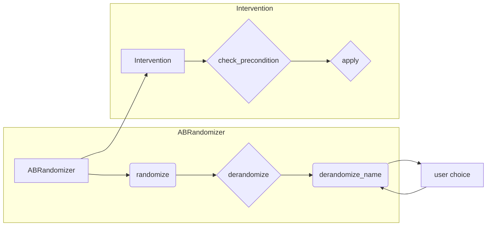

# <input code>

```python
import random
import pandas as pd
from tinytroupe.agent import TinyPerson

class ABRandomizer():

    def __init__(self, real_name_1="control", real_name_2="treatment",
                       blind_name_a="A", blind_name_b="B",
                       passtrough_name=[],
                       random_seed=42):
        """
        An utility class to randomize between two options, and de-randomize later.
        The choices are stored in a dictionary, with the index of the item as the key.
        The real names are the names of the options as they are in the data, and the blind names
        are the names of the options as they are presented to the user. Finally, the passtrough names
        are names that are not randomized, but are always returned as-is.

        Args:
            real_name_1 (str): the name of the first option
            real_name_2 (str): the name of the second option
            blind_name_a (str): the name of the first option as seen by the user
            blind_name_b (str): the name of the second option as seen by the user
            passtrough_name (list): a list of names that should not be randomized and are always
                                    returned as-is.
            random_seed (int): the random seed to use
        """

        self.choices = {}
        self.real_name_1 = real_name_1
        self.real_name_2 = real_name_2
        self.blind_name_a = blind_name_a
        self.blind_name_b = blind_name_b
        self.passtrough_name = passtrough_name
        self.random_seed = random_seed

    def randomize(self, i, a, b):
        """
        Randomly switch between a and b, and return the choices.
        Store whether the a and b were switched or not for item i, to be able to
        de-randomize later.

        Args:
            i (int): index of the item
            a (str): first choice
            b (str): second choice
        """
        if random.Random(self.random_seed).random() < 0.5:
            self.choices[i] = (0, 1)
            return a, b
        else:
            self.choices[i] = (1, 0)
            return b, a

    def derandomize(self, i, a, b):
        """
        De-randomize the choices for item i, and return the choices.

        Args:
            i (int): index of the item
            a (str): first choice
            b (str): second choice
        """
        if self.choices[i] == (0, 1):
            return a, b
        elif self.choices[i] == (1, 0):
            return b, a
        else:
            raise Exception(f"No randomization found for item {i}")

    def derandomize_name(self, i, blind_name):
        """
        Decode the choice made by the user, and return the choice.

        Args:
            i (int): index of the item
            choice_name (str): the choice made by the user
        """
        if self.choices[i] == (0, 1):
            if blind_name == self.blind_name_a:
                return self.real_name_1
            elif blind_name == self.blind_name_b:
                return self.real_name_2
            elif blind_name in self.passtrough_name:
                return blind_name
            else:
                raise Exception(f"Choice '{blind_name}' not recognized")
        elif self.choices[i] == (1, 0):
            if blind_name == self.blind_name_a:
                return self.real_name_2
            elif blind_name == self.blind_name_b:
                return self.real_name_1
            elif blind_name in self.passtrough_name:
                return blind_name
            else:
                raise Exception(f"Choice '{blind_name}' not recognized")
        else:
            raise Exception(f"No randomization found for item {i}")


# TODO under development
class Intervention:

    def __init__(self, agent=None, agents:list=None, environment=None, environments:list=None):
        # ... (rest of the code)
```

# <algorithm>

The code defines a class `ABRandomizer` for randomizing and de-randomizing choices between two options (e.g., "control" and "treatment").  It also has a `Intervention` class that seems to be a placeholder or under development for interventions in a system.

**ABRandomizer Algorithm:**

1. **Initialization (`__init__`):** Sets up the randomizer with real and blind names for the two options, a list of names that should remain unchanged, and a random seed for reproducibility. Stores the randomization choices in `self.choices`.
2. **Randomization (`randomize`):**  Randomly chooses which option (A or B) should correspond to each real option (real_name_1 or real_name_2). It stores the mappings in `self.choices` as a tuple (e.g., (0, 1)).
3. **De-randomization (`derandomize`):** Uses the stored mapping from `randomize` to convert the blind names back to their original names.
4. **Decoding user choices (`derandomize_name`):** Takes the user's choice and returns the original name based on the stored mappings. If the user selected a name not in the randomization, it raises an exception.


**Intervention Algorithm (Conceptual):**

1. **Initialization (`__init__`):**  Accepts optional agent, list of agents, environment, or list of environments to target. Raises exceptions if inputs are inconsistent. Stores the provided agents/environments in `self.agents`/`self.environments`.
2. **Preconditions (`check_precondition`):**  (Placeholder) Checks if the intervention's conditions are met.
3. **Application (`apply`):** (Placeholder) Applies the intervention's effect based on the stored `effect_func`.


# <mermaid>



# <explanation>

**Imports:**

- `random`: Used for generating random numbers, crucial for the randomization process.
- `pandas as pd`: Likely used for data manipulation (loading, processing) but not used directly in this segment of the code.
- `tinytroupe.agent import TinyPerson`: Imports the `TinyPerson` class from the `tinytroupe.agent` module within the `tinytroupe` package. This suggests a relationship to agents, environments, or possibly the data entities being manipulated.


**Classes:**

- **`ABRandomizer`:** This is a utility class for randomizing and de-randomizing choices between two options.
    - `self.choices`: A dictionary to store the randomization mappings.
    - `real_name_1`, `real_name_2`, `blind_name_a`, `blind_name_b`: String attributes holding the names.
    - `randomize`, `derandomize`, `derandomize_name`: Methods for performing the randomization/de-randomization logic.

- **`Intervention`:** This class likely defines an intervention mechanism for affecting the agents,  environments, or both within the TinyTroupe project. Its role is to provide a way to intervene on existing entities and to define conditions and effects.
    - `agents`: A list of agents to intervene on (if provided).
    - `environments`: A list of environments to intervene on (if provided).
    - `text_precondition`: A string representing a precondition (condition for the intervention to take place), evaluated by a language model potentially.
    - `precondition_func`: A function representing a precondition (a conditional function to be checked) for the intervention.
    - `effect_func`: The function to apply when the intervention is triggered.
    - `__init__`: The constructor sets up the possible entities to intervene on and defines the function for applying the effect.
    - `check_precondition`, `apply`, `set_textual_precondition`, `set_functional_precondition`, `set_effect`: Methods for defining and checking the intervention's prerequisites and applying the changes.

**Functions:**

- `__init__` (ABRandomizer): Initializes the ABRandomizer with specified parameters.
- `randomize`: Randomly swaps the order of two options for a given index.
- `derandomize`: Reverses the randomization for a given index.
- `derandomize_name`: Takes a user's choice name and de-randomizes it based on the internal storage.
- `__init__` (Intervention): Initializes the Intervention.


**Possible Errors/Improvements:**

- **Missing `TinyWorld`:** The `Intervention` class uses `TinyWorld` but it's not defined within the provided snippet.
- **Type Checking:** Adding type hints for the `Intervention` parameters (e.g., `agent: TinyPerson`) could improve code safety and readability.
- **`Intervention` Implementation:** The `check_precondition` and `apply` methods are placeholders.  A full implementation of `Intervention` depends heavily on what TinyPerson and TinyWorld classes can do.
- **Error Handling:** While `ABRandomizer` has some error handling, more robust error checks, especially in `derandomize_name` for handling invalid choices, are recommended.


**Relationships with Other Parts of the Project:**

The `ABRandomizer` class seems to be a helper tool for the `TinyTroupe` project, likely used to prepare data or process user choices during an experiment. The `Intervention` class is part of the TinyTroupe intervention functionality, which implies it relies on other parts of the project (e.g. classes `TinyPerson`, `TinyWorld`) for managing agents and environments. The `TinyPerson` class is likely part of the agent system in `tinytroupe.agent` which could affect the intervention logic.