## <алгоритм>

### ResultsExtractor

1.  **Инициализация (`__init__`)**:
    *   Загружает шаблон промпта из `prompts/interaction_results_extractor.mustache`.
    *   Инициализирует пустые словари `agent_extraction` и `world_extraction` для кэширования результатов.
    
2.  **Извлечение результатов из агента (`extract_results_from_agent`)**:
    *   Принимает `tinyperson` (экземпляр `TinyPerson`), `extraction_objective`, `situation`, `fields` и `fields_hints` (опционально).
    *   Формирует промпт для LLM, используя шаблон и переданные параметры.
    *   Извлекает историю взаимодействий агента.
    *   Отправляет промпт в LLM (OpenAI API).
    *   Извлекает JSON из ответа LLM.
    *   Кэширует результат в `agent_extraction` с ключом имени агента.
        *   Пример:
            ```python
            extractor = ResultsExtractor()
            agent = TinyPerson(name="Alice")
            agent.episodic_memory.append({"role": "user", "content": {"stimuli":[{"type":"greeting", "content":"Hello!"}]}})
            extracted_data = extractor.extract_results_from_agent(agent, extraction_objective="What happened in the simulation?")
            print(extracted_data) # Output: {"summary": "Agent Alice received a greeting."}
            ```

3.  **Извлечение результатов из мира (`extract_results_from_world`)**:
    *   Принимает `tinyworld` (экземпляр `TinyWorld`), `extraction_objective`, `situation`, `fields` и `fields_hints` (опционально).
    *   Формирует промпт для LLM, используя шаблон и переданные параметры.
    *   Извлекает историю взаимодействий из мира.
    *   Отправляет промпт в LLM (OpenAI API).
    *   Извлекает JSON из ответа LLM.
    *   Кэширует результат в `world_extraction` с ключом имени мира.
     *   Пример:
            ```python
            extractor = ResultsExtractor()
            world = TinyWorld(name="World1")
            agent1 = TinyPerson(name="Alice")
            agent2 = TinyPerson(name="Bob")
            world.add_agent(agent1)
            world.add_agent(agent2)
            agent1.episodic_memory.append({"role": "user", "content": {"stimuli":[{"type":"greeting", "content":"Hello!"}]}})
            agent2.episodic_memory.append({"role": "user", "content": {"stimuli":[{"type":"greeting", "content":"Hi!"}]}})

            extracted_data = extractor.extract_results_from_world(world, extraction_objective="What happened in the simulation?")
            print(extracted_data) # Output: {"summary": "Agents Alice and Bob received greetings."}
            ```

4.  **Сохранение результатов в JSON (`save_as_json`)**:
    *   Принимает `filename`.
    *   Сохраняет словари `agent_extraction` и `world_extraction` в файл JSON.

### ResultsReducer

1.  **Инициализация (`__init__`)**:
    *   Инициализирует пустой словарь `results` и `rules`.

2.  **Добавление правил редукции (`add_reduction_rule`)**:
    *   Принимает `trigger` (тип события) и `func` (функция редукции).
    *   Добавляет правило в словарь `rules`.
        * Пример:
          ```python
          reducer = ResultsReducer()
          def extract_greeting(focus_agent, source_agent, content, timestamp, **kwargs):
              return {"event": "greeting", "content": content, "agent_name": focus_agent.name}
          reducer.add_reduction_rule("greeting", extract_greeting)
          ```

3.  **Редукция агента (`reduce_agent`)**:
    *   Принимает `agent` (экземпляр `TinyPerson`).
    *   Итерируется по эпизодической памяти агента.
    *   Для каждого сообщения:
        *   Игнорирует сообщения с ролью 'system'.
        *   Если роль 'user' (стимул):
            *   Извлекает тип стимула, контент и источник.
            *   Вызывает функцию редукции, если правило существует для данного типа стимула.
        *   Если роль 'assistant' (действие):
            *   Извлекает тип действия, контент и цель.
            *   Вызывает функцию редукции, если правило существует для данного типа действия.
    *   Возвращает список сокращенных данных.
        *   Пример:
          ```python
          reducer = ResultsReducer()
          def extract_greeting(focus_agent, source_agent, content, timestamp, **kwargs):
              return {"event": "greeting", "content": content, "agent_name": focus_agent.name}
          reducer.add_reduction_rule("greeting", extract_greeting)

          agent = TinyPerson(name="Alice")
          agent.episodic_memory.append({"role": "user", "content": {"stimuli":[{"type":"greeting", "content":"Hello!"}]}})
          reduced_data = reducer.reduce_agent(agent)
          print(reduced_data) # Output: [{'event': 'greeting', 'content': 'Hello!', 'agent_name': 'Alice'}]
          ```
4.  **Редукция агента в DataFrame (`reduce_agent_to_dataframe`)**:
    *   Принимает `agent` и `column_names` (опционально).
    *   Вызывает `reduce_agent` и возвращает результат в виде DataFrame.

### ArtifactExporter

1.  **Инициализация (`__init__`)**:
    *   Принимает `base_output_folder`.

2.  **Экспорт артефакта (`export`)**:
    *   Принимает `artifact_name`, `artifact_data` (словарь или строка), `content_type`, `content_format` (опционально), `target_format` (по умолчанию "txt") и `verbose`.
    *   Очищает имя артефакта от недопустимых символов.
    *   Составляет путь к файлу.
    *   В зависимости от `target_format`:
        *   `json`: вызывает `_export_as_json`.
        *   `txt`, `text`, `md`, `markdown`: вызывает `_export_as_txt`.
        *   `docx`: вызывает `_export_as_docx`.
    *   Пример:
        ```python
        exporter = ArtifactExporter(base_output_folder="output")
        exporter.export(artifact_name="my_data", artifact_data={"content":"hello world"}, content_type="simulation", target_format="json")
        # Creates a file output/simulation/my_data.json with content '{"content": "hello world"}'
        ```

3.  **Экспорт в txt (`_export_as_txt`)**:
    *   Принимает `artifact_file_path`, `artifact_data` и `content_type`.
    *   Сохраняет текстовые данные в файл.

4.  **Экспорт в JSON (`_export_as_json`)**:
    *   Принимает `artifact_file_path`, `artifact_data` и `content_type`.
    *   Сохраняет данные в формате JSON.

5.  **Экспорт в DOCX (`_export_as_docx`)**:
    *   Принимает `artifact_file_path`, `artifact_data` и `content_original_format`.
    *   Конвертирует текст в HTML, затем в DOCX с использованием `pypandoc`.

6. **Составление пути к файлу (`_compose_filepath`)**:
    * Принимает `artifact_data`, `artifact_name`, `content_type`, `target_format` и `verbose`.
    * Определяет расширение файла на основе `target_format` или типа данных.
    * Создает подпапку на основе `content_type`.
    * Создает путь к файлу.
    * Создает промежуточные каталоги, если они не существуют.

### Normalizer

1.  **Инициализация (`__init__`)**:
    *   Принимает список элементов `elements`, количество `n` нормализованных элементов и `verbose`.
    *   Удаляет дубликаты из списка элементов.
    *   Отправляет запрос в LLM для нормализации элементов, используя `normalizer.system.mustache` и `normalizer.user.mustache` шаблоны.
    *   Извлекает нормализованные элементы из ответа LLM и сохраняет их в `normalized_elements`.
    *   Инициализирует пустой словарь `normalizing_map` для кэширования.
    *   Пример:
        ```python
        normalizer = Normalizer(elements=["apple", "banana", "orange", "grape"], n=2)
        print(normalizer.normalized_elements) # Output: {'categories': ['fruit1', 'fruit2'], 'elements': {
        #   'apple': 'fruit1',
        #   'banana': 'fruit1',
        #   'orange': 'fruit2',
        #   'grape': 'fruit2'
        # }
        ```

2.  **Нормализация (`normalize`)**:
    *   Принимает один элемент или список элементов `element_or_elements`.
    *   Использует кэш (`normalizing_map`) для избежания повторной нормализации.
    *   Для новых элементов:
        *   Отправляет запрос в LLM для их нормализации, используя `normalizer.applier.system.mustache` и `normalizer.applier.user.mustache` шаблоны.
        *   Обновляет кэш `normalizing_map`.
    *   Возвращает нормализованные элементы.
        * Пример:
        ```python
        normalizer = Normalizer(elements=["apple", "banana", "orange", "grape"], n=2)
        normalized_elements = normalizer.normalize(["apple", "banana", "grape"])
        print(normalized_elements) # Output: ['fruit1', 'fruit1', 'fruit2']
        ```

### default_extractor
Создает экземпляр `ResultsExtractor`.

```mermaid
flowchart TD
    subgraph ResultsExtractor
        A[<code>__init__</code><br>Load Template and Initialize Cache] --> B[<code>extract_results_from_agent</code><br>Extract from TinyPerson]
        B --> C[Compose Prompt]
        C --> D[Get Interaction History]
        D --> E[Send Prompt to LLM]
        E --> F[Extract JSON Response]
        F --> G[Cache Result]
        A --> H[<code>extract_results_from_world</code><br>Extract from TinyWorld]
        H --> C
        H --> D
        H --> E
        H --> F
        H --> I[Cache World Result]
        A --> J[<code>save_as_json</code><br>Save Results to JSON]
    end
    
    subgraph ResultsReducer
        K[<code>__init__</code><br>Initialize Reduction Rules] --> L[<code>add_reduction_rule</code><br>Add New Reduction Rule]
        K --> M[<code>reduce_agent</code><br>Reduce Agent Data]
        M --> N[Iterate Through Agent Memory]
        N --> O{Message Role}
        O -- 'user' --> P[Extract Stimulus Info]
        P --> Q{Check Stimulus Rule}
        Q -- 'Yes' --> R[Apply Reduction Rule]
        O -- 'assistant' --> S[Extract Action Info]
         S --> T{Check Action Rule}
        T -- 'Yes' --> R
        R --> U[Append Reduced Data]
        N --> U
        U --> V[Return Reduced List]
        K --> W[<code>reduce_agent_to_dataframe</code><br>Convert Reduction to DataFrame]
        W --> M
        M --> V
    end
    
    subgraph ArtifactExporter
        X[<code>__init__</code><br>Set Output Folder] --> Y[<code>export</code><br>Export Artifacts]
        Y --> Z[Sanitize Artifact Name]
        Z --> AA[Compose File Path]
        AA --> AB{Target Format}
        AB -- 'json' --> AC[<code>_export_as_json</code><br>Save as JSON]
        AB -- 'txt, text, md, markdown' --> AD[<code>_export_as_txt</code><br>Save as TXT]
        AB -- 'docx' --> AE[<code>_export_as_docx</code><br>Save as DOCX]
    end

    subgraph Normalizer
        AF[<code>__init__</code><br> Normalize elements using LLM] --> AG[Compose LLM Messages]
        AG --> AH[Send Messages to LLM]
        AH --> AI[Extract Normalization Result]
        AI --> AJ[Cache Normalized elements]
        AF --> AK[<code>normalize</code><br> Normalize given elements]
        AK --> AL[Check Cache]
        AL -- 'Cache Hit' --> AM[Return Cached Result]
        AL -- 'Cache Miss' --> AN[Compose New LLM Messages]
        AN --> AO[Send Messages to LLM]
        AO --> AP[Extract Normalization Result]
        AP --> AQ[Update Cache]
        AQ --> AR[Return Normalized Result]
    end
    

    Start --> default_extractor[<code>default_extractor</code><br> Instance of ResultsExtractor]
    
    style Start fill:#f9f,stroke:#333,stroke-width:2px
```

## <mermaid>



### Импорты
*   `os`: Для работы с файловой системой, используется для определения пути к шаблону промпта и создания директорий для вывода артефактов.
*   `json`: Для работы с данными в формате JSON, используется для сохранения и извлечения данных из LLM, а также сохранения результатов.
*   `chevron`: Для работы с шаблонами (например, Mustache), используется для формирования промптов для LLM.
*   `logging`: Для логирования, используется для записи отладочных сообщений и предупреждений.
*   `pandas` (pd): Для работы с данными в виде DataFrame, используется в `ResultsReducer` для преобразования результатов редукции.
*   `pypandoc`: Для конвертации документов (например, из Markdown в DOCX), используется в `ArtifactExporter`.
*   `markdown`: Для конвертации Markdown в HTML, используется перед конвертацией в DOCX.
*   `typing`: Для аннотации типов, используется для повышения читаемости кода.
*   `tinytroupe.agent`: Содержит класс `TinyPerson`, который представляет агента в симуляции.
*   `tinytroupe.environment`: Содержит класс `TinyWorld`, который представляет среду симуляции.
*   `tinytroupe.factory`: Содержит класс `TinyPersonFactory`, для создания агентов.
*   `tinytroupe.utils`: Содержит различные утилиты, такие как `JsonSerializableRegistry`, `extract_json`, `dedent` и `compose_initial_LLM_messages_with_templates`.
*   `tinytroupe.openai_utils`: Содержит утилиты для взаимодействия с OpenAI API.

### Классы

*   **`ResultsExtractor`**:
    *   **Роль**: Извлечение данных из агентов и миров.
    *   **Атрибуты**:
        *   `_extraction_prompt_template_path`: Путь к шаблону промпта для LLM.
        *   `agent_extraction`: Словарь для кэширования результатов извлечения из агентов.
        *   `world_extraction`: Словарь для кэширования результатов извлечения из миров.
    *   **Методы**:
        *   `__init__`: Инициализация класса.
        *   `extract_results_from_agent`: Извлекает результаты из экземпляра `TinyPerson`.
        *   `extract_results_from_world`: Извлекает результаты из экземпляра `TinyWorld`.
        *   `save_as_json`: Сохраняет результаты извлечения в файл JSON.

*   **`ResultsReducer`**:
    *   **Роль**: Сокращение данных из эпизодической памяти агентов на основе правил.
    *   **Атрибуты**:
        *   `results`: Словарь для хранения промежуточных результатов.
        *   `rules`: Словарь правил редукции.
    *   **Методы**:
        *   `__init__`: Инициализация класса.
        *   `add_reduction_rule`: Добавляет правило редукции.
        *   `reduce_agent`: Сокращает данные из эпизодической памяти агента.
        *   `reduce_agent_to_dataframe`: Сокращает данные и преобразует в DataFrame.

*   **`ArtifactExporter`**:
    *   **Роль**: Экспорт артефактов из TinyTroupe элементов.
    *   **Атрибуты**:
        *   `base_output_folder`: Базовая папка для сохранения артефактов.
    *   **Методы**:
        *   `__init__`: Инициализация класса.
        *   `export`: Экспортирует артефакт в указанный формат.
        *   `_export_as_txt`: Экспортирует артефакт в текстовый файл.
        *   `_export_as_json`: Экспортирует артефакт в JSON файл.
        *   `_export_as_docx`: Экспортирует артефакт в DOCX файл.
        *   `_compose_filepath`: Составляет путь к файлу.

*   **`Normalizer`**:
    *   **Роль**: Нормализация текстовых элементов с помощью LLM.
    *   **Атрибуты**:
        *   `elements`: Список элементов для нормализации.
        *   `n`: Количество нормализованных элементов.
        *   `verbose`: Флаг для вывода отладочных сообщений.
        *   `normalized_elements`: JSON-структура для хранения нормализованных элементов.
        *   `normalizing_map`: Словарь для кэширования нормализованных элементов.
    *   **Методы**:
        *   `__init__`: Инициализация класса, отправляет запрос в LLM для первичной нормализации.
        *   `normalize`: Нормализует один элемент или список элементов, используя кэш и при необходимости LLM.

### Функции

*   `default_extractor`: Создает экземпляр `ResultsExtractor`.

### Переменные
*   `logger`: Объект `logging.Logger` для логирования.

### Взаимосвязи
*   `ResultsExtractor` использует `openai_utils.client()` для взаимодействия с OpenAI API.
*   `ResultsExtractor` использует шаблоны Mustache (`chevron`) для формирования промптов.
*   `ResultsExtractor` использует `tinytroupe.utils.extract_json` для извлечения JSON из ответов LLM.
*   `ResultsReducer` использует эпизодическую память `TinyPerson` для редукции данных.
*   `ResultsReducer` использует правила, которые устанавливаются пользователем, через `add_reduction_rule`.
*   `ArtifactExporter` использует `tinytroupe.utils.dedent` для удаления отступов.
*   `ArtifactExporter` использует `os` для работы с файловой системой.
*   `ArtifactExporter` использует `json` для сохранения в JSON.
*  `ArtifactExporter` использует `pypandoc` для конвертации в DOCX.
*   `Normalizer` использует шаблоны Mustache (`chevron`) для формирования промптов.
*   `Normalizer` использует `tinytroupe.utils.compose_initial_LLM_messages_with_templates` для подготовки промптов.
*   `Normalizer` использует `tinytroupe.utils.extract_json` для извлечения JSON из ответов LLM.

### Потенциальные ошибки и улучшения

*   **Ошибки**:
    *   Некорректная обработка ошибок при взаимодействии с OpenAI API.
    *   Ошибки при конвертации в DOCX, если `pypandoc` не установлен или не работает корректно.
    *   Проблемы с извлечением JSON из ответов LLM, если формат ответа не соответствует ожидаемому.
    *   Отсутствие обработки исключений при добавлении дублирующихся правил редукции в `ResultsReducer`.
    *   Необходимо добавить обработку исключений в методах экспорта (`_export_as_txt`, `_export_as_json`, `_export_as_docx`).
*   **Улучшения**:
    *   Добавить асинхронное взаимодействие с OpenAI API для повышения производительности.
    *   Расширить возможности экспорта в другие форматы, например, CSV.
    *   Добавить возможность предварительной обработки или фильтрации данных перед извлечением.
    *   Добавить возможность настраивать шаблоны промптов через параметры.
    *   Реализовать более гибкую систему правил редукции, возможно, с использованием шаблонов или DSL.
    *   Улучшить документацию кода.
    *   Реализовать механизм обработки ошибок при нормализации.
    *   Добавить логику для обработки случаев, когда LLM возвращает некорректные данные.
    *   Увеличить количество тестов для проверки функциональности.

Этот код предоставляет мощный и гибкий инструмент для извлечения, преобразования и экспорта данных из TinyTroupe, но требует дальнейшей доработки и усовершенствования.