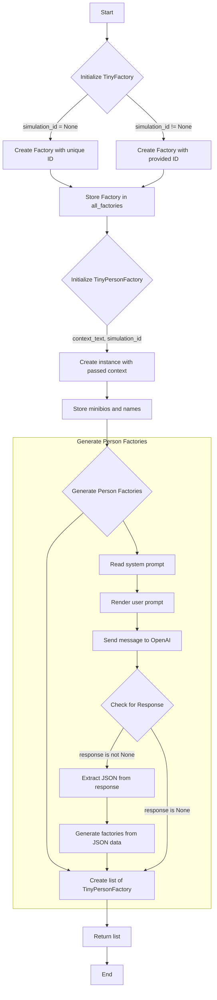
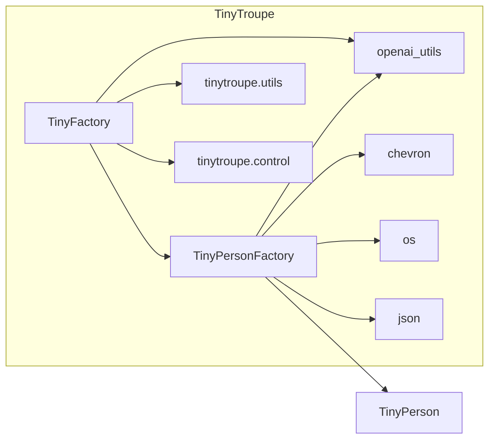

# <input code>

```python
import os
import json
import chevron
import logging
import copy
logger = logging.getLogger("tinytroupe")

from tinytroupe import openai_utils
from tinytroupe.agent import TinyPerson
import tinytroupe.utils as utils
from tinytroupe.control import transactional

class TinyFactory:
    """
    A base class for various types of factories. This is important because it makes it easier to extend the system, particularly 
    regarding transaction caching.
    """

    # A dict of all factories created so far.
    all_factories = {} # name -> factories
    
    def __init__(self, simulation_id:str=None) -> None:
        """
        Initialize a TinyFactory instance.

        Args:
            simulation_id (str, optional): The ID of the simulation. Defaults to None.
        """
        self.name = f"Factory {utils.fresh_id()}" # we need a name, but no point in making it customizable
        self.simulation_id = simulation_id

        TinyFactory.add_factory(self)
    
    def __repr__(self):
        return f"TinyFactory(name=\'{self.name}\')"\n    
    @staticmethod
    def set_simulation_for_free_factories(simulation):
        """
        Sets the simulation if it is None. This allows free environments to be captured by specific simulation scopes
        if desired.
        """
        for factory in TinyFactory.all_factories.values():
            if factory.simulation_id is None:
                simulation.add_factory(factory)

    @staticmethod
    def add_factory(factory):
        """
        Adds a factory to the list of all factories. Factory names must be unique,
        so if an factory with the same name already exists, an error is raised.
        """
        if factory.name in TinyFactory.all_factories:
            raise ValueError(f"Factory names must be unique, but \'{factory.name}\' is already defined.")
        else:
            TinyFactory.all_factories[factory.name] = factory
    
    @staticmethod
    def clear_factories():
        """
        Clears the global list of all factories.
        """
        TinyFactory.all_factories = {}

    ################################################################################################
    # Caching mechanisms
    #
    # Factories can also be cached in a transactional way. This is necessary because the agents they
    # generate can be cached, and we need to ensure that the factory itself is also cached in a 
    # consistent way.
    ################################################################################################

    def encode_complete_state(self) -> dict:
        """
        Encodes the complete state of the factory. If subclasses have elmements that are not serializable, they should override this method.
        """

        state = copy.deepcopy(self.__dict__)
        return state

    def decode_complete_state(self, state:dict):
        """
        Decodes the complete state of the factory. If subclasses have elmements that are not serializable, they should override this method.
        """
        state = copy.deepcopy(state)

        self.__dict__.update(state)
        return self


class TinyPersonFactory(TinyFactory):

    def __init__(self, context_text, simulation_id:str=None):
        """
        Initialize a TinyPersonFactory instance.

        Args:
            context_text (str): The context text used to generate the TinyPerson instances.
            simulation_id (str, optional): The ID of the simulation. Defaults to None.
        """
        super().__init__(simulation_id)
        self.person_prompt_template_path = os.path.join(os.path.dirname(__file__), 'prompts/generate_person.mustache')
        self.context_text = context_text
        self.generated_minibios = [] # keep track of the generated persons. We keep the minibio to avoid generating the same person twice.
        self.generated_names = []


    @staticmethod
    def generate_person_factories(number_of_factories, generic_context_text):
        """
        Generate a list of TinyPersonFactory instances using OpenAI's LLM.

        Args:
            number_of_factories (int): The number of TinyPersonFactory instances to generate.
            generic_context_text (str): The generic context text used to generate the TinyPersonFactory instances.

        Returns:
            list: A list of TinyPersonFactory instances.
        """
        # ... (rest of the method)
```

# <algorithm>



# <mermaid>



# <explanation>

**Импорты:**

- `os`, `json`, `chevron`, `logging`, `copy`: Стандартные библиотеки Python, используемые для работы с файлами, JSON, шаблонами, логгированием и копированием объектов соответственно.
- `openai_utils`:  Утилитный модуль для работы с OpenAI API, скорее всего, из пакета `tinytroupe`.
- `TinyPerson`: Класс из подпапки `agent` в пакете `tinytroupe`, представляющий агента.
- `tinytroupe.utils`: Модуль вспомогательных функций, вероятно, для обработки данных и работы с файлами.
- `tinytroupe.control`:  Модуль для управления транзакциями, вероятно, для кеширования и сохранения состояния.

**Классы:**

- `TinyFactory`: Базовый класс для фабрик.  Используется для создания экземпляров и управления ими. Хранит `all_factories` (словарь фабрик). Методы `add_factory`, `set_simulation_for_free_factories`, `clear_factories` обеспечивают создание, добавление в словарь и очистку фабрик.  Важно для управления жизненным циклом и транзакций.
- `TinyPersonFactory`: Наследован от `TinyFactory`, предназначен для создания `TinyPerson` агентов. Хранит контекст (`context_text`), шаблоны (`person_prompt_template_path`) и список сгенерированных `minibios` и имен (`generated_minibios`, `generated_names`). Методы `generate_person_factories` для генерации множества агентов и `generate_person` для генерации одного агента, используя `openai_utils`. Определены методы для кодирования и декодирования состояния фабрики для кэширования. `_aux_model_call` и `_setup_agent` - вспомогательные методы, использующие декортор `transactional` для правильного кэширования.

**Функции:**

- `__init__`: Конструктор классов `TinyFactory` и `TinyPersonFactory`. Устанавливает `self.name` и `self.simulation_id`. В `TinyPersonFactory` также инициализирует `context_text` и хранилище сгенерированных объектов.
- `generate_person_factories`: Генерирует список `TinyPersonFactory` объектов на основе контекста с использованием OpenAI.
- `generate_person`: Генерирует одного `TinyPerson` агента, используя предопределенный контекст. Использует `chevron` для рендеринга шаблона и отправки запроса в OpenAI.
- `_aux_model_call`: Вспомогательная функция для вызова модели OpenAI, использующая декоратор `transactional`.
- `_setup_agent`: Настраивает агента, задавая его атрибуты.
- `encode_complete_state`: Кодирует состояние фабрики для кэширования.
- `decode_complete_state`: Декодирует состояние фабрики из кэша.

**Переменные:**

- `all_factories`: Словарь, хранящий все созданные фабрики.
- `person_prompt_template_path`: Путь к файлу с шаблоном запроса для OpenAI.
- `context_text`: Текст контекста для генерации агентов.
- `generated_minibios`, `generated_names`:  Список сгенерированных minibios и имен агентов.

**Возможные ошибки или улучшения:**

- **Обработка ошибок OpenAI:**  Код не обрабатывает ошибки при вызове OpenAI API. Необходимо добавить обработку исключений (`try...except`) для устойчивости к ошибкам.
- **Уникальные имена:**  Проверка уникальности имен агентов (`result["name"]`) может быть улучшена, например, присвоением временных имен и последующей проверкой уникальности уже сгенерированных имен.
- **Контекст:** Проверка корректности `context_text` может быть добавлена в `generate_person_factories`.
- **Логирование:** Дополнительно можно улучшить логирование, чтобы отслеживать ход выполнения.
- **Оптимизация:** Генерация нескольких агентов можно улучшить, используя `asyncio` для асинхронной обработки запросов к OpenAI.
- **Переиспользование объектов:** В `generate_person` есть дублирование логики создания агента, которое может быть вынесено в отдельный метод.
- **Обработка JSON ответа:** Проверка валидности ответа OpenAI,  проверка существования необходимых ключей в `result` для более надежной работы.

**Взаимосвязи с другими частями проекта:**

`TinyFactory` и `TinyPersonFactory` взаимодействуют с `openai_utils` для вызова модели OpenAI.
`TinyPersonFactory` использует `TinyPerson` для создания агентов, предполагая, что `TinyPerson` класс находится в подпапке `agent` в пакете `tinytroupe`.
`tinytroupe.utils`  присутствует для вспомогательных функций (возможно, для работы с файлами или другими ресурсами).
`tinytroupe.control` используется для транзакционного кеширования.


В целом код демонстрирует структурированный подход к генерации агентов, используя шаблоны и кэширование. Он достаточно подробный и хорошо прокомментированный, что облегчает понимание. Но для повышения надежности требуется улучшить обработку ошибок и оптимизировать некоторые части.