## АНАЛИЗ КОДА: `tinytroupe/factory.py`

### 1. `<алгоритм>`

**Общая логика:**

1.  **`TinyFactory` (Базовый класс):**
    *   Инициализация: Создает фабрику с уникальным именем и опциональным `simulation_id`.
    *   Управление фабриками:
        *   `add_factory`: Добавляет фабрику в глобальный список `all_factories`.
        *   `clear_factories`: Очищает глобальный список фабрик.
        *   `set_simulation_for_free_factories`: Назначает `simulation_id` для "свободных" фабрик.
    *   Кэширование:
        *   `encode_complete_state`: Кодирует состояние фабрики для кэширования.
        *   `decode_complete_state`: Декодирует состояние фабрики из кэша.
2.  **`TinyPersonFactory` (Производный класс):**
    *   Инициализация: Наследует от `TinyFactory`, устанавливает путь к шаблону промпта и сохраняет `context_text`.
    *   Генерация фабрик:
        *   `generate_person_factories`: Создает несколько `TinyPersonFactory` на основе общего контекста, используя LLM.
        *   Отправляет запрос к LLM с инструкциями по генерации JSON описаний фабрик.
        *   Создает `TinyPersonFactory` для каждого полученного описания.
    *   Генерация персонажей:
        *   `generate_person`: Создает `TinyPerson` с использованием LLM на основе контекста фабрики.
        *   Использует шаблон (`prompts/generate_person.mustache`) для формирования промпта.
        *   Отправляет промпт к LLM.
        *   Извлекает JSON из ответа.
        *   Создает `TinyPerson` объект, если сгенерированное имя уникально.
    *   Вспомогательные методы:
        *   `_aux_model_call`: Вспомогательный метод для обращения к LLM, который можно кэшировать.
        *   `_setup_agent`: Настраивает `TinyPerson` с полученными параметрами.

**Блок-схема:**

```
flowchart TD
    subgraph TinyFactory
        A[__init__] --> B{Создать уникальное имя}
        B --> C{Сохранить simulation_id}
        C --> D{Добавить фабрику в all_factories}

        E[set_simulation_for_free_factories] --> F{Для каждой фабрики}
        F --> G{Если simulation_id is None}
        G -- Да --> H{Добавить фабрику в simulation}
        G -- Нет --> F

        I[add_factory] --> J{Проверить уникальность имени}
        J -- Нет --> K{Ошибка}
        J -- Да --> L{Добавить фабрику в all_factories}

        M[clear_factories] --> N{Очистить all_factories}

        O[encode_complete_state] --> P{Создать копию __dict__}
        P --> Q{Возврат состояния}

        R[decode_complete_state] --> S{Создать копию state}
        S --> T{Обновить __dict__}
        T --> U{Возврат фабрики}
    end

    subgraph TinyPersonFactory
        V[__init__] --> A
        V --> W{Установить путь к шаблону}
        W --> X{Сохранить context_text}
        X --> Y{Инициализировать списки generated_minibios и generated_names}

        Z[generate_person_factories] --> AA{Создать промпт для LLM}
        AA --> AB{Отправить запрос к LLM}
        AB --> AC{Извлечь JSON}
        AC --> AD{Для каждого описания}
        AD --> AE{Создать TinyPersonFactory}
        AE --> AF{Добавить фабрику в список}

        AG[generate_person] --> AH{Сформировать промпт}
        AH --> AI{Вызвать aux_generate}
        AI --> AJ{Если agent_spec is None}
        AJ -- Да --> AK{Возврат None}
        AJ -- Нет --> AL{Создать TinyPerson}
        AL --> AM{Настроить агента}
        AM --> AN{Добавить минибио и имя в списки}
        AN --> AO{Возврат TinyPerson}

        AP[aux_generate] --> AQ{Создать промпт}
        AQ --> AR{Отправить запрос к LLM}
        AR --> AS{Извлечь JSON}
        AS --> AT{Проверить уникальность имени}
        AT -- Да --> AU{Возврат agent_spec}
        AT -- Нет --> AV{Возврат None}

        AW[_aux_model_call] --> AX{Отправить запрос к LLM}
        AX --> AY{Возврат сообщения}

        AZ[_setup_agent] --> BA{Для каждого элемента конфигурации}
        BA --> BB{Если элемент список}
        BB -- Да --> BC{agent.define_several}
        BB -- Нет --> BD{agent.define}
        BD --> BA
        BC --> BA
    end

    
```

**Примеры:**

*   **`TinyFactory.__init__`:**
    *   `factory = TinyFactory(simulation_id="sim123")` создаст фабрику с именем, например, "Factory 12345" и `simulation_id = "sim123"`.
*   **`TinyPersonFactory.generate_person_factories`:**
    *   `factories = TinyPersonFactory.generate_person_factories(2, "World War II")` создаст 2 фабрики, каждая со своим контекстом, основанном на "World War II", и сгенерирует их с помощью LLM.
*   **`TinyPersonFactory.generate_person`:**
    *   `person = factory.generate_person(agent_particularities="shy and introverted")` создаст `TinyPerson` на основе контекста фабрики, но с заданными параметрами "shy and introverted", используя LLM.
*  **`_aux_model_call`:**
    *  `_aux_model_call` вызывается для вызова модели и используется декоратор `@transactional` для кэширования результатов.
    *  `_setup_agent` настраивает агента, применяя конфигурацию, но сам объект агента не кэшируется.

```mermaid
flowchart TD
    subgraph TinyFactory
        TinyFactory_init(Init) --> TinyFactory_Generate_Name{Generate Unique Name}
        TinyFactory_Generate_Name --> TinyFactory_Save_Simulation_ID{Save Simulation ID}
        TinyFactory_Save_Simulation_ID --> TinyFactory_Add_To_All_Factories{Add to all_factories}

        TinyFactory_set_simulation_for_free_factories(set_simulation_for_free_factories) --> TinyFactory_Loop_through_all_factories{Loop through all factories}
        TinyFactory_Loop_through_all_factories --> TinyFactory_Check_Simulation_ID{Check if simulation_id is None}
        TinyFactory_Check_Simulation_ID -- Yes --> TinyFactory_Add_factory_to_simulation{Add factory to simulation}
        TinyFactory_Check_Simulation_ID -- No --> TinyFactory_Loop_through_all_factories

        TinyFactory_add_factory(add_factory) --> TinyFactory_Check_Unique_Name{Check if name is unique}
        TinyFactory_Check_Unique_Name -- No --> TinyFactory_ValueError{Raise ValueError}
        TinyFactory_Check_Unique_Name -- Yes --> TinyFactory_add_to_all_factories_logic{Add to all_factories}

        TinyFactory_clear_factories(clear_factories) --> TinyFactory_Clear_all_factories{Clear all_factories}

        TinyFactory_encode_complete_state(encode_complete_state) --> TinyFactory_Copy_Dict{Create a deep copy of __dict__}
        TinyFactory_Copy_Dict --> TinyFactory_Return_State{Return the state}

        TinyFactory_decode_complete_state(decode_complete_state) --> TinyFactory_Copy_State{Create a deep copy of state}
        TinyFactory_Copy_State --> TinyFactory_Update_Dict{Update __dict__}
        TinyFactory_Update_Dict --> TinyFactory_Return_Factory{Return the factory}
    end

    subgraph TinyPersonFactory
        TinyPersonFactory_init(Init) --> TinyFactory_init
        TinyPersonFactory_init --> TinyPersonFactory_Set_Prompt_Path{Set prompt template path}
        TinyPersonFactory_Set_Prompt_Path --> TinyPersonFactory_Save_Context{Save context_text}
        TinyPersonFactory_Save_Context --> TinyPersonFactory_Init_Generated_Lists{Initialize generated lists}

        TinyPersonFactory_generate_person_factories(generate_person_factories) --> TinyPersonFactory_Create_Prompt_for_LLM{Create Prompt for LLM}
        TinyPersonFactory_Create_Prompt_for_LLM --> TinyPersonFactory_Send_Prompt_to_LLM{Send prompt to LLM}
        TinyPersonFactory_Send_Prompt_to_LLM --> TinyPersonFactory_Extract_JSON{Extract JSON}
        TinyPersonFactory_Extract_JSON --> TinyPersonFactory_Loop_Through_Descriptions{Loop through descriptions}
        TinyPersonFactory_Loop_Through_Descriptions --> TinyPersonFactory_Create_TinyPersonFactory{Create TinyPersonFactory}
        TinyPersonFactory_Create_TinyPersonFactory --> TinyPersonFactory_Add_to_factories_list{Add factory to list}

        TinyPersonFactory_generate_person(generate_person) --> TinyPersonFactory_Form_Prompt{Form Prompt}
        TinyPersonFactory_Form_Prompt --> TinyPersonFactory_Call_aux_generate{Call aux_generate}
        TinyPersonFactory_Call_aux_generate --> TinyPersonFactory_Check_Agent_Spec{Check if agent_spec is None}
        TinyPersonFactory_Check_Agent_Spec -- Yes --> TinyPersonFactory_Return_None{Return None}
        TinyPersonFactory_Check_Agent_Spec -- No --> TinyPersonFactory_Create_TinyPerson{Create TinyPerson}
        TinyPersonFactory_Create_TinyPerson --> TinyPersonFactory_Setup_Agent{Setup agent}
        TinyPersonFactory_Setup_Agent --> TinyPersonFactory_Add_minibio_to_lists{Add minibio and name to lists}
        TinyPersonFactory_Add_minibio_to_lists --> TinyPersonFactory_Return_TinyPerson{Return TinyPerson}

        TinyPersonFactory_aux_generate(aux_generate) --> TinyPersonFactory_aux_generate_Create_Prompt{Create Prompt}
        TinyPersonFactory_aux_generate_Create_Prompt --> TinyPersonFactory_aux_generate_Send_Prompt_to_LLM{Send Prompt to LLM}
        TinyPersonFactory_aux_generate_Send_Prompt_to_LLM --> TinyPersonFactory_aux_generate_Extract_JSON{Extract JSON}
        TinyPersonFactory_aux_generate_Extract_JSON --> TinyPersonFactory_aux_generate_Check_Unique_Name{Check for unique name}
        TinyPersonFactory_aux_generate_Check_Unique_Name -- Yes --> TinyPersonFactory_aux_generate_Return_Agent_Spec{Return agent_spec}
        TinyPersonFactory_aux_generate_Check_Unique_Name -- No --> TinyPersonFactory_aux_generate_Return_None{Return None}

        TinyPersonFactory_aux_model_call(_aux_model_call) --> TinyPersonFactory_aux_model_call_Send_Message_to_LLM{Send Message to LLM}
        TinyPersonFactory_aux_model_call_Send_Message_to_LLM --> TinyPersonFactory_aux_model_call_Return_Message{Return message}

        TinyPersonFactory_setup_agent(_setup_agent) --> TinyPersonFactory_setup_agent_Loop_Through_Config{Loop through configuration}
        TinyPersonFactory_setup_agent_Loop_Through_Config --> TinyPersonFactory_setup_agent_Check_If_Value_List{Check if value is a list}
        TinyPersonFactory_setup_agent_Check_If_Value_List -- Yes --> TinyPersonFactory_setup_agent_Call_define_several{Call agent.define_several}
        TinyPersonFactory_setup_agent_Check_If_Value_List -- No --> TinyPersonFactory_setup_agent_Call_define{Call agent.define}
        TinyPersonFactory_setup_agent_Call_define --> TinyPersonFactory_setup_agent_Loop_Through_Config
        TinyPersonFactory_setup_agent_Call_define_several --> TinyPersonFactory_setup_agent_Loop_Through_Config
    end
    
    
    TinyFactory_init --> TinyPersonFactory_init
    
    style TinyPersonFactory_init fill:#f9f,stroke:#333,stroke-width:2px
    style TinyFactory_init fill:#ccf,stroke:#333,stroke-width:2px

```

### 2. `<mermaid>`



**Импорты в Mermaid:**

*   **os:** Используется для работы с файловой системой, например, для определения пути к файлу шаблона промпта.
*   **json:** Используется для работы с данными в формате JSON, для извлечения данных из ответов LLM.
*   **chevron:** Используется для рендеринга шаблонов, например, для формирования промптов.
*   **logging:** Используется для логирования, включая debug, info и error сообщения.
*   **copy:** Используется для создания глубоких копий объектов при кэшировании состояний.
*   **tinytroupe.openai_utils:** Содержит методы для взаимодействия с OpenAI API.
*   **tinytroupe.agent.TinyPerson:** Класс для представления персонажей.
*   **tinytroupe.utils:** Содержит вспомогательные функции, например, для извлечения JSON из текста.
*   **tinytroupe.control.transactional:** Декоратор для кэширования результатов функций.

### 3. `<объяснение>`

**Импорты:**

*   `os`: Предоставляет функции для взаимодействия с операционной системой, используется для работы с путями к файлам (например, к файлу шаблона `mustache`).
*   `json`: Используется для обработки данных JSON, которые часто возвращаются LLM.
*   `chevron`: Используется для рендеринга шаблонов, например, для генерации промптов из файлов `.mustache`.
*   `logging`: Модуль для логирования событий, позволяющий отслеживать работу программы и выявлять ошибки.
    *   `logger = logging.getLogger("tinytroupe")`: Получение логгера для текущего модуля `tinytroupe`.
*   `copy`: Используется для создания глубоких копий объектов, чтобы избежать изменения исходных данных при кэшировании.
*   `tinytroupe.openai_utils`: Модуль, содержащий утилиты для работы с API OpenAI, например, отправку сообщений.
*   `tinytroupe.agent.TinyPerson`: Класс, представляющий агента (персонажа) в симуляции.
*   `tinytroupe.utils`: Содержит общие утилиты, например, для извлечения JSON из текста.
*   `tinytroupe.control`: Модуль с инструментами управления, например, декоратор `@transactional` для кэширования функций.

**Классы:**

*   **`TinyFactory`:**
    *   **Роль:** Базовый класс для создания различных фабрик, управляет списком фабрик, кэшированием.
    *   **Атрибуты:**
        *   `all_factories`: (static) Словарь для хранения всех созданных фабрик (`name: factory`).
        *   `name`: Уникальное имя фабрики.
        *   `simulation_id`: Идентификатор симуляции, к которой принадлежит фабрика.
    *   **Методы:**
        *   `__init__`: Инициализирует фабрику, присваивая имя и добавляя ее в `all_factories`.
        *   `set_simulation_for_free_factories`: Устанавливает `simulation_id` для фабрик без `simulation_id`
        *   `add_factory`: Добавляет фабрику в `all_factories`.
        *   `clear_factories`: Очищает `all_factories`.
        *   `encode_complete_state`: Кодирует состояние фабрики (по умолчанию, простое копирование `__dict__`).
        *   `decode_complete_state`: Декодирует состояние фабрики из сохраненного состояния.
*   **`TinyPersonFactory` (наследуется от `TinyFactory`):**
    *   **Роль:** Фабрика для создания `TinyPerson` экземпляров (агентов).
    *   **Атрибуты:**
        *   `person_prompt_template_path`: Путь к файлу шаблона для генерации промпта персонажа.
        *   `context_text`: Контекст для генерации персонажей.
        *   `generated_minibios`: Список мини-биографий сгенерированных персонажей.
        *   `generated_names`: Список сгенерированных имен персонажей (для гарантии уникальности).
    *   **Методы:**
        *   `__init__`: Инициализирует фабрику, задавая путь к шаблону и контекст.
        *   `generate_person_factories`: Генерирует несколько `TinyPersonFactory` с помощью LLM, используя общий контекст.
        *   `generate_person`: Генерирует одного `TinyPerson` с помощью LLM на основе контекста фабрики и дополнительных параметров.
        *   `_aux_model_call`: Вспомогательный метод для вызова LLM, необходим для правильного кэширования с декоратором `@transactional`.
        *   `_setup_agent`: Настраивает агента с полученными параметрами, используя `agent.define` и `agent.define_several`.

**Функции:**

*   `__init__` (в классах):
    *   **Аргументы:** `simulation_id` (str, опционально).
    *   **Возвращаемое значение:** None.
    *   **Назначение:** Инициализация объекта, установка имени, `simulation_id` и добавление в список фабрик.
*   `set_simulation_for_free_factories`:
     *   **Аргументы:** `simulation`
     *   **Возвращаемое значение:** None.
     *   **Назначение:** Устанавливает `simulation_id` для фабрик, которые были созданы вне конкретной симуляции, но должны быть в нее добавлены.
*   `add_factory`:
    *   **Аргументы:** `factory` (`TinyFactory`).
    *   **Возвращаемое значение:** None.
    *   **Назначение:** Добавляет фабрику в `all_factories`, проверяя уникальность имени.
*   `clear_factories`:
    *   **Аргументы:** None.
    *   **Возвращаемое значение:** None.
    *   **Назначение:** Очищает глобальный список всех фабрик `all_factories`.
*    `encode_complete_state`:
        *   **Аргументы:** None.
        *   **Возвращаемое значение:** `dict`
        *   **Назначение:** Создает состояние фабрики для кэширования (базово возвращает копию словаря `__dict__`).
*    `decode_complete_state`:
       *   **Аргументы:** `state` (dict)
       *   **Возвращаемое значение:** `TinyFactory`
       *   **Назначение:** Восстанавливает состояние фабрики из словаря `state`
*   `generate_person_factories`:
    *   **Аргументы:** `number_of_factories` (int), `generic_context_text` (str).
    *   **Возвращаемое значение:** `list` (список объектов `TinyPersonFactory`).
    *   **Назначение:** Создает несколько фабрик персонажей, используя LLM для генерации описаний.
*   `generate_person`:
    *   **Аргументы:** `agent_particularities` (str, опционально), `temperature` (float, по умолчанию 1.5), `attempts` (int, по умолчанию 5).
    *   **Возвращаемое значение:** `TinyPerson` или None.
    *   **Назначение:** Создает одного персонажа, используя LLM и контекст фабрики, гарантируя уникальность имени.
*   `_aux_model_call`:
    *   **Аргументы:** `messages` (list), `temperature` (float).
    *   **Возвращаемое значение:** Ответ LLM или None.
    *   **Назначение:** Вспомогательный метод для вызова LLM, используемый для кэширования.
*   `_setup_agent`:
    *    **Аргументы:** `agent` (`TinyPerson`), `configuration` (dict).
    *   **Возвращаемое значение:** None
    *   **Назначение:** Настраивает агента, добавляя атрибуты из `configuration`.

**Переменные:**

*   `all_factories` (static, в `TinyFactory`): Словарь для хранения всех созданных фабрик (`name: factory`).
*   `name` (в `TinyFactory`): Имя фабрики (генерируется автоматически).
*   `simulation_id` (в `TinyFactory`): ID симуляции, к которой относится фабрика.
*   `person_prompt_template_path` (в `TinyPersonFactory`): Путь к файлу шаблона для промпта.
*   `context_text` (в `TinyPersonFactory`): Контекст, на основе которого генерируются персонажи.
*   `generated_minibios` (в `TinyPersonFactory`): Список сгенерированных мини-биографий.
*   `generated_names` (в `TinyPersonFactory`): Список сгенерированных имен.
*   `messages` (в `generate_person_factories` и `generate_person`): Список сообщений для LLM (промпты).
*   `result` (в `generate_person_factories` и `generate_person`): Результат ответа LLM.
*   `agent_spec` (в `generate_person`): Спецификация агента, полученная от LLM.
*   `agent` (в `generate_person`): Экземпляр `TinyPerson`.

**Потенциальные ошибки и области улучшения:**

*   **Обработка ошибок при вызове LLM:** В коде есть обработка ошибок, но она может быть более детальной и включать повторные попытки с экспоненциальным отступлением.
*   **Управление памятью:** Если количество фабрик или агентов станет большим, необходимо будет предусмотреть механизмы управления памятью (например, удаление неиспользуемых объектов).
*   **Улучшение валидации ответов LLM:** Текущая валидация ответов LLM заключается в проверке уникальности имени, но можно добавить и другие проверки (например, на соответствие формату).
*   **Гибкость настроек:** Возможность кастомизации параметров LLM (например, модели, top-p, n и т. д.)
*   **Логирование:** Можно добавить больше логирования для отслеживания всех этапов процесса.

**Цепочка взаимосвязей с другими частями проекта:**

*   **`openai_utils`**: Используется для взаимодействия с OpenAI API, отправки промптов и получения ответов.
*   **`agent.TinyPerson`**: Создание агентов, настройка их характеристик через методы `define` и `define_several`.
*   **`utils`**: Используется для извлечения JSON из ответов LLM.
*   **`control.transactional`**: Используется для кэширования вызовов LLM (метода `_aux_model_call`), чтобы избежать повторных обращений к модели, повышая эффективность.

Этот анализ предоставляет подробное понимание функциональности кода, его компонентов и их взаимодействий, а также потенциальных областей для улучшения.