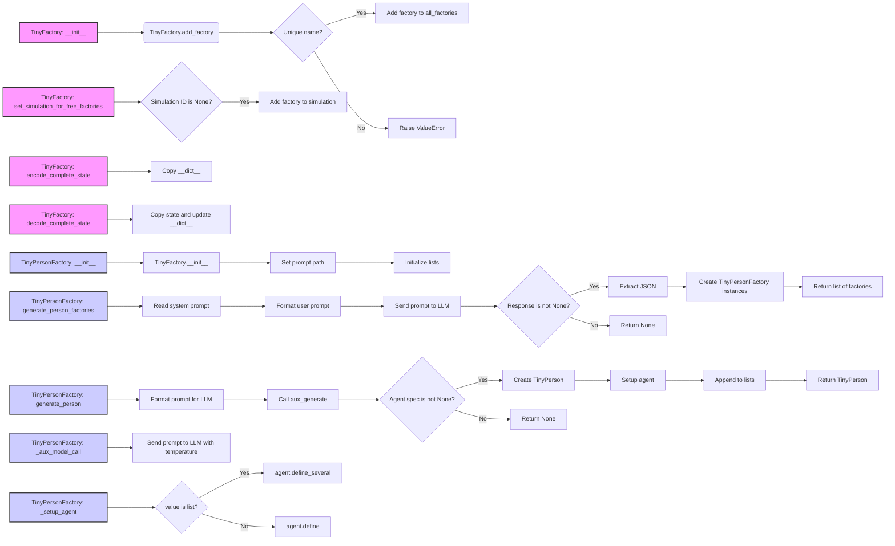

## Анализ кода `hypotez/src/ai/tiny_troupe/TinyTroupe/tinytroupe/factory.py`

### <алгоритм>

1.  **Инициализация `TinyFactory`**:
    *   При создании экземпляра `TinyFactory` генерируется уникальное имя фабрики и сохраняется `simulation_id`. Фабрика добавляется в глобальный словарь `all_factories`.
    *   Пример: `factory = TinyFactory(simulation_id="sim123")` создаст фабрику с именем `Factory <уникальный_id>` и `simulation_id="sim123"`.
2.  **Управление фабриками**:
    *   `set_simulation_for_free_factories`: Проходит по всем фабрикам и добавляет те, у которых `simulation_id` равен `None` к указанной симуляции.
    *   `add_factory`: Добавляет фабрику в `all_factories`, проверяя уникальность имени.
    *   `clear_factories`: Очищает глобальный словарь `all_factories`.
3.  **Кэширование состояния**:
    *   `encode_complete_state`: Создаёт копию словаря `__dict__`, представляющего состояние объекта.
    *   `decode_complete_state`: Обновляет `__dict__` объекта на основе переданного словаря.
4.  **Инициализация `TinyPersonFactory`**:
    *   При создании экземпляра `TinyPersonFactory` инициализируется `TinyFactory`, сохраняется `context_text`, путь к шаблону запроса и пустые списки `generated_minibios` и `generated_names`.
    *   Пример: `person_factory = TinyPersonFactory(context_text="Some context", simulation_id="sim123")`.
5.  **Генерация фабрик персонажей**:
    *   `generate_person_factories`:
        *   Читает системный промпт из файла.
        *   Формирует запрос к LLM на основе переданного контекста и количества фабрик.
        *   Отправляет запрос и извлекает JSON-ответ.
        *   Создаёт экземпляры `TinyPersonFactory` для каждого описания персонажа из ответа.
    *   Пример: `factories = TinyPersonFactory.generate_person_factories(number_of_factories=2, generic_context_text="Generic context")`
6.  **Генерация персонажа**:
    *   `generate_person`:
        *   Генерирует промпт для LLM на основе контекста фабрики и дополнительных параметров.
        *   Вызывает вспомогательную функцию `aux_generate` в цикле (до 5 раз), пока не будет сгенерирован подходящий персонаж.
        *   `aux_generate`: Отправляет промпт в LLM, извлекает JSON-ответ. Проверяет уникальность имени персонажа. Возвращает спецификацию агента или `None`, если создать не удалось.
        *   Если агент сгенерирован, то создаётся экземпляр `TinyPerson`, вызывается метод `_setup_agent`. Спецификация агента добавляется в список `generated_minibios` и `generated_names`.
        *   Возвращает экземпляр `TinyPerson` или `None` в случае ошибки.
    *   Пример: `person = person_factory.generate_person(agent_particularities="Particularity", temperature=1.2)`
7.  **Вспомогательные методы**:
    *   `_aux_model_call`: Отправляет сообщение в LLM, используется для кэширования вызова с помощью декоратора `transactional`.
    *   `_setup_agent`: Устанавливает параметры агента на основе переданной конфигурации.
    *   Метод `_setup_agent` не возвращает ничего, поскольку мы не хотим кешировать сам объект агента.
    *   Метод `_aux_model_call` имеет декоратор `@transactional`, который управляет кешированием его результата,  гарантируя, что  процесс создания персонажа (а именно,  вызов `TinyPerson(...)` и его последующая настройка в методе `_setup_agent(...)` )  не будет пропущен при  повторном вызове  с теми же  параметрами.

### <mermaid>

### <объяснение>

**Импорты:**

*   `os`: Предоставляет функции для взаимодействия с операционной системой, такие как работа с путями к файлам.
*   `json`: Позволяет работать с JSON-форматом данных, включая сериализацию и десериализацию.
*   `chevron`: Используется для рендеринга шаблонов mustache, позволяя динамически генерировать текст на основе данных.
*   `logging`: Предоставляет API для логирования событий, что полезно для отладки и мониторинга.
*   `copy`: Обеспечивает операции глубокого и поверхностного копирования объектов.
*   `tinytroupe.openai_utils`: Содержит утилиты для взаимодействия с OpenAI API.
*   `tinytroupe.agent.TinyPerson`: Представляет собой класс для создания агентов в системе.
*   `tinytroupe.utils`: Содержит вспомогательные функции, такие как извлечение JSON из текста.
*   `tinytroupe.control.transactional`: Декоратор для обеспечения транзакционности методов, то есть кэширования результатов вызова.

**Классы:**

*   `TinyFactory`:
    *   **Назначение**: Базовый класс для создания фабрик. Он обеспечивает общую функциональность, включая управление фабриками и кэширование состояния.
    *   **Атрибуты**:
        *   `all_factories`: Статический словарь, содержащий все созданные фабрики.
        *   `name`: Имя фабрики.
        *   `simulation_id`: Идентификатор симуляции, связанной с фабрикой.
    *   **Методы**:
        *   `__init__`: Инициализирует фабрику, создавая уникальное имя и добавляя ее в `all_factories`.
        *   `set_simulation_for_free_factories`:  Назначает симуляцию фабрикам без `simulation_id`.
        *   `add_factory`: Добавляет фабрику в `all_factories` с проверкой уникальности имени.
        *   `clear_factories`: Очищает список всех фабрик.
        *   `encode_complete_state`: Сериализует состояние фабрики в словарь.
        *   `decode_complete_state`: Десериализует состояние фабрики из словаря.
*   `TinyPersonFactory`:
    *   **Назначение**: Подкласс `TinyFactory`, специализирующийся на создании `TinyPerson` агентов.
    *   **Атрибуты**:
        *   `person_prompt_template_path`: Путь к файлу шаблона для генерации промпта для генерации персонажа.
        *   `context_text`: Контекст, используемый для генерации персонажей.
        *   `generated_minibios`: Список сгенерированных мини-биографий.
        *    `generated_names`: Список сгенерированных имен.
    *   **Методы**:
        *   `__init__`: Инициализирует фабрику персонажей.
        *   `generate_person_factories`: Генерирует несколько фабрик персонажей на основе общего контекста.
        *   `generate_person`: Генерирует экземпляр `TinyPerson` на основе контекста фабрики и дополнительных параметров.
        *   `_aux_model_call`: Вспомогательный метод для вызова LLM, декорированный `transactional` для кэширования.
        *   `_setup_agent`: Настраивает агента с переданной конфигурацией.

**Функции:**

*   `set_simulation_for_free_factories` (статический метод `TinyFactory`): Применяет симуляцию к фабрикам, у которых нет `simulation_id`.
*   `add_factory` (статический метод `TinyFactory`): Добавляет фабрику в глобальный словарь.
*    `clear_factories` (статический метод `TinyFactory`): Очищает глобальный словарь фабрик.
*   `encode_complete_state` (`TinyFactory`): Кодирует состояние объекта.
*   `decode_complete_state` (`TinyFactory`): Декодирует состояние объекта.
*   `generate_person_factories` (статический метод `TinyPersonFactory`): Генерирует несколько фабрик персонажей на основе общего контекста.
*   `generate_person` (`TinyPersonFactory`): Генерирует персонажа.
*   `_aux_model_call` (`TinyPersonFactory`): Вспомогательный метод для вызова LLM, используется для кэширования вызова с помощью декоратора `transactional`.
*   `_setup_agent` (`TinyPersonFactory`): Настраивает агента.

**Переменные:**

*   `all_factories` (статическая переменная `TinyFactory`): Словарь всех созданных фабрик.
*   `name` (`TinyFactory`, `TinyPersonFactory`): Имя фабрики.
*   `simulation_id` (`TinyFactory`, `TinyPersonFactory`): Идентификатор симуляции.
*   `person_prompt_template_path` (`TinyPersonFactory`): Путь к файлу шаблона запроса.
*   `context_text` (`TinyPersonFactory`): Контекст для генерации персонажей.
*    `generated_minibios` (`TinyPersonFactory`): Список мини-биографий уже сгенерированных персонажей.
*    `generated_names` (`TinyPersonFactory`): Список имен уже сгенерированных персонажей.

**Потенциальные ошибки и улучшения:**

*   **Обработка ошибок**: В коде присутствует общая обработка исключений при генерации агента, но можно было бы более детально обрабатывать различные типы ошибок, которые могут возникать при взаимодействии с LLM.
*   **Кэширование**: Использование `@transactional` для кэширования результатов вызова LLM.
*   **Уникальность имен**: Гарантируется уникальность имен фабрик и персонажей.

**Взаимосвязи с другими частями проекта:**

*   Использует `openai_utils` для взаимодействия с LLM.
*   Использует `TinyPerson` для создания агентов.
*   Использует `utils` для извлечения JSON из текста.
*   Использует декоратор `transactional` для кэширования вызовов.

Этот код представляет собой гибкий и расширяемый механизм для создания агентов, с акцентом на кэшировании и управлении состоянием, что делает его важной частью проекта `TinyTroupe`.