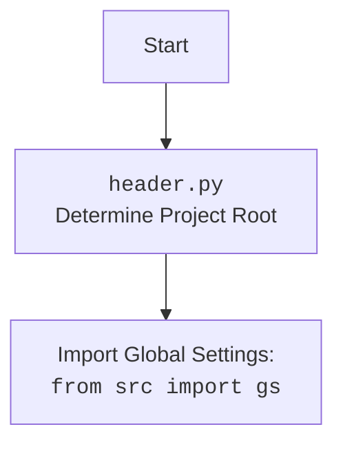

## <алгоритм>

**Блок-схема работы `TinyFactory` и `TinyPersonFactory`:**

1.  **Создание `TinyFactory` (Базовый класс):**
    *   При инициализации создается уникальное имя `Factory {fresh_id}`.
    *   Обновляет глобальный словарь `all_factories`.
    *   Метод `set_simulation_for_free_factories` добавляет фабрики в симуляцию, если они еще не добавлены.
    *   Метод `add_factory` добавляет фабрику в словарь, проверяя уникальность имени.
    *   Метод `clear_factories` очищает глобальный список фабрик.
    *   Методы `encode_complete_state` и `decode_complete_state` для сохранения и восстановления состояния фабрики.

    *   **Пример:**
        ```python
        factory1 = TinyFactory(simulation_id="sim123")
        print(factory1.name) # -> Factory <some_id>
        print(TinyFactory.all_factories) # -> {'Factory <some_id>': <__main__.TinyFactory object at 0x...>}

        factory2 = TinyFactory()
        print(factory2.name) # -> Factory <some_other_id>
        print(TinyFactory.all_factories) # -> {'Factory <some_id>': <__main__.TinyFactory object at 0x...>, 'Factory <some_other_id>': <__main__.TinyFactory object at 0x...>}
        ```

2.  **Создание `TinyPersonFactory` (Наследник `TinyFactory`):**
    *   Инициализируется с `context_text` и опциональным `simulation_id`.
    *   Задает путь к файлу шаблона генерации персонажа `prompts/generate_person.mustache`.
    *   Хранит список сгенерированных `minibios` и `generated_names`.

    *   **Пример:**
        ```python
        person_factory = TinyPersonFactory(context_text="Example context", simulation_id="sim456")
        print(person_factory.context_text) # -> "Example context"
        ```

3.  **Генерация `TinyPersonFactory` с помощью `generate_person_factories`:**
    *   Принимает количество фабрик и общий контекст `generic_context_text`.
    *   Читает системный промпт из `prompts/generate_person_factory.md`.
    *   Формирует запрос к OpenAI LLM с запросом на генерацию описаний персонажей, используя `chevron`.
    *   Обрабатывает ответ от OpenAI, извлекая JSON, и создает список `TinyPersonFactory`, где каждый элемент это персонаж.

    *   **Пример:**
        ```python
        factories = TinyPersonFactory.generate_person_factories(number_of_factories=2, generic_context_text="Some broad context")
        print(factories) # -> [<__main__.TinyPersonFactory object at 0x...>, <__main__.TinyPersonFactory object at 0x...>]
        print(factories[0].context_text) # -> description of the first person.
        ```

4.  **Генерация `TinyPerson` с помощью `generate_person`:**
    *   Принимает специфические особенности агента `agent_particularities`, температуру `temperature` и количество попыток `attempts`.
    *   Формирует промпт к OpenAI LLM, используя шаблон `prompts/generate_person.mustache`, `context_text`, `agent_particularities` и `already_generated`.
    *   Вызывает `aux_generate` в цикле `attempts` раз, пока не будет получен агент, или если превышено кол-во попыток.
    *   `aux_generate`:
        *   Отправляет запрос к OpenAI LLM через `_aux_model_call`.
        *   Извлекает JSON из ответа.
        *   Проверяет уникальность имени сгенерированного агента.
    *   Создает экземпляр `TinyPerson`.
    *   Настраивает агента с помощью `_setup_agent`.
    *   Добавляет `minibio` и имя в списки.
    *   Возвращает созданный `TinyPerson`.

    *   **Пример:**
        ```python
        person = person_factory.generate_person(agent_particularities="Friendly", temperature=1.2)
        print(person) # -> <tinytroupe.agent.TinyPerson object at 0x...>
        print(person.get('name')) # -> Name of the agent
        ```

5.  **Вспомогательные методы:**
    *   `_aux_model_call`: Вызывает OpenAI LLM API, используется для кэширования через `@transactional`.
    *   `_setup_agent`: Настраивает агента, определяя его свойства из конфигурации.
    *   `encode_complete_state` и `decode_complete_state`: для кодирования и декодирования состояния объекта, используется в механизме кэширования.

## <mermaid>

```mermaid
flowchart TD
    subgraph TinyFactory
        A[<code>__init__</code><br>Initialize factory] --> B{Add factory to <br><code>all_factories</code>}
        B -- Unique name? --> C[Error]
        B -- No duplicate --> D[Add to <br><code>all_factories</code>]
        E[<code>set_simulation_for_free_factories</code><br>Add factories to simulation] --> F{Is simulation_id None?}
        F -- Yes --> G[Add factory to simulation]
        H[<code>add_factory</code><br>Add factory to global list]
        H --> B
        I[<code>clear_factories</code><br>Clear all factories] --> J[Clear <br><code>all_factories</code>]
        K[<code>encode_complete_state</code><br>Encode state] --> L[Return encoded state]
        M[<code>decode_complete_state</code><br>Decode state] --> N[Update object <br> state]
    end
    
    subgraph TinyPersonFactory
       O[<code>__init__</code><br>Initialize person factory] --> P[Set prompt template path]
       P --> Q[Store context text]
       Q --> R[Initialize generated lists]

       S[<code>generate_person_factories</code><br>Generate factory list] --> T[Read system prompt]
       T --> U[Form user prompt with<br><code>chevron</code>]
       U --> V[Send message to OpenAI]
       V --> W{Response received?}
       W -- Yes --> X[Extract JSON from response]
       X --> Y[Create list of <br><code>TinyPersonFactory</code>]
       W -- No --> Z[Return None]
       
       AA[<code>generate_person</code><br>Generate a person] --> AB[Render prompt with <br><code>chevron</code>]
       AB --> AC[Call <code>aux_generate</code>]
       AC --> AD{Agent generated?}
       AD -- Yes --> AE[Create <code>TinyPerson</code>]
       AE --> AF[Set up agent]
       AF --> AG[Store agent info]
       AG --> AH[Return <code>TinyPerson</code>]
       AD -- No --> AI[Return None after retries]
       
       AJ[<code>_aux_model_call</code><br>Send message to OpenAI] --> AK[Send message to OpenAI with<br><code>openai_utils.client()</code>]

       AL[<code>_setup_agent</code><br>Setup an agent] --> AM[Set agent properties]
    end
    
    
    A --> O
    L --> K
    N --> M
    Y --> S
    AH --> AA
    AK --> AJ
    AM --> AL
```

**Зависимости `mermaid`:**

1.  **`TinyFactory`**:
    *   `__init__`: Инициализирует фабрику, задает имя и добавляет ее в глобальный список `all_factories`.
    *   `set_simulation_for_free_factories`: Добавляет фабрики без `simulation_id` в симуляцию.
    *   `add_factory`: Добавляет фабрику в глобальный список `all_factories`, проверяя уникальность имени.
    *   `clear_factories`: Очищает глобальный список фабрик `all_factories`.
    *   `encode_complete_state`: Кодирует состояние фабрики для кэширования.
    *   `decode_complete_state`: Декодирует состояние фабрики из кэша.

2.  **`TinyPersonFactory`**:
    *   `__init__`: Инициализирует фабрику персонажей, задает путь к шаблону и сохраняет контекст.
    *   `generate_person_factories`: Генерирует несколько `TinyPersonFactory` на основе контекста, вызывая OpenAI LLM.
    *    `generate_person`: Генерирует `TinyPerson` на основе контекста, вызывая OpenAI LLM.
    *   `_aux_model_call`: Вспомогательный метод для вызова OpenAI LLM, используется для кэширования.
    *   `_setup_agent`: Настраивает агента, определяя его свойства.

**Дополнительно:**



## <объяснение>

### Импорты

*   `os`: Используется для работы с файловой системой, например, для определения пути к файлам шаблонов (`os.path.join`, `os.path.dirname`).
*   `json`: Используется для работы с JSON, например, для извлечения JSON из ответа OpenAI (`json.dumps`).
*   `chevron`: Используется для работы с шаблонами mustache, для подстановки переменных в промпты (`chevron.render`).
*   `logging`: Используется для ведения логов, записи ошибок и отладочной информации.
*   `copy`: Используется для создания глубоких копий объектов (`copy.deepcopy`).
*   `tinytroupe.openai_utils`: Содержит утилиты для взаимодействия с OpenAI API.
*   `tinytroupe.agent.TinyPerson`: Класс агента, который создает фабрика.
*   `tinytroupe.utils`: Содержит общие утилиты, например `fresh_id()` и `extract_json()`.
*   `tinytroupe.control.transactional`: Декоратор для обеспечения транзакционности, используется для кэширования результатов вызовов функций.

### Классы

1.  **`TinyFactory`**:
    *   **Роль**: Базовый класс для всех фабрик. Управляет созданием и кэшированием фабрик.
    *   **Атрибуты**:
        *   `all_factories` (dict): Словарь, хранящий все созданные фабрики.
        *   `name` (str): Уникальное имя фабрики.
        *   `simulation_id` (str): ID симуляции, с которой связана фабрика (может быть `None`).
    *   **Методы**:
        *   `__init__(simulation_id: str=None)`: Конструктор, инициализирует фабрику.
        *   `set_simulation_for_free_factories(simulation)`: Добавляет фабрики без симуляции в указанную симуляцию.
        *   `add_factory(factory)`: Добавляет фабрику в глобальный список, проверяя уникальность имени.
        *   `clear_factories()`: Очищает глобальный список фабрик.
        *   `encode_complete_state() -> dict`: Кодирует состояние фабрики в словарь для кэширования.
        *   `decode_complete_state(state: dict)`: Восстанавливает состояние фабрики из словаря.

2.  **`TinyPersonFactory`**:
    *   **Роль**: Фабрика для создания `TinyPerson`.
    *   **Атрибуты**:
        *   `person_prompt_template_path` (str): Путь к файлу шаблона для генерации промпта персонажа.
        *   `context_text` (str): Текст контекста для генерации персонажа.
        *   `generated_minibios` (list): Список сгенерированных мини-биографий.
        *   `generated_names` (list): Список сгенерированных имен.
    *   **Методы**:
        *   `__init__(context_text, simulation_id: str = None)`: Конструктор, инициализирует фабрику.
        *   `generate_person_factories(number_of_factories, generic_context_text)`: Генерирует список `TinyPersonFactory` с помощью OpenAI LLM.
        *   `generate_person(agent_particularities: str = None, temperature: float = 1.5, attepmpts: int = 5)`: Генерирует `TinyPerson`, используя OpenAI LLM.
        *  `_aux_model_call(messages, temperature)`: Вызывает OpenAI LLM, метод используется для кэширования вызовов с помощью `@transactional` декоратора
        *   `_setup_agent(agent, configuration)`: Настраивает агента, добавляя свойства из конфигурации.

### Функции

*   `generate_person_factories(number_of_factories, generic_context_text)`: Статический метод, генерирующий список фабрик персонажей на основе заданного контекста. Использует OpenAI LLM для создания описаний персонажей.
    *   **Аргументы**:
        *   `number_of_factories` (int): Количество фабрик для генерации.
        *   `generic_context_text` (str): Общий контекст для генерации.
    *   **Возвращаемое значение**:
        *   `list` of `TinyPersonFactory` объектов: Список созданных фабрик, `None` в случае ошибки.
*   `generate_person(agent_particularities: str = None, temperature: float = 1.5, attepmpts: int = 5)`: Метод, генерирующий одного персонажа.
    *   **Аргументы**:
        *   `agent_particularities` (str, optional): Специфические характеристики агента.
        *   `temperature` (float, optional): Температура для LLM.
        *   `attempts` (int, optional): Количество попыток генерации.
    *   **Возвращаемое значение**:
        *   `TinyPerson` object: Созданный персонаж или `None` в случае ошибки.
*   `_aux_model_call(messages, temperature)`: Вызывает OpenAI LLM API, используется для кэширования через `@transactional`.
    *   **Аргументы**:
         *   `messages` (list): Список сообщений.
         *   `temperature` (float): Температура для LLM.
    *   **Возвращаемое значение**:
          *   `dict`: Ответ от OpenAI LLM API.
*   `_setup_agent(agent, configuration)`:  Настраивает агента, добавляя его свойства из конфигурации.
    *   **Аргументы**:
         *  `agent` (`TinyPerson` object): Агент, которого нужно настроить.
         * `configuration` (dict): Словарь конфигурации.
    *   **Возвращаемое значение**:
         *   `None`.

### Переменные

*   `all_factories`: (dict) Глобальный словарь всех фабрик, где ключ - это имя фабрики.
*   `name`: (str) Уникальное имя фабрики.
*   `simulation_id`: (str) Идентификатор симуляции, может быть `None`.
*   `person_prompt_template_path`: (str) Путь к файлу с шаблоном для генерации промптов персонажей.
*   `context_text`: (str) Общий контекст, используемый для генерации персонажей.
*   `generated_minibios`: (list) Список сгенерированных мини биографий, предотвращает дублирование персонажей.
*   `generated_names`: (list) Список имен сгенерированных персонажей.

### Потенциальные ошибки и области для улучшения:

*   **Обработка ошибок:** Добавить более детальную обработку ошибок при вызовах OpenAI API и преобразовании JSON.
*   **Улучшение кэширования:** Проверить и улучшить логику кэширования для избежания повторной генерации персонажей с одинаковыми параметрами.
*   **Расширение функциональности:** Можно добавить поддержку различных моделей LLM или разных шаблонов промптов.
*   **Валидация JSON:** Добавить валидацию JSON, полученного из OpenAI, чтобы гарантировать его соответствие ожидаемому формату.
*   **Ограничение количества попыток:** При генерации персонажа (`generate_person`), можно вынести количество попыток в конфигурацию, чтобы можно было его легко изменять.
*   **Контроль уникальности имен:** В `generate_person` контроль уникальности имен можно усилить, чтобы он был независим от регистра.
*   **Разделение функциональности:** Некоторые части кода можно разделить на более мелкие функции для улучшения читаемости.

### Взаимосвязи с другими частями проекта:

*   `tinytroupe.openai_utils`: Используется для связи с OpenAI API.
*   `tinytroupe.agent.TinyPerson`: Создаваемые агенты, которые будут использоваться в симуляции.
*   `tinytroupe.utils`: Используются функции для извлечения JSON и создания уникальных ID.
*   `tinytroupe.control.transactional`: Используется для кэширования результатов вызовов.

Данный код реализует фабричный паттерн для создания агентов, используя OpenAI LLM. Он спроектирован так, что позволяет кэшировать результаты запросов к LLM и обеспечивать транзакционность операций, что делает его эффективным и масштабируемым.