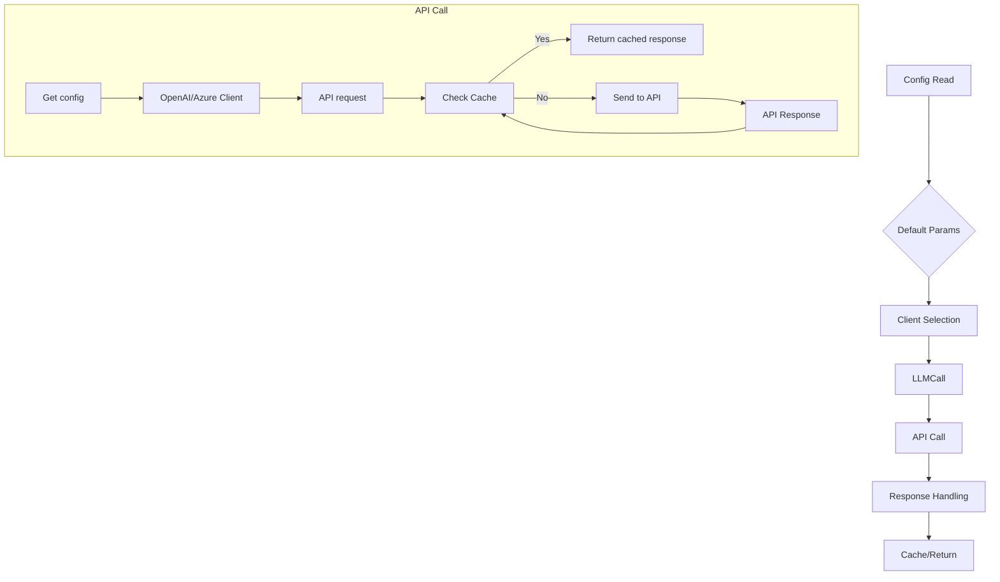

# <input code>

```python
import os
import openai
from openai import OpenAI, AzureOpenAI
import time
import json
import pickle
import logging
import configparser
import tiktoken
from tinytroupe import utils

logger = logging.getLogger("tinytroupe")

# We'll use various configuration elements below
config = utils.read_config_file()

###########################################################################
# Default parameter values
###########################################################################
default = {}
default["model"] = config["OpenAI"].get("MODEL", "gpt-4")
default["max_tokens"] = int(config["OpenAI"].get("MAX_TOKENS", "1024"))
default["temperature"] = float(config["OpenAI"].get("TEMPERATURE", "0.3"))
default["top_p"] = int(config["OpenAI"].get("TOP_P", "0"))
default["frequency_penalty"] = float(config["OpenAI"].get("FREQ_PENALTY", "0.0"))
default["presence_penalty"] = float(
    config["OpenAI"].get("PRESENCE_PENALTY", "0.0"))
default["timeout"] = float(config["OpenAI"].get("TIMEOUT", "30.0"))
default["max_attempts"] = float(config["OpenAI"].get("MAX_ATTEMPTS", "0.0"))
default["waiting_time"] = float(config["OpenAI"].get("WAITING_TIME", "0.5"))
default["exponential_backoff_factor"] = float(config["OpenAI"].get("EXPONENTIAL_BACKOFF_FACTOR", "5"))

default["embedding_model"] = config["OpenAI"].get("EMBEDDING_MODEL", "text-embedding-3-small")

default["cache_api_calls"] = config["OpenAI"].getboolean("CACHE_API_CALLS", False)
default["cache_file_name"] = config["OpenAI"].get("CACHE_FILE_NAME", "openai_api_cache.pickle")

###########################################################################
# Model calling helpers
###########################################################################

# TODO under development
class LLMCall:
    """
    A class that represents an LLM model call. It contains the input messages, the model configuration, and the model output.
    """
    def __init__(self, system_template_name:str, user_template_name:str=None, **model_params):
        """
        Initializes an LLMCall instance with the specified system and user templates.
        """
        self.system_template_name = system_template_name
        self.user_template_name = user_template_name
        self.model_params = model_params
    
    def call(self, **rendering_configs):
        """
        Calls the LLM model with the specified rendering configurations.
        """
        self.messages = utils.compose_initial_LLM_messages_with_templates(self.system_template_name, self.user_template_name, rendering_configs)
        
        # call the LLM model
        self.model_output = client().send_message(self.messages, **self.model_params)

        if 'content' in self.model_output:
            return self.model_output['content']
        else:
            logger.error(f"Model output does not contain 'content' key: {self.model_output}")
            return None


    def __repr__(self):
        return f"LLMCall(messages={self.messages}, model_config={self.model_config}, model_output={self.model_output})"

# ... (rest of the code)
```

# <algorithm>

**(Simplified Block Diagram)**



**Explanation:**

1. **Config Read (A):** Reads configuration values from `config.ini` (likely within `utils.read_config_file()`).
2. **Default Params (B):** Sets default parameter values for API calls based on configuration or defaults.  These values are critical for model interactions.
3. **Client Selection (C):** Determines the appropriate API client (`OpenAIClient` or `AzureClient`) based on the configuration.
4. **LLMCall (D):** Prepares data for the LLM call, including messages and parameters.
5. **API Call (E):** This is the main block, which can either retrieve from a cache (E4 -> E5) or make a request to the API (E6 -> E7).
6. **Response Handling (F):** Processes the response from the API, extracts relevant data, and handles errors like `InvalidRequestError` or `RateLimitError`.  Includes logging and exponential backoff on error.
7. **Cache/Return (G):** Either returns the response from the cache or stores the API response in the cache before returning it.


# <mermaid>

```mermaid
graph LR
    subgraph TinyTroupe
        config[config.ini] --> OpenAI_Config;
        OpenAI_Config --> OpenAIClient;
        OpenAI_Config --> AzureClient;
        OpenAIClient --> OpenAI_API;
        AzureClient --> Azure_API;
        utils[utils.py] --> OpenAI_Config;
        utils --> OpenAIClient;
        utils --> AzureClient;
        OpenAI_API --> Response;
        Azure_API --> Response;
        Response --> LLMCall;
        LLMCall --> OpenAIClient;
        LLMCall --> AzureClient;
    end
    
    OpenAIClient --> cache[Cache (pickle)];
    AzureClient --> cache;
```


# <explanation>

**Imports:**

* `os`, `openai`, `time`, `json`, `pickle`, `logging`, `configparser`, `tiktoken`: Standard Python libraries for interacting with the operating system, the OpenAI API, handling time, JSON data, pickling, logging, configuration files, and tokenizing text, respectively.
* `tinytroupe.utils`: This import suggests a custom utility module (`utils.py`) within the `tinytroupe` package. This module likely contains helper functions, probably for configuration management, message construction, and data sanitization.


**Classes:**

* **`LLMCall`:**  A simple container class for holding the inputs (templates, parameters), the API call itself (`client().send_message`), and the output of the API call. This promotes modularity. It does not handle caching or error handling, but relies on the `client` function to perform the actual API call.
* **`OpenAIClient`:**  A crucial class for interacting with the OpenAI API. It handles API calls, caching, error handling, and exponential backoff.  It includes methods to both perform calls and to handle the cache (reading/writing).  It's highly customizable through configuration and customizable methods such as `_raw_model_call` and `_raw_model_response_extractor`.
* **`AzureClient`:**  A subclass of `OpenAIClient` tailored for interacting with the Azure OpenAI service, overriding the API setup (`_setup_from_config`) and call (`_raw_model_call`) methods to match Azure's API.
* **`InvalidRequestError`, `NonTerminalError`:** Custom exception classes specific to the OpenAI API interaction to distinguish between different error types.


**Functions:**

* **`client()`:** This function retrieves the appropriate API client (`OpenAIClient` or `AzureClient`) based on the configuration (`config["OpenAI"]["API_TYPE"]`).  A crucial part of the abstraction.
* **`register_client()`:** Registers the available client types ("openai", "azure").
* **`send_message()`:** The main function for sending messages to the OpenAI API. It handles retries, timeouts, exponential backoff on rate limits, and caching if enabled (`default["cache_api_calls"]`).
* **`force_api_type()`, `force_api_cache()`, `force_default_value()`:** These allow overriding default values and client types programmatically, which is usually useful for testing or specific use cases.


**Variables:**

* **`default`:** A dictionary of default parameters used in API calls.  These are crucial defaults that need to be configurable through the `config.ini` file.


**Possible Errors/Improvements:**

* **Error handling**: More specific error handling (e.g., parsing exceptions) within `send_message()` and `_count_tokens()` is beneficial.
* **`_count_tokens()`**: This function is adapted from the OpenAI cookbook, which means potential problems are masked here since the implementation is not completely within the context of the code provided.
* **Customizability**:  Even though the method `_raw_model_call` is designed to be overridable, the function `send_message` could benefit from accepting a custom API call function in some cases to support different API endpoints.
* **`_count_tokens()` error handling**: The token counting logic is fragile. It would be improved with better error handling around cases where `tiktoken` might not be able to find the appropriate encoding.


**Relationships with other parts of the project:**

The code heavily relies on `utils.py` for configuration reading and message composition.  The `LLMCall` class represents a layer of abstraction, separating the API interaction logic from the use cases that might use the LLM.  The caching mechanism is a vital aspect for performance, especially when interacting with a rate-limited service.

**Overall:**

The code is well-structured, with good error handling and a clear attempt at resilience. The use of a cache and exponential backoff is crucial for robustness and performance when dealing with external APIs. The separation of concerns (e.g., the `client` function) is excellent.  The introduction of Azure support highlights a willingness to accommodate different API providers.  The use of logging provides excellent insights into the interactions.  The code is designed for configurability, which is important for maintainability.