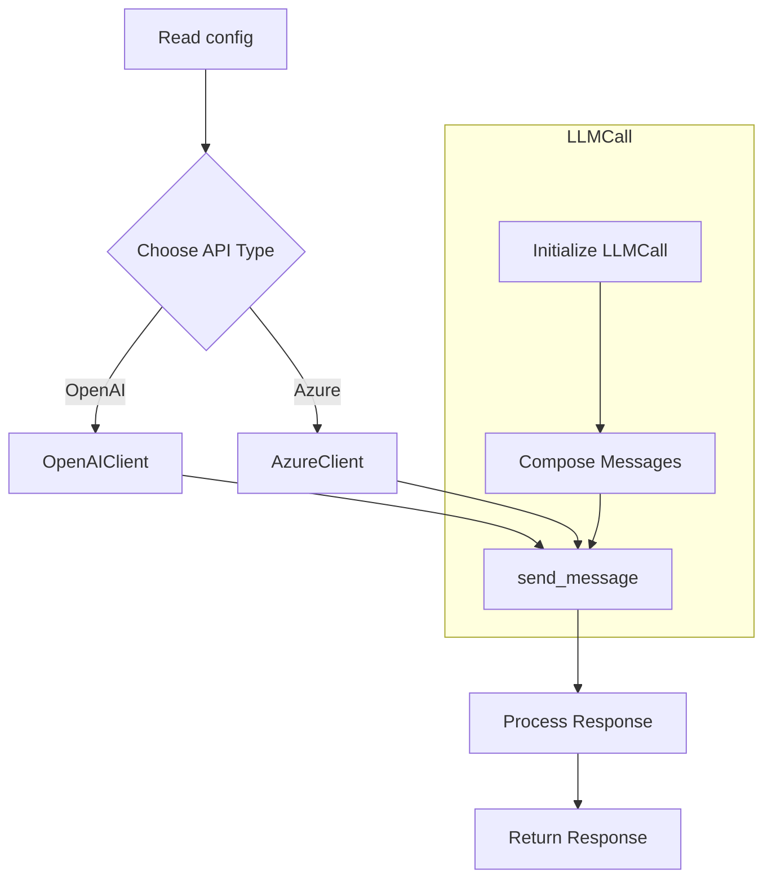
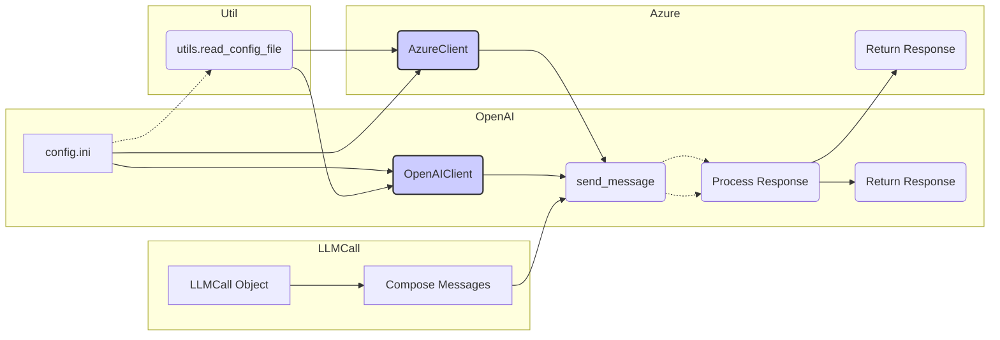

# <input code>

```python
import os
import openai
from openai import OpenAI, AzureOpenAI
import time
import json
import pickle
import logging
import configparser
import tiktoken
from tinytroupe import utils

logger = logging.getLogger("tinytroupe")

# We'll use various configuration elements below
config = utils.read_config_file()

###########################################################################
# Default parameter values
###########################################################################
default = {}
default["model"] = config["OpenAI"].get("MODEL", "gpt-4")
default["max_tokens"] = int(config["OpenAI"].get("MAX_TOKENS", "1024"))
default["temperature"] = float(config["OpenAI"].get("TEMPERATURE", "0.3"))
default["top_p"] = int(config["OpenAI"].get("TOP_P", "0"))
default["frequency_penalty"] = float(config["OpenAI"].get("FREQ_PENALTY", "0.0"))
default["presence_penalty"] = float(
    config["OpenAI"].get("PRESENCE_PENALTY", "0.0"))
default["timeout"] = float(config["OpenAI"].get("TIMEOUT", "30.0"))
default["max_attempts"] = float(config["OpenAI"].get("MAX_ATTEMPTS", "0.0"))
default["waiting_time"] = float(config["OpenAI"].get("WAITING_TIME", "0.5"))
default["exponential_backoff_factor"] = float(config["OpenAI"].get("EXPONENTIAL_BACKOFF_FACTOR", "5"))

default["embedding_model"] = config["OpenAI"].get("EMBEDDING_MODEL", "text-embedding-3-small")

default["cache_api_calls"] = config["OpenAI"].getboolean("CACHE_API_CALLS", False)
default["cache_file_name"] = config["OpenAI"].get("CACHE_FILE_NAME", "openai_api_cache.pickle")

###########################################################################
# Model calling helpers
###########################################################################

# TODO under development
class LLMCall:
    """
    A class that represents an LLM model call. It contains the input messages, the model configuration, and the model output.
    """
    def __init__(self, system_template_name:str, user_template_name:str=None, **model_params):
        """
        Initializes an LLMCall instance with the specified system and user templates.
        """
        self.system_template_name = system_template_name
        self.user_template_name = user_template_name
        self.model_params = model_params
    
    def call(self, **rendering_configs):
        """
        Calls the LLM model with the specified rendering configurations.
        """
        self.messages = utils.compose_initial_LLM_messages_with_templates(self.system_template_name, self.user_template_name, rendering_configs)
        self.model_output = client().send_message(self.messages, **self.model_params)
        if 'content' in self.model_output:
            return self.model_output['content']
        else:
            logger.error(f"Model output does not contain \'content\' key: {self.model_output}")
            return None
    # ... (rest of the code)
```

# <algorithm>

**(Block Diagram - Simplified)**



**Explanation:**

1. **Read config:** The code reads configuration settings from a `config.ini` file (likely using `configparser`) via `utils.read_config_file()`.
2. **Choose API type:** Based on the `config.ini` file, it selects the appropriate API client (`OpenAIClient` or `AzureClient`) using the `client()` function.
3. **`LLMCall` object:** Creates an `LLMCall` object, which is designed to encapsulate the process of calling a language model with specific parameters.
4. **`send_message`:** Sends a message to the chosen API using the `send_message` method of the selected client. This method handles retries and exponential backoff mechanisms to mitigate rate limits.
5. **Process Response:** Extracts the content from the API's response.
6. **Return response:** Returns the extracted content to the caller or `None` if there are errors or missing content.


# <mermaid>




# <explanation>

**1. Imports:**

- `os`: For interacting with the operating system, primarily retrieving environment variables.
- `openai`: The main OpenAI API client library.
- `OpenAI`, `AzureOpenAI`: Specific classes for interacting with the OpenAI and Azure OpenAI APIs.
- `time`, `json`, `pickle`, `logging`, `configparser`, `tiktoken`: Standard Python libraries for timing, data serialization, logging, configuration, and tokenization.
- `tinytroupe.utils`: A custom module within the `tinytroupe` package, likely containing helper functions for configuration reading, message composition, and other utility tasks.

**2. Classes:**

- `LLMCall`: Represents a call to a large language model (LLM). It encapsulates parameters (templates, model parameters) and the process of constructing messages. The `call` method orcheStartes the process of interaction with the API client. This class is designed to allow for consistent message framing and config values.
- `OpenAIClient`:  A class for interacting with the OpenAI API.  It handles API calls, caching (if enabled), and error handling (rate limits, invalid requests). The crucial `send_message` method is responsible for making the actual calls, with extensive error handling and exponential backoff. `set_api_cache`, `_load_cache`, `_save_cache` handle caching mechanism.
- `AzureClient`: A subclass of `OpenAIClient` specifically for the Azure OpenAI Service API. This demonStartes code reusability.
- `InvalidRequestError`, `NonTerminalError`: Custom exceptions to improve error handling for invalid requests or recoverable errors.

**3. Functions:**

- `client()`:  Returns the appropriate API client object (`OpenAIClient` or `AzureClient`) based on the configuration, thereby delegating API calls to a specific implementation. This handles the choice of an appropriate client for the currently selected API type.  Crucial for enabling different API providers' support and switching between them.
- `register_client()`, `_get_client_for_api_type()`: Functions for registering and retrieving API clients dynamically.
- `force_api_type()`, `force_api_cache()`, `force_default_value()`: allow overriding default configurations, useful for testing or rapid prototyping.


**4. Variables:**

- `config`: A dictionary holding configuration values read from `config.ini`.
- `default`: A dictionary containing default parameter values for LLM calls. This is used for parameter defaults and to initialize parameters not specified in `config.ini`.
- `logger`: A `logging` handler for writing log messages to a file or console.


**5. Possible Errors/Improvements:**

- **Error Handling:** The error handling is comprehensive, including rate limiting, invalid requests, and non-terminal errors. However, error handling for specific API exceptions should be added for increased robustness.
- **`_count_tokens`:** This function is crucial for managing token limits. The `try...except` block for `encoding` and token counting scenarios is a good safeguard.
- **`LLMCall` class and  `messages` parameter:** The `LLMCall` class could potentially be improved with additional validation and information storage about the input messages and model parameters. This could improve debugability and maintainability.
- **`cache_api_calls`**: The caching mechanism is a good optimization, but proper validation to avoid errors when loading or saving the cache would be an improvement.
- **External Dependencies:** The `tinytroupe` module (especially the `utils` module) is not analyzed here, but its correct implementation is crucial for the correct functioning of this code.

**Relationship with Other Parts of the Project:**

The code heavily relies on the `utils` module for configuration reading and potentially message formatting. The `config.ini` file defines parameters for API type, caching, and model parameters, demonStarting the setup for accessing API features like text embeddings.

This code is part of a larger project (`tinytroupe`) focused on interacting with language models.  The `utils` module likely contains functions for general tasks. The project's architecture hints at potential modular design and further customization options.