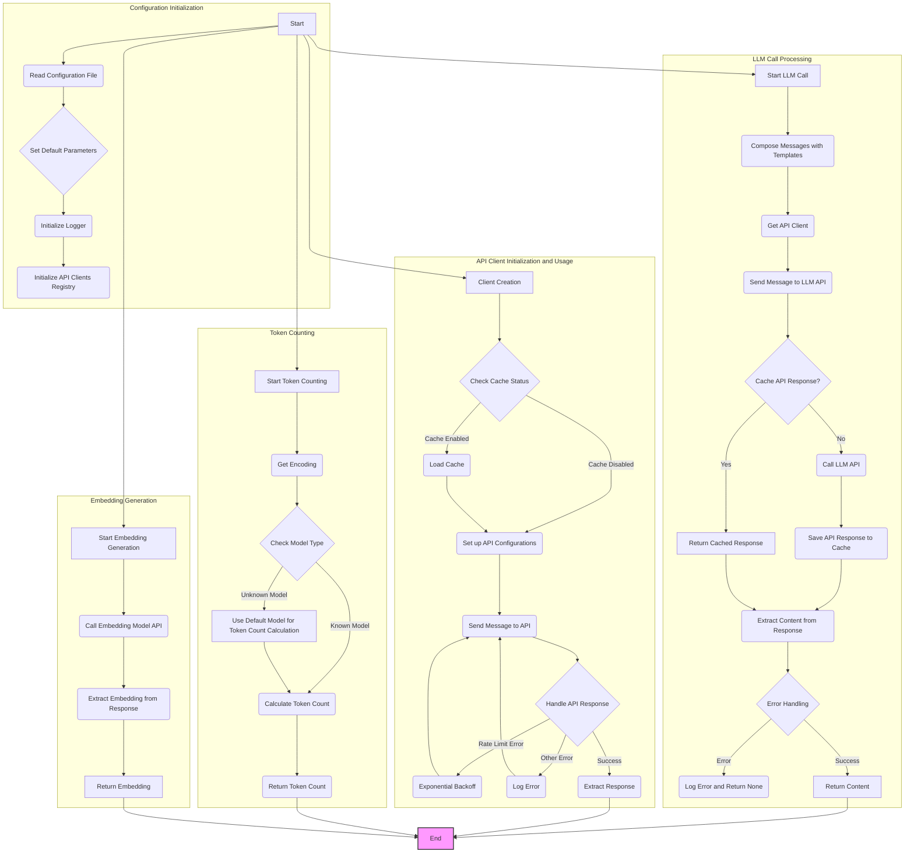
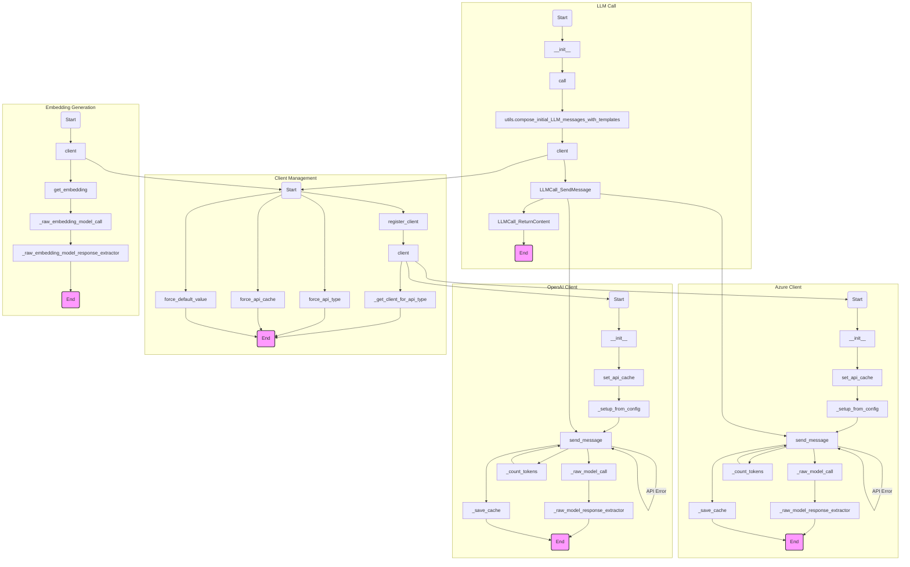

## ИНСТРУКЦИЯ:

Анализируй предоставленный код подробно и объясни его функциональность. Ответ должен включать три раздела:

1. **<алгоритм>**: Опиши рабочий процесс в виде пошаговой блок-схемы, включая примеры для каждого логического блока, и проиллюстрируй поток данных между функциями, классами или методами.
2. **<mermaid>**: Напиши код для диаграммы в формате `mermaid`, проанализируй и объясни все зависимости,
   которые импортируются при создании диаграммы.
   **ВАЖНО!** Убедитесь, что все имена переменных, используемые в диаграмме `mermaid`,
   имеют осмысленные и описательные имена. Имена переменных вроде `A`, `B`, `C`, и т.д., не допускаются!

   **Дополнительно**: Если в коде есть импорт `import header`, добавьте блок `mermaid` flowchart, объясняющий `header.py`:
   ```mermaid
   flowchart TD
       Start --> Header[<code>header.py</code><br> Determine Project Root]

       Header --> import[Import Global Settings: <br><code>from src import gs</code>]
   ```

3. **<объяснение>**: Предоставьте подробные объяснения:
   - **Импорты**: Их назначение и взаимосвязь с другими пакетами `src.`.
   - **Классы**: Их роль, атрибуты, методы и взаимодействие с другими компонентами проекта.
   - **Функции**: Их аргументы, возвращаемые значения, назначение и примеры.
   - **Переменные**: Их типы и использование.
   - Выделите потенциальные ошибки или области для улучшения.

Дополнительно, постройте цепочку взаимосвязей с другими частями проекта (если применимо).

Это обеспечивает всесторонний и структурированный анализ кода.
## Формат ответа: `.md` (markdown)
**КОНЕЦ ИНСТРУКЦИИ**

## <алгоритм>



1.  **Конфигурация (Configuration Initialization):**
    *   **A (Start):** Начало выполнения программы.
    *   **B (Read Configuration File):** Чтение конфигурационного файла (например, `config.ini`) с помощью `utils.read_config_file()`.
        *   Пример: Файл `config.ini` содержит параметры для OpenAI, такие как `MODEL`, `MAX_TOKENS`, `TEMPERATURE`, `API_TYPE` и т. д.
    *   **C (Set Default Parameters):** Установка значений параметров по умолчанию из конфигурационного файла. Например, `default["model"]` устанавливается из `config["OpenAI"].get("MODEL", "gpt-4")`.
        *   Пример: `default["max_tokens"]` установлено в 1024, если в `config.ini` не указано другое значение.
    *   **D (Initialize Logger):** Инициализация системы логирования для отслеживания работы программы.
        *   Пример: Записи о начале работы программы, ошибках, предупреждениях и отладке будут записываться в лог-файл.
    *   **E (Initialize API Clients Registry):** Регистрация поддерживаемых API-клиентов (OpenAI, Azure) в словаре `_api_type_to_client`.

2.  **Обработка вызова LLM (LLM Call Processing):**
    *   **F (Start LLM Call):** Начало процесса вызова языковой модели.
    *   **G (Compose Messages with Templates):** Составление сообщений для LLM с использованием шаблонов (например, системного и пользовательского) с помощью `utils.compose_initial_LLM_messages_with_templates()`.
        *   Пример: Подстановка переменных в шаблоны и формирование списка сообщений для передачи в OpenAI API.
    *   **H (Get API Client):** Получение нужного API-клиента (например, `OpenAIClient` или `AzureClient`) в соответствии с типом API, указанным в конфигурации.
        *   Пример: Если `config["OpenAI"]["API_TYPE"]` равно `"azure"`, то будет возвращён экземпляр `AzureClient`.
    *   **I (Send Message to LLM API):** Отправка сформированных сообщений и параметров в LLM API через метод `send_message()` API-клиента.
        *   Пример: Передача списка сообщений, модели, температуры и других параметров в OpenAI API.
    *   **J (Cache API Response?):** Проверка, нужно ли использовать кэш для API-запросов.
    *   **K (Return Cached Response):** Если кэширование включено и ответ есть в кэше, то возвращается кэшированный ответ.
        *   Пример: Если запрос ранее выполнялся с теми же параметрами, возвращается сохранённый ответ.
    *   **L (Call LLM API):** Если кэширование отключено или ответа нет в кэше, происходит вызов LLM API.
    *   **M (Save API Response to Cache):** После получения ответа от API, он сохраняется в кэш (если кэширование включено).
    *   **N (Extract Content from Response):** Извлечение полезного содержимого из ответа API.
        *   Пример: Извлекается текст из поля `content` в ответе OpenAI.
    *   **O (Error Handling):** Проверка на наличие ошибок в ответе.
    *   **P (Log Error and Return None):** Если произошла ошибка, она регистрируется в логе, и функция возвращает `None`.
    *   **Q (Return Content):** Если запрос выполнен успешно, возвращается извлечённое содержимое.

3.  **Инициализация и использование API-клиента (API Client Initialization and Usage):**
    *   **R (Client Creation):** Создание экземпляра API-клиента (`OpenAIClient` или `AzureClient`).
    *   **S (Check Cache Status):** Проверка, включено ли кэширование API-вызовов.
    *   **T (Load Cache):** Загрузка кэшированных API-ответов из файла, если кэширование включено.
    *   **U (Set up API Configurations):** Настройка параметров API-клиента (например, API-ключ).
        *   Пример: Для `OpenAIClient` устанавливается API-ключ из переменной окружения `OPENAI_API_KEY`. Для `AzureClient` - endpoint, api version, key.
    *   **V (Send Message to API):** Отправка запроса к API.
    *   **W (Handle API Response):** Обработка ответа от API, включая обработку ошибок.
    *   **X (Exponential Backoff):** При возникновении ошибки `RateLimitError` применяется экспоненциальная задержка перед повторной отправкой запроса.
    *   **Y (Log Error):** При возникновении других ошибок, они регистрируются в логе.
    *   **Z (Extract Response):** Извлечение ответа из API.

4.  **Подсчёт токенов (Token Counting):**
    *   **AA (Start Token Counting):** Начало процесса подсчёта токенов.
    *   **AB (Get Encoding):** Получение кодировки токенов для конкретной модели с помощью `tiktoken.encoding_for_model()`.
    *   **AC (Check Model Type):** Проверка, относится ли модель к известным моделям (например, GPT-3.5 Turbo, GPT-4).
    *   **AD (Calculate Token Count):** Расчёт количества токенов на основе типа модели.
    *   **AE (Use Default Model for Token Count Calculation):** Если модель неизвестна, используется модель по умолчанию для подсчёта токенов.
    *   **AF (Return Token Count):** Возврат количества токенов.

5.  **Генерация вложений (Embedding Generation):**
    *   **AG (Start Embedding Generation):** Начало процесса генерации вложений.
    *   **AH (Call Embedding Model API):** Вызов API для получения вложений текста.
    *   **AI (Extract Embedding from Response):** Извлечение вложения из ответа API.
    *   **AJ (Return Embedding):** Возврат вложения текста.

## <mermaid>



**Анализ зависимостей:**

1.  **`os`**: Используется для доступа к переменным окружения, таким как `OPENAI_API_KEY` и `AZURE_OPENAI_ENDPOINT`, `AZURE_OPENAI_KEY`.  
2.  **`openai`**: Используется для взаимодействия с OpenAI API.
3.  **`openai.OpenAI`, `openai.AzureOpenAI`**: Классы для создания клиентов OpenAI и Azure OpenAI.
4.  **`time`**: Используется для задержек между повторными попытками вызова API (экспоненциальная задержка) и для измерения времени выполнения запросов.
5.  **`json`**: Используется, но не непосредственно в этом коде, это говорит о том, что класс `utils` вероятно использует этот модуль.
6.  **`pickle`**: Используется для сериализации и десериализации данных (кэша API-вызовов) в файл, так как некоторые объекты, возвращаемые API, не являются JSON-сериализуемыми.
7.  **`logging`**: Используется для регистрации событий и отладочной информации.
8.  **`configparser`**: Используется для чтения конфигурационных файлов (например, `config.ini`).
9.  **`tiktoken`**: Используется для подсчёта количества токенов в сообщениях, отправляемых в OpenAI API.
10. **`tinytroupe.utils`**:  Импортируется локальный модуль `utils` из пакета `tinytroupe`, который содержит вспомогательные функции, такие как чтение конфигурации, составление сообщений с шаблонами и санитайзер.  

## <объяснение>

### Импорты

*   `import os`: Обеспечивает взаимодействие с операционной системой, в основном для получения переменных окружения.
*   `import openai`: Предоставляет основной интерфейс для работы с OpenAI API.
*   `from openai import OpenAI, AzureOpenAI`: Импортирует классы `OpenAI` и `AzureOpenAI` для создания клиентов для OpenAI и Azure OpenAI соответственно.
*   `import time`: Используется для работы со временем, особенно для задержек и измерения времени выполнения.
*   `import json`: Используется для работы с JSON, хотя напрямую не видно в этом коде, вероятно используется в модуле `utils`.
*   `import pickle`:  Используется для сериализации и десериализации объектов Python, особенно для кэширования API-вызовов.
*   `import logging`: Используется для регистрации событий, отладочной информации, ошибок и предупреждений.
*   `import configparser`: Используется для чтения конфигурационных файлов типа `.ini`.
*   `import tiktoken`: Используется для подсчёта токенов при работе с OpenAI API.
*   `from tinytroupe import utils`: Импортирует модуль `utils` из пакета `tinytroupe`, который предоставляет общие утилиты, включая чтение конфигурации и составление сообщений с шаблонами, санитайзер и другие.

### Классы

*   **`LLMCall`**:
    *   **Роль**: Представляет вызов языковой модели (LLM).
    *   **Атрибуты**:
        *   `system_template_name` (str): Имя шаблона для системного сообщения.
        *   `user_template_name` (str, опционально): Имя шаблона для пользовательского сообщения.
        *   `model_params` (dict): Параметры модели.
        *   `messages` (list): Сообщения, отправляемые в LLM.
        *   `model_output` (dict): Выходные данные от LLM.
    *   **Методы**:
        *   `__init__(self, system_template_name:str, user_template_name:str=None, **model_params)`: Инициализирует экземпляр `LLMCall`.
        *   `call(self, **rendering_configs)`: Вызывает LLM модель с указанными параметрами рендеринга.
        *   `__repr__(self)`: Возвращает строковое представление объекта `LLMCall`.
    *   **Взаимодействие**: Использует `utils.compose_initial_LLM_messages_with_templates` для подготовки сообщений и `client().send_message()` для вызова LLM.

*   **`OpenAIClient`**:
    *   **Роль**: Управляет взаимодействием с OpenAI API.
    *   **Атрибуты**:
        *   `cache_api_calls` (bool): Флаг для включения/выключения кэширования API-вызовов.
        *   `cache_file_name` (str): Имя файла для кэширования.
        *   `api_cache` (dict): Кэш API-вызовов.
        *   `client` (openai.OpenAI): Клиент для работы с OpenAI API.
    *   **Методы**:
        *   `__init__(self, cache_api_calls=default["cache_api_calls"], cache_file_name=default["cache_file_name"])`: Инициализирует клиент.
        *   `set_api_cache(self, cache_api_calls, cache_file_name=default["cache_file_name"])`: Настраивает параметры кэширования.
        *   `_setup_from_config(self)`: Настраивает API-клиент (устанавливает API key).
        *   `send_message(...)`: Отправляет сообщение в OpenAI API и обрабатывает ответ, включая повторные попытки и кэширование.
        *   `_raw_model_call(self, model, chat_api_params)`:  Выполняет низкоуровневый вызов API.
        *   `_raw_model_response_extractor(self, response)`: Извлекает данные из ответа API.
        *   `_count_tokens(self, messages: list, model: str)`: Подсчитывает количество токенов в сообщениях.
        *   `_save_cache(self)`: Сохраняет кэш на диск.
        *   `_load_cache(self)`: Загружает кэш с диска.
        *   `get_embedding(self, text, model=default["embedding_model"])`: Получает эмбеддинг текста.
        *   `_raw_embedding_model_call(self, text, model)`: Выполняет низкоуровневый вызов API для получения эмбеддинга.
        *    `_raw_embedding_model_response_extractor(self, response)`: Извлекает эмбеддинг из ответа API.
    *   **Взаимодействие**:  Использует `openai.OpenAI` для вызова API, а также `pickle` для кэширования.

*   **`AzureClient`**:
    *   **Роль**:  Управляет взаимодействием с Azure OpenAI API.
    *   **Атрибуты**:  Наследует атрибуты от `OpenAIClient`.
    *   **Методы**:
        *   `__init__(self, cache_api_calls=default["cache_api_calls"], cache_file_name=default["cache_file_name"])`:  Инициализирует клиент.
        *   `_setup_from_config(self)`:  Настраивает API-клиент Azure.
        *   `_raw_model_call(self, model, chat_api_params)`: Выполняет низкоуровневый вызов API Azure.
        *   Остальные методы наследуются от `OpenAIClient`
    *   **Взаимодействие**: Использует `openai.AzureOpenAI` для вызова API.

*   **`InvalidRequestError`**:
    *   **Роль**: Пользовательское исключение, которое возникает, когда запрос к OpenAI API является недействительным.
*   **`NonTerminalError`**:
    *   **Роль**: Пользовательское исключение, которое возникает при ошибках, допускающих повторные попытки.

### Функции

*   **`register_client(api_type, client)`**:
    *   **Аргументы**:
        *   `api_type` (str): Тип API (например, "openai", "azure").
        *   `client`: Объект API-клиента.
    *   **Назначение**:  Регистрирует API-клиент для указанного типа API.
    *   **Пример**: `register_client("openai", OpenAIClient())` регистрирует клиента OpenAI.

*   **`_get_client_for_api_type(api_type)`**:
    *   **Аргументы**:
        *   `api_type` (str): Тип API.
    *   **Назначение**:  Возвращает зарегистрированный клиент для указанного типа API.
    *   **Возвращаемое значение**: Объект API-клиента.
    *   **Пример**: `_get_client_for_api_type("openai")` вернёт объект `OpenAIClient`.
*   **`client()`**:
    *   **Назначение**: Возвращает текущий активный API-клиент, определённый в конфигурации.
    *   **Возвращаемое значение**: Объект API-клиента.

*   **`force_api_type(api_type)`**:
    *   **Аргументы**:
        *   `api_type` (str): Тип API, который нужно форсировать.
    *   **Назначение**: Переопределяет тип API, указанный в конфигурации, на переданный тип.

*    **`force_api_cache(cache_api_calls, cache_file_name=default["cache_file_name"])`**:
    *   **Аргументы**:
        * `cache_api_calls` (bool): Флаг, указывающий, нужно ли кэшировать API-вызовы.
        * `cache_file_name` (str): Имя файла кэша.
    *   **Назначение**: Переопределяет настройки кэширования API-вызовов для всех зарегистрированных клиентов.

*   **`force_default_value(key, value)`**:
    *   **Аргументы**:
        *   `key` (str): Ключ параметра, который нужно переопределить.
        *   `value`: Новое значение параметра.
    *   **Назначение**: Переопределяет значение параметра по умолчанию для указанного ключа.
    *   **Пример**: `force_default_value("model", "gpt-3.5-turbo")` переопределяет значение параметра по умолчанию для модели.

### Переменные

*   `default` (dict): Словарь, содержащий значения параметров по умолчанию, используемые для вызова API. Инициализируется из `config.ini`.
*   `config` (configparser.ConfigParser): Объект для чтения конфигурационного файла.
*   `logger` (logging.Logger): Объект для логирования.
*   `_api_type_to_client` (dict): Словарь для хранения зарегистрированных клиентов API.
*   `_api_type_override` (str, optional): Переопределённый тип API, если он установлен.

### Потенциальные ошибки и области для улучшения

1.  **Обработка исключений**:  Код обрабатывает `openai.RateLimitError`, `openai.BadRequestError`,  `InvalidRequestError`, и `NonTerminalError`,  но другие исключения обрабатываются в общем блоке `except Exception as e`,  что может затруднить отладку. Желательно обрабатывать исключения более конкретно.
2.  **Кэширование**: Кэширование использует `pickle`, который может быть небезопасным для загрузки данных из ненадежных источников. Следует добавить предупреждение о безопасности или использовать другое решение для сериализации (например, `json` для JSON-сериализуемых объектов).
3.  **Конфигурация**:  Для более гибкой настройки можно было бы использовать более сложную систему конфигурации.

### Взаимосвязи с другими частями проекта

*   **`utils`**: Этот файл импортирует `tinytroupe.utils` для чтения конфигурации, составления сообщений с шаблонами и санитайзера, что указывает на зависимость от других модулей в том же пакете `tinytroupe`.
*   **Конфигурация**: Код зависит от `config.ini` для настройки параметров, что указывает на связь с файлами конфигурации проекта.
*   **Логирование**: Код использует систему логирования для записи событий, что связано с общим механизмом логирования проекта.

Этот код предоставляет гибкую структуру для работы с OpenAI API, поддерживая как OpenAI, так и Azure OpenAI. Он также включает в себя функциональность кэширования, повторных попыток вызовов и подсчёта токенов.