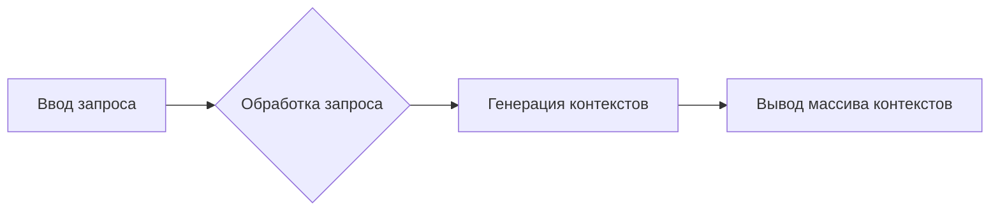

```MD
# Анализ кода generate_person_factory.md

1. **<input code>**

```
Your task is create many contexts that will be used as base to generate a list of persons.
The idea is receive a broad context, with some  details of persons we want to generate, like demographics parameters, physical characteristics, behaviors, believes, etc; and then create many other contexts, more specifics, but derivaded of the more generic one.
Your response must be an array in JSON format. Each element of the array must be a context that will be used to generate a person description.

Example:
  - INPUT:
    Please, generate 3 person(s) description(s) based on the following broad context: Latin American, age between 20 and 40 years old, economic status can vary between poor and rich, it can be religious or not, it can be married or not, it can have children or not, it can be a professional or not, it can be a worker or not
  - OUTPUT:
    ["Mexican person that has formed as lawyer but now works in other are, is single, like sports and movies", "Create a Brazilian person that is a doctor, like pets and the nature and love heavy metal.", "Create a Colombian person that is a lawyer, like to read and drink coffee and is married with 2 children."]
```

2. **<algorithm>**

Этот код не содержит исполняемого алгоритма. Он представляет собой описание задачи для генерации контекстов для создания описаний людей.  Алгоритм будет определяться в коде, который использует этот запрос, а не в самом запросе. Блок-схема невозможна, так как отсутствует код.  Данные передаются в виде текстового запроса и ожидается массив строк в ответ.

3. **<mermaid>**



4. **<explanation>**

Этот код представляет собой описание задачи, а не реализацию алгоритма.  Он определяет необходимый формат ввода (широкий контекст о людях) и ожидаемый формат вывода (массив контекстов для генерации описаний людей).

* **Импорты:** Отсутствуют импорты, так как это не код программы, а описание задачи.

* **Классы:** Отсутствуют классы.

* **Функции:** Отсутствуют функции.

* **Переменные:** Отсутствуют переменные.

* **Возможные ошибки или улучшения:**  Описание задачи не содержит детальной спецификации того, как контексты должны быть сгенерированы. Это открывает для различных способов реализации и потенциальных ошибок.  Необходимо уточнить, как будет обрабатываться "широкий контекст", чтобы исключить неоднозначности при генерации конкретных контекстов.


**Цепочка взаимосвязей с другими частями проекта:**

Этот код является описанием задачи для системы, которая будет генерировать описания людей.  Он предполагает наличие системы, способной обработать запрос и сгенерировать специфические контексты.  Эта система будет связана с другими частями проекта, ответственным за генерацию текста, описание людей, обработку данных и т.д.  Например, если это часть API, то потребуется серверная логика для обработки входящих запросов.  Если это часть чат-бота, то потребуется логика для взаимодействия с пользователем и генерации ответов.