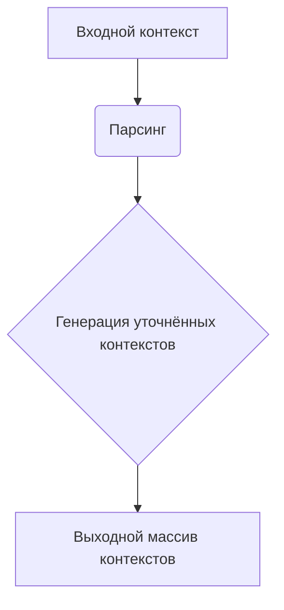

```MD
# Анализ кода generate_person_factory.md

## <input code>

```
Your task is create many contexts that will be used as base to generate a list of persons.
The idea is receive a broad context, with some  details of persons we want to generate, like demographics parameters, physical characteristics, behaviors, believes, etc; and then create many other contexts, more specifics, but derivaded of the more generic one.
Your response must be an array in JSON format. Each element of the array must be a context that will be used to generate a person description.

Example:
  - INPUT:
    Please, generate 3 person(s) description(s) based on the following broad context: Latin American, age between 20 and 40 years old, economic status can vary between poor and rich, it can be religious or not, it can be married or not, it can have children or not, it can be a professional or not, it can be a worker or not
  - OUTPUT:
    ["Mexican person that has formed as lawyer but now works in other are, is single, like sports and movies", "Create a Brazilian person that is a doctor, like pets and the nature and love heavy metal.", "Create a Colombian person that is a lawyer, like to read and drink coffee and is married with 2 children."]
```

## <algorithm>

Этот код представляет собой описание задачи, а не алгоритм в традиционном смысле. Он описывает ожидаемое поведение функции/системы, которая должна генерировать персонализированные текстовые описания людей на основе предоставленного контекста.  Алгоритм работы такой функции не представлен, но ожидается, что она:

1. Принимает на вход строку (broad context) с описанием характеристик человека.
2. Парсит входную строку, выделяя ключевые детали (например, национальность, возраст, профессия, семейное положение).
3. Использует эти детали для генерации нескольких (в примере - 3) более конкретных контекстов (например, "Mexican person that has formed as lawyer but now works in other are").
4. Возвращает массив этих контекстов в формате JSON.

Примеры обработки:

* **Вход:** "Russian, age between 25 and 35, works as a programmer, single"
* **Возможный выход:**  ["Russian programmer living in Moscow, enjoys coding and playing video games, is single", "Russian software developer, lives in St. Petersburg, enjoys hiking, is single"]


## <mermaid>



**Описание диаграммы:**

Диаграмма показывает простой процесс: на вход подается контекст, он анализируется, и на выходе получается массив уточненных контекстов. Подробности обработки в блоке `C` скрыты, так как алгоритм генерации не определен в предоставленном фрагменте.


## <explanation>

**Импорты:**  Нет импортов.  Код представляет собой описание задачи, а не фрагмент кода на каком-либо языке программирования.

**Классы:** Нет классов.

**Функции:** Нет функций.

**Переменные:**  Нет переменных.

**Возможные ошибки/улучшения:**

* Не указан способ генерации. Нужно описать алгоритм преобразования исходного контекста в список описаний.
*  Отсутствует ясность, каким образом парсинг и генерация будет реализована.
* Не определены критерии качества генерируемых описаний.


**Взаимосвязи с другими частями проекта:**

Предполагается, что этот код является частью проекта, который занимается генерацией текста.  Функция, реализующая описанную задачу, будет использоваться другими частями проекта, например, для создания различных текстовых данных.