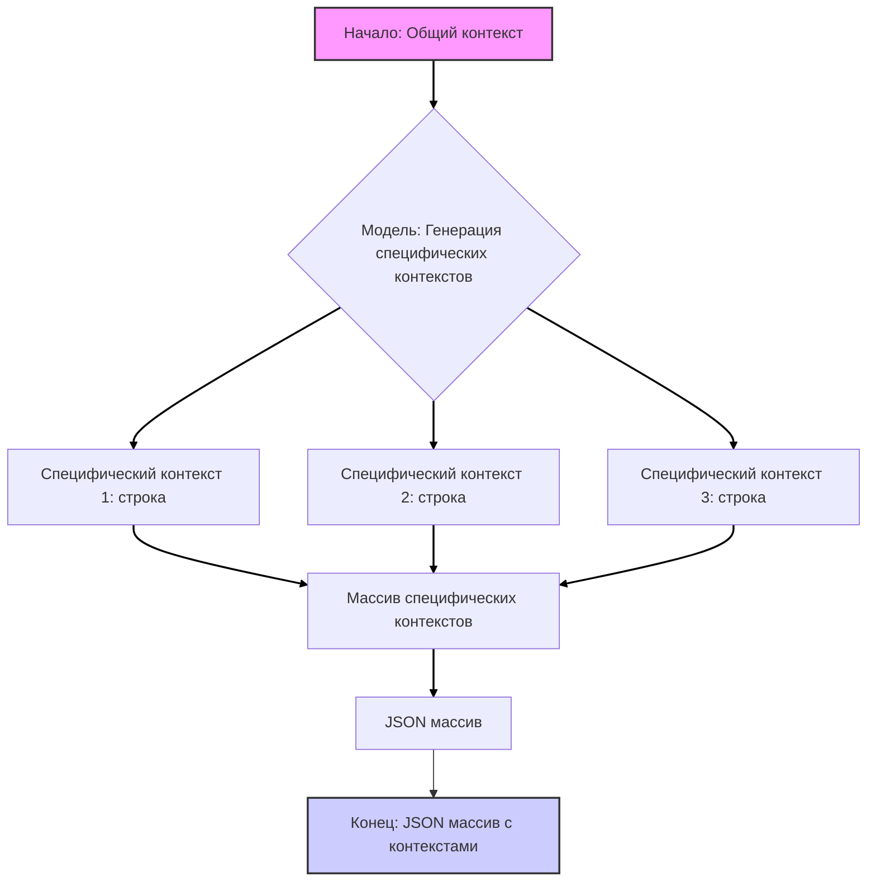

## Анализ кода `generate_person_factory.md`

### 1. `<алгоритм>`

Код представляет собой инструкцию для модели искусственного интеллекта, которая должна генерировать контексты для описаний персонажей. Процесс можно разбить на следующие шаги:

1.  **Получение общего контекста:** Модель получает на вход общий контекст, который описывает общие параметры для группы персонажей, например, демографию, возраст, экономический статус, религиозность и семейное положение.
    *   *Пример:* "Латиноамериканец, возраст 20-40 лет, экономический статус от бедного до богатого, может быть религиозным или нет, может быть женат или нет, может иметь детей или нет, может быть профессионалом или нет, может быть рабочим или нет."

2.  **Генерация нескольких специфических контекстов:** На основе общего контекста модель генерирует несколько (в данном примере 3) более специфичных контекстов. Каждый специфический контекст должен представлять собой описание, которое может быть использовано для генерации описания персонажа.
    *   *Пример 1:* "Мексиканский юрист, который сейчас работает в другой сфере, не женат, любит спорт и кино."
    *   *Пример 2:* "Бразильский врач, любящий домашних животных и природу, а также тяжелый металл."
    *   *Пример 3:* "Колумбийский юрист, любит читать и пить кофе, женат, имеет двоих детей."

3.  **Формирование JSON-массива:** Все сгенерированные специфические контексты собираются в JSON-массив, где каждый элемент массива является строкой, описывающей один контекст.

4.  **Возврат результата:** Модель возвращает JSON-массив с описанием специфических контекстов.

**Пример потока данных:**

```
Общий контекст (строка) --> Модель (генерация специфических контекстов) --> Массив специфических контекстов (строки) --> JSON массив (массив строк) --> Результат (JSON массив)
```

### 2. `<mermaid>`



**Анализ зависимостей:**

*   **Общий контекст:** Входная строка, определяющая общие параметры для генерации персонажей.
*   **Модель:** Искусственный интеллект, ответственный за генерацию специфических контекстов на основе общего контекста.
*   **Специфический контекст:** Строка, описывающая конкретные характеристики одного персонажа, полученная в результате обработки общего контекста моделью.
*   **Массив специфических контекстов:** Массив, содержащий сгенерированные специфические контексты (строки).
*   **JSON массив:** Массив специфических контекстов, представленный в формате JSON.

**Объяснение:**

Диаграмма `mermaid` описывает поток данных, начиная с общего контекста и заканчивая JSON-массивом специфических контекстов. В начале есть входной параметр (общий контекст), который обрабатывается моделью для создания нескольких специфических контекстов. Далее специфические контексты объединяются в массив, который затем преобразуется в JSON массив. Имена переменных осмысленные, описывают назначение каждого шага.

### 3. `<объяснение>`

**Импорты:**

В предоставленном коде нет явных импортов, так как это не код, а инструкция для языковой модели. Предполагается, что модель, выполняющая эту задачу, уже имеет все необходимые инструменты для обработки текста, генерации новых текстов и преобразования их в JSON.

**Классы:**

В данном контексте нет классов, поскольку это инструкция для модели, а не реализация объектно-ориентированного кода.

**Функции:**

В явном виде нет функций, но можно представить, что существует некая функция (или метод), внутри модели, которая принимает общий контекст и возвращает массив специфических контекстов. Эта функция выполняет следующие действия:

1.  **Аргумент:** Общий контекст (строка).
2.  **Возвращаемое значение:** Массив строк, где каждая строка — специфический контекст.
3.  **Назначение:** Генерирует на основе общего контекста, более конкретные контексты для дальнейшего использования при генерации описания персонажей.

**Пример:**

```python
# Псевдокод
def generate_specific_contexts(general_context: str) -> list[str]:
  """
  Генерирует список специфических контекстов на основе общего контекста.
  """
  specific_contexts = []
  #  Логика генерации специфических контекстов на основе general_context
  # (реализуется внутри модели)
  specific_contexts.append("Мексиканский юрист, который сейчас работает в другой сфере, не женат, любит спорт и кино.")
  specific_contexts.append("Бразильский врач, любящий домашних животных и природу, а также тяжелый металл.")
  specific_contexts.append("Колумбийский юрист, любит читать и пить кофе, женат, имеет двоих детей.")
  return specific_contexts
```

**Переменные:**

*   `general_context`: Строка, представляющая общий контекст для генерации персонажей.
*   `specific_contexts`: Массив строк, представляющий сгенерированные специфические контексты.

**Потенциальные ошибки и области для улучшения:**

1.  **Неоднородность контекстов:** Контексты могут получаться слишком похожими или не представлять достаточное разнообразие.  
2.  **Генерация неправдоподобных сочетаний:** Модель может сгенерировать неправдоподобные сочетания характеристик.
3.  **Контроль над разнообразием:** Отсутствует явный механизм для контроля над разнообразием сгенерированных контекстов.

**Цепочка взаимосвязей с другими частями проекта:**

Этот код (инструкция) напрямую связан с частью проекта, которая отвечает за генерацию описаний персонажей.  Сгенерированные специфические контексты используются в качестве основы для создания детальных описаний персонажей.  Вероятно, есть другой модуль или функция, которая принимает эти контексты и генерирует на их основе текст с подробным описанием персонажа.  Возможно, существуют и другие части системы, которые могут использовать эти данные (например, для генерации диалогов персонажей или для построения сюжета).