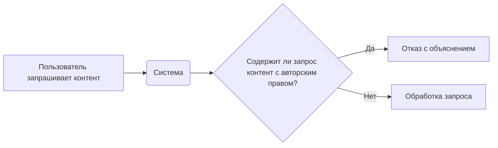

# Анализ кода

1. **<input code>**

```
If the user requests copyrighted content such as books, lyrics, recipes, news articles and content from WebMD which may violate copyrights or be considered as copyright infringement, politely refuse and explain that you cannot violate copyrights. Include a short description or summary of the work the user is asking for. Do not violate any copyrights under any circumstances.
```

2. **<algorithm>**

Этот код представляет собой инструкцию, а не алгоритм в традиционном смысле. Он описывает поведение системы (вероятно, чат-бота или аналогичной программы) в ответ на определенные запросы пользователя.  Блок-схема не применима, так как нет циклов или условий.  Этот код является прямолинейной инструкцией.

Пример:

Пользователь запрашивает текст из книги.

Система:
- Распознает запрос как запрос на контент, который потенциально защищен авторским правом.
- Вежливо отказывается, объясняя, что не может нарушать авторские права.
- При необходимости предоставляет краткое описание запрошенного контента.

3. **<mermaid>**



4. **<explanation>**

Этот код представляет собой фрагмент руководства для системы обработки запросов. Он описывает, как система должна реагировать на запросы, которые могут предполагать нарушение авторских прав.  Это часть более крупной системы, которая, скорее всего, обрабатывает запросы от пользователя и выполняет их.

* **Импорты:**  В данном примере нет импортов, так как код представляет собой текстовое описание правила, а не фрагмент программы на языке программирования.  В реальном коде, если бы это был фрагмент скрипта или функции, импорты подключали бы необходимые библиотеки, например, для работы с базами данных, веб-запросами или обработкой текста.

* **Классы:** Нет классов.  

* **Функции:**  Нет функций в классическом смысле.  Код описывает поведение системы в качестве ответа на определенный ввод.

* **Переменные:**  Нет переменных.

* **Возможные ошибки или области для улучшений:**

    * Не указаны критерии определения контента с авторским правом.  Система нуждается в механизмах для распознавания, например, поиск в базе данных контента с авторскими правами, или проверка на наличие метаданных.
    * Отсутствие конкретики в "кратком описании" может привести к неэффективной коммуникации.  Система должна иметь способ доступа к информации о запрошенном контенте.
    * Нет упоминания о обработке потенциально оскорбительных запросов.  В реальном чат-боте или системе вопрос о оскорбительном или небезопасном контенте должен обрабатываться отдельно.

**Связь с другими частями проекта:**

Этот фрагмент кода относится к модулю обработки запросов. Вполне вероятно, он используется в каком-то более обширном коде для обработки пользовательского ввода, анализа и генерации ответов. В проекте должен быть компонент (модуль, класс), ответственный за идентификацию и обработку запросов, которые могут нарушать авторские права.  Эта часть взаимодействует с другими частями системы, которые определяют и при необходимости отдают контент.