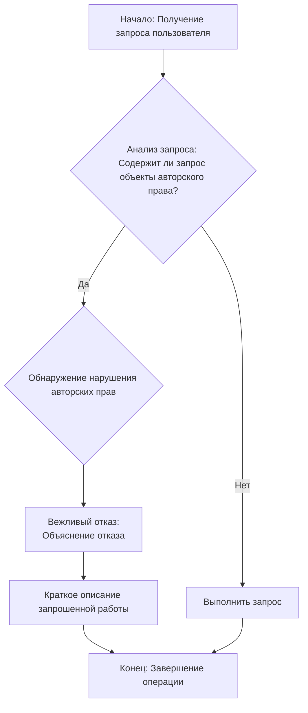

## <алгоритм>

1.  **Получение запроса пользователя:** Пользователь отправляет запрос, содержащий описание контента, который он хотел бы получить.
    *   **Пример:** "Пожалуйста, предоставь мне текст песни 'Bohemian Rhapsody' группы Queen."

2.  **Анализ запроса:** Система анализирует запрос, чтобы определить, содержит ли он упоминания объектов, защищенных авторским правом. Это могут быть книги, тексты песен, рецепты, новостные статьи, контент с WebMD и другие материалы, защищенные авторским правом.
    *   **Пример:** Запрос содержит слова "текст песни" и "Bohemian Rhapsody", что указывает на потенциальное нарушение авторских прав.

3.  **Обнаружение нарушения авторских прав:** Если запрос содержит признаки запроса на защищенный авторским правом контент, система идентифицирует это как потенциальное нарушение.

4.  **Вежливый отказ:** Если обнаружено потенциальное нарушение авторских прав, система вежливо отказывает пользователю в выполнении запроса.
    *   **Пример ответа:** "Извините, я не могу предоставить вам текст песни 'Bohemian Rhapsody', так как это нарушает авторские права. 'Bohemian Rhapsody' - это известная песня группы Queen, защищенная авторским правом."

5.  **Объяснение:** Система объясняет пользователю, почему запрос не может быть выполнен, ссылаясь на необходимость соблюдения авторских прав.

6.  **Краткое описание запрошенного контента:** В ответе предоставляется краткое описание или резюме запрошенной работы, чтобы пользователь понимал, о чем идет речь.
    *   **Пример:** "Я не могу нарушать авторские права. 'Bohemian Rhapsody' - это рок-опера, написанная Фредди Меркьюри, которая известна своим уникальным музыкальным стилем и многослойной структурой."

7.  **Запрет на нарушение авторских прав:** Система строго придерживается правила не нарушать авторские права ни при каких обстоятельствах.

## <mermaid>



**Описание элементов `mermaid` диаграммы:**

*   `A` (Начало: Получение запроса пользователя): Начальная точка процесса, где пользователь вводит свой запрос.
*   `B` (Анализ запроса: Содержит ли запрос объекты авторского права?): Узел принятия решения, где анализируется запрос на наличие потенциальных нарушений авторских прав.
*   `C` (Обнаружение нарушения авторских прав):  Узел, представляющий ситуацию, когда обнаружено потенциальное нарушение авторских прав.
*   `D` (Вежливый отказ: Объяснение отказа):  Узел, представляющий отказ в ответе на запрос и пояснение причины отказа (соблюдение авторских прав).
*   `E` (Краткое описание запрошенной работы):  Узел, где дается краткое описание запрошенного контента, чтобы пользователь знал, о чем идет речь.
*  `G` (Выполнить запрос): Узел, представляющий выполнение запроса пользователя, если он не связан с нарушением авторских прав.
*   `F` (Конец: Завершение операции):  Конечная точка процесса.

## <объяснение>

**Импорты:**
В предоставленном коде нет явных импортов.  Это текстовое описание логики, а не исполняемый код. Если бы это был исполняемый код, могли бы быть импорты, связанные с обработкой текста,  анализом содержимого и другими инструментами, связанными с обработкой текста.

**Классы:**
В данном фрагменте кода нет классов, поскольку это псевдокод, а не  реальный код. Если бы мы реализовывали подобную функциональность на языке программирования, мы, вероятно, использовали бы класс для обработки запросов и отслеживания правил авторских прав.

**Функции:**
В данном примере не используются функции. Однако, если бы это был исполняемый код, можно было бы определить функции для:
   - `analyze_request(user_request)`: для анализа запроса на наличие потенциальных нарушений авторских прав.
   - `provide_polite_refusal(work_description)`: для формирования вежливого отказа и краткого описания запрошенной работы.
   - `is_copyrighted_content(content)`: для проверки, является ли контент объектом авторского права.
   - `execute_request(user_request)`: для выполнения запроса, если он не связан с нарушением авторских прав.
  
  **Примеры использования функций (гипотетически):**
  ```python
    def analyze_request(user_request):
        if is_copyrighted_content(user_request):
            return True # Нарушение авторских прав
        return False # Не является нарушением
    
    def provide_polite_refusal(work_description):
        return f"Извините, я не могу предоставить вам контент. {work_description} является объектом авторского права."
    
    def is_copyrighted_content(content):
         copyrighted_keywords = ["песня", "книга", "статья", "рецепт", "WebMD"]
         for keyword in copyrighted_keywords:
           if keyword in content.lower():
            return True
         return False
    
    def execute_request(user_request):
         print(f"Выполняю запрос: {user_request}")


    user_request = "Пожалуйста, дай мне рецепт торта 'Наполеон'"
    if analyze_request(user_request):
      description = "Рецепт 'Наполеон' защищен авторским правом"
      print(provide_polite_refusal(description))
    else:
        execute_request(user_request)
   ```
  
**Переменные:**
В данном фрагменте кода нет переменных. Но в гипотетическом коде, могут быть такие переменные:
   - `user_request` (string): Текстовый запрос пользователя.
   - `copyrighted_keywords` (list): Список ключевых слов, которые могут указывать на наличие авторских прав.
   - `work_description` (string): Краткое описание запрошенной работы.
   - `is_copyrighted` (bool): Флаг, указывающий, есть ли нарушение авторских прав.

**Потенциальные ошибки и области улучшения:**
   - **Недостаточная детализация проверки авторских прав**: Текущий алгоритм может быть слишком простым и полагаться только на ключевые слова. Для точного определения требуется более сложный анализ текста.
   - **Отсутствие динамического обновления базы данных**: База данных ключевых слов и объектов авторских прав должна регулярно обновляться, чтобы  адекватно обрабатывать все новые запросы.
   - **Недостаточно гибкий отказ**:  Ответ системы должен быть более персонализированным и учитывать контекст запроса.
   - **Нет обработки edge-cases**: Необходимо проработать ситуации, в которых запрос не является прямым копированием, но все равно нарушает авторские права.
   - **Отсутствие логирования**: Для отладки и анализа использования системы необходимо логировать все запросы и результаты их обработки.

**Цепочка взаимосвязей с другими частями проекта:**
Данный фрагмент кода может быть частью большего проекта, например:
-   **AI Assistant:** В этом случае, система предотвращения нарушения авторских прав будет интегрирована в  сервис обработки запросов пользователей. Она будет работать как  фильтр, который анализирует запросы перед тем, как AI Assistant отвечает на них.
-   **Контроль контента:** Если проект связан с генерацией или обработкой контента, эта система может использоваться для проверки  всего контента на наличие нарушений авторских прав перед его публикацией.
-   **Система модерации:** В рамках системы модерации контента этот механизм может проверять запросы и  пользовательский контент, чтобы избежать нарушений.

Эта система предотвращения нарушений авторских прав важна для того, чтобы  сервис или приложение соответствовали законодательству в сфере авторских прав. Она помогает защитить права авторов контента и избежать потенциальных юридических проблем.