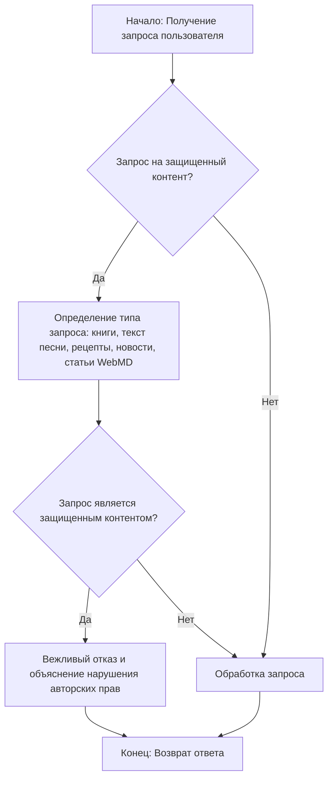
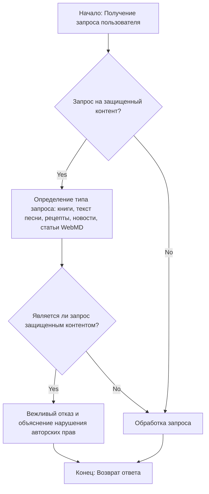

## АНАЛИЗ КОДА:

### 1. <алгоритм>

**Блок-схема:**

**Примеры:**

*   **Пример 1 (Защищенный контент):**
    *   **Вход:** "Напиши текст песни «Yesterday» The Beatles."
    *   **Блок B:** Запрос распознается как "текст песни", значит "Да".
    *   **Блок C:** Определяется как защищенный контент (текст песни).
    *   **Блок D:** Запрос считается нарушающим авторские права, "Да".
    *   **Блок E:** "Мне очень жаль, но я не могу предоставить текст песни «Yesterday» The Beatles, так как это защищено авторскими правами. Эта песня известна как классическая работа группы The Beatles."
    *   **Блок G:** Завершение с отказным ответом.

*   **Пример 2 (Не защищенный контент):**
    *   **Вход:** "Расскажи об истории Древнего Рима."
    *   **Блок B:** Запрос не связан с защищенным контентом, значит "Нет".
    *   **Блок F:** Запрос отправляется на обработку.
    *   **Блок G:** Завершение с ответом.

### 2. <mermaid>

**Анализ `mermaid`:**

Диаграмма иллюстрирует последовательность действий, которую выполняет система при получении запроса пользователя.

1.  **`Start`**: Начало процесса, где система принимает запрос пользователя.
2.  **`IsCopyrighted`**: Логический блок, проверяющий, запрашивает ли пользователь контент, который потенциально может нарушить авторские права.
3.  **`IdentifyRequestType`**: Если запрос относится к потенциально защищенному контенту, система определяет конкретный тип запроса (книги, тексты песен и т.д.).
4.  **`IsRequestCopyrighted`**: Проверяет, относится ли запрос к защищенному контенту.
5.  **`RefuseRequest`**: В случае нарушения авторских прав система вежливо отказывает в запросе, объясняя причину.
6.  **`ProcessRequest`**: Если запрос не нарушает авторских прав, он отправляется на обработку.
7.  **`End`**: Конец процесса, когда система отправляет ответ пользователю.

### 3. <объяснение>

**Импорты:**

*   В данном коде нет импортов.

**Классы:**

*   В данном коде нет классов.

**Функции:**

*   В данном коде нет функций.

**Переменные:**

*   В данном коде нет переменных.

**Объяснение:**

Данный код представляет собой логику обработки запросов пользователя в контексте предотвращения нарушения авторских прав. Основная цель кода - вежливо отказать пользователю в случае запроса защищенного контента (такого как книги, тексты песен, рецепты и т.д.) и при этом объяснить причину отказа.

**Работа:**

1.  **Получение запроса:** Код начинает с получения запроса пользователя.
2.  **Проверка на защищенный контент:** Далее проверяется, не запрашивает ли пользователь контент, защищенный авторским правом.
3.  **Определение типа запроса:** Если запрос потенциально нарушает авторские права, система пытается определить его конкретный тип.
4.  **Подтверждение нарушения:** Система убеждается, относится ли запрос к защищенному контенту.
5.  **Вежливый отказ:** В случае, если запрос действительно нарушает авторские права, система отказывает в выполнении запроса и объясняет причину отказа. Также, приводится краткое описание запрошенного контента.
6.  **Обработка:** В противном случае, когда запрос не связан с защищенным контентом, он отправляется на обработку.

**Потенциальные проблемы и области для улучшения:**

1.  **Распознавание защищенного контента:** Алгоритм полагается на ключевые слова (книги, тексты песен, рецепты, новости, статьи WebMD).  Он может не всегда точно распознать защищенный контент.  Нужно добавить более продвинутые методы распознавания.
2.  **Объяснение отказа:** Отказ пользователю достаточно общий и может быть более персонализированным. Например, можно предоставить альтернативные варианты, не нарушающие авторские права, или указать, где можно легально получить доступ к нужному контенту.
3.  **Логирование:** Для отладки и улучшения алгоритма было бы полезно вести лог запросов и ответов.
4.  **Обработка контекста:** Алгоритм не учитывает контекст. Если пользователь делает запрос, который лишь косвенно касается защищенного контента, он может быть неверно классифицирован.

**Цепочка взаимосвязей с другими частями проекта:**

Этот код представляет собой часть системы, которая занимается обработкой запросов пользователя и предотвращением нарушения авторских прав. Он может быть интегрирован в более крупную систему, где есть различные модули, которые обрабатывают запросы, отправляют ответы пользователю и управляют взаимодействием с пользователем.

В заключении, данный код демонстрирует базовую логику обработки запросов с учетом авторских прав. Для более сложной системы потребуется дальнейшая доработка, чтобы обеспечить точность и корректность работы.