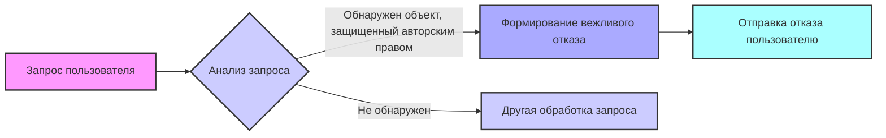

## Анализ кода: предотвращение нарушения авторских прав

### <алгоритм>

1. **Получение запроса пользователя**: На вход поступает запрос пользователя в текстовой форме.
    *   **Пример**: "Напиши мне текст песни 'Yesterday' группы The Beatles."
2. **Анализ запроса**: Запрос анализируется на предмет наличия в нем упоминаний объектов, защищенных авторским правом. Это могут быть книги, тексты песен, рецепты, новостные статьи, контент с сайта WebMD и т.д.
    *   **Пример**: В запросе "Напиши мне текст песни 'Yesterday' группы The Beatles" обнаруживается упоминание текста песни, защищенного авторским правом.
    *   **Пример**: В запросе "Дай мне рецепт торта 'Наполеон'" обнаруживается упоминание рецепта, который может быть защищен авторским правом.
3. **Проверка наличия объектов, защищенных авторским правом**: Если в запросе обнаружены объекты, защищенные авторским правом, то выполняется следующий шаг, иначе запрос обрабатывается другим способом (не описанным в данном фрагменте кода).
4. **Формирование вежливого отказа**: Формируется вежливый отказ, который объясняет пользователю, что запрос не может быть выполнен, так как он нарушает авторские права.
    *   **Пример**: "К сожалению, я не могу предоставить текст песни 'Yesterday', так как это нарушает авторские права. 'Yesterday' - известная песня группы The Beatles, написанная Полом Маккартни."
    *   **Пример**: "Извините, но я не могу предоставить рецепт торта 'Наполеон'. Рецепты также могут быть защищены авторским правом. Торт 'Наполеон' - это популярный многослойный торт."
5. **Отправка отказа пользователю**: Сформированный отказ отправляется пользователю в качестве ответа.

### <mermaid>

**Зависимости:**

*   Нет явных зависимостей от импортируемых модулей. Это текстовое описание логики, а не код.

**Описание переменных в mermaid:**

*   `Запрос пользователя` - Входящий запрос от пользователя в текстовом формате.
*   `Анализ запроса` -  Процесс анализа запроса для выявления упоминаний объектов, защищенных авторским правом.
*   `Формирование вежливого отказа` - Процесс формирования вежливого сообщения об отказе с объяснением причины.
*   `Другая обработка запроса` - Обозначает обработку запроса, если в нем не найдены защищенные авторским правом объекты.
*   `Отправка отказа пользователю` - Отправка сформированного отказа пользователю.

### <объяснение>

**Импорты:**

*   В данном коде отсутствуют явные импорты, так как это текстовое описание логики, а не исполняемый код на Python.

**Классы:**

*   Отсутствуют классы, так как это описание логики, а не объектно-ориентированный код.

**Функции:**

*   Функции в явном виде не представлены, но можно выделить логические блоки как функции:
    1. `analyze_user_request(request)`: Принимает запрос пользователя и анализирует его на наличие упоминаний авторских прав.
    2. `create_rejection_message(request)`: Принимает запрос пользователя, определяет тип объекта, защищенного авторским правом, и формирует вежливое сообщение об отказе.
    3. `send_rejection_message(message)`: Отправляет сгенерированное сообщение пользователю.

**Переменные:**

*   `request` (тип: string) - Запрос пользователя.
*   `message` (тип: string) - Сообщение об отказе.

**Подробное объяснение:**

Данный фрагмент представляет собой инструкцию для модели ИИ, описывающую, как она должна обрабатывать запросы пользователей, связанные с контентом, защищенным авторским правом.  Основная цель - предотвратить нарушения авторских прав путем анализа запросов пользователей и вежливого отказа в случае обнаружения таких нарушений.

**Цепочка взаимосвязей с другими частями проекта:**

Этот фрагмент кода является частью системы обработки пользовательских запросов.  Он интегрирован в цепочку обработки запросов до того, как запрос будет передан основной модели ИИ.  Цепочка выглядит следующим образом:

1.  **Получение запроса от пользователя**.
2.  **Проверка на наличие нарушений авторских прав** (текущий код).
3.  **Обработка запроса основной моделью ИИ** (если не выявлено нарушений авторских прав).
4.  **Ответ пользователю**.

**Потенциальные ошибки и области для улучшения:**

1.  **Сложность анализа**: Анализ запроса на наличие объектов авторского права может быть сложным. Необходимо использовать NLP техники, такие как named entity recognition и классификация текста, для более точного определения.
2.  **Неполный список**: Текущий список (книги, песни, рецепты, новости, WebMD) неполный. Следует добавить другие виды защищенного контента.
3.  **Гибкость сообщений**: Сообщения об отказе могут быть более разнообразными и зависеть от типа объекта авторского права.
4.  **Обучение модели**: Модель ИИ должна быть обучена распознавать различные формулировки запросов, содержащих объекты авторского права.
5.  **Обход защиты**: Пользователи могут попытаться обойти защиту, формулируя запросы в неявном виде.  Необходимы дополнительные механизмы защиты.
6.  **Многоязычность**: Система должна поддерживать анализ запросов на разных языках.
7.  **Обновление**: Список защищенного контента и способов его распознавания должен постоянно обновляться.

В целом, данный фрагмент представляет собой базовую инструкцию для предотвращения нарушений авторских прав. Для эффективной реализации необходимо усовершенствовать механизмы анализа запросов и расширить перечень защищенного контента.