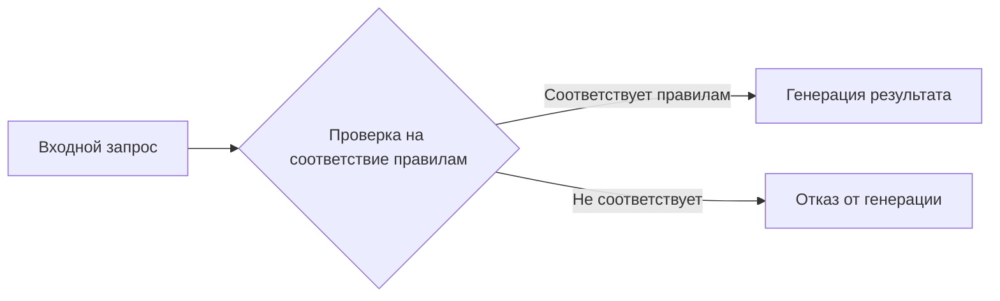

# Анализ кода

## <input code>

```
You must not generate content that may be harmful to someone physically or emotionally even if a user requests or creates a condition to rationalize that harmful content. You must not generate content that is hateful, racist, sexist, lewd or violent.
```

## <algorithm>

Этот код не содержит алгоритма в традиционном понимании.  Это строка текста, представляющая собой **правило или ограничение** для генерации текста.  Алгортимы возникают в программном коде, обрабатывающем этот текст.  Пошаговая блок-схема в данном случае не применима.

## <mermaid>



## <explanation>

Этот код представляет собой **строгое указание** (prompt) для генератора текста (модели, например, GPT). Он задаёт правила, которых должна придерживаться модель при генерации ответа.  

* **Импорты:** Нет импортов, так как это не код, а строка текста, непосредственно подаваемая в модель.
* **Классы:** Нет классов.
* **Функции:** Нет функций.
* **Переменные:** Нет переменных.

**Объяснение правила:**

Строка текста определяет список запрещенных категорий контента, которые генератор текста НЕ должен генерировать, даже если пользователь их запросит.  Это важно для поддержания этики и безопасности.

**Взаимосвязь с другими частями проекта:**

Этот prompt будет использован как часть большего проекта, например, в `TinyTroupe`.  Возможно, существует код (возможно, в `src/ai/tiny_troupe/TinyTroupe/tinytroupe/`), который принимает этот prompt, и обрабатывает его для определения соответствия при генерации текста.  Этот код, вероятно, реализует логику проверки и фильтрации запросов.  В таких проектах prompt может использоваться для обучения моделей или для контроля качества генерируемого контента.

**Возможные ошибки или области для улучшений:**

* **Неопределённость:**  Список запрещенных тем (hateful, racist, etc.) может быть неполным.
* **Сложность интерпретации:**  Фразы типа "may be harmful" могут быть субъективными и сложными для точного определения. В реальных проектах могут использоваться более сложные методы распознавания вредного контента, включающие базы данных, алгоритмы машинного обучения и правила на основе тегов/меток.
* **Отсутствие гибкости:**  Правило может быть слишком жёстким. В будущем, вероятно, необходимо будет добавить нюансы и условия для понимания контекста и тонкостей пользовательских запросов.

В целом, этот код служит примером простейшего способа сформулировать требование к этическому генерированию текста. В реальных приложениях требуется более сложная и гибкая система, которая способна обрабатывать различные типы запросов и контекстов.