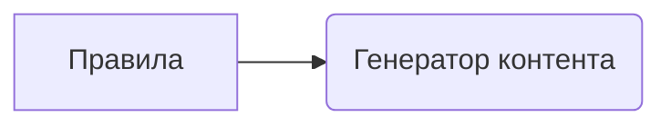

# Анализ кода

**1. <input code>**

```
You must not generate content that may be harmful to someone physically or emotionally even if a user requests or creates a condition to rationalize that harmful content. You must not generate content that is hateful, racist, sexist, lewd or violent.
```

**2. <algorithm>**

Этот код не содержит алгоритма в традиционном понимании. Он представляет собой строку текста, задающую правила для генератора контента,  описывающую набор ограничений, которым должен следовать генератор.  Блок-схема в данном случае не применима.

**3. <mermaid>**



**4. <explanation>**

Этот фрагмент кода - это *строгое* правило, не содержащее логики или структуры данных в традиционном смысле.  Он определяет набор ограничений для генератора контента. 

* **Цель:**  Предотвращение генерации вредного контента.
* **Описание:** Код содержит список запрещенных категорий контента:  вредный, ненавистнический, расистский, сексистский, вульгарный и насильственный. 
* **Применение:** Данное правило будет использоваться в какой-то системе обработки естественного языка или генерации текста (например, в `TinyTroupe`) для проверки генерируемого текста. Система будет отбрасывать любые тексты, нарушающие эти правила.

**Взаимосвязь с другими частями проекта:**

В `TinyTroupe` эта строка, скорее всего, будет частью конфигурационного файла, файла с инструкциями, или встроенного в систему фильтра.  Этот код будет проверять генерируемый текст на соответствие правилам *до* его выдачи пользователю.  

**Возможные ошибки и улучшения:**

* **Недостаточная точность:** Перечень категорий, вероятно, не исчерпывающий.  Сложные формы оскорблений,  скрытый расизм, или другие нюансы могут остаться незамеченными.
* **Необходимость адаптации:**  Это правило  может быть недостаточно гибким для разных контекстов. Необходимо учитывать различные нюансы и оттенки языка.
* **Нет механизма проверки:**  Сам по себе этот код не выполняет проверки. Он лишь описывает правила.  Необходима реализация логики, которая проверяет генерируемый текст на соответствие этим правилам.
* **Многоязычие:**  Правило написанно на английском языке, но система может работать с другими языками.

**Заключение:**

Этот фрагмент кода представляет собой несложную, но важную часть процесса фильтрации контента.  Важно понимать, что для полноценной системы контроля контента необходимо более полное и детальное описание правил, а также механизм их проверки.