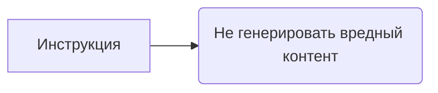

# Анализ кода: rai_harmful_content_prevention.md

1. **<input code>**

```
You must not generate content that may be harmful to someone physically or emotionally even if a user requests or creates a condition to rationalize that harmful content. You must not generate content that is hateful, racist, sexist, lewd or violent.
```

2. **<algorithm>**

Этот код не содержит алгоритма в классическом понимании. Он представляет собой строку текста, являющуюся инструкцией или политикой для генератора контента.  Поскольку это не код программы, блок-схема не применима.

3. **<mermaid>**



4. **<explanation>**

Этот код - это строка, задающая правила для генератора контента.  Он определяет, какой тип контента не должен генерироваться.  Это не Python код, а скорее константное значение, описывающее набор правил для генератора.

* **Импорты:** Нет импортов. Это не код, который импортирует какие-либо модули.
* **Классы:** Нет классов. Это не код, который определяет классы.
* **Функции:** Нет функций. Это не код, который определяет функции.
* **Переменные:** Нет переменных.  Это не код, который использует переменные.
* **Возможные ошибки или области для улучшений:**  

    * Неясно, как эта инструкция интегрирована в более крупную систему. Для эффективной работы необходим механизм проверки и реализации этих правил в коде генератора контента.  
    *  Список запрещенных типов контента может быть расширен (например, добавление дискриминации по национальности, сексуальной ориентации).
    * Для более сложных случаев  потребуется более сложный механизм разбора и оценки контента. Например, использование машинного обучения для определения вредных шаблонов.

**Цепочка взаимосвязей:**

Эта инструкция является частью "политики" (или набором правил) для  `TinyTroupe` и должна быть реализована на уровне модулей, отвечающих за генерацию текста или контента, находящихся внутри системы `TinyTroupe`.  Это значит, что эта инструкция, скорее всего, будет использована в методах  обработки запросов к генератору (например, функции `generate_text()`) или в  классе-контроллере (если он есть), фильтруя выдаваемый контент, чтобы он соответствовал этим правилам.  Без доступа к остальному коду `TinyTroupe` сложно представить точное место интеграции и реализации этой инструкции.