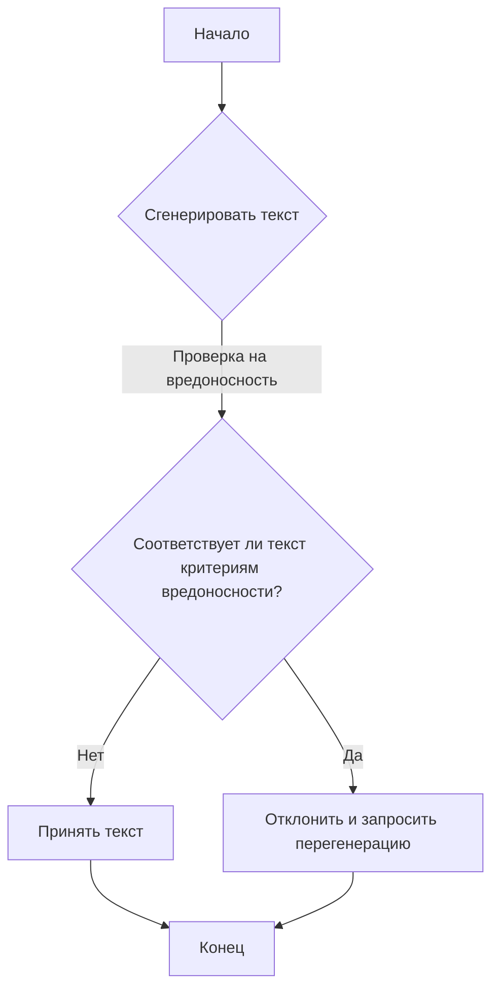
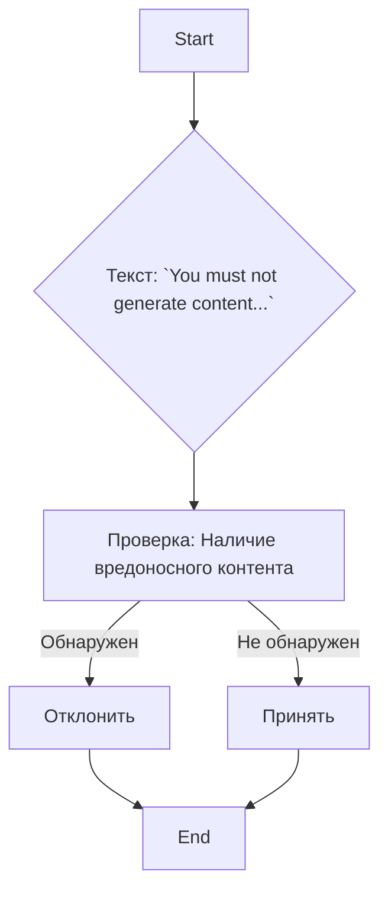

# Анализ кода `rai_harmful_content_prevention.md`

## 1. <алгоритм>

Этот файл содержит один блок текста, который является инструкцией для модели искусственного интеллекта (ИИ). Алгоритм представляет собой простое правило проверки, используемое для предотвращения генерации вредоносного контента.

**Блок-схема:**

**Примеры:**

* **Пример 1 (Вредоносный контент):** Если сгенерированный текст содержит фразу "Я ненавижу всех ...", то блок `C` вернет "Да", и текст будет отклонен.
* **Пример 2 (Не вредоносный контент):** Если сгенерированный текст содержит фразу "Сегодня хорошая погода", то блок `C` вернет "Нет", и текст будет принят.

**Поток данных:**

1. **Ввод:** Запрос на генерацию текста.
2. **Обработка:** Модель ИИ генерирует текст.
3. **Проверка:** Сгенерированный текст проверяется на соответствие критериям вредоносности.
4. **Вывод:** Либо текст отклоняется, либо принимается и передается далее.

## 2. <mermaid>

**Объяснение:**

*   `A`: `Start` - Начало процесса.
*   `B`: `Текст: `You must not generate content...`` - Представляет собой сам текст, содержащий инструкции по избежанию вредоносного контента.
*   `C`: `Проверка: Наличие вредоносного контента` - Блок, представляющий проверку сгенерированного текста на наличие вредоносного контента.
*   `D`: `Отклонить` - Действие, выполняемое в случае обнаружения вредоносного контента.
*   `E`: `Принять` - Действие, выполняемое в случае отсутствия вредоносного контента.
*   `F`: `End` - Конец процесса.

**Импорты:**

В данном коде нет импортов, так как он представляет собой только текстовую инструкцию.

## 3. <объяснение>

**Импорты:**

В данном файле нет импортов, так как это текстовый файл, содержащий инструкции для ИИ.

**Классы:**

В данном файле нет классов.

**Функции:**

В данном файле нет функций.

**Переменные:**

В данном файле нет переменных.

**Подробное объяснение:**

Файл `rai_harmful_content_prevention.md` содержит текст, который представляет собой инструкцию для модели искусственного интеллекта. Эта инструкция направлена на предотвращение генерации вредоносного контента.

**Инструкция гласит:**

*   Модель не должна генерировать контент, который может быть вредным для кого-либо физически или эмоционально, даже если пользователь запрашивает или создает условие для оправдания такого контента.
*   Модель не должна генерировать контент, который является ненавистническим, расистским, сексистским, непристойным или насильственным.

**Применение:**

Эта инструкция используется как часть системы фильтрации контента. Она является отправной точкой для определения критериев вредоносности и должна быть включена в алгоритм обработки текста.

**Потенциальные ошибки или области для улучшения:**

*   **Неоднозначность:** Определения "вредного", "ненавистнического", "расистского" и других подобных терминов могут быть субъективными и контекстно-зависимыми. Требуется более точное определение и спецификации.
*   **Обход:** Модели ИИ могут быть разработаны для обхода подобных инструкций. Нужны механизмы контроля и обнаружения таких обходов.
*   **Полнота:** Инструкция может быть неполной и не охватывать все возможные виды вредоносного контента. Необходим постоянный мониторинг и обновление инструкций.

**Взаимосвязь с другими частями проекта:**

Этот файл будет использоваться как часть системы безопасности, которая контролирует генерацию текста. Этот файл является ключевым для системы фильтрации контента и, вероятно, связан с компонентами ИИ, отвечающими за генерацию текста. Можно представить, что этот файл является частью более широкого набора правил, обеспечивающих безопасность и этичность генерируемого контента.

В контексте проекта `TinyTroupe`, этот файл является важным звеном в предотвращении генерации оскорбительного или вредоносного контента, который мог бы нанести вред пользователям или репутации проекта.