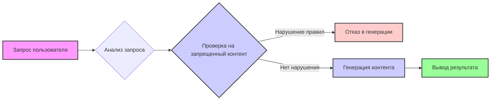

# Анализ кода: rai_harmful_content_prevention.md

## <алгоритм>

Этот код представляет собой текстовое описание в формате Markdown, которое задаёт правила для системы генерации контента. Алгоритмически, этот "код" не выполняет никаких действий, а является набором ограничений, которые должна учитывать система. Его можно представить в виде следующих шагов:

1. **Получение запроса пользователя:** Система получает запрос от пользователя на генерацию контента.
   *Пример:* Пользователь запрашивает "написать рассказ про гонки".

2. **Анализ запроса:** Система анализирует запрос и извлекает из него ключевые слова и намерения пользователя.
   *Пример:* Система определяет, что речь идет о "рассказе" и "гонках".

3. **Проверка на запрещенный контент:** Система проверяет, не приведет ли генерация контента, основанного на запросе, к нарушению правил, описанных в данном файле.
    *Пример:*
        *   Запрос: "написать о ненависти к какой-либо нации" - вызовет нарушение правил.
        *   Запрос: "написать рассказ о жестоком обращении" - вызовет нарушение правил.
        *   Запрос: "описать драку" - вызовет нарушение правил, т.к. может считаться потенциально жестоким контентом.
        *   Запрос: "написать рассказ о гонках" - скорее всего не вызовет нарушения, если не будет описано что-то жестокое или ненавистное.

4. **Генерация контента (если не найдено нарушений):** Если проверка не выявила нарушений, система генерирует контент в соответствии с запросом пользователя.
   *Пример:* Система генерирует рассказ о гонках, избегая описаний насилия, ненависти, расизма и т.д.

5. **Вывод результата:** Система выводит сгенерированный контент пользователю.
   *Пример:* Пользователь получает рассказ о гонках.

В данном случае, файл `.md` работает как **список правил**.  Система проверяет, не нарушает ли предполагаемый контент эти правила. Если есть нарушение, контент не создается или создается с применением фильтров.

## <mermaid>

**Описание диаграммы:**

Диаграмма представляет процесс обработки запроса пользователя и проверки его на соответствие ограничениям.

*   **A [Запрос пользователя]:** Начальная точка процесса, где пользователь вводит запрос на генерацию контента.
*   **B {Анализ запроса}:**  Блок, представляющий анализ запроса пользователя, где система извлекает ключевые слова и намерения.
*   **C {Проверка на запрещенный контент}:**  Условный блок, где происходит проверка соответствия запроса правилам, описанным в `rai_harmful_content_prevention.md`.
*   **D [Отказ в генерации]:** Блок, представляющий ситуацию, когда запрос нарушает правила, и генерация контента не происходит.
*   **E [Генерация контента]:**  Блок, представляющий процесс генерации контента, если проверка не выявила нарушений.
*   **F [Вывод результата]:**  Конечная точка процесса, где сгенерированный контент предоставляется пользователю.

**Зависимости:**

Диаграмма иллюстрирует поток данных и управление процессом: запрос пользователя (A) и далее идет пошаговое выполнение необходимых процессов (B,C,D/E,F).  Диаграмма не имеет импортов в классическом смысле, так как это визуализация логики, а не программный код.

## <объяснение>

**Импорты:**

Данный файл не содержит импортов, так как это текстовое описание, а не программный код.

**Классы:**

В данном файле нет классов.

**Функции:**

В данном файле нет функций.

**Переменные:**

В данном файле нет переменных.

**Объяснение:**

Этот файл `rai_harmful_content_prevention.md` определяет **правила фильтрации контента**, которые должна соблюдать система генерации текста. Он задает перечень ограничений, связанных с вредным контентом. Файл предназначен для того, чтобы гарантировать, что сгенерированный контент не будет:

*   Физически вредным для кого-либо.
*   Эмоционально вредным для кого-либо.
*   Ненавистным.
*   Расистским.
*   Сексистским.
*   Непристойным.
*   Жестоким.

**Потенциальные ошибки и области для улучшения:**

*   **Неопределенность:**  Текстовое описание может быть недостаточно конкретным. Некоторые термины, такие как "эмоционально вредным", могут быть интерпретированы по-разному. Это может привести к неконсистентному поведению системы генерации.
*   **Обход ограничений:**  Пользователи могут попытаться обойти эти ограничения, используя эвфемизмы или косвенные намеки. Система должна быть достаточно умной, чтобы распознавать такие попытки.
*   **Отсутствие конкретики:** Было бы лучше расширить список запрещенных тем, включив в него более конкретные примеры и сценарии.

**Цепочка взаимосвязей с другими частями проекта:**

Этот файл является частью системы генерации контента. Он напрямую взаимодействует с:

1.  **Модулем анализа запросов:** Модуль анализирует запрос пользователя и извлекает его намерения.
2.  **Модулем фильтрации контента:** Модуль использует правила, описанные в этом файле, для проверки сгенерированного контента на соответствие ограничениям.
3.  **Модулем генерации контента:** Модуль генерирует контент, основываясь на запросе и после проверки на соблюдение ограничений.

Этот файл играет **ключевую роль в обеспечении безопасности и этичности** создаваемого контента.  Он является одним из основных компонентов системы фильтрации.