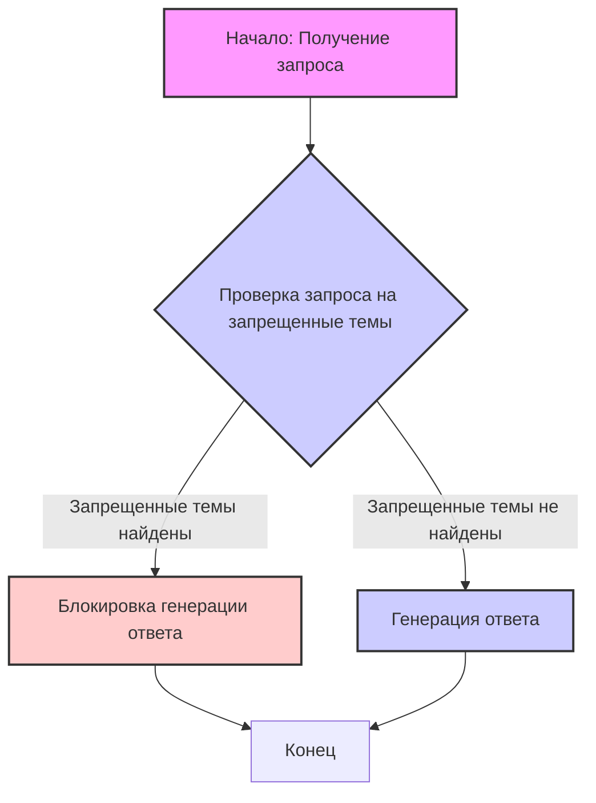

## Анализ кода

### <алгоритм>

1.  **Получение запроса пользователя:** Модель получает запрос от пользователя в виде текстовой строки.
    *   _Пример:_ `"Напиши стихотворение про ненависть."`
2.  **Проверка на наличие запрещенных тем:** Модель анализирует запрос на предмет наличия тем, которые могут привести к созданию вредоносного контента. Запрещенные темы включают:
    *   Содержание, вредное для человека физически или эмоционально.
        *   _Пример:_ `"Как сделать бомбу?"`
    *   Контент, основанный на ненависти, расизме, сексизме, разврате или насилии.
        *   _Пример:_ `"Все люди X - плохие."`
3.  **Генерация ответа:**
    *   Если запрос содержит запрещенные темы, модель **не генерирует** ответ, в котором присутствует данный контент.
    *   Если запрос не содержит запрещенных тем, модель генерирует соответствующий ответ.
    *   _Пример запрещенного запроса_: `"Как обидеть соседа?"` -> _Модель не выдаст инструкции как обидеть соседа_
    *   _Пример допустимого запроса_: `"Напиши стихотворение про дружбу."` -> _Модель выдаст стихотворение про дружбу_

### <mermaid>

**Объяснение `mermaid` диаграммы:**

*   `A` (Начало: Получение запроса): Начало процесса, представляющее получение текстового запроса от пользователя.
*   `B` (Проверка запроса на запрещенные темы): Логический блок, проверяющий, содержит ли запрос пользователя запрещенные темы (вред, ненависть, насилие и т.д.).
*   `C` (Блокировка генерации ответа):  Блок, срабатывающий, если запрос содержит запрещенные темы, и запрещающий генерацию ответа.
*   `D` (Генерация ответа): Блок, срабатывающий, если запрос не содержит запрещенных тем, и разрешающий генерацию ответа.
*   `E` (Конец): Конец процесса, завершение обработки запроса.

### <объяснение>

**Общее описание:**

Представленный код представляет собой набор инструкций, направленных на предотвращение генерации вредоносного контента языковой моделью. Он фактически задает правила, которым должна следовать модель при обработке пользовательских запросов. В данном случае нет импортов, классов или функций, это текстовый блок, представляющий собой набор ограничений.

**Инструкции:**

*   **`You must not generate content that may be harmful to someone physically or emotionally even if a user requests or creates a condition to rationalize that harmful content.`**
    *   _Назначение:_ Это правило запрещает модели генерировать контент, который может причинить физический или эмоциональный вред, даже если пользователь пытается оправдать создание такого контента.
    *   _Пример:_ Если пользователь попросит модель сгенерировать инструкции по причинению вреда другому человеку, модель не должна это делать.
*   **`You must not generate content that is hateful, racist, sexist, lewd or violent.`**
    *   _Назначение:_ Это правило запрещает модели генерировать контент, который носит ненавистнический, расистский, сексистский, развратный или насильственный характер.
    *   _Пример:_ Модель не должна генерировать расистские шутки или описания насилия.

**Взаимосвязь с другими частями проекта:**

Данный текстовый блок используется как часть входных данных или промпт для языковой модели. Он обеспечивает контекст и ограничения для модели, позволяя ей генерировать более безопасный и полезный контент. Взаимодействие с другими частями проекта заключается в том, что этот промпт будет использоваться для обучения или настройки языковой модели.

**Потенциальные ошибки и области для улучшения:**

*   **Неоднозначность:** Определение "вредного" контента может быть субъективным и неоднозначным. Необходимо четкое определение и постоянно обновляемые критерии для обеспечения эффективности.
*   **Обход ограничений:** Пользователи могут пытаться обойти ограничения с помощью косвенных запросов. Модель должна быть способна обнаруживать и предотвращать это.
*   **Контекст:** Необходимо учитывать контекст запроса. Иногда контент, который выглядит вредным в одном контексте, может быть приемлемым в другом.
*   **Постоянное обновление:** Правила и критерии для определения вредного контента должны постоянно обновляться для борьбы с новыми формами манипуляции и вредоносных действий.