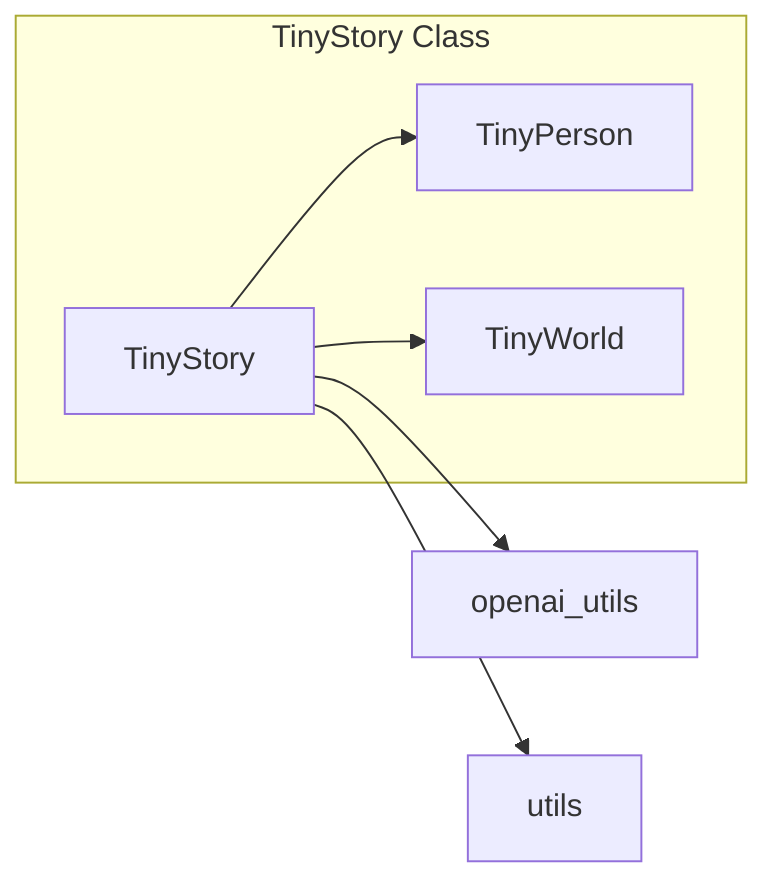

# Анализ кода модуля `story.py`

## <input code>

```python
"""
Every simulation tells a story. This module provides helper mechanisms to help with crafting appropriate stories in TinyTroupe.
"""

from typing import List
from tinytroupe.agent import TinyPerson
from tinytroupe.environment import TinyWorld
import tinytroupe.utils as utils
from tinytroupe import openai_utils

class TinyStory:

    def __init__(self, environment:TinyWorld=None, agent:TinyPerson=None, purpose:str="Be a realistic simulation.", context:str="",
                 first_n=10, last_n=20, include_omission_info:bool=True) -> None:
        # ... (остальной код __init__)
    
    def start_story(self, requirements="Start some interesting story about the agents.", number_of_words:int=100, include_plot_twist:bool=False) -> str:
        # ... (остальной код start_story)
    
    def continue_story(self, requirements="Continue the story in an interesting way.", number_of_words:int=100, include_plot_twist:bool=False) -> str:
        # ... (остальной код continue_story)

    def _current_story(self) -> str:
        # ... (остальной код _current_story)
```

## <algorithm>

**Блок-схема `TinyStory`:**

```mermaid
graph TD
    A[__init__(environment, agent, ...)] --> B{Проверка environment/agent};
    B -- environment или agent --> C[Сохранение environment/agent];
    B -- Ни одного --> D[Ошибка: должно быть одно из environment/agent];
    C --> E[Сохранение purpose, context, first_n, last_n];
    E --> F[self.current_story = context];
    F --> G[Возврат];
    
    H[start_story(requirements, ...)] --> I[Составление rendering_configs];
    I --> J[Создание сообщений для LLM];
    J --> K[Отправка сообщения в openai_utils];
    K --> L[Получение ответа];
    L --> M[Добавление в self.current_story];
    M --> N[Возврат start];

    O[continue_story(requirements, ...)] --> I;
    O --> N;
    
    P[_current_story()] --> Q{self.agent/environment не None?};
    Q -- True --> R[Создание interaction_history];
    Q -- False --> S[interaction_history = ""];
    R --> T[Добавление interaction_history в self.current_story];
    T --> U[Возврат self.current_story];
    S --> U;
```

**Примеры данных:**

* `environment`: Объект `TinyWorld` описывающий среду.
* `agent`: Объект `TinyPerson` описывающий агента.
* `purpose`: Строка "Описать взаимодействие агентов".
* `context`: Начальный контекст истории (пустая строка по умолчанию).
* `requirements`: Требования к истории.


## <mermaid>



## <explanation>

**Импорты:**

* `from tinytroupe.agent import TinyPerson`: Импортирует класс `TinyPerson` из модуля `tinytroupe.agent`. Предполагается, что он описывает агентов в моделировании.
* `from tinytroupe.environment import TinyWorld`: Импортирует класс `TinyWorld` из модуля `tinytroupe.environment`. Предполагается, что он описывает среду моделирования.
* `import tinytroupe.utils as utils`: Импортирует утилиты из модуля `tinytroupe.utils`.  Вероятно, эти утилиты обеспечивают вспомогательные функции, такие как обработка строк, создание сообщений или взаимодействие с LLM.
* `from tinytroupe import openai_utils`: Импортирует вспомогательный модуль `openai_utils`, необходимый для взаимодействия с API OpenAI.

**Классы:**

* `TinyStory`: Класс для создания и управления историей моделирования.  Он хранит контекст истории (`current_story`), информацию об агенте/среде, параметры формирования истории, и отвечает за формирование/продолжение истории с помощью LLM.

**Функции:**

* `__init__(...)`: Инициализирует объект `TinyStory`.  Принимает параметры, определяющие среду (`environment`), агента (`agent`), цель (`purpose`), контекст истории (`context`) и другие параметры, используемые для генерации истории. 
* `start_story(...)`: Создаёт новую историю, используя предоставленные параметры (`requirements`,`number_of_words`,`include_plot_twist`).  Важный момент, что она использует OpenAI для генерации начальной части истории.  Это указывает на интеграцию с LLM.
* `continue_story(...)`: Продолжает существующую историю, используя параметры и OpenAI.
* `_current_story(...)`: Функция формирует текущее состояние истории.  Её цель - собирать информацию о событиях в моделировании и представлять её в формате, приемлемом для LLM.

**Переменные:**

* `self.environment`, `self.agent`: Хранят ссылки на объекты `TinyWorld` или `TinyPerson` соответственно, являясь важными для контекста истории.
* `self.purpose`: Определяет цель истории.
* `self.current_story`: Текст текущей истории.


**Возможные ошибки и улучшения:**

* **Обработка ошибок:** Код проверяет, что либо `environment`, либо `agent` указаны.  Это важно, но нужно проверить обработку ошибок в функции `start_story` и `continue_story`.
* **Модульность:** Можно выделить отдельный модуль для работы с OpenAI или LLM, чтобы отделить детали взаимодействия от основной логики истории.
* **Улучшение структуры данных:** Можно использовать более подходящие структуры данных для хранения истории взаимодействия (например, список объектов).


**Взаимосвязи с другими частями проекта:**

Код напрямую взаимодействует с классами `TinyPerson`, `TinyWorld`, модулем `utils` и `openai_utils`, что указывает на тесную связь с другими компонентами проекта `tinytroupe`.  Это указывает на то, что проект, вероятно, связан с моделью искусственного интеллекта и системным моделированием.