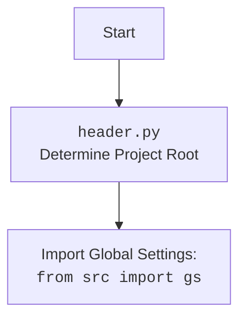

## АНАЛИЗ КОДА

### <алгоритм>

**1. `TinyStory.__init__` (Инициализация):**

   - **Входные данные:** `environment` (TinyWorld), `agent` (TinyPerson), `purpose` (str), `context` (str), `first_n` (int), `last_n` (int), `include_omission_info` (bool).
   - **Логика:**
     - Проверяет, передан ли только один из параметров: `environment` или `agent`. Выбрасывает исключение, если переданы оба или ни один.
     - Инициализирует атрибуты экземпляра класса: `environment`, `agent`, `purpose`, `current_story`, `first_n`, `last_n`, `include_omission_info`.
   - **Выходные данные:** Объект класса `TinyStory`.
   - **Пример:**
     ```python
     story = TinyStory(agent=my_agent, purpose="To explore social dynamics", context="The town of Willow Creek was quiet until...")
     ```

**2. `TinyStory.start_story` (Начало истории):**

   - **Входные данные:** `requirements` (str), `number_of_words` (int), `include_plot_twist` (bool).
   - **Логика:**
     - Формирует словарь `rendering_configs` с параметрами для шаблонизатора.
     - Вызывает `utils.compose_initial_LLM_messages_with_templates` для создания сообщений для языковой модели (LLM). Использует шаблоны `"story.start.system.mustache"` и `"story.start.user.mustache"`.
     - Отправляет сообщения в LLM через `openai_utils.client().send_message` и получает ответ.
     - Добавляет ответ LLM в `self.current_story` с форматированием.
   - **Выходные данные:** Строка (начало истории).
   - **Пример:**
     ```python
     start_text = story.start_story(requirements="Describe the agent's first day in the new town.", number_of_words=150)
     print(start_text)
     ```

**3. `TinyStory.continue_story` (Продолжение истории):**

   - **Входные данные:** `requirements` (str), `number_of_words` (int), `include_plot_twist` (bool).
   - **Логика:**
     - Аналогично `start_story`, но использует шаблоны `"story.continuation.system.mustache"` и `"story.continuation.user.mustache"`.
     - Добавляет ответ LLM в `self.current_story` с форматированием.
   - **Выходные данные:** Строка (продолжение истории).
   - **Пример:**
     ```python
     continuation_text = story.continue_story(requirements="What challenges does the agent face?", number_of_words=120)
      print(continuation_text)
     ```

**4. `TinyStory._current_story` (Получение текущей истории):**

   - **Входные данные:** Нет.
   - **Логика:**
     - Получает историю взаимодействий из `agent` или `environment` (в зависимости от того, какой параметр был передан при инициализации) через методы `pretty_current_interactions`.
     - Добавляет отформатированную историю взаимодействий в `self.current_story`.
   - **Выходные данные:** Строка (текущая история).
   - **Пример:**
     ```python
     current_story = story._current_story()
     print(current_story)
     ```

**Поток данных:**

- `TinyStory.__init__`: Получает данные об окружении/агенте и инициализирует объект `TinyStory`.
- `TinyStory.start_story` и `TinyStory.continue_story`: Используют `_current_story`, чтобы получить текущую историю, и затем отправляют её в LLM через `openai_utils.client().send_message`.
- `openai_utils.client().send_message`: Возвращает сгенерированный текст, который добавляется в `self.current_story`.

### <mermaid>

```mermaid
flowchart TD
    StartStory[<code>TinyStory.start_story</code><br>Start new story generation]
    ContinueStory[<code>TinyStory.continue_story</code><br>Continue story generation]
    CurrentStory[<code>TinyStory._current_story</code><br>Retrieve current simulation interactions]
    Init[<code>TinyStory.__init__</code><br>Initialize TinyStory instance]

    StartStory --> ComposeStartMessages[<code>utils.compose_initial_LLM_messages_with_templates</code><br>Compose LLM messages with 'story.start' templates]
    ContinueStory --> ComposeContMessages[<code>utils.compose_initial_LLM_messages_with_templates</code><br>Compose LLM messages with 'story.continuation' templates]

    ComposeStartMessages --> LLMStart[<code>openai_utils.client().send_message</code><br>Send messages to LLM for start]
    ComposeContMessages --> LLMCont[<code>openai_utils.client().send_message</code><br>Send messages to LLM for continuation]

    LLMStart --> StartText[Extract text from LLM response]
    LLMCont --> ContText[Extract text from LLM response]
    
    StartText --> UpdateCurrentStory1[<code>self.current_story</code><br>Append generated text and simulation interactions to story]
    ContText --> UpdateCurrentStory2[<code>self.current_story</code><br>Append generated text and simulation interactions to story]
    
    UpdateCurrentStory1 --> ReturnStart[Return start_text]
    UpdateCurrentStory2 --> ReturnCont[Return continuation_text]
    
    
    Init -->|agent or env| CurrentStory
    CurrentStory --> UpdateCurrentStory1
    CurrentStory --> UpdateCurrentStory2
    
    
    classDef blue fill:#f9f,stroke:#333,stroke-width:2px;
    class StartStory, ContinueStory, CurrentStory, Init, LLMStart, LLMCont blue
```



**Описание зависимостей:**

- `TinyStory` использует `tinytroupe.agent.TinyPerson` и `tinytroupe.environment.TinyWorld` для получения истории взаимодействий.
- `tinytroupe.utils` используется для форматирования текста и составления сообщений для LLM.
- `tinytroupe.openai_utils` используется для отправки запросов к LLM.

### <объяснение>

**Импорты:**

- `from typing import List`: Импорт `List` для аннотации типов.
- `from tinytroupe.agent import TinyPerson`: Импорт класса `TinyPerson` для представления агентов. Позволяет  `TinyStory` знать структуру `TinyPerson` и получать доступ к информации о его действиях.
- `from tinytroupe.environment import TinyWorld`: Импорт класса `TinyWorld` для представления среды. Позволяет `TinyStory`  получать доступ к информации о событиях в среде.
- `import tinytroupe.utils as utils`: Импорт модуля `utils` из `tinytroupe` для общих функций, включая форматирование текста и работу с LLM-шаблонами.
- `from tinytroupe import openai_utils`: Импорт модуля `openai_utils` для взаимодействия с OpenAI API.

**Класс `TinyStory`:**

- **Роль:** Предназначен для генерации текстовых историй на основе симуляций, происходящих с `TinyPerson` и `TinyWorld`. Управляет историей, её началом и продолжением.
- **Атрибуты:**
  - `environment` (`TinyWorld`): Среда, в которой происходит действие истории.
  - `agent` (`TinyPerson`): Агент, участвующий в истории.
  - `purpose` (`str`): Назначение истории.
  - `current_story` (`str`): Текущий текст истории.
  - `first_n` (`int`): Количество первых взаимодействий для включения в историю.
  - `last_n` (`int`): Количество последних взаимодействий для включения в историю.
  - `include_omission_info` (`bool`): Флаг, определяющий, следует ли включать информацию об опущенных взаимодействиях.
- **Методы:**
  - `__init__`: Конструктор класса, инициализирующий атрибуты.
  - `start_story`: Начинает новую историю, отправляя запрос в LLM на основе начального шаблона.
  - `continue_story`: Продолжает историю, отправляя запрос в LLM на основе шаблона продолжения.
  - `_current_story`: Возвращает текущую историю, включая информацию об окружении или агенте.

**Функции:**

- `__init__`:
  - **Аргументы:** `environment`, `agent`, `purpose`, `context`, `first_n`, `last_n`, `include_omission_info`.
  - **Возвращаемое значение:** None.
  - **Назначение:** Инициализирует объект `TinyStory`.
  - **Пример:**
    ```python
    story = TinyStory(agent=my_agent, purpose="Explore personal growth", context="The journey began...")
    ```
- `start_story`:
  - **Аргументы:** `requirements`, `number_of_words`, `include_plot_twist`.
  - **Возвращаемое значение:** Строка (начало истории).
  - **Назначение:** Генерирует начальную часть истории с использованием LLM.
  - **Пример:**
    ```python
    start_text = story.start_story(requirements="Describe a peaceful morning.", number_of_words=100)
    ```
- `continue_story`:
  - **Аргументы:** `requirements`, `number_of_words`, `include_plot_twist`.
  - **Возвращаемое значение:** Строка (продолжение истории).
  - **Назначение:** Продолжает историю, генерируя новый текст с использованием LLM.
  - **Пример:**
    ```python
    continuation_text = story.continue_story(requirements="A sudden event happens.", number_of_words=150)
    ```
- `_current_story`:
  - **Аргументы:** None.
  - **Возвращаемое значение:** Строка (текущая история).
  - **Назначение:** Формирует текущую историю из накопленных данных об окружении/агенте и тексте истории.
  - **Пример:**
    ```python
    story_text = story._current_story()
    ```

**Переменные:**

- `environment`: Экземпляр `TinyWorld` или `None`.
- `agent`: Экземпляр `TinyPerson` или `None`.
- `purpose`: Строка, описывающая назначение истории.
- `current_story`: Строка, содержащая текущий текст истории.
- `first_n`: Целое число, определяющее, сколько первых взаимодействий включить в историю.
- `last_n`: Целое число, определяющее, сколько последних взаимодействий включить в историю.
- `include_omission_info`: Логическое значение, определяющее, включать ли информацию об опущенных взаимодействиях.

**Потенциальные ошибки и области для улучшения:**

- **Обработка ошибок LLM:** Не предусмотрена обработка ошибок при взаимодействии с LLM. Стоит добавить обработку исключений для `openai_utils.client().send_message` на случай сбоев API.
- **Гибкость шаблонов:** Жестко закодированные имена шаблонов ( `"story.start.system.mustache"` и `"story.continuation.user.mustache"`) можно вынести в конфигурацию, чтобы упростить их изменение.
- **Параметры LLM:** Параметр `temperature=1.5` задан жестко. Можно сделать этот параметр настраиваемым.
- **Управление контекстом:** Класс хранит всю историю в `current_story`. Для длинных историй это может привести к проблемам с памятью и производительностью. Стоит рассмотреть возможность разбиения истории на части или использования более эффективного механизма управления контекстом.

**Взаимосвязи с другими частями проекта:**

- `TinyStory` зависит от `TinyPerson` и `TinyWorld` для получения данных о симуляции.
- Класс использует `utils` для работы с шаблонами LLM и `openai_utils` для взаимодействия с LLM API.
- `TinyStory` является частью более крупной системы для создания симуляций и историй, где `TinyPerson` и `TinyWorld`  представляют агентов и окружения, а `openai_utils` - связующее звено с языковой моделью.