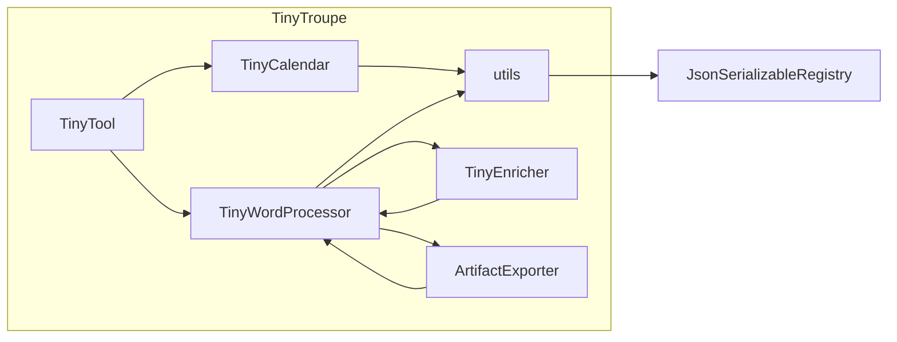

# Анализ кода tools.py

## <input code>

```python
"""
Tools allow agents to accomplish specialized tasks.
"""
import textwrap
import json
import copy
import logging
logger = logging.getLogger("tinytroupe")
import tinytroupe.utils as utils
from tinytroupe.extraction import ArtifactExporter
from tinytroupe.enrichment import TinyEnricher
from tinytroupe.utils import JsonSerializableRegistry

class TinyTool(JsonSerializableRegistry):
    # ... (остальной код)
```

## <algorithm>

(Блок-схема отсутствует, т.к. код описывает классы и функции, а не алгоритм в формате вычислений.  Блок-схема для функций внутри классов приведена в описании каждой функции.)


## <mermaid>



## <explanation>

Этот код определяет базовый класс `TinyTool` и два его наследника: `TinyCalendar` и `TinyWordProcessor`.  Эти классы представляют собой инструменты, которые агенты могут использовать для выполнения задач.

**Импорты:**

- `textwrap`, `json`, `copy`, `logging`: Стандартные библиотеки Python, необходимые для работы с текстом, JSON, копирования данных и ведения логов.
- `tinytroupe.utils`: Модуль из собственного проекта, вероятно, содержащий полезные утилиты (например, функцию `dedent` для удаления отступов в строках).
- `tinytroupe.extraction.ArtifactExporter`: Класс из модуля `extraction` проекта, отвечает за экспорт артефактов.
- `tinytroupe.enrichment.TinyEnricher`: Класс из модуля `enrichment` проекта, отвечает за обогащение данных.
- `tinytroupe.utils.JsonSerializableRegistry`: Базовый класс для сериализации объектов в JSON.


**Классы:**

- **`TinyTool`:** Базовый класс для всех инструментов. Он определяет общие атрибуты (название, описание, владелец, реальные последствия, экспортер, обогатитель) и методы, необходимые для всех инструментов. 
    - `__init__`: Инициализирует атрибуты инструмента.
    - `_process_action`: Абстрактный метод, который должен быть реализован в наследниках для обработки конкретных действий.
    - `_protect_real_world`: Выводит предупреждение, если инструмент имеет реальные последствия.
    - `_enforce_ownership`: Проверяет, принадлежит ли инструмент агенту.
    - `set_owner`: Изменяет владельца инструмента.
    - `actions_definitions_prompt`: Возвращает подсказку для определений действий.
    - `actions_constraints_prompt`: Возвращает подсказку для ограничений действий.
    - `process_action`: Обработка действия агента с проверкой владельца и реальных последствий.

- **`TinyCalendar`:** Инструмент для работы с календарем.
    - `__init__`: Инициализирует атрибут `calendar` (словарь, сопоставляющий даты спискам событий).
    - `add_event`: Добавляет новое событие в календарь.
    - `find_events`: Находит события по заданным критериям (не реализовано).
    - `_process_action`: Обрабатывает действия по добавлению событий в календарь. Использует `json.loads` для парсинга входящего JSON.
    - `actions_definitions_prompt`: Определяет подсказки для доступных действий (создание события).
    - `actions_constraints_prompt`: (не реализовано)

- **`TinyWordProcessor`:** Инструмент для обработки текстов.
    - `__init__`: Инициализирует атрибуты инструмента.
    - `write_document`: Записывает документ, используя экспортер и обогатитель (если указаны).
    - `_process_action`: Обрабатывает действия по написанию документов.  Обрабатывает возможные ошибки парсинга JSON.
    - `actions_definitions_prompt`: Определяет подсказку для доступных действий (написание документа).
    - `actions_constraints_prompt`: Определяет ограничения для действий по написанию документов.

**Функции:**

- В основном, функции внутри классов (`__init__`, `add_event`, `write_document`, `_process_action` и т.д.).  Их поведение описано в разделах документации к классам.

**Переменные:**

- `logger`: Логгер, используемый для записи сообщений.
- `valid_keys`: Список допустимых ключей в JSON для действий.

**Возможные ошибки и улучшения:**

- `NotImplementedError` в методах `_process_action`, `actions_definitions_prompt`, `actions_constraints_prompt`. Необходимо реализовать методы в наследниках.
- `TODO` комментарии, указывая на недописанные части (например, поиск событий в календаре).
- Обработка ошибок при чтении/парсинге JSON в `TinyWordProcessor._process_action`.  В `find_events` нет логики работы, нужно подумать о структуре данных.
- В `TinyCalendar`  нет обработки ошибок валидации данных.
- Не описана структура данных для `mandatory_attendees` и `optional_attendees`.
- В `actions_constraints_prompt`  для `TinyCalendar` нет ограничений.
- Недостаточно информации о поведении  `utils.check_valid_fields`

**Взаимосвязь с другими частями проекта:**

Классы `ArtifactExporter` и `TinyEnricher` зависят от других частей проекта `tinytroupe`.  `TinyTool` использует методы из `JsonSerializableRegistry`.  `utils` содержит вспомогательные функции для обработки данных и других полезных инструментов.  Предполагается, что классы `TinyCalendar` и `TinyWordProcessor` будут взаимодействовать с другими классами проекта для выполнения своих задач.


```