# Анализ кода tools.py

**1. <input code>**

```python
"""
Tools allow agents to accomplish specialized tasks.
"""
import textwrap
import json
import copy
import logging
logger = logging.getLogger("tinytroupe")
import tinytroupe.utils as utils
from tinytroupe.extraction import ArtifactExporter
from tinytroupe.enrichment import TinyEnricher
from tinytroupe.utils import JsonSerializableRegistry

class TinyTool(JsonSerializableRegistry):
    def __init__(self, name, description, owner=None, real_world_side_effects=False, exporter=None, enricher=None):
        self.name = name
        self.description = description
        self.owner = owner
        self.real_world_side_effects = real_world_side_effects
        self.exporter = exporter
        self.enricher = enricher
    def _process_action(self, agent, action: dict) -> bool:
        raise NotImplementedError("Subclasses must implement this method.")
    def _protect_real_world(self):
        if self.real_world_side_effects:
            logger.warning(f" !!!!!!!!!! Tool {self.name} has REAL-WORLD SIDE EFFECTS. This is NOT just a simulation. Use with caution. !!!!!!!!!!")
    def _enforce_ownership(self, agent):
        if self.owner is not None and agent.name != self.owner.name:
            raise ValueError(f"Agent {agent.name} does not own tool {self.name}, which is owned by {self.owner.name}.")
    def set_owner(self, owner):
        self.owner = owner
    def actions_definitions_prompt(self) -> str:
        raise NotImplementedError("Subclasses must implement this method.")
    def actions_constraints_prompt(self) -> str:
        raise NotImplementedError("Subclasses must implement this method.")
    def process_action(self, agent, action: dict) -> bool:
        self._protect_real_world()
        self._enforce_ownership(agent)
        self._process_action(agent, action)

class TinyCalendar(TinyTool):
    def __init__(self, owner=None):
        super().__init__("calendar", "A basic calendar tool that allows agents to keep track meetings and appointments.", owner=owner, real_world_side_effects=False)
        self.calenar = {}
    def add_event(self, date, title, ...):
        # ...
    def find_events(...):
        # ...
    def _process_action(self, agent, action) -> bool:
        # ...
    def actions_definitions_prompt(self) -> str:
        # ...
    def actions_constraints_prompt(self) -> str:
        # ...

class TinyWordProcessor(TinyTool):
    def __init__(self, owner=None, exporter=None, enricher=None):
        super().__init__("wordprocessor", "A basic word processor tool that allows agents to write documents.", owner=owner, real_world_side_effects=False, exporter=exporter, enricher=enricher)
    def write_document(self, title, content, author=None):
        # ...
    def _process_action(self, agent, action) -> bool:
        # ...
    def actions_definitions_prompt(self) -> str:
        # ...
    def actions_constraints_prompt(self) -> str:
        # ...
```

**2. <algorithm>**

(Блок-схема - сложно представить в текстовом формате, поэтому описание алгоритма)

Класс `TinyTool` — базовый класс для инструментов. Он определяет общие атрибуты (имя, описание, владелец, возможность реальных последствий) и методы для обработки действий (`_process_action`, проверка владения (`_enforce_ownership`), предупреждение о реальных последствиях (`_protect_real_world`)). Подклассы должны реализовывать `_process_action`, `actions_definitions_prompt`, `actions_constraints_prompt`.
Класс `TinyCalendar` обрабатывает действия по добавлению событий в календарь. Класс `TinyWordProcessor` обрабатывает действия по написанию документов.

```mermaid
graph LR
    A[tinytroupe.tools.py] --> B(TinyTool);
    B --> C{actions_definitions_prompt};
    B --> D{actions_constraints_prompt};
    B --> E{_process_action};
    B --> F[_protect_real_world];
    B --> G[_enforce_ownership];
    C --> H[TinyCalendar];
    D --> I[TinyCalendar];
    E --> J[TinyCalendar._process_action];
    C --> K[TinyWordProcessor];
    D --> L[TinyWordProcessor];
    E --> M[TinyWordProcessor._process_action];

    subgraph TinyCalendar
        H --> N[add_event]
        H --> O[find_events]
    end
    
    subgraph TinyWordProcessor
        K --> P[write_document]
    end

    style B fill:#ccf,stroke:#333,stroke-width:2px
    style H fill:#ccf,stroke:#333,stroke-width:2px
    style K fill:#ccf,stroke:#333,stroke-width:2px
```

**3. <mermaid>**



**4. <explanation>**

* **Импорты:**
    * `textwrap`, `json`, `copy`, `logging`: стандартные библиотеки Python.
    * `tinytroupe.utils`: модуль с утилитами, вероятно, из того же проекта, содержит вспомогательные функции (например, `utils.check_valid_fields`).
    * `tinytroupe.extraction.ArtifactExporter`:  класс для экспорта результатов, возможно,  для сохранения артефактов.
    * `tinytroupe.enrichment.TinyEnricher`: класс для обогащения данных, вероятно, для дополнения результатов обработки.
    * `tinytroupe.utils.JsonSerializableRegistry`: регистр для сериализации в JSON, обеспечивая согласованность формата данных.

* **Классы:**
    * **`TinyTool`:** Базовый абстрактный класс для всех инструментов. Определяет общие методы, но подклассы обязаны реализовывать `_process_action`, `actions_definitions_prompt`, `actions_constraints_prompt`.
    * **`TinyCalendar`:** Инструмент для работы с календарем. Имеет атрибут `calendar` для хранения событий, метод `add_event` для добавления, и `find_events`.
    * **`TinyWordProcessor`:** Инструмент для обработки текстовых документов. Имеет метод `write_document` для создания и потенциального обогащения документов (с использованием `enricher`).

* **Функции:**
    * **`_process_action`:** Обрабатывает действие, которое применимо к данному инструменту. (абстрактная функция)
    * **`_protect_real_world`:**  Проверяет, есть ли реальные последствия и выводит предупреждение, если они есть.
    * **`_enforce_ownership`:** Проверяет, имеет ли агент право использовать инструмент.
    * **`set_owner`:** Устанавливает владельца инструмента.
    * **`actions_definitions_prompt`:**  Возвращает строку с подсказками о допустимых действиях. (абстрактная функция)
    * **`actions_constraints_prompt`:**  Возвращает строку с подсказками о ограничениях при выполнении действий. (абстрактная функция)
    * **`write_document`:** Метод класса `TinyWordProcessor`,  создает и сохраняет документ. Обрабатывает обогащение с использованием `enricher` и экспорт в разные форматы (md, docx, json) с помощью `exporter`.


* **Возможные ошибки/улучшения:**
    * Не хватает реализации `find_events` в `TinyCalendar`.
    * Не хватает реализации `actions_definitions_prompt`, `actions_constraints_prompt` в `TinyCalendar`, `TinyWordProcessor`.
    * Логика обогащения в `TinyWordProcessor` может быть улучшена.
    * Необходимо добавить больше проверок на валидность данных в методах `add_event`, `write_document`.
    * Необходимо продумать обработку исключений `json.JSONDecodeError` в `TinyWordProcessor`.

**Цепочка взаимосвязей:**

Код использует классы и функции из пакетов `tinytroupe.extraction`, `tinytroupe.enrichment`, `tinytroupe.utils`.  Это подразумевает, что эти пакеты определяют классы `ArtifactExporter`, `TinyEnricher`, и вспомогательные функции.  Классы `TinyTool`, `TinyCalendar` и `TinyWordProcessor` взаимодействуют друг с другом, получая и передавая данные, используя методы  `process_action` (для обработки действий) и передачу данных через параметры (например, `exporter` и `enricher`).