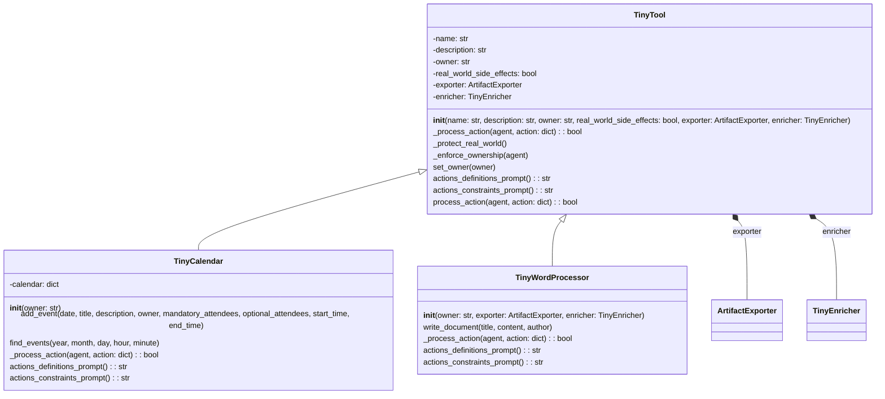
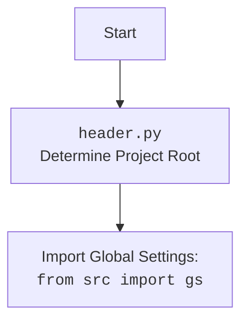

## АНАЛИЗ КОДА: `hypotez/src/ai/tiny_troupe/TinyTroupe/tinytroupe/tools.py`

### 1. <алгоритм>

#### Общий рабочий процесс:
1. **Инициализация инструмента**: Создается экземпляр класса `TinyTool` (или его подкласса, например, `TinyCalendar` или `TinyWordProcessor`). При этом задаются основные параметры инструмента: имя, описание, владелец, наличие побочных эффектов в реальном мире, экспортер и обогатитель.
   *   Пример: `calendar = TinyCalendar(owner=agent1)`

2.  **Выполнение действия**: Когда агент вызывает метод `process_action` инструмента, происходит следующее:
    *   Проверка на наличие побочных эффектов в реальном мире (`_protect_real_world`). Если они есть, выводится предупреждение.
        *   Пример: Если инструмент `TinyTool` имеет `real_world_side_effects=True`, то выводится предупреждение в лог.
    *   Проверка владельца инструмента (`_enforce_ownership`). Если инструмент имеет владельца, проверяется, что его использует именно этот владелец.
        *   Пример: Если `calendar` принадлежит `agent1`, то `agent2` не сможет его использовать.
    *   Вызывается метод `_process_action`, который специфичен для каждого подкласса `TinyTool`. Этот метод обрабатывает действие агента, используя входные данные (аргумент `action`).
        *   Пример: Для `TinyCalendar`, `_process_action` обрабатывает создание события (create_event)
        *   Пример: Для `TinyWordProcessor`, `_process_action` обрабатывает создание документа (write_document)

3. **Обработка действия внутри `_process_action`**:  Внутри этого метода, специфичного для каждого инструмента, обрабатываются данные из `action` (словаря),  например создание нового события календаря или нового документа.
    *   Пример: В `TinyCalendar`,  происходит парсинг JSON, проверка валидности входных данных  и  добавление нового события в календарь.
    *   Пример: В `TinyWordProcessor`,  происходит парсинг JSON,  валидация,  обогащение контента (если есть обогатитель), экспорт контента (если есть экспортер) и запись документа.

4. **Возврат результата**: Метод `_process_action` возвращает `True` в случае успешного выполнения действия или `False` в случае неудачи.

5. **Экспорт артефактов** (только для `TinyWordProcessor`):
    *   Если у инструмента есть экспортер, то вызывается метод `export` для сохранения артефактов (текстового файла, документа в формате docx, json).
    *  Пример: `exporter.export(artifact_name='my_document', ...)`

6. **Обогащение контента** (только для `TinyWordProcessor`):
    *   Если у инструмента есть обогатитель, то вызывается метод `enrich_content` для обработки контента документа.
     * Пример: `content = enricher.enrich_content(requirements='...', content='...',...)`

#### Блок-схема:
```mermaid
graph LR
    A[Начало: Инициализация инструмента] --> B{Вызов process_action};
    B -- Проверка на побочные эффекты --> C{_protect_real_world};
    C -- Проверка владельца --> D{_enforce_ownership};
    D --> E{Вызов _process_action};
    E -- TinyCalendar --> F[Обработка создания события];
    E -- TinyWordProcessor --> G[Обработка создания документа];
    F --> H{Возврат True/False};
    G --> I{Обогащение контента (если есть)};
    I --> J{Экспорт контента (если есть)};
    J --> H;
    H --> K[Конец];
```

### 2. <mermaid>



**Объяснение:**

*   **`TinyTool`**:  Это базовый класс для всех инструментов. Он содержит общую логику:
    *   `name`: Имя инструмента (строка).
    *   `description`: Описание инструмента (строка).
    *   `owner`: Имя агента, которому принадлежит инструмент (строка или `None`).
    *   `real_world_side_effects`: Флаг, указывающий, может ли инструмент изменять состояние реального мира (логическое значение).
    *   `exporter`: Объект `ArtifactExporter` для экспорта артефактов (может быть `None`).
    *   `enricher`: Объект `TinyEnricher` для обогащения контента (может быть `None`).
    *   `__init__()`: Конструктор класса, инициализирует атрибуты.
    *   `_process_action()`: Абстрактный метод, который должен быть реализован в подклассах для обработки действий.
    *   `_protect_real_world()`: Метод, который предупреждает о побочных эффектах в реальном мире.
    *   `_enforce_ownership()`: Метод, который проверяет, что инструмент используется его владельцем.
    *   `set_owner()`: Метод для установки владельца инструмента.
    *   `actions_definitions_prompt()`: Абстрактный метод, который должен быть реализован в подклассах для предоставления инструкций по использованию.
    *    `actions_constraints_prompt()`: Абстрактный метод, который должен быть реализован в подклассах для предоставления ограничений по использованию.
    *   `process_action()`: Метод, который запускает процесс обработки действия, вызывая проверку на побочные эффекты, проверку владельца и метод `_process_action()`.

*   **`TinyCalendar`**: Это подкласс `TinyTool`, реализующий инструмент "календарь".
    *   `calendar`: Словарь для хранения событий календаря. Ключ - дата, значение - список событий.
    *   `__init__()`: Конструктор класса, вызывает конструктор родительского класса и инициализирует календарь.
    *   `add_event()`: Метод для добавления нового события в календарь.
    *   `find_events()`: Метод для поиска событий в календаре (пока не реализован).
    *   `_process_action()`: Метод для обработки действий, связанных с календарем (например, создание нового события).
    *   `actions_definitions_prompt()`: Метод, возвращающий описание возможных действий с календарем.
    *    `actions_constraints_prompt()`: Метод, возвращающий ограничения по использованию календаря (пока не реализован).

*   **`TinyWordProcessor`**: Это подкласс `TinyTool`, реализующий инструмент "текстовый редактор".
    *   `__init__()`: Конструктор класса, вызывает конструктор родительского класса и инициализирует экспортер и обогатитель.
    *    `write_document()`: Метод для создания документа, с возможностью экспорта и обогащения.
    *   `_process_action()`: Метод для обработки действий, связанных с созданием документов.
    *   `actions_definitions_prompt()`: Метод, возвращающий описание возможных действий с текстовым редактором.
     *    `actions_constraints_prompt()`: Метод, возвращающий ограничения по использованию текстового редактора.

* **`ArtifactExporter`**: Класс, отвечающий за экспорт артефактов (документов, файлов и т.д.).
* **`TinyEnricher`**: Класс, отвечающий за обогащение контента (например, добавление деталей, создание более длинных текстов).

**Зависимости**:
* `TinyTool` зависит от `ArtifactExporter` и `TinyEnricher` через атрибуты `exporter` и `enricher`.
* `TinyCalendar` и `TinyWordProcessor` наследуют от `TinyTool`.

### 3. <объяснение>

#### Импорты:

*   `textwrap`: Используется для форматирования текста, в основном для удаления отступов из многострочных строк (например, при создании подсказок).
*   `json`: Используется для работы с данными в формате JSON (например, при парсинге данных из действий агентов).
*   `copy`: Используется для создания копий объектов (не используется в текущей версии файла).
*   `logging`: Используется для логирования событий.
*   `tinytroupe.utils as utils`: Импортирует модуль `utils` из пакета `tinytroupe`, который содержит вспомогательные функции, такие как `check_valid_fields` и `dedent`.
*   `tinytroupe.extraction.ArtifactExporter`: Импортирует класс `ArtifactExporter` из пакета `tinytroupe.extraction`, который используется для экспорта артефактов.
*   `tinytroupe.enrichment.TinyEnricher`: Импортирует класс `TinyEnricher` из пакета `tinytroupe.enrichment`, который используется для обогащения контента.
*   `tinytroupe.utils.JsonSerializableRegistry`: Импортирует класс `JsonSerializableRegistry` из пакета `tinytroupe.utils`, который используется как базовый класс для инструментов, позволяя их сериализовывать в JSON.

#### Классы:

*   **`TinyTool`**:
    *   **Роль**: Базовый класс для всех инструментов, предоставляющий общую структуру и функциональность.
    *   **Атрибуты**:
        *   `name`: Имя инструмента (строка).
        *   `description`: Описание инструмента (строка).
        *   `owner`: Владелец инструмента (может быть `None`).
        *   `real_world_side_effects`: Флаг, указывающий на наличие побочных эффектов в реальном мире (логический тип).
        *   `exporter`: Объект `ArtifactExporter` для экспорта данных.
        *   `enricher`: Объект `TinyEnricher` для обогащения данных.
    *   **Методы**:
        *   `__init__(self, name, description, owner=None, real_world_side_effects=False, exporter=None, enricher=None)`: Конструктор класса, инициализирует атрибуты.
        *   `_process_action(self, agent, action: dict) -> bool`: Абстрактный метод, который должен быть реализован в подклассах для обработки действий.
        *   `_protect_real_world(self)`: Метод, который предупреждает о побочных эффектах.
        *   `_enforce_ownership(self, agent)`: Метод, который проверяет, что инструмент используется его владельцем.
        *   `set_owner(self, owner)`: Устанавливает нового владельца инструмента.
        *   `actions_definitions_prompt(self) -> str`: Абстрактный метод, который должен быть реализован в подклассах для предоставления инструкций по использованию инструмента.
        *   `actions_constraints_prompt(self) -> str`: Абстрактный метод, который должен быть реализован в подклассах для предоставления ограничений по использованию инструмента.
        *   `process_action(self, agent, action: dict) -> bool`: Метод, который выполняет действие, проверяя побочные эффекты, владельца и вызывая метод `_process_action()`.
    *   **Взаимодействие**:  Служит базовым классом для других инструментов. Взаимодействует с `ArtifactExporter` и `TinyEnricher`.

*   **`TinyCalendar`**:
    *   **Роль**:  Инструмент для работы с календарем.
    *   **Атрибуты**:
        *   `calendar`: Словарь, представляющий календарь (ключи - даты, значения - списки событий).
    *   **Методы**:
        *   `__init__(self, owner=None)`: Конструктор класса, вызывает конструктор родительского класса и инициализирует календарь.
        *   `add_event(self, date, title, description=None, owner=None, mandatory_attendees=None, optional_attendees=None, start_time=None, end_time=None)`: Добавляет новое событие в календарь.
        *   `find_events(self, year, month, day, hour=None, minute=None)`: Метод для поиска событий в календаре (пока не реализован).
        *   `_process_action(self, agent, action) -> bool`: Метод для обработки действий, связанных с календарем.
        *  `actions_definitions_prompt(self) -> str`: Метод, возвращающий описание возможных действий с календарем.
        *   `actions_constraints_prompt(self) -> str`: Метод, возвращающий ограничения по использованию календаря.
    *   **Взаимодействие**:  Является подклассом `TinyTool`.

*   **`TinyWordProcessor`**:
    *   **Роль**: Инструмент для работы с текстовыми документами.
    *   **Атрибуты**: Отсутствуют, но наследует атрибуты от `TinyTool`.
    *   **Методы**:
        *   `__init__(self, owner=None, exporter=None, enricher=None)`: Конструктор класса, вызывает конструктор родительского класса.
        *   `write_document(self, title, content, author=None)`: Создает документ, может обогащать контент и экспортировать его.
        *   `_process_action(self, agent, action) -> bool`: Метод для обработки действий, связанных с текстовыми документами.
        *   `actions_definitions_prompt(self) -> str`: Метод, возвращающий описание возможных действий с текстовым редактором.
        *   `actions_constraints_prompt(self) -> str`: Метод, возвращающий ограничения по использованию текстового редактора.
    *   **Взаимодействие**:  Является подклассом `TinyTool`. Использует `ArtifactExporter` и `TinyEnricher`.

#### Функции:

*   `check_valid_fields`: Функция из `tinytroupe.utils`, которая проверяет, что в словаре есть только разрешенные ключи.
*   `dedent`: Функция из `tinytroupe.utils`, которая удаляет начальные отступы из многострочной строки.

#### Переменные:

*   `logger`: Объект логгера для записи сообщений в лог.
*   `prompt`: Строковые переменные, содержащие текст подсказок для агентов.

#### Потенциальные ошибки и области для улучшения:

*   **`TinyCalendar`**:
    *   Метод `find_events` не реализован.
    *   Обработка списка участников событий не до конца проработана.
    *   Отсутствуют ограничения на действия.

*   **`TinyWordProcessor`**:
    *   Экспорт документов всегда происходит в форматы `md`, `docx` и `json`. Возможно, стоит добавить опциональность.
    *   Логика обогащения контента может быть более гибкой.

*  **Общее**:
    *  Отсутствует подробная документация для каждого метода и класса.
    *  Жесткая привязка к формату JSON для действий агентов (можно сделать более гибким).
    *  Нет тестов.

#### Взаимосвязи с другими частями проекта:

*   Использует модули `utils`, `extraction` и `enrichment` из пакета `tinytroupe`.
*   Может использоваться агентами в других частях проекта (зависимости от агента не отображены в коде, но подразумеваются).
*  Использует `JsonSerializableRegistry` для сериализации инструментов в JSON (возможно, для сохранения состояния).

**Дополнительно:**

