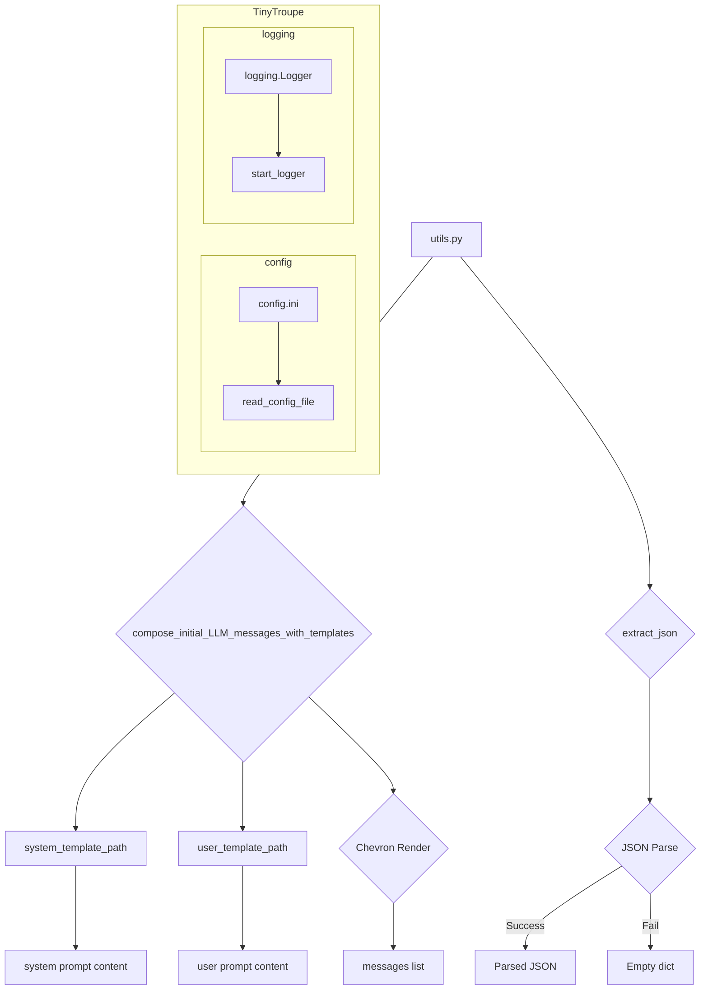

```MD
# <input code>

```python
"""
General utilities and convenience functions.
"""
import re
import json
import os
import sys
import hashlib
import textwrap
import logging
import chevron
import copy
from typing import Collection
from datetime import datetime
from pathlib import Path
import configparser
from typing import Any, TypeVar, Union
AgentOrWorld = Union["TinyPerson", "TinyWorld"]

# logger
logger = logging.getLogger("tinytroupe")


################################################################################
# Model input utilities
################################################################################
def compose_initial_LLM_messages_with_templates(system_template_name:str, user_template_name:str=None, rendering_configs:dict={}) -> list:
    """
    Composes the initial messages for the LLM model call, under the assumption that it always involves 
    a system (overall task description) and an optional user message (specific task description). 
    These messages are composed using the specified templates and rendering configurations.
    """

    system_prompt_template_path = os.path.join(os.path.dirname(__file__), f'prompts/{system_template_name}')
    user_prompt_template_path = os.path.join(os.path.dirname(__file__), f'prompts/{user_template_name}')

    messages = []

    messages.append({"role": "system", 
                         "content": chevron.render(
                             open(system_prompt_template_path).read(), 
                             rendering_configs)})
    
    # optionally add a user message
    if user_template_name is not None:
        messages.append({"role": "user", 
                            "content": chevron.render(
                                    open(user_prompt_template_path).read(), 
                                    rendering_configs)})
    return messages


################################################################################
	
# Model output utilities
################################################################################
def extract_json(text: str) -> dict:
    """
    Extracts a JSON object from a string, ignoring: any text before the first 
    opening curly brace; and any Markdown opening (```json) or closing(```) tags.
    """
    try:
        # remove any text before the first opening curly or square braces, using regex. Leave the braces.
        text = re.sub(r'^.*?({|\\[)', r'\1', text, flags=re.DOTALL)

        # remove any trailing text after the LAST closing curly or square braces, using regex. Leave the braces.
        text  =  re.sub(r'(\}|\])(?!.*(\\]|\\})).*$', r'\1', text, flags=re.DOTALL)
        
        # remove invalid escape sequences, which show up sometimes
        # replace \\' with just '
        text =  re.sub("\\\\'", "\'", text) #re.sub(r'\\\\\'', r"\'", text)

        # return the parsed JSON object
        return json.loads(text)
    
    except Exception:
        return {}

# ... (rest of the code)
```

# <algorithm>

**`compose_initial_LLM_messages_with_templates`**

1. **Input:** `system_template_name`, `user_template_name`, `rendering_configs`
2. **Calculate paths:** Construct paths to system and (optional) user prompt templates.
3. **Initialize:** Create an empty list `messages`.
4. **Render system prompt:** Read the system prompt template, render it using `chevron` with provided configurations, and append the result to `messages` as a system message.
5. **Render user prompt (optional):** If `user_template_name` is provided, read the template, render it, and append it as a user message to `messages`.
6. **Return:** Return the `messages` list.

**`extract_json`**

1. **Input:** `text` (string)
2. **Regex matching:** Use regex to extract the JSON portion, removing extraneous parts before and after the JSON.
3. **Error handling:** Try to parse the extracted text as JSON.
4. **JSON parsing:** If parsing succeeds, return the parsed JSON object.
5. **Error catching:** If parsing fails (e.g., invalid JSON), return an empty dictionary `{}`.

**(Other functions have similar algorithms, which can be described in a step-by-step manner)**

# <mermaid>



**Explanation of Dependencies:**

* `utils.py` depends on `os`, `re`, `json`, `sys`, `hashlib`, `textwrap`, `logging`, `chevron`, `copy`, `typing`, `datetime`, `pathlib`, `configparser`.  These are standard Python libraries or modules for file operations, regular expressions, JSON handling, system interactions, string manipulation, logging, template rendering, and data structures, respectively.

* `utils.py` (indirectly) depends on `tinytroupe.config`:  The `add_rai_template_variables_if_enabled` function imports `config` from `tinytroupe`, indicating a dependency on the configuration handling.

* The `JsonSerializableRegistry` class interacts with JSON serialization/deserialization via `json`.

* The `configparser` module is used to read configuration files.


# <explanation>

**Imports:**

- `re`, `json`, `os`, `sys`, `hashlib`, `textwrap`, `logging`, `chevron`, `copy`: Standard Python libraries for various tasks, like regular expressions, JSON handling, file operations, string manipulation, logging, template rendering, and object manipulation.
- `Collection`, `datetime`, `Path`, `configparser`: From the Python standard library for data structures, date and time handling, file paths, and configuration file parsing.
- `typing`: For type hints.
- `Union`, `Any`, `TypeVar`:  For defining types in a more flexible way (e.g., accepting different classes). `AgentOrWorld` is a type hint for Union of two classes defined in other parts of the TinyTroupe codebase.

**Classes:**

- `JsonSerializableRegistry`: A mixin class providing JSON serialization and deserialization capabilities. It also handles subclass registration, allowing for different classes to be serialized in a consistent manner. The crucial aspect is the `to_json` method and the class method `from_json` that handles the loading and deserializing of various complex data structures (dictionaries, lists, and nested ones), which is crucial for handling complex data objects in a more robust way.


**Functions:**

- `compose_initial_LLM_messages_with_templates`: Creates initial messages for an LLM (Large Language Model) call, rendering templates for system and (optionally) user instructions. It takes template names, and rendering configuration.
- `extract_json`: Extracts a JSON object from a string, handling potential errors during parsing, and removing unneeded parts.
- `extract_code_block`: Extracts a code block from a string, handling potential errors.
- `repeat_on_error`: A decorator for retrying a function call in case of specified exceptions. It handles multiple retry attempts in case of error during some operation, which is important in robustness of code, so the process won't crash immediately. 
- `check_valid_fields`: Validates if a dictionary contains only expected fields.
- `sanitize_raw_string`: Sanitizes a string by removing invalid characters and ensuring it fits within Python string limits to prevent potential issues, and possible attacks.
- `sanitize_dict`: Sanitizes a dictionary in a similar manner to `sanitize_raw_string`, removing invalid characters.
- `add_rai_template_variables_if_enabled`: Adds RAI (Responsible AI) template variables to a dictionary, if enabled in the configuration, loading the variables from template files.
- `inject_html_css_style_prefix`: Injects a style prefix to style attributes in an HTML string.
- `break_text_at_length`: Breaks text (or JSON) at a specified length, adding an ellipsis.
- `pretty_datetime`: Formats a `datetime` object into a readable string.
- `dedent`: Removes leading whitespace from a string.
- `read_config_file`: Reads the configuration file (config.ini). It has caching mechanism to avoid reading the file multiple times, and it tries to read the custom config, if it exists. This is important to ensure configuration flexibility, with default values, if no custom file is found.
- `pretty_print_config`: Prints the configuration in a formatted way.
- `start_logger`: Sets up the logging system using the configuration file. This is important to keep track of process state, and to have a better understanding of possible issues.


**Variables:**

- `logger`: A `logging` logger instance for the `tinytroupe` module.
- `_config`: A cached `configparser.ConfigParser` object to prevent redundant file reading.

**Possible Errors/Improvements:**

- Error handling in `extract_json` could be more specific about the type of JSON parsing error.
- More robust error handling in other functions.
- Consider using a more sophisticated configuration system beyond `configparser` for complex configurations.
- The use of regex might be inefficient for large inputs. Consider alternative approaches or performance analysis.
- The `JsonSerializableRegistry` could be improved by handling potentially more complex object types beyond dictionaries and lists.
- The code could be made more modular.

**Relationships with other parts of the project:**

- `utils.py` likely interacts with other parts of `tinytroupe`, particularly modules related to "TinyPerson" and "TinyWorld" (as indicated by the `AgentOrWorld` type hint) and various components for LLM model interactions, data handling and simulation logic. It is a crucial tool, as it provides many utility functions that other modules can use.


This comprehensive analysis provides a detailed understanding of the code's functionality, its dependencies, and potential improvements.