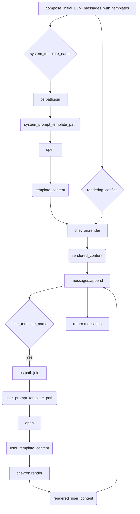

```MD
# <input code>

```python
"""
General utilities and convenience functions.
"""
import re
import json
import os
import sys
import hashlib
import textwrap
import logging
import chevron
import copy
from typing import Collection
from datetime import datetime
from pathlib import Path
import configparser
from typing import Any, TypeVar, Union
AgentOrWorld = Union["TinyPerson", "TinyWorld"]

# logger
logger = logging.getLogger("tinytroupe")


################################################################################
# Model input utilities
################################################################################
def compose_initial_LLM_messages_with_templates(system_template_name:str, user_template_name:str=None, rendering_configs:dict={}) -> list:
    """
    Composes the initial messages for the LLM model call, under the assumption that it always involves 
    a system (overall task description) and an optional user message (specific task description). 
    These messages are composed using the specified templates and rendering configurations.
    """

    system_prompt_template_path = os.path.join(os.path.dirname(__file__), f'prompts/{system_template_name}')
    user_prompt_template_path = os.path.join(os.path.dirname(__file__), f'prompts/{user_template_name}')

    messages = []

    messages.append({"role": "system", 
                         "content": chevron.render(
                             open(system_prompt_template_path).read(), 
                             rendering_configs)})
    
    # optionally add a user message
    if user_template_name is not None:
        messages.append({"role": "user", 
                            "content": chevron.render(
                                    open(user_prompt_template_path).read(), 
                                    rendering_configs)})
    return messages


################################################################################
# Model output utilities
################################################################################
def extract_json(text: str) -> dict:
    """
    Extracts a JSON object from a string, ignoring: any text before the first 
    opening curly brace; and any Markdown opening (```json) or closing(```) tags.
    """
    try:
        # remove any text before the first opening curly or square braces, using regex. Leave the braces.
        text = re.sub(r'^.*?({|\\[)', r'\1', text, flags=re.DOTALL)

        # remove any trailing text after the LAST closing curly or square braces, using regex. Leave the braces.
        text  =  re.sub(r'([}\]])(?!.*([}\]]).*)$', r'\1', text, flags=re.DOTALL)
        
        # remove invalid escape sequences, which show up sometimes
        # replace \\' with just '
        text =  re.sub("\\\\'", "\'", text) #re.sub(r'\\\\\'', r"\'", text)

        # return the parsed JSON object
        return json.loads(text)
    
    except Exception:
        return {}


# ... (rest of the code)
```

# <algorithm>

**Функция `compose_initial_LLM_messages_with_templates`:**

1.  **Получение путей:** Определяет пути к шаблонам системного и пользовательского сообщений, используя имя шаблона и текущий каталог.
2.  **Создание списка сообщений:** Создает пустой список `messages`.
3.  **Обработка системного сообщения:** Считывает системный шаблон, применяет `chevron.render` для подстановки значений из `rendering_configs`, и добавляет его в список `messages`.
4.  **Обработка пользовательского сообщения (необязательно):** Если `user_template_name` задан, выполняет те же действия, что и для системного сообщения, но для пользовательского шаблона, и добавляет его в список `messages`.
5.  **Возврат:** Возвращает список `messages`.


**Функция `extract_json`:**

1.  **Удаление нежелательной части:** Использует регулярные выражения, чтобы удалить все символы до первой открывающей фигурной скобки `{` или квадратной скобки `[` (и сохранив её).  Затем удаляет все после последней закрывающей.
2.  **Обработка невалидных эскейпов:** Удаляет невалидные эскейп-последовательности, которые могут встречаться в строке.
3.  **Парсинг JSON:** Если все успешно, то парсит оставшуюся часть строки как JSON и возвращает результат.
4.  **Обработка ошибок:** Если возникают ошибки при парсинге JSON, возвращает пустой словарь `{}`.


**Пример использования (`compose_initial_LLM_messages_with_templates`):**

Вход: `system_template_name = "my_system_template.txt"`, `rendering_configs = {"name": "Alice"}`

Выход: список сообщений с рендереным системным сообщением, содержащим `Alice`.


# <mermaid>



**Объяснение диаграммы:**

- Функция `compose_initial_LLM_messages_with_templates` принимает имя шаблона и конфигурацию рендеринга.
- Она формирует путь к шаблону с помощью `os.path.join`.
- Шаблон считывается функцией `open`.
- `chevron.render` применяет конфигурацию к шаблону.
- Результирующее сообщение добавляется в список.
- Функция возвращает список составленных сообщений.

# <explanation>

**Импорты:**

- `re`, `json`, `os`, `sys`, `hashlib`, `textwrap`, `logging`, `chevron`, `copy`, `typing`, `datetime`, `pathlib`, `configparser`: Стандартные библиотеки Python, используемые для работы с регулярными выражениями, JSON, файлами, системными переменными, хэшами, форматированием текста, логгированием, шаблонами, копиями данных, системами типов, датами и путями к файлам.
- `Union`, `Any`, `TypeVar`: Часть `typing` для объявления типов.
- `Collection`:  Тип для работы с коллекциями (списками, кортежами и т.д.).
- `AgentOrWorld`: Объявляет тип, который может быть либо `TinyPerson`, либо `TinyWorld`. Это показывает взаимосвязь с другими классами (которые должны быть определены в `tinytroupe`, но не видны в этом фрагменте кода).

**Классы:**

- `JsonSerializableRegistry`:  Класс, предназначенный для сериализации и десериализации объектов в JSON формат.  Это важный класс, так как он позволяет представлять сложные объекты как JSON, что необходимо для сохранения и загрузки данных.  Он содержит статический атрибут `class_mapping`, который позволяет получать подклассы и вызывать их методы.

**Функции:**

- `compose_initial_LLM_messages_with_templates`: Создает начальные сообщения для LLM (Большой языковой модели).  Это важно, т.к. LLM требует определенный формат входных данных. Функция принимает шаблоны для системного и (необязательного) пользовательского сообщений и подставляет в них данные из `rendering_configs`.
- `extract_json`: Извлекает JSON-объект из строки, игнорируя лишние префиксы и постфиксы. Необходимо для обработки ответов от LLM, которые могут быть неполными или содержать нежелательные данные.
- `extract_code_block`: Извлекает код из строки, игнорируя все, кроме блока кода.
- `repeat_on_error`: Декоратор, позволяющий повторить функцию до определенного числа раз, если происходит ошибка из заданного списка.
- `check_valid_fields`: Проверяет, что словарь содержит только разрешенные поля.
- `sanitize_raw_string`: Обеспечивает, что строка содержит только валидные UTF-8 символы и не превышает максимальную длину строки Python.
- `sanitize_dict`: Обеспечивает, что словарь не содержит невалидных значений и не является слишком вложенным.
- `add_rai_template_variables_if_enabled`: Добавляет переменные для RAI (Responsible AI) шаблонов, если они включены в конфигурации.
- `inject_html_css_style_prefix`: Добавляет префикс к атрибутам стиля в HTML-строке.
- `break_text_at_length`: Обрезает текст, если он слишком длинный, добавляя "(...)".
- `pretty_datetime`: Преобразует объект `datetime` в удобочитаемый формат.
- `dedent`: Удаляет отступы из строки.
- `read_config_file`: Чтение конфигурации из `config.ini`. Важный механизм для управления настройками приложения.
- `pretty_print_config`: Выводит конфигурацию в удобочитаемом формате.
- `start_logger`: Настройка логгера.
- `name_or_empty`: Возвращает имя сущности или пустую строку, если она None.
- `custom_hash`: Возвращает детерминированный хэш объекта.
- `fresh_id`: Возвращает уникальный идентификатор.

**Переменные:**

- `logger`: Объект логгера, используемый для записи сообщений.
- `_config`:  Временное хранилище конфигурации,  позволяет избежать повторного чтения `config.ini` при многократном доступе.
- `AgentOrWorld`: Тип данных, используемый для хранения агентов или миров.
- `_fresh_id_counter`: Глобальная переменная для генерации уникальных идентификаторов.

**Возможные ошибки и улучшения:**

- **Циклические импорты:** В функции `add_rai_template_variables_if_enabled` есть импорт `config` из `tinytroupe`. Это может быть не лучшим способом предотвращения циклического импорта, лучше использовать импорт как абсолютный или относительный импорт в соответствии с архитектурой проекта.
- **Обработка исключений:**  В `extract_json` и `extract_code_block` есть обработка исключений, но они могли бы быть более специфическими или использовать более подходящие типы исключений.
- **Безопасность:** В `sanitize_raw_string` и `sanitize_dict` может потребоваться более тщательная проверка вводимых данных. Это может быть важно для предотвращения атак, связанных с обработкой вводимых данных.
- **Документация:** Документация некоторых функций и классов может быть более подробной.

**Взаимосвязи с другими частями проекта:**

- Функции, связанные с LLM, взаимодействуют с внешними моделями и нуждаются в правильном формате данных.
- `JsonSerializableRegistry` используется для сериализации и десериализации других классов.  Это указывает на то, что существуют другие классы, которые должны быть сериализуемы (например, `TinyPerson`, `TinyWorld`).
- Конфигурация `config.ini` является центральным источником данных для управления поведением.

Этот код является частью модуля утилит для проекта `tinytroupe`, который, судя по всему, предназначен для работы с LLM, конфигурацией и данными симуляций.