# Анализ кода `tinytroupe/utils.py`

## <алгоритм>

**1. `compose_initial_LLM_messages_with_templates`**:
   - Принимает имена системного (`system_template_name`) и пользовательского (`user_template_name`, опционально) шаблонов, а также словарь `rendering_configs` для заполнения шаблонов.
   - Формирует путь к файлам шаблонов, используя `os.path.join` и `__file__`, предполагая, что шаблоны находятся в директории `prompts`.
   - Инициализирует пустой список `messages`.
   - Добавляет в список системное сообщение, сгенерированное из содержимого файла системного шаблона и `rendering_configs` с помощью `chevron.render`.
   - Если `user_template_name` не `None`, добавляет пользовательское сообщение, сгенерированное аналогичным образом, используя содержимое файла пользовательского шаблона.
   - Возвращает список сообщений.
   
   *Пример:*
   ```python
    system_template_name = "system_prompt.md"
    user_template_name = "user_prompt.md"
    rendering_configs = {"agent_name": "Agent1"}
    
    messages = compose_initial_LLM_messages_with_templates(system_template_name, user_template_name, rendering_configs)
    # messages будет содержать список из двух словарей:
    # [{"role": "system", "content": "Содержимое system_prompt.md с подставленным Agent1"}, 
    #  {"role": "user", "content": "Содержимое user_prompt.md с подставленным Agent1"}]
   ```

**2. `extract_json`**:
   - Принимает строку `text`.
   - Использует регулярные выражения (`re.sub`) для удаления текста до первого открывающего символа `{` или `[`, и текста после последнего закрывающего `}` или `]`.
   - Удаляет некорректные escape-последовательности `\\\'` заменяя их на `\'`.
   - Пытается преобразовать полученный текст в JSON-объект с помощью `json.loads`.
   - Если преобразование не удается, возвращает пустой словарь `{}`.

   *Пример:*
    ```python
    text = "Some text before { \"key\": \"value\" } some text after"
    extracted_json = extract_json(text) 
    # extracted_json будет {"key": "value"}

    text_with_invalid_escapes = "{ \\'key\\': \\'value\\' }"
    extracted_json = extract_json(text_with_invalid_escapes)
    #extracted_json будет {'key': 'value'}
    
   ```

**3. `extract_code_block`**:
    - Принимает строку `text`.
    - Использует регулярные выражения для удаления текста до первого вхождения ` ``` ` и после последнего.
    - Возвращает извлеченный блок кода или пустую строку, если не удается извлечь блок.
    *Пример:*
    ```python
    text = "Some text before ```code block``` some text after"
    extracted_code = extract_code_block(text)
    # extracted_code будет "```code block```"
    ```

**4. `repeat_on_error`**:
   - Декоратор, принимающий количество попыток (`retries`) и список исключений (`exceptions`).
   - Возвращает функцию-декоратор, которая вызывает декорируемую функцию.
   - Внутри декоратора, функция-обертка выполняет декорируемую функцию в цикле `retries` раз, перехватывая исключения из списка `exceptions`.
   - Если исключение произошло, и это последняя попытка, то исключение пробрасывается выше. Иначе, цикл продолжается.
   - Если исключение не возникает, возвращает результат работы декорируемой функции.

   *Пример:*
   ```python
   @repeat_on_error(retries=3, exceptions=[ValueError])
    def some_function():
        # код, который может вызвать ValueError
        pass
   ```

**5. `check_valid_fields`**:
   - Принимает словарь `obj` и список допустимых ключей `valid_fields`.
   - Проверяет, есть ли в словаре ключи, которых нет в `valid_fields`.
   - Если находит недопустимый ключ, генерирует `ValueError`.
   *Пример:*
    ```python
    obj = {"key1": "value1", "key2": "value2", "invalid_key": "value3"}
    valid_fields = ["key1", "key2"]
    check_valid_fields(obj, valid_fields) # вызовет ValueError
    ```

**6. `sanitize_raw_string`**:
   - Принимает строку `value`.
   - Кодирует строку в UTF-8, игнорируя ошибки кодирования, и декодирует обратно.
   - Возвращает строку, обрезанную до `sys.maxsize`.

**7. `sanitize_dict`**:
   - Принимает словарь `value`.
   - Сериализует словарь в JSON, санирует полученную строку с помощью `sanitize_raw_string`, а затем десериализует ее обратно в словарь.
   - Возвращает очищенный словарь.

**8. `add_rai_template_variables_if_enabled`**:
    - Принимает словарь `template_variables`.
    - Импортирует `config` для проверки конфигурации RAI.
    - Если RAI включен, читает файлы `rai_harmful_content_prevention.md` и `rai_copyright_infringement_prevention.md`, и добавляет содержимое в `template_variables` под ключами `rai_harmful_content_prevention` и `rai_copyright_infringement_prevention` соответственно.
    - Если RAI выключен, устанавливает значения `None` для соответствующих ключей.
    - Возвращает обновленный словарь `template_variables`.

**9. `inject_html_css_style_prefix`**:
   - Принимает HTML-строку `html` и строку `style_prefix_attributes`.
   - Добавляет `style_prefix_attributes` в начало каждого атрибута `style` в строке `html`.

**10. `break_text_at_length`**:
    - Принимает текст или словарь `text` и максимальную длину `max_length`.
    - Если `text` словарь, преобразует его в JSON.
    - Если `max_length` равен `None` или длина `text` меньше или равна `max_length`, возвращает текст без изменений.
    - Иначе, обрезает текст до `max_length`, добавляя `(...)` в конце.

**11. `pretty_datetime`**:
   - Принимает объект `datetime` и возвращает его строковое представление в формате `YYYY-MM-DD HH:MM`.

**12. `dedent`**:
   - Принимает строку `text` и возвращает ее с удаленными начальными пробелами и отступами.

**13. `read_config_file`**:
   - Читает конфигурационный файл `config.ini` из каталога модуля и из текущей рабочей директории.
   - Если `use_cache` равен `True` и конфигурация уже прочитана, то возвращает кэшированную конфигурацию.
   - В противном случае, создает новый объект `configparser.ConfigParser`, читает сначала файл из каталога модуля, а затем (если существует) из текущей директории, переопределяя значения.
   - Если ни один файл не найден, возбуждает исключение `ValueError`.

**14. `pretty_print_config`**:
   - Выводит на экран текущую конфигурацию в читаемом формате.

**15. `start_logger`**:
   - Настраивает логгер, задавая уровень логирования, обработчик (вывод в консоль) и формат сообщений.

**16. `JsonSerializableRegistry`**:
   - Класс-миксин для сериализации и десериализации объектов в JSON.
   - Имеет методы `to_json` (сериализация), `from_json` (десериализация).
   -  Регистрирует подклассы для возможности десериализации.
   - Поддерживает пользовательские инициализаторы и фильтры для атрибутов при сериализации/десериализации.
   -  Метод `__init_subclass__` автоматически регистрирует подклассы и расширяет списки `serializable_attributes`, `suppress_attributes_from_serialization` и `custom_serialization_initializers`.
    - Метод `_post_deserialization_init` вызывается после десериализации для выполнения дополнительной инициализации.

**17. `post_init`**:
    - Декоратор для вызова метода `_post_init` после инициализации объекта.
    - Заменяет стандартный метод `__init__` новым, в котором после вызова старого `__init__` вызывается метод `_post_init` если он есть.

**18. `name_or_empty`**:
   - Принимает объект `AgentOrWorld` (который может быть `TinyPerson` или `TinyWorld`) или `None`.
   - Возвращает имя объекта, если объект не `None`, иначе возвращает пустую строку.

**19. `custom_hash`**:
   - Принимает объект и возвращает его SHA256 хэш в виде строки.

**20. `fresh_id`**:
   - Возвращает уникальный ID, увеличивая внутренний счетчик.

```mermaid
graph LR
    subgraph "Model Input Utilities"
        compose_initial_LLM_messages_with_templates(compose_initial_LLM_messages_with_templates)
        system_template_name((system_template_name))
        user_template_name((user_template_name))
        rendering_configs((rendering_configs))
        system_prompt_template_path((system_prompt_template_path))
        user_prompt_template_path((user_prompt_template_path))
        messages((messages))
        
        compose_initial_LLM_messages_with_templates --> system_template_name
        compose_initial_LLM_messages_with_templates --> user_template_name
        compose_initial_LLM_messages_with_templates --> rendering_configs
        system_template_name --> system_prompt_template_path
        user_template_name --> user_prompt_template_path
        system_prompt_template_path --> messages
        user_prompt_template_path --> messages
    end
    
    subgraph "Model Output Utilities"
    
        extract_json(extract_json)
        text1((text))
        extracted_json((extracted_json))
        extract_json --> text1
        text1 --> extracted_json

        extract_code_block(extract_code_block)
        text2((text))
        extracted_code_block((extracted_code_block))
        extract_code_block --> text2
        text2 --> extracted_code_block
    end
    
    subgraph "Model Control Utilities"
        repeat_on_error(repeat_on_error)
        retries((retries))
        exceptions((exceptions))
        decorated_function((decorated_function))
        
        repeat_on_error --> retries
        repeat_on_error --> exceptions
        repeat_on_error --> decorated_function
    end
    
     subgraph "Validation"
        check_valid_fields(check_valid_fields)
        obj((obj))
        valid_fields((valid_fields))
        check_valid_fields --> obj
        check_valid_fields --> valid_fields
        
        sanitize_raw_string(sanitize_raw_string)
        raw_string_value((raw_string_value))
        sanitized_raw_string((sanitized_raw_string))
        sanitize_raw_string --> raw_string_value
        raw_string_value --> sanitized_raw_string
        
        sanitize_dict(sanitize_dict)
        dict_value((dict_value))
        sanitized_dict((sanitized_dict))
        sanitize_dict --> dict_value
        dict_value --> sanitized_dict
    end
    
    subgraph "Prompt Engineering"
       add_rai_template_variables_if_enabled(add_rai_template_variables_if_enabled)
       template_variables((template_variables))
       updated_template_variables((updated_template_variables))
       add_rai_template_variables_if_enabled --> template_variables
       template_variables --> updated_template_variables
    end
    
    subgraph "Rendering and markup"
        inject_html_css_style_prefix(inject_html_css_style_prefix)
        html((html))
        style_prefix_attributes((style_prefix_attributes))
        
        inject_html_css_style_prefix --> html
        inject_html_css_style_prefix --> style_prefix_attributes

        break_text_at_length(break_text_at_length)
        text3((text))
        max_length((max_length))
        truncated_text((truncated_text))
        break_text_at_length --> text3
        break_text_at_length --> max_length
        text3 --> truncated_text
        
        pretty_datetime(pretty_datetime)
        dt((dt))
        formatted_datetime((formatted_datetime))
        pretty_datetime --> dt
        dt --> formatted_datetime
        
         dedent(dedent)
         indented_text((indented_text))
         dedented_text((dedented_text))
         dedent --> indented_text
        indented_text --> dedented_text
    end
    
    subgraph "IO and startup utilities"
        read_config_file(read_config_file)
        use_cache((use_cache))
        verbose((verbose))
        config((config))
        read_config_file --> use_cache
        read_config_file --> verbose
        read_config_file --> config

        pretty_print_config(pretty_print_config)
        current_config((current_config))
        pretty_print_config --> current_config
        
        start_logger(start_logger)
        config_for_logger((config_for_logger))
         start_logger --> config_for_logger
    end
    
    subgraph "Json Serialization"
    
    classDef serializable fill:#f9f,stroke:#333,stroke-width:2px
    
    JsonSerializableRegistry(JsonSerializableRegistry)
    JsonSerializableRegistry:::serializable
    to_json(to_json)
    include((include))
    suppress((suppress))
    file_path((file_path))
    json_representation((json_representation))
    to_json --> include
    to_json --> suppress
    to_json --> file_path
    to_json --> json_representation
    JsonSerializableRegistry --> to_json
    
    from_json(from_json)
    json_dict_or_path((json_dict_or_path))
    deserialized_object((deserialized_object))
    post_init_params((post_init_params))
    from_json --> json_dict_or_path
     from_json --> suppress
    from_json --> post_init_params
    from_json --> deserialized_object
    JsonSerializableRegistry --> from_json
    end

    subgraph "Other"
        name_or_empty(name_or_empty)
        named_entity((named_entity))
        entity_name((entity_name))
        name_or_empty --> named_entity
        named_entity --> entity_name

        custom_hash(custom_hash)
        obj_to_hash((obj_to_hash))
        hashed_value((hashed_value))
         custom_hash --> obj_to_hash
        obj_to_hash --> hashed_value
        
        fresh_id(fresh_id)
        unique_id((unique_id))
        fresh_id --> unique_id
    end
```

## <mermaid>

## <объяснение>

**Импорты:**
- `re`: Используется для работы с регулярными выражениями, например, для извлечения JSON и кода.
- `json`: Используется для работы с JSON-данными, сериализации и десериализации объектов.
- `os`: Используется для работы с путями к файлам, например, при чтении шаблонов.
- `sys`: Используется для получения максимального размера строки (`sys.maxsize`) и для установки лимита размера строки.
- `hashlib`: Используется для создания хэшей объектов.
- `textwrap`: Используется для удаления отступов в многострочном тексте (`textwrap.dedent`).
- `logging`: Используется для логирования событий.
- `chevron`: Используется для рендеринга шаблонов.
- `copy`: Используется для создания глубоких копий объектов.
- `typing`: Используется для аннотации типов, например, `Collection`, `Any`, `TypeVar`, `Union`.
- `datetime`: Используется для работы с датой и временем.
- `pathlib`: Используется для работы с путями к файлам.
- `configparser`: Используется для чтения конфигурационных файлов.

**Классы:**
- `JsonSerializableRegistry`:
  - **Назначение**: Миксин-класс, обеспечивающий JSON-сериализацию, десериализацию и регистрацию подклассов. Позволяет сохранять и восстанавливать состояние объектов в формате JSON.
  - **Атрибуты**: `class_mapping`: словарь для регистрации подклассов (ключ - имя класса, значение - сам класс).
  - **Методы**:
    - `to_json(self, include: list = None, suppress: list = None, file_path: str = None) -> dict`: преобразует объект в JSON-словарь.
     - Принимает `include` (список атрибутов для включения), `suppress` (список атрибутов для исключения) и `file_path` (путь к файлу для записи JSON).
     - Собирает сериализуемые атрибуты из иерархии классов.
     - Создает словарь с именем класса и сериализованными значениями атрибутов, рекурсивно обрабатывая вложенные объекты `JsonSerializableRegistry`, списки и словари.
     - Сохраняет JSON в файл, если передан `file_path`.
     - Возвращает JSON-словарь.
    - `from_json(cls, json_dict_or_path, suppress: list = None, post_init_params: dict = None)`: создает объект класса из JSON-словаря или файла.
     - Принимает JSON-словарь или путь к JSON-файлу, список `suppress` (атрибуты для исключения) и `post_init_params` (параметры для post-init).
     - Определяет класс объекта, который необходимо создать, на основе ключа `json_serializable_class_name`.
     - Инициализирует объект без вызова `__init__` (`target_class.__new__(target_class)`).
     - Десериализует атрибуты, рекурсивно обрабатывая вложенные объекты, списки и словари.
     - Применяет пользовательские инициализаторы.
     - Вызывает `_post_deserialization_init`, если он есть.
     - Возвращает созданный объект.
    - `__init_subclass__(cls, **kwargs)`: регистрирует подкласс в `class_mapping` и автоматически расширяет списки `serializable_attributes`, `suppress_attributes_from_serialization` и `custom_serialization_initializers` из базовых классов.
    - `_post_deserialization_init(self, **kwargs)`: метод для пользовательской инициализации после десериализации.
  - **Взаимодействие**: Используется как миксин для других классов, добавляя им функциональность JSON-сериализации и десериализации.

**Функции:**
- `compose_initial_LLM_messages_with_templates(system_template_name:str, user_template_name:str=None, rendering_configs:dict={}) -> list`: 
  - **Аргументы**:
     - `system_template_name` (str): Имя файла системного шаблона.
     - `user_template_name` (str, optional): Имя файла пользовательского шаблона.
     - `rendering_configs` (dict, optional): Словарь для подстановки переменных в шаблоны.
   - **Возвращаемое значение**: `list`: Список словарей с сообщениями для LLM.
  - **Назначение**: Формирует список сообщений для LLM на основе шаблонов.
  - **Пример:** `compose_initial_LLM_messages_with_templates("system.md", "user.md", {"name": "Agent1"})`.
- `extract_json(text: str) -> dict`:
  - **Аргументы**:
    - `text` (str): Строка, из которой нужно извлечь JSON.
  - **Возвращаемое значение**: `dict`: Извлеченный JSON-объект или пустой словарь.
  - **Назначение**: Извлекает JSON из строки, игнорируя лишний текст.
  - **Пример**: `extract_json("text { \"key\": \"value\" }")`.
- `extract_code_block(text: str) -> str`:
   - **Аргументы**:
     - `text` (str): Строка, из которой нужно извлечь блок кода.
    - **Возвращаемое значение**: `str`: Извлеченный блок кода или пустая строка.
   - **Назначение**: Извлекает блок кода из строки, обрамленного тройными обратными кавычками.
   - **Пример**: `extract_code_block("text ```code```")`.
- `repeat_on_error(retries:int, exceptions:list)`:
  - **Аргументы**:
    - `retries` (int): Количество попыток повтора функции.
    - `exceptions` (list): Список типов исключений, которые нужно перехватывать.
   - **Возвращаемое значение**: Декоратор для функции.
  - **Назначение**: Декоратор для повторного вызова функции при возникновении указанных исключений.
  - **Пример:** `@repeat_on_error(retries=3, exceptions=[ValueError])`.
- `check_valid_fields(obj: dict, valid_fields: list) -> None`:
  - **Аргументы**:
    - `obj` (dict): Словарь, который нужно проверить.
    - `valid_fields` (list): Список допустимых ключей.
  - **Возвращаемое значение**: `None`.
  - **Назначение**: Проверяет, содержит ли словарь только допустимые ключи, и возбуждает исключение `ValueError` в противном случае.
  - **Пример**: `check_valid_fields({"key1": "val1", "key2": "val2"}, ["key1"])` (вызовет ошибку).
- `sanitize_raw_string(value: str) -> str`:
  - **Аргументы**:
    - `value` (str): Строка для очистки.
  - **Возвращаемое значение**: `str`: Очищенная строка.
  - **Назначение**: Очищает строку, удаляя недопустимые символы и гарантируя, что она не превышает максимальную длину.
- `sanitize_dict(value: dict) -> dict`:
  - **Аргументы**:
    - `value` (dict): Словарь для очистки.
  - **Возвращаемое значение**: `dict`: Очищенный словарь.
  - **Назначение**: Очищает словарь, удаляя недопустимые символы и предотвращая глубокую вложенность.
- `add_rai_template_variables_if_enabled(template_variables: dict) -> dict`:
  - **Аргументы**:
    - `template_variables` (dict): Словарь переменных для шаблона.
  - **Возвращаемое значение**: `dict`: Обновленный словарь с переменными RAI.
  - **Назначение**: Добавляет переменные RAI (ответственное ИИ) в словарь шаблонов, если это разрешено в конфигурации.
- `inject_html_css_style_prefix(html, style_prefix_attributes)`:
   - **Аргументы**:
     - `html` (str): HTML-строка для изменения.
     - `style_prefix_attributes` (str): Строка с CSS-свойствами для добавления.
   - **Возвращаемое значение**: `str`: HTML-строка с добавленными CSS-свойствами.
   - **Назначение**: Добавляет CSS-свойства в начало атрибутов `style` в HTML-строке.
- `break_text_at_length(text: Union[str, dict], max_length: int=None) -> str`:
  - **Аргументы**:
    - `text` (str или dict): Текст или словарь для обрезки.
    - `max_length` (int, optional): Максимальная длина текста.
  - **Возвращаемое значение**: `str`: Обрезанный текст.
  - **Назначение**: Обрезает текст до заданной длины, добавляя в конце `(...)`.
- `pretty_datetime(dt: datetime) -> str`:
  - **Аргументы**:
    - `dt` (datetime): Объект даты и времени.
  - **Возвращаемое значение**: `str`: Строковое представление даты и времени в формате `YYYY-MM-DD HH:MM`.
  - **Назначение**: Форматирует дату и время для отображения.
- `dedent(text: str) -> str`:
  - **Аргументы**:
    - `text` (str): Многострочный текст.
  - **Возвращаемое значение**: `str`: Текст без отступов.
  - **Назначение**: Удаляет отступы из многострочного текста.
- `read_config_file(use_cache=True, verbose=True) -> configparser.ConfigParser`:
  - **Аргументы**:
    - `use_cache` (bool, optional): Использовать ли кэшированную конфигурацию.
    - `verbose` (bool, optional): Выводить ли сообщения отладки.
  - **Возвращаемое значение**: `configparser.ConfigParser`: Объект конфигурации.
  - **Назначение**: Читает конфигурационный файл и возвращает объект конфигурации.
- `pretty_print_config(config)`:
    - **Аргументы**: `config` (configparser.ConfigParser) - объект конфигурации
    - **Возвращаемое значение**: `None`.
    - **Назначение**: Выводит на экран текущую конфигурацию в читаемом виде.
- `start_logger(config: configparser.ConfigParser)`:
  - **Аргументы**:
    - `config` (configparser.ConfigParser): Объект конфигурации.
  - **Возвращаемое значение**: `None`.
  - **Назначение**: Настраивает логгер на основе конфигурации.
- `post_init(cls)`:
  - **Аргументы**:
    - `cls` (type): Класс для декорирования.
  - **Возвращаемое значение**: type: Декорированный класс.
  - **Назначение**: Декоратор для вызова метода `_post_init` после инициализации объекта.
- `name_or_empty(named_entity: AgentOrWorld)`:
   - **Аргументы**:
     - `named_entity` (`AgentOrWorld`): Объект с именем (агент или мир).
  - **Возвращаемое значение**: `str`: Имя объекта или пустая строка.
   - **Назначение**: Возвращает имя объекта, или пустую строку, если объект равен `None`.
- `custom_hash(obj)`:
  - **Аргументы**:
    - `obj` (Any): Объект для хэширования.
  - **Возвращаемое значение**: `str`: Строка, представляющая хэш.
  - **Назначение**: Генерирует хэш для объекта, преобразуя его в строку.
- `fresh_id()`:
  - **Аргументы**: Нет.
  - **Возвращаемое значение**: `int`: Новый уникальный ID.
  - **Назначение**: Возвращает уникальный ID, увеличивая внутренний счетчик.

**Переменные:**
- `AgentOrWorld`: `Union["TinyPerson", "TinyWorld"]`-  Аннотация типа, обозначающая, что переменная может быть либо `TinyPerson`, либо `TinyWorld`.
- `logger`: Логгер для записи сообщений.
- `_config`: Кэш для конфигурации, инициализируется `None`.
- `_fresh_id_counter`: Счетчик для генерации уникальных ID.
- `class_mapping`: Словарь для хранения соответствия имени класса и самого класса в `JsonSerializableRegistry`.

**Потенциальные ошибки и области для улучшения:**
- **Жестко заданные пути к файлам:** Пути к файлам шаблонов и RAI-дисклеймерам жестко заданы. Это может вызвать проблемы, если структура каталогов изменится.
- **Обработка исключений:** В функциях `extract_json` и `extract_code_block` обработка исключений очень общая, что затрудняет диагностику проблем. Лучше использовать более конкретные исключения.
- **Отсутствие проверок типов:** В некоторых функциях не хватает проверок типов, что может привести к ошибкам во время выполнения. Например, `check_valid_fields` ожидает словарь, но не проверяет его тип.
- **Глобальная переменная `_config`:** Использование глобальной переменной для кэширования конфигурации может затруднить тестирование и управление состоянием приложения. Возможно, стоит использовать паттерн singleton.
- **Дублирование логики:** Логика сбора атрибутов из иерархии классов в `to_json` и `from_json` довольно похожа. Возможно, стоит вынести эту логику в отдельную функцию.
- **Излишняя кодировка и декодировка UTF-8:** В `sanitize_raw_string` и `sanitize_dict` есть лишняя операция по кодированию и декодированию, возможно, она не нужна для всех случаев использования и может быть узким местом.
- **Недостаток документации**: Некоторые функции и классы можно было бы дополнить более подробной документацией для лучшего понимания их работы.

**Взаимосвязи с другими частями проекта:**
- **`config.ini`**: Используется для конфигурации логгера и для определения, включены ли RAI-дисклеймеры.
- **`prompts`**: В этой директории хранятся шаблоны для сообщений LLM и RAI-дисклеймеры.
- **`TinyPerson` и `TinyWorld`**: используются в качестве типа для параметра `named_entity` в функции `name_or_empty`.
- **Другие части проекта**: Класс `JsonSerializableRegistry` позволяет сериализовать и десериализовать объекты, что делает его потенциально связанным со многими другими частями проекта.