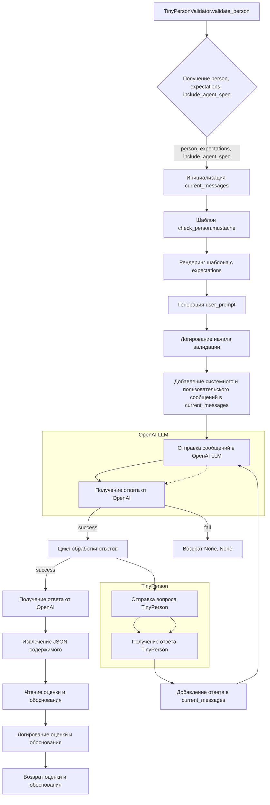

# <input code>

```python
import os
import json
import chevron
import logging

from tinytroupe import openai_utils
from tinytroupe.agent import TinyPerson
from tinytroupe import config
import tinytroupe.utils as utils

default_max_content_display_length = config["OpenAI"].getint("MAX_CONTENT_DISPLAY_LENGTH", 1024)


class TinyPersonValidator:

    @staticmethod
    def validate_person(person, expectations=None, include_agent_spec=True, max_content_length=default_max_content_display_length):
        """
        Validate a TinyPerson instance using OpenAI's LLM.

        This method sends a series of questions to the TinyPerson instance to validate its responses using OpenAI's LLM.
        The method returns a float value representing the confidence score of the validation process.
        If the validation process fails, the method returns None.

        Args:
            person (TinyPerson): The TinyPerson instance to be validated.
            expectations (str, optional): The expectations to be used in the validation process. Defaults to None.
            include_agent_spec (bool, optional): Whether to include the agent specification in the prompt. Defaults to True.
            max_content_length (int, optional): The maximum length of the content to be displayed when rendering the conversation.

        Returns:
            float: The confidence score of the validation process (0.0 to 1.0), or None if the validation process fails.
            str: The justification for the validation score, or None if the validation process fails.
        """
        # Initiating the current messages
        current_messages = []

        # Generating the prompt to check the person
        check_person_prompt_template_path = os.path.join(os.path.dirname(__file__), 'prompts/check_person.mustache')
        with open(check_person_prompt_template_path, 'r') as f:
            check_agent_prompt_template = f.read()

        system_prompt = chevron.render(check_agent_prompt_template, {"expectations": expectations})

        # use dedent
        import textwrap
        user_prompt = textwrap.dedent(
        """
        Now, based on the following characteristics of the person being interviewed, and following the rules given previously, 
        create your questions and interview the person. Good luck!

        """)

        if include_agent_spec:
            user_prompt += f"\\n\\n{person.generate_agent_specification()}"\
        else:
            user_prompt += f"\\n\\nMini-biography of the person being interviewed: {person.minibio()}"\


        logger = logging.getLogger("tinytroupe")

        logger.info(f"Starting validation of the person: {person.name}")

        # Sending the initial messages to the LLM
        current_messages.append({"role": "system", "content": system_prompt})
        current_messages.append({"role": "user", "content": user_prompt})

        message = openai_utils.client().send_message(current_messages)

        # What string to look for to terminate the conversation
        termination_mark = "```json"

        while message is not None and not (termination_mark in message["content"]):
            # Appending the questions to the current messages
            questions = message["content"]
            current_messages.append({"role": message["role"], "content": questions})
            logger.info(f"Question validation:\n{questions}")

            # Asking the questions to the person
            person.listen_and_act(questions, max_content_length=max_content_length)
            responses = person.pop_actions_and_get_contents_for("TALK", False)
            logger.info(f"Person reply:\n{responses}")

            # Appending the responses to the current conversation and checking the next message
            current_messages.append({"role": "user", "content": responses})
            message = openai_utils.client().send_message(current_messages)

        if message is not None:
            json_content = utils.extract_json(message['content'])
            # read score and justification
            score = float(json_content["score"])
            justification = json_content["justification"]
            logger.info(f"Validation score: {score:.2f}; Justification: {justification}")

            return score, justification

        else:
            return None, None
```

# <algorithm>

**Шаг 1:** Инициализация `current_messages` как пустого списка.
**Шаг 2:** Получение шаблона `check_person.mustache` и рендеринг его с параметрами `expectations`.
**Шаг 3:** Генерация пользовательского `user_prompt` с  информацией о `person` (биография или спецификация агента).
**Шаг 4:** Логирование начала валидации.
**Шаг 5:** Добавление системного и пользовательского сообщений в `current_messages`.
**Шаг 6:** Отправка сообщений в OpenAI LLM.
**Шаг 7:** Цикл:
    * Получение ответа OpenAI.
    * Добавление ответа в `current_messages`.
    * Логирование вопроса.
    * Отправка вопроса человеку для ответа.
    * Добавление ответа человека в `current_messages`.
    * Отправка обновленных сообщений в OpenAI LLM.
    * Проверка на маркер завершения ("```json").
**Шаг 8:** Обработка ответа от OpenAI:
    * Извлечение JSON содержимого.
    * Чтение оценки и обоснования.
    * Логирование оценки и обоснования.
    * Возврат оценки и обоснования.
**Шаг 9:** Если ответ от OpenAI не получен или не соответствует ожидаемому формату, то возврат `None`.


**Пример данных:**

* `person`: Объект `TinyPerson` с атрибутами `name`, `minibio`, `generate_agent_specification` и `listen_and_act`.
* `expectations`: Строка, описывающая ожидания для валидации.
* `message`: Словарь, содержащий ответ от OpenAI.
* `current_messages`: Список словарей, содержащих сообщения в диалоге.


# <mermaid>



# <explanation>

**Импорты:**
* `os`: Для работы с файловой системой, в частности, для построения путей к файлам.
* `json`: Для работы с JSON данными.
* `chevron`: Для рендеринга шаблонов.
* `logging`: Для ведения логов.
* `openai_utils`: Модуль для взаимодействия с OpenAI API.
* `TinyPerson`: Класс из модуля `agent`, представляющий собой агента.
* `config`: Модуль, вероятно, содержащий конфигурацию приложения.
* `utils`: Модуль, содержащий вспомогательные функции, в частности, `extract_json`.

**Классы:**
* `TinyPersonValidator`: Класс для валидации объектов `TinyPerson`.  `@staticmethod` указывает, что метод `validate_person` является статическим методом. Это означает, что метод не связан с конкретным экземпляром класса, а может вызываться напрямую через имя класса.

**Функции:**
* `validate_person`: Функция для валидации объекта `TinyPerson`.
    * Принимает на вход объект `person`, параметры `expectations`, `include_agent_spec`, `max_content_length`.
    * Возвращает оценку валидации (float) и обоснование (строка) или `None`, если валидация не удалась.
    * Использует шаблон `check_agent_prompt_template` для генерации запросов к OpenAI.
    * Использует `person.generate_agent_specification()` или `person.minibio()` для получения информации об агенте.
    * Использует `openai_utils.client().send_message()` для взаимодействия с OpenAI API.
    * Итеративно получает вопросы от OpenAI и ответы от `TinyPerson`, пока не получит ответ с ````json` маркером.
    * Извлекает данные из ответа, преобразует их в числовой формат и возвращает результат.

**Переменные:**
* `default_max_content_display_length`:  Максимальная длина отображаемого контента.


**Возможные ошибки и улучшения:**
* **Обработка ошибок:** Нет явной обработки исключений (например, `try...except` блоков) при работе с OpenAI или файлами. Это может привести к падению программы при возникновении ошибок.  Добавление обработки исключений значительно повысит надежность кода.
* **Поведение при отсутствии ответа:** Код не содержит проверки на случай, если OpenAI не отвечает. Это может привести к зависанию программы. Необходимо добавить механизм таймаутов или проверки на отсутствие ответа в цикле.
* **Управление состоянием:**  Необходимо добавить логику для хранения и обработки состояния диалога между `TinyPerson` и OpenAI.  Сейчас кажется, что данные теряются после каждого вызова.
* **Прозрачность логирования:** Логирование должно быть более информативным, например, включая идентификатор запроса.
* **Документация:** Документация к методам `generate_agent_specification` и `minibio` в классе `TinyPerson` будет полезна для понимания этих методов.
* **Стандартизация:**  Использовать  `textwrap.dedent`  для отступа текста.
* **Проверка входных данных:** Проверка того, что `person` — это действительно экземпляр класса `TinyPerson` и что другие аргументы имеют правильные типы.


**Связь с другими частями проекта:**

Код сильно зависит от `openai_utils`, `TinyPerson`, `config`, и `utils`.  `TinyPerson` - это, вероятно, класс, представляющий агента, который отвечает на вопросы. `openai_utils` отвечает за взаимодействие с API OpenAI. `config` предоставляет конфигурационные параметры, а `utils` - вспомогательные функции, включая `extract_json`.  Все эти компоненты должны быть правильно импортированы и работают вместе для обеспечения работоспособности валидации.