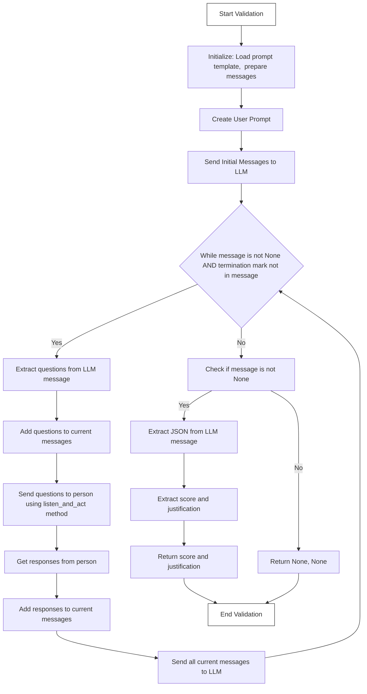
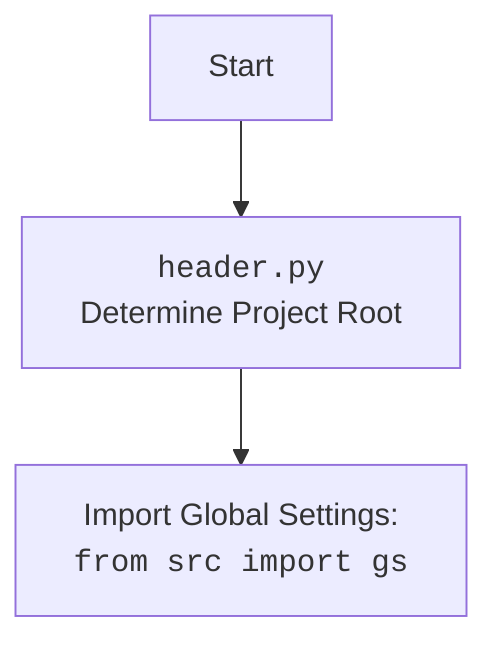

## <алгоритм>

1. **Инициализация**:
   - Устанавливается максимальная длина контента для отображения `max_content_length` (по умолчанию 1024, из `config`).
   - Создается пустой список `current_messages` для хранения истории сообщений.
   - Загружается шаблон промпта из файла `prompts/check_person.mustache` для проверки персонажа.
   - Рендерится системный промпт из шаблона, подставляя в него ожидаемые качества персонажа (`expectations`).

   _Пример:_
   ```python
   current_messages = []
   check_agent_prompt_template = "You are an AI that interviews other AI agents to check their specifications. {expectations}"
   system_prompt = chevron.render(check_agent_prompt_template, {"expectations": "The agent should be creative."})
   # system_prompt = "You are an AI that interviews other AI agents to check their specifications. The agent should be creative."
   ```

2. **Формирование пользовательского промпта**:
   - Создается начальный пользовательский промпт, который просит LLM начать интервью.
   - Если `include_agent_spec` истинно, добавляется спецификация агента (`person.generate_agent_specification()`).
   - Иначе добавляется мини-биография персонажа (`person.minibio()`).

   _Пример:_
   ```python
   user_prompt = "Now, based on the following characteristics of the person being interviewed, and following the rules given previously, create your questions and interview the person. Good luck!\n\nMini-biography of the person being interviewed: This is a test person."
   ```

3. **Отправка начальных сообщений**:
   - Добавляется системное сообщение (`system_prompt`) в `current_messages`.
   - Добавляется пользовательское сообщение (`user_prompt`) в `current_messages`.
   - Отправляются начальные сообщения в LLM с помощью `openai_utils.client().send_message()`.

   _Пример:_
    ```python
   current_messages = [
    {"role": "system", "content": "You are an AI that interviews other AI agents to check their specifications. The agent should be creative."},
    {"role": "user", "content": "Now, based on the following characteristics of the person being interviewed, and following the rules given previously, create your questions and interview the person. Good luck!\n\nMini-biography of the person being interviewed: This is a test person."}
    ]
    message = openai_utils.client().send_message(current_messages)
   ```
    
4. **Цикл валидации**:
   - Пока есть ответ от LLM (`message`) и пока не найден маркер завершения (`termination_mark` - "```json"):
     - Извлекаются вопросы из ответа LLM (`message["content"]`).
     - Вопросы добавляются в `current_messages`.
     - Вопросы отправляются персонажу (`person.listen_and_act(questions)`).
     - Получаются ответы персонажа (`responses`).
     - Ответы добавляются в `current_messages`.
     - Отправляются все сообщения в LLM, чтобы получить следующее сообщение.
    _Пример:_
   ```python
    # First iteration
    message = {"role": "assistant", "content": "What is your name?\n"}
    current_messages.append({"role": "assistant", "content": "What is your name?\n"})
    person.listen_and_act("What is your name?", max_content_length = 1024)
    responses = "My name is Test Person."
    current_messages.append({"role": "user", "content": "My name is Test Person."})
    message = openai_utils.client().send_message(current_messages)

   ```

5. **Обработка результатов**:
   - Если получен ответ от LLM (`message` не `None`):
     - Извлекается JSON из ответа (`utils.extract_json(message['content'])`).
     - Извлекается оценка (`score`) и обоснование (`justification`) из JSON.
     - Возвращается оценка и обоснование.
   - Иначе:
     - Возвращается `None, None`.

   _Пример:_
   ```python
   # Assuming the message is:
   # message = {"content": "```json\n{\"score\": 0.8, \"justification\": \"The person was creative and insightful.\"}\n```"}
   json_content = {"score": 0.8, "justification": "The person was creative and insightful."}
   score = 0.8
   justification = "The person was creative and insightful."
   return score, justification
   ```

## <mermaid>





## <объяснение>

### Импорты

- `os`: Используется для работы с файловой системой, в частности, для построения путей к файлам (`os.path.join`, `os.path.dirname`).
- `json`: Используется для работы с JSON-данными, которые возвращает LLM в конце валидации.
- `chevron`: Используется для рендеринга шаблонов строк, в данном случае - для формирования промптов из mustache шаблонов.
- `logging`: Используется для ведения логов, отслеживания процесса валидации.
- `tinytroupe.openai_utils`: Модуль, содержащий утилиты для взаимодействия с OpenAI API, такие как отправка сообщений.
- `tinytroupe.agent`: Содержит класс `TinyPerson`, представляющий агента, которого нужно валидировать.
- `tinytroupe.config`: Модуль для загрузки и работы с конфигурационными данными.
- `tinytroupe.utils`: Содержит утилиты, используемые в проекте, включая функцию `extract_json` для извлечения JSON из строки.

Все импорты, начинающиеся с `tinytroupe.`, указывают на использование модулей внутри проекта `tinytroupe`.

### Классы

- `TinyPersonValidator`:
  - Это класс, который содержит статический метод `validate_person`, предназначенный для проверки экземпляра `TinyPerson`.
  - **Атрибуты:** Не имеет атрибутов экземпляра, так как метод `validate_person` статический.
  - **Методы:**
    - `validate_person(person, expectations=None, include_agent_spec=True, max_content_length=default_max_content_display_length)`:
        - Принимает экземпляр `TinyPerson`, а также ожидаемые характеристики (`expectations`), флаг включения спецификации агента (`include_agent_spec`), и максимальную длину контента (`max_content_length`).
        - Отправляет ряд вопросов LLM для проверки персонажа, используя его ответы, а также ожидаемые характеристики и спецификации агента.
        - Возвращает `float` (оценку валидации от 0.0 до 1.0) и `str` (обоснование оценки), либо `None, None`, если валидация не удалась.

### Функции

- Отсутствуют, кроме статического метода `validate_person`.

### Переменные

- `default_max_content_display_length`:  Глобальная переменная, которая устанавливает максимальную длину текста для отображения контента, значение берется из конфигурации `config["OpenAI"].getint("MAX_CONTENT_DISPLAY_LENGTH", 1024)`.
- `current_messages`: Список, в котором хранятся сообщения (словарь с ключами "role" и "content") в формате, необходимом для взаимодействия с OpenAI API.
- `check_person_prompt_template_path`: Путь к файлу mustache-шаблона промпта.
- `check_agent_prompt_template`: Содержит шаблон промпта, прочитанный из файла.
- `system_prompt`: Системный промпт, который используется для установки контекста для LLM.
- `user_prompt`: Пользовательский промпт, содержащий инструкцию для LLM начать интервью.
- `termination_mark`:  Строка-маркер ("```json"), указывающая на то, что LLM завершил интервью и предоставил JSON с результатами.
- `message`: Переменная, которая хранит ответ от LLM в виде словаря.
- `questions`: Строка, содержащая вопросы, которые LLM задает персонажу.
- `responses`: Строка, содержащая ответы персонажа на вопросы.
- `json_content`: Словарь, полученный путем парсинга JSON из ответа LLM.
- `score`: Оценка, извлеченная из JSON (число с плавающей точкой от 0 до 1).
- `justification`: Обоснование оценки, извлеченное из JSON (строка).

### Ошибки и улучшения

- **Обработка ошибок:** Код не обрабатывает возможные исключения, например:
    -  `FileNotFoundError` при открытии файла шаблона.
    -  `KeyError` при попытке доступа к ключу в JSON-ответе LLM.
    -  Ошибки, связанные с OpenAI API (например, таймауты, ошибки аутентификации).
- **Улучшение:**
  - Добавить обработку исключений с использованием `try...except`.
  - Реализовать таймауты или ограничение на количество итераций в цикле валидации.
  - Реализовать кеширование или использование предварительных шаблонов сообщений для повышения производительности.
  - Добавить более гибкую конфигурацию маркера завершения (`termination_mark`).
  - Проверить и обработать возможные ошибки, которые могут возникнуть при вызове `person.listen_and_act()`.
  - Добавить возможность валидации несколькими способами (например, по разным аспектам).
  - Добавить возможность отслеживания валидации в реальном времени (например, с помощью веб-сокетов).
  - Обеспечить большую гибкость в формировании промптов и шаблонов сообщений.
  - Пересмотреть логику обработки и извлечения JSON (добавить проверки).

### Взаимосвязь с другими частями проекта

-   Использует `tinytroupe.openai_utils` для взаимодействия с OpenAI API.
-   Использует `tinytroupe.agent.TinyPerson` для представления персонажа, который нужно валидировать, и для взаимодействия с этим персонажем.
-   Использует `tinytroupe.config` для получения конфигурационных параметров, таких как `MAX_CONTENT_DISPLAY_LENGTH`.
-   Использует `tinytroupe.utils` для извлечения JSON из строки ответа.
-   Использует шаблоны Mustache для генерации промптов, что помогает отделить код от текста промптов.
-   Использует логирование для отслеживания хода выполнения.

Таким образом, `TinyPersonValidator` является важной частью проекта, поскольку он обеспечивает функциональность проверки и оценки поведения агентов. Он интегрируется с другими модулями, чтобы эффективно использовать их возможности.