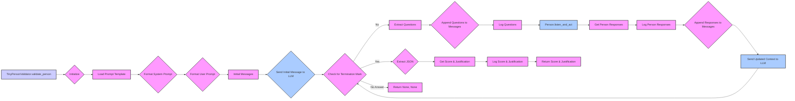

## Анализ кода `tinytroupe/validation.py`

### 1. <алгоритм>

**Блок-схема:**

1.  **Инициализация:**
    *   Импортируются необходимые библиотеки и модули: `os`, `json`, `chevron`, `logging`, `openai_utils`, `TinyPerson`, `config`, `utils`, `textwrap`.
    *   Определяется `default_max_content_display_length` из конфигурации.

2.  **Функция `validate_person`:**
    *   Принимает экземпляр `TinyPerson` (`person`), ожидания (`expectations`), флаг включения спецификации агента (`include_agent_spec`) и максимальную длину контента (`max_content_length`).
    *   Инициализирует список сообщений `current_messages`.
    *   Загружает шаблон запроса из `prompts/check_person.mustache`.

3.  **Формирование системного и пользовательского запросов:**
    *   Формирует системный запрос (`system_prompt`) с использованием шаблона `chevron` и предоставленных ожиданий.
    *   Формирует пользовательский запрос (`user_prompt`) с инструкциями для LLM.
    *   Если `include_agent_spec` истинно, добавляет спецификацию агента; в противном случае добавляет мини-биографию персонажа.

4.  **Начало валидации:**
    *   Инициализирует логгер.
    *   Добавляет системное и пользовательское сообщения в `current_messages`.
    *   Отправляет начальное сообщение в LLM.

5.  **Цикл валидации:**
    *   Пока есть ответ от LLM и в нем нет маркера завершения `"```json"`:
        *   Извлекает вопросы из ответа LLM.
        *   Добавляет вопрос в `current_messages`.
        *   Логирует вопрос.
        *   Отправляет вопрос персонажу (`person`) через `listen_and_act`.
        *   Получает ответы от персонажа, логирует их.
        *   Добавляет ответ в `current_messages`.
        *   Отправляет обновленный контекст в LLM для получения следующего сообщения.

6.  **Завершение валидации:**
    *   Если получен ответ с маркером завершения:
        *   Извлекает JSON из ответа (`utils.extract_json`).
        *   Извлекает оценку (`score`) и обоснование (`justification`) из JSON.
        *   Логирует оценку и обоснование.
        *   Возвращает оценку и обоснование.
    *   Если ответа нет или валидация не завершилась, возвращает `None, None`.

**Пример:**

Предположим, у нас есть `TinyPerson` по имени "Alice", ожидание "хорошо разбирается в истории" и `include_agent_spec=True`.

1.  **Инициализация**: Подготавливаются переменные и загружается шаблон.
2.  **Системное сообщение**:  Создается с учетом ожидания, например: `"Вы проверяете, насколько хорошо человек разбирается в истории."`
3.  **Пользовательское сообщение**: Создается, добавляется спецификация персонажа.
4.  **Начало**: Отправляются сообщения LLM.
5.  **Цикл:**
    *   LLM спрашивает: "Какое событие произошло в 1945 году?".
    *   Ответ Алисы: "В 1945 году закончилась Вторая Мировая война."
    *   Ответ Алисы отправляется LLM.
    *   LLM спрашивает: "Кто был президентом США в это время?".
    *   Ответ Алисы: "Президентом был Трумэн."
    *   ...
    *   LLM возвращает: `{"score": 0.9, "justification": "Алиса хорошо разбирается в истории, ее ответы точны и соответствуют ожиданиям."}`
6.  **Завершение**: Функция возвращает `0.9, "Алиса хорошо разбирается..."`.

### 2. <mermaid>



**Объяснение зависимостей:**

*   Диаграмма описывает поток управления внутри функции `TinyPersonValidator.validate_person`.
*   Импорт `openai_utils` используется в блоках `G` (отправка начального сообщения) и `P` (отправка обновленного контекста).
*   Импорт `TinyPerson` используется в блоке `L` (вызов `person.listen_and_act`).
*   Импорт `utils` используется в блоке `Q` (извлечение JSON).
*   Импорт `chevron` используется в блоке `D` (формирование системного запроса).
*   Импорт `textwrap` используется в блоке `E` (формирование пользовательского запроса).

### 3. <объяснение>

**Импорты:**

*   `os`: Используется для работы с путями к файлам, в частности, для нахождения шаблона `check_person.mustache`.
*   `json`: Используется для обработки JSON, хотя в коде явно не используется, но он необходим в `utils.extract_json`, который импортируется.
*   `chevron`: Используется для рендеринга шаблонов (в данном случае, для создания системного запроса).
*   `logging`: Используется для логирования событий в процессе валидации.
*   `tinytroupe.openai_utils`: Модуль, предоставляющий функциональность для взаимодействия с API OpenAI.
*   `tinytroupe.agent.TinyPerson`: Класс, представляющий персонажа, который нужно валидировать.
*   `tinytroupe.config`: Модуль для получения конфигурационных параметров.
*   `tinytroupe.utils`: Модуль с утилитами, в частности, `extract_json`.
*   `textwrap`: Используется для удаления лишних пробелов в строках.

**Классы:**

*   `TinyPersonValidator`:
    *   **Роль**: Класс, отвечающий за валидацию экземпляров `TinyPerson`.
    *   **Атрибуты**: Не имеет атрибутов.
    *   **Методы**:
        *   `validate_person`: Статический метод, выполняющий валидацию персонажа.
            *   **Аргументы**:
                *   `person` (`TinyPerson`): Экземпляр персонажа для валидации.
                *   `expectations` (`str`, optional): Ожидания от персонажа.
                *   `include_agent_spec` (`bool`, optional): Флаг включения спецификации агента в промпт.
                *   `max_content_length` (`int`, optional): Максимальная длина выводимого контента.
            *   **Возвращает**: Кортеж из float (оценка от 0.0 до 1.0) и str (обоснование), или None, None при неудаче.
            *   **Назначение**:  Использует LLM для проверки соответствия персонажа заданным ожиданиям.
            *   **Пример**: Вызов `TinyPersonValidator.validate_person(alice, "любит кошек")` проверит, насколько персонаж "alice" соответствует ожиданию "любит кошек".

**Функции:**

*   `default_max_content_display_length`: Переменная, определяющая максимальную длину отображаемого контента, полученная из конфигурации.

**Переменные:**

*   `current_messages`: Список словарей, представляющих историю сообщений для общения с LLM.
*   `check_person_prompt_template_path`: Путь к файлу шаблона запроса.
*   `check_agent_prompt_template`: Содержимое файла шаблона запроса.
*   `system_prompt`: Сформированный системный запрос для LLM.
*   `user_prompt`: Сформированный пользовательский запрос для LLM.
*   `logger`: Логгер для записи событий.
*   `message`: Ответ от LLM.
*   `termination_mark`: Строка-маркер для завершения диалога.
*   `questions`: Извлеченные вопросы из ответа LLM.
*   `responses`: Ответы персонажа.
*   `json_content`: Извлеченный JSON из ответа LLM.
*   `score`: Оценка валидации.
*   `justification`: Обоснование оценки.

**Цепочка взаимосвязей:**

1.  `TinyPersonValidator` зависит от `openai_utils` для взаимодействия с LLM.
2.  `TinyPersonValidator` использует `TinyPerson` для получения ответов.
3.  `TinyPersonValidator` зависит от `config` для получения параметров конфигурации.
4.  `TinyPersonValidator` использует `utils` для извлечения JSON.
5.  `TinyPersonValidator` использует `chevron` для рендеринга шаблонов.
6.  `TinyPersonValidator` использует `textwrap` для форматирования строк.

**Потенциальные ошибки и улучшения:**

*   **Обработка ошибок:** В коде отсутствует обработка возможных ошибок, таких как ошибки при взаимодействии с API OpenAI, ошибки парсинга JSON, и ошибки открытия файла. Необходимо добавить блоки try-except для повышения надежности.
*   **Повторное использование запросов**: Шаблон запроса загружается каждый раз при вызове метода, что может быть не эффективно. Можно закэшировать загруженный шаблон.
*   **Неоднозначность завершения**: Завершение диалога основывается на наличии `"```json"` в ответе, что может привести к преждевременному завершению. Можно рассмотреть использование других, более надежных, методов завершения диалога.
*   **Разделение логики**: Логику валидации и взаимодействия с персонажем можно разбить на более мелкие методы для лучшей читаемости и повторного использования.
*   **Конфигурация `max_content_length`:** Может быть имеет смысл сделать параметр `max_content_length` обязательным.
*   **Логирование:** Можно добавить более детальное логирование.

Этот анализ обеспечивает полное понимание кода, его функциональности и возможных точек для улучшения.