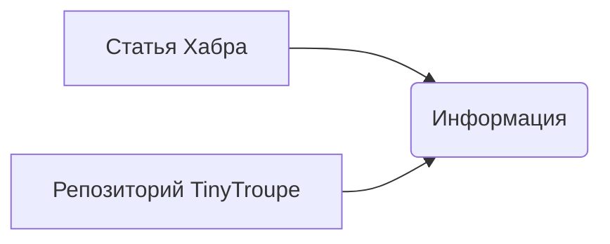

```MD
# Анализ кода tiny_troupe/__init__.py

1. **<input code>**

```python
# https://habr.com/ru/news/858370/
# https://github.com/microsoft/TinyTroupe
```

2. **<algorithm>**

Код представляет собой комментарии, ссылающиеся на статью Хабра и репозиторий GitHub.  Он не содержит исполняемого кода, поэтому алгоритма работы нет в традиционном понимании.  Никакие данные не передаются между функциями или классами.

3. **<mermaid>**



4. **<explanation>**

Данный файл `__init__.py`  в папке `hypotez/src/ai/tiny_troupe`  является инициализационным файлом пакета.  В Python, `__init__.py`  делает папку пакетом.  Однако, в этом конкретном случае, файл не содержит никакого Python-кода.

* **Импорты**:  Нет импортов, т.к. файл пустой.  Код ссылается на внешние источники, но не импортирует их.

* **Классы**:  Нет классов.

* **Функции**:  Нет функций.

* **Переменные**: Нет переменных.

* **Возможные ошибки или области для улучшений**:  Файл не содержит кода, поэтому не может быть ошибок.  Лучше бы был заголовок или описание того, что этот пакет делает, или какой функционал он предоставляет. Ссылки должны быть включены в документацию пакета, а не просто в файле `__init__.py`.

**Цепочка взаимосвязей с другими частями проекта:**

Этот `__init__.py`  предполагает, что в пакете `tiny_troupe` есть какие-то классы и функции, которые будут использоваться в других частях проекта.  Например, в других модулях этого пакета могут быть классы, реализующие определенные функциональные возможности, связанные с tiny_troupe.  Ссылки на статью Хабра и репозиторий GitHub указывают на возможный источник вдохновения или документацию, которые могут помочь понять, какие функции или классы должен содержать этот пакет.  Недостаточно информации для полного понимания местоположения в проекте.  Без дополнительного кода, невозможно определить его связь с остальной частью кодовой базы.