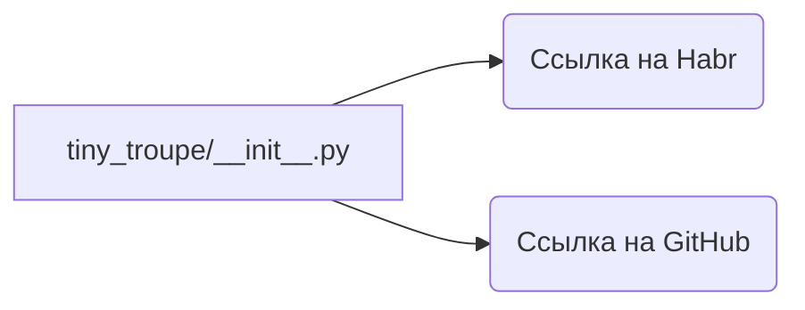

```MD
# Анализ кода из tiny_troupe/__init__.py

1. **<input code>**

```python
# https://habr.com/ru/news/858370/
# https://github.com/microsoft/TinyTroupe
```

2. **<algorithm>**

Код на самом деле не содержит Python-кода. Это комментарии, ссылающиеся на статью Хабра и репозиторий GitHub, посвященные TinyTroupe.  Следовательно, алгоритма в классическом понимании нет.  Эти ссылки вероятно служат для контекста или дополнительной информации об источнике, о котором идет речь.

3. **<mermaid>**



4. **<explanation>**

Этот код не содержит функций, классов или переменных в привычном для Python понимании.  Он состоит из двух строк комментариев.


* **`# https://habr.com/ru/news/858370/`**: Эта строка является комментарием, который содержит ссылку на статью Хабра, вероятно, описывающую или связанную с библиотекой TinyTroupe.  Этот комментарий не выполняет никакой функциональности в Python-программе.

* **`# https://github.com/microsoft/TinyTroupe`**: Этот комментарий содержит ссылку на репозиторий GitHub, вероятно, содержащий код библиотеки TinyTroupe.  Комментирование ссылок на внешние ресурсы помогает пониманию контекста и источника материала.


**Взаимосвязи с другими частями проекта:**

Этот файл `__init__.py` из пакета `tiny_troupe` скорее всего служит для инициализации всего модуля.  В реальной реализации, `__init__.py` содержал бы импорты классов или функций из других файлов внутри `tiny_troupe`. Ссылки в комментариях указывают на потенциальный источник кода, но сам `__init__.py` в данном случае не содержит  активного кода.

**Возможные ошибки или области для улучшений:**

В данном фрагменте нет ошибок, поскольку это только комментарии. Но в обычном коде, где ссылки на сторонние ресурсы имеют смысл,  хорошо было бы дополнить их описанием того, как они связаны с реализацией.

**Вывод:**

Этот код является метаданными, указывающими на внешний источник информации, связанный с библиотекой TinyTroupe.  Без дополнительного кода сложно представить детальную блок-схему или более глубокое объяснение.