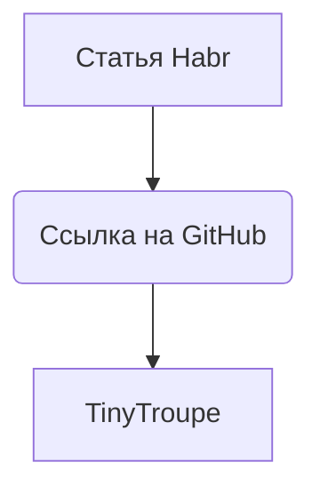

```MD
1. **<input code>**

```python
# https://habr.com/ru/news/858370/
# https://github.com/microsoft/TinyTroupe
```

2. **<algorithm>**

Этот код не содержит кода в виде функций или классов. Он представляет собой просто комментарии, ссылающиеся на статью Habr и репозиторий GitHub.  Алгоритм работы отсутствует, так как нет конкретной программы.

3. **<mermaid>**



4. **<explanation>**

Этот код не содержит функционального кода. Он просто содержит две ссылки: одна на статью Habr, а вторая на репозиторий GitHub.  Эти ссылки скорее всего указывают на источник вдохновения или документацию для каких-либо связанных проектов.  Они не представляют собой самостоятельного алгоритма или программы.  Без дополнительного контекста, это просто указатели на внешние ресурсы, которые могут содержать информацию о работе с библиотекой TinyTroupe.

**Цепочка взаимосвязей с другими частями проекта:**

Без анализа контекста невозможно сказать, как эти ссылки связаны с другими частями проекта.  Для того, чтобы проанализировать взаимосвязи, необходимо знать, где этот код расположен относительно других файлов и папок проекта `hypotez/src/ai/tiny_troupe/__init__.py`. Например, если в файле `__init__.py` импортируются классы или функции, упомянутые в ссылках, это будет указывать на прямое использование.


**Возможные ошибки или области для улучшений:**

Нет ошибок в предоставленном коде, поскольку это просто ссылки.  Возможным улучшением будет добавление более конкретных комментариев или примеров использования в `__init__.py`, если это часть проекта, реализующего TinyTroupe.