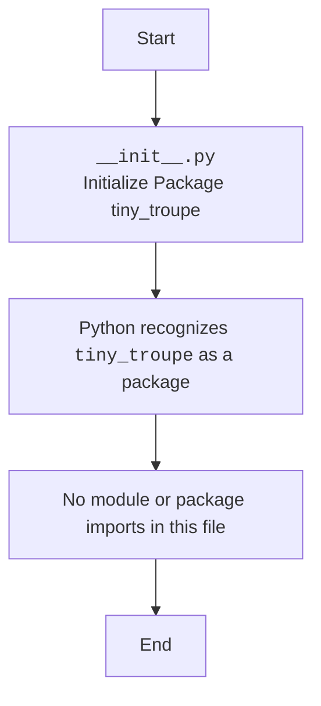

## Анализ кода `hypotez/src/ai/tiny_troupe/__init__.py`

### 1. <алгоритм>

Данный файл `__init__.py` является файлом инициализации пакета `tiny_troupe`. Его основная функция - сделать директорию `tiny_troupe` пакетом Python, позволяя импортировать модули и пакеты внутри нее как если бы они были частью одного пакета.
**Пример**:
Если у вас есть файл `module.py` внутри `tiny_troupe`, то без `__init__.py` вы не сможете сделать `import tiny_troupe.module`.

**Пошаговая блок-схема:**

```mermaid
graph LR
    A[Начало] --> B{Обнаружение пакета tiny_troupe}
    B -- Да --> C[Создание пакета Python]
    C --> D{Импорт модулей и пакетов (если есть)}
    D --> E[Использование модулей и пакетов из tiny_troupe]
    E --> F[Конец]
    B -- Нет --> F
```

**Пояснение:**

1. **Начало**: Процесс импорта пакета начинается.
2. **Обнаружение пакета `tiny_troupe`**: Python ищет директорию с именем `tiny_troupe`.
3. **Создание пакета Python**: Если директория `tiny_troupe` найдена и в ней есть файл `__init__.py`, Python понимает, что это пакет.
4. **Импорт модулей и пакетов**:  Могут быть импортированы модули или вложенные пакеты внутри `tiny_troupe`. В данном случае, код пуст и никаких импортов нет.
5. **Использование модулей и пакетов из `tiny_troupe`**: Другие части проекта могут теперь импортировать и использовать модули и классы внутри `tiny_troupe`.
6. **Конец**: Пакет инициализирован.

### 2. <mermaid>



**Объяснение диаграммы:**

*   `Start`: Начальная точка процесса.
*   `PackageInit`: Обозначает файл `__init__.py` в пакете `tiny_troupe`.
*   `CreatePackage`: Python идентифицирует директорию `tiny_troupe` как пакет Python благодаря наличию файла `__init__.py`.
*    `NoImports`:  В данном случае, `__init__.py` не содержит никаких импортов.
*    `End`: Конечная точка.

В данном конкретном случае нет никаких импортов, поэтому зависимости ограничены только самим фактом создания пакета.

### 3. <объяснение>

**Импорты:**

*   В данном файле `__init__.py` нет явных импортов модулей.  `__init__.py` файл может быть пустым, если нет необходимости проводить инициализацию при импорте пакета.

**Классы:**

*   В данном файле `__init__.py` нет классов. Он служит только для инициализации пакета.

**Функции:**

*   В данном файле `__init__.py` нет функций. Он служит только для инициализации пакета.

**Переменные:**

*   В данном файле `__init__.py` нет переменных.

**Дополнительные пояснения:**

*   **Роль:** `__init__.py` в пакете `tiny_troupe` служит для обозначения каталога как пакета Python. Это позволяет импортировать модули и подпакеты, расположенные внутри `tiny_troupe`.
*   **Использование:** Несмотря на то что этот конкретный файл пуст, наличие файла `__init__.py` делает директорию `tiny_troupe` полноценным пакетом, который можно импортировать в другие части проекта.
*   **Потенциальные улучшения/ошибки:**
    *   В данный момент этот файл очень простой, но в будущем может понадобится добавлять дополнительные импорты для упрощения использования пакета.
    *   Например, можно добавить `from . import module` если предполагается часто использовать какой-то модуль из пакета, что позволит сделать  `from tiny_troupe import module` вместо `from tiny_troupe.module import module`
*   **Взаимосвязь с другими частями проекта:** Данный пакет `tiny_troupe` может быть использован для организации моделей и алгоритмов, связанных с ИИ. Это может быть пакет, содержащий  модули для взаимодействия с моделями, которые были взяты из репозитория `microsoft/TinyTroupe` , как указано в начале комментария.

**Пример использования**:

Предположим, что есть файл `model.py` в `tiny_troupe`, содержащий класс `TinyModel`. Тогда можно будет использовать:

```python
from tiny_troupe.model import TinyModel

model = TinyModel()
```

**Примечание:**  В данном коде нет зависимостей от других частей проекта, так как он просто инициализирует пакет.  В будущем, при добавлении функционала, возможно появление зависимостей от других частей.