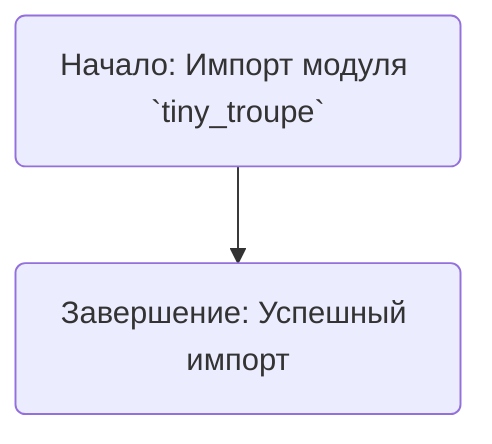

## <алгоритм>

**Описание:**

Данный код является отправной точкой для модуля `tiny_troupe`, который, судя по комментариям, является реализацией проекта, аналогичного [TinyTroupe от Microsoft](https://github.com/microsoft/TinyTroupe).  В текущем виде, код не содержит никакой логики, а просто является пустым файлом `__init__.py`.

Поскольку код пустой, блок-схема будет тривиальной:

1.  **Начало:** Запуск модуля `tiny_troupe`.
2.  **Завершение:** Модуль успешно импортируется, не выполняя никаких действий.

**Пример:**

Представим ситуацию, когда другой модуль в проекте делает импорт:
```python
from src.ai.tiny_troupe import *
```
В этом случае, модуль `tiny_troupe` импортируется, но поскольку он пуст, никаких дополнительных действий не выполняется.
 
## <mermaid>



**Объяснение диаграммы:**

*   `Start`:  Обозначает начало процесса импорта модуля `tiny_troupe`.
*   `End`: Обозначает успешное завершение импорта модуля.

В данном случае, диаграмма простая, так как код не содержит никаких зависимостей или функциональности.

## <объяснение>

**Импорты:**

В текущем коде импорты отсутствуют.  В контексте проекта, вероятно, модуль `tiny_troupe` будет импортировать модули из `src` для реализации своей функциональности, например:
   - `from src.ai.models import Model` - для использования моделей.
   - `from src.utils import logger` - для логирования.
   - `from src.config import get_config` - для получения конфигурации.
    
   Но в предоставленном коде они отсутствуют, поэтому зависимости не формируются.

**Классы:**
В коде нет классов.

**Функции:**
В коде нет функций.

**Переменные:**
В коде нет переменных.

**Цепочка взаимосвязей:**
Пока что модуль `tiny_troupe` не связан ни с какими другими частями проекта из-за своей пустоты. Когда он начнет наполняться кодом, то он, вероятно, будет зависеть от других частей проекта, например:

*   Модули с моделями `src.ai.models`.
*   Модули с конфигурациями `src.config`.
*   Модули с утилитами `src.utils`.
*   Модули для обработки и анализа данных.

**Потенциальные ошибки и области для улучшения:**
*   **Пустой файл:** Текущий файл `__init__.py` не содержит кода. Это означает, что он не выполняет никакой полезной работы. В реальном проекте `__init__.py` обычно используется для инициализации пакета, определения публичных API или выполнения других начальных действий.
*   **Неполное понимание:**  Без более конкретного кода трудно оценить его роль и потенциальные проблемы.
*   **Отсутствие логики:** В данный момент отсутствует логика TinyTroupe, которая в будущем должна быть реализована в данном модуле или его подмодулях.

В будущем, необходимо:

*   Реализовать основную логику TinyTroupe в этом модуле или в его подмодулях.
*   Добавить необходимые импорты для взаимодействия с другими частями проекта.
*   Определить классы, функции и переменные, необходимые для реализации функциональности.